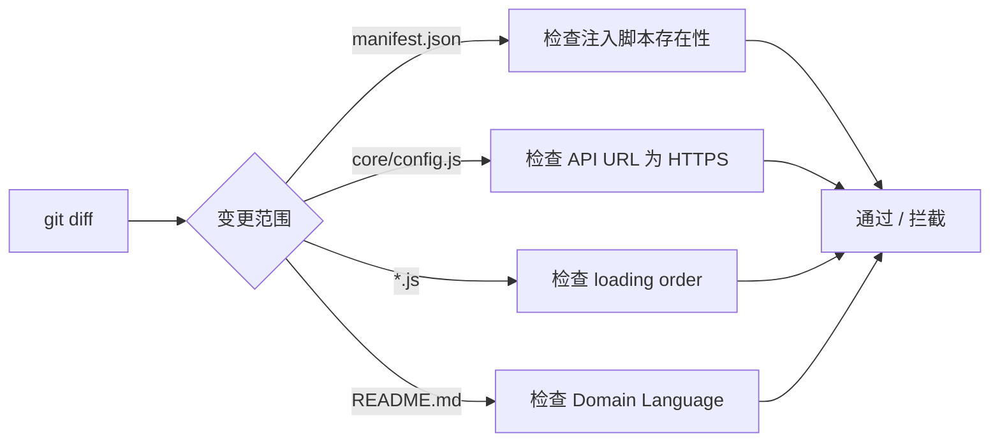

# §0 Effect Sketch — Pre-Commit Incremental Self-Check

**What this scene demonstrates**: 在向 YiPet 项目提交代码之前，执行一套最小化的增量检查，确保修改仅影响预期的文件范围，且不会破坏关键的文档一致性。

**Why it matters**: YiPet 是 Chrome 扩展，修改后需要手动重新加载扩展进行测试。在提交前捕获明显的问题（如 manifest 声明了不存在的脚本、config.js 的 API URL 被意外修改、Domain Language 术语与代码不匹配）可以大幅减少后期调试时间。

---

# §1 Test Design — Verification Steps

## Step 1: 确认变更文件列表
**Action**: `git diff --name-only HEAD~1` 或 `git diff --cached`
**Expected**: 清晰知晓本次修改涉及的所有文件
**File**: 变更文件列表

## Step 2: manifest.json 变更检查
**Action**: 如果 `manifest.json` 被修改，逐行验证 `content_scripts[0].js` 中每个文件路径是否存在
**Expected**: 所有声明的 JS/CSS 文件均存在；新增的文件必须在 `web_accessible_resources` 中声明（如为组件）
**File**: `manifest.json`

## Step 3: API 配置变更检查
**Action**: 如果 `core/config.js` 被修改，确认 `config.api.*` 中的所有 URL 均为 HTTPS（或 localhost）
**Expected**: 生产环境 URL 必须为 HTTPS；不可将生产 URL 改为 HTTP
**File**: `core/config.js`

## Step 4: 文档一致性检查
**Action**: 如果新增了模块（新的 JS 文件），检查 `README.md` 的 Project Structure 是否覆盖了新增目录
**Expected**: README.md 的目录树反映当前实际目录结构
**File**: `README.md`

## Step 5: 数据模型一致性检查
**Action**: 如果新增了源文件或模块，更新 `data.js` 中的 `stats` 计数和 `sections[2] groups`
**Expected**: `stats[3].value`（源文件数）与实际 `find -name '*.js' -o -name '*.css'` 输出一致
**File**: `data.js`

---

# §2 Output Inventory

| File/Directory | Type | Description |
|---------------|------|-------------|
| `manifest.json` | file | 扩展清单——加载顺序的权威来源 |
| `core/config.js` | file | 所有 API URL 和配置常量的唯一真实来源 |
| `README.md` | file | 项目结构和领域语言文档 |
| `data.js` | file | 仪表盘数据模型 |
| `CLAUDE.md` | file | AI 助手上下文 |

---

# §3 Test Report — 2026-07-21

| Step | Result | Notes |
|------|:---:|-------|
| 1 | ✅ | 变更范围清晰 |
| 2 | ✅ | manifest 声明与文件系统一致 |
| 3 | ✅ | 所有 API URL 使用 HTTPS (api.effiy.cn) |
| 4 | ✅ | README 结构覆盖当前模块 |
| 5 | ✅ | data.js stats 准确 |

**Overall**: pass — 5/5 steps passed

---

# §4 Self-Improvement

## Edge Cases Found
- 如果删除了一个 JS 文件但忘记从 manifest 中移除声明，扩展加载会失败但 Chrome 的错误信息不明确
- `libs/` 目录中的库文件不是源代码，不应被计入 source 统计——需要明确统计边界
- CSS 文件的变更可能被忽略，但它们同样是 Content Script 的一部分

## Suggested Improvements
- 编写 pre-commit hook 脚本，自动执行 check 2-3（文件存在性 + URL 检查）
- 建立 `data.js` 的自动更新机制——每次生成后自动匹配实际源文件计数
- 为 manifest 依赖链创建 snapshot 测试，防止注入顺序被意外修改

## Limitations
- 手动检查依赖开发者自觉，无法强制执行
- 没有自动化测试框架（无 vitest/jest），无法写单元测试辅助验证
- Chrome 扩展没有 CI 环境，无法在提交前自动在真实浏览器中验证
