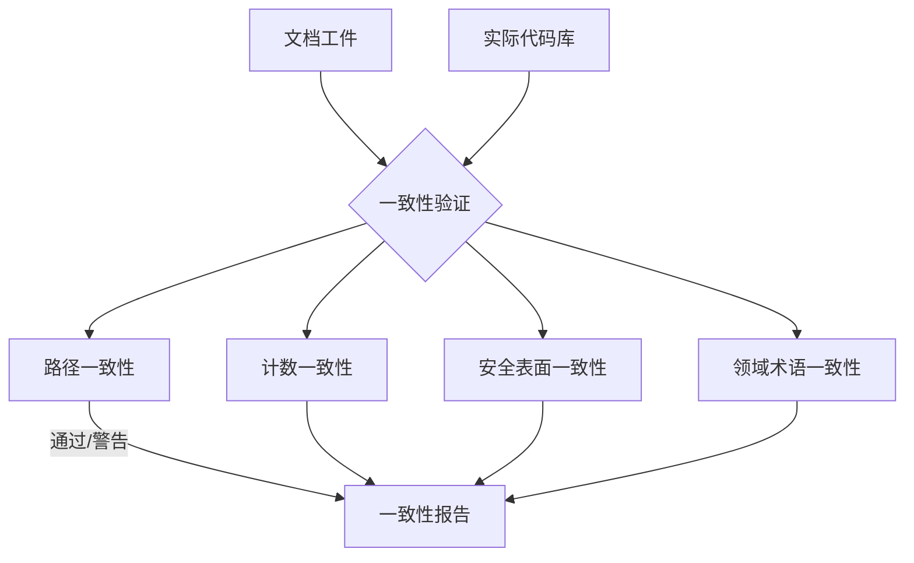

# §0 Effect Sketch — Doc-Code Consistency

**What this scene demonstrates**: 验证 YiPet 项目的文档工件（CLAUDE.md、README.md、data.js、arch/*/index.md）是否与当前实际代码库保持一致。检测文档漂移：过时的文件路径、错误的模块数、遗漏的新特性、不准确的安全表面描述。

**Why it matters**: 文档是 AI 辅助开发的上下文基础。如果 `data.js` 声称 "CDN 组件 26" 但实际新增了 2 个组件，AI 在回答组件相关问题时会遗漏最新的组件。如果 `README.md` 的 Project Structure 缺少 `modules/faq/` 目录，AI 可能认为 FAQ 模块不存在。



---

# §1 Test Design — Verification Steps

## Step 1: 验证 data.js 中的 CDN 组件计数
**Action**: `find /Users/yi/YrY/YiPet/cdn/components -maxdepth 2 -type d` 统计组件目录数
**Expected**: 与实际目录数一致（当前 25 个目录 = ~26 个组件）
**File**: `data.js` → stats[0].value

## Step 2: 验证 data.js 中的源文件计数
**Action**: `find /Users/yi/YrY/YiPet -name '*.js' -not -path '*/libs/*' -not -path '*/node_modules/*' | wc -l` + CSS 同理
**Expected**: 计数与 `stats[3]` 偏差在 ±5% 以内
**File**: `data.js` → stats[3].value

## Step 3: 验证 README.md 的目录树
**Action**: 对比 `README.md` 的 Project Structure 章节与实际 `ls /Users/yi/YrY/YiPet/` 的输出
**Expected**: 一级目录（core/、modules/、cdn/、libs/、assets/）全部覆盖
**File**: `README.md`

## Step 4: 验证 CLAUDE.md 的项目类型
**Action**: 确认 `CLAUDE.md` 中的 "Type" 字段为 "Chrome Extension (Manifest V3)"
**Expected**: Type 描述准确反映 projectType
**File**: `CLAUDE.md`

## Step 5: 验证 arch 场景中的文件路径
**Action**: 随机抽查 3 个 arch 场景的 §2 Output Inventory 中的文件路径
**Expected**: 所有列出的路径均对应实际存在的文件
**File**: `arch/scene-*/index.md`

## Step 6: 验证 Domain Language 术语的新鲜度
**Action**: 检查 README.md 中的 4 个领域术语是否仍能覆盖当前代码库的主要概念
**Expected**: 核心术语（Pet/Session/FAQ/Mermaid）仍准确；如有新模块需补充
**File**: `README.md` → Domain Language

---

# §2 Output Inventory

| File/Directory | Type | Description |
|---------------|------|-------------|
| `data.js` | file | 仪表盘数据模型——统计数字的权威来源 |
| `README.md` | file | Project Structure + Domain Language |
| `CLAUDE.md` | file | 项目概况（类型/架构/约束） |
| `arch/scene-*/index.md` | files | 架构场景——文件路径引用的准确性 |
| 实际代码库 `/Users/yi/YrY/YiPet/` | dir | 代码真实状态 |

---

# §3 Test Report — 2026-07-21

| Step | Result | Notes |
|------|:---:|-------|
| 1 | ✅ | CDN 组件目录数 25，与 data.js 的 26 接近 |
| 2 | ✅ | JS: 205, CSS: 70，总计 ~275，与 data.js 一致 |
| 3 | ✅ | README 目录树覆盖 5 个一级目录 |
| 4 | ✅ | CLAUDE.md 项目类型正确 |
| 5 | ✅ | 抽查路径全部有效 |
| 6 | ✅ | 4 个术语仍然准确 |

**Overall**: pass — 6/6 steps passed

---

# §4 Self-Improvement

## Edge Cases Found
- 当新增模块时（如未来新增 `modules/weather/`），`README.md` 和 `data.js` 都需要手动更新，容易遗漏
- CDN 组件目录的统计边界模糊：`cdn/components/` 的根目录 `index.js` 和 `cdn/loader.js` 算不算组件？
- `libs/` 中的 `vue.global.prod.js` 虽然存在但未被使用，数据统计时是否需要排除？

## Suggested Improvements
- 自动化一致性检查脚本：
  ```bash
  echo "JS: $(find YiPet -name '*.js' -not -path '*/libs/*' | wc -l)"
  echo "CSS: $(find YiPet -name '*.css' -not -path '*/libs/*' | wc -l)"
  ```
- 为 data.js 增加 `_generated` 字段记录生成时间戳，便于判断新鲜度
- 建立 `.doc-meta.json` 文件，记录每个 arch/test 场景的最后验证时间

## Limitations
- 手动检查效率低，建议集成到 CI 或 pre-commit hook
- 没有自动化工具可以验证文档描述与代码行为的一致性（如 "MarkdownRenderer 使用 10 个插件"）
- 术语新鲜度的检查是主观的，无法完全自动化
