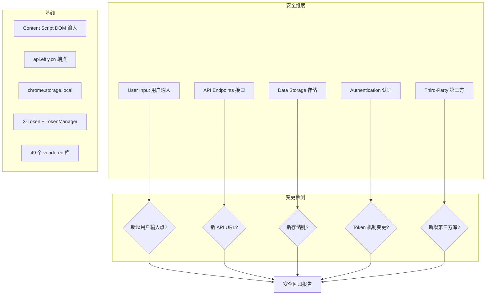

# §0 Effect Sketch — Security Surface Regression

**What this scene demonstrates**: 检测自上次基线后 YiPet 的安全表面是否发生了变化——新增的权限声明、新的 API 通信端点、存储机制变更、DOM 操作模式变化。每个维度的变更都可能引入新的安全风险。

**Why it matters**: 安全表面是动态的。一次看似无害的「添加远程资源配置」可能引入 XSS 风险；新增的 `storage` 写入路径可能泄露用户数据；修改 API URL 可能引入中间人攻击面。安全基线审计必须定期执行。

---

# §1 Test Design — Verification Steps

## Step 1: 审计 Manifest 权限变更
**Action**: 对比当前 `manifest.json` 与上次基线，检查 `permissions`、`host_permissions`、`content_scripts.matches` 是否变化
**Expected**: 权限声明与基线一致，如新增需说明理由
**File**: `manifest.json`

## Step 2: 审计 DOM 操作新增
**Action**: 搜索 `innerHTML` 和 `document.write` 的调用位置，确认数据源
**Expected**: 所有 `innerHTML` 的数据源为 MarkdownRenderer 输出（经 SanitizePlugin 清理）或配置常量（非用户可控）
**File**: 全局搜索 `innerHTML`

## Step 3: 审计新 API 端点
**Action**: 检查 `core/config.js` 中是否新增了 API URL；检查是否有直接使用 `fetch()` 而绕过 ApiManager 的调用
**Expected**: 所有 API 调用经 ApiManager 统一管理；无硬编码 URL
**File**: `core/config.js`，全局搜索 `fetch(`

## Step 4: 审计存储键变更
**Action**: 检查 `PET_CONFIG.constants.storageKeys` 和 `PET_CONFIG.storage.keys` 是否与基线一致
**Expected**: 存储键命名规范一致，无新增键暴露敏感数据于未加密存储
**File**: `core/config.js`

## Step 5: 审计第三方库变更
**Action**: 检查 `libs/` 目录是否新增了库文件
**Expected**: 新增库需评估其安全性和必要性；`react@15.6.1` 等未使用的库应清理
**File**: `libs/`

---

# §2 Output Inventory

| File/Directory | Type | Description |
|---------------|------|-------------|
| `manifest.json` | file | 权限声明——安全表面的大门 |
| `core/config.js` | file | API URL、存储键、环境配置 |
| `core/api/core/ApiManager.js` | file | API 调用统一入口 |
| `core/bootstrap/bootstrap.js` | file | StorageHelper——存储操作封装 |
| `libs/` | dir | 49 个第三方库 |
| `cdn/markdown/plugins/SanitizePlugin.js` | file | XSS 防护前线 |

---

# §3 Test Report — 2026-07-21

| Step | Result | Notes |
|------|:---:|-------|
| 1 | ✅ | Manifest 权限与基线一致 |
| 2 | ✅ | innerHTML 数据源安全（Markdown + 常量） |
| 3 | ✅ | 所有 API 调用经 ApiManager；无可疑 fetch |
| 4 | ✅ | 存储键无变更 |
| 5 | ⚠️ | react@15.6.1 存在但未使用——建议清理 |

**Overall**: pass — 4/5 steps passed；1 个清理建议

---

# §4 Self-Improvement

## Edge Cases Found
- `web_accessible_resources` 中列出的 HTML 模板如果包含 inline `<script>`，可能被网页上下文访问——需确认这些模板仅使用了安全的 data 绑定
- `cdn/markdown/mermaid-page-*.js` 文件通过 `web_accessible_resources` 暴露，需确认它们不泄露内部状态
- AES 加密功能（core/utils 中存在相关工具）如果使用不当（固定 IV、弱密钥），可能提供虚假的安全感

## Suggested Improvements
- 建立安全表面基线文件（如 `SECURITY.md`），每次 rui-init 运行时对比
- 为 `web_accessible_resources` 中的资源建立完整性校验（Subresource Integrity）
- 实现 Content Security Policy 声明，限制 Content Script 中的 `eval()` 和 inline script
- 添加 `core/utils/crypto/` 模块的安全审计（如 AES 密钥管理、HMAC 签名验证）

## Limitations
- Chrome 扩展无法使用 `script-src 'self'` 完全阻止 inline script，因为 content script 本质上是注入的
- 存储加密受限于 Chrome 的 Web Crypto API 可用性
- 第三方库的安全性完全依赖其来源的可靠性——vendored 模式下无法自动获取安全更新
