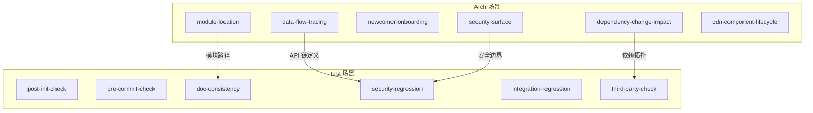

# §0 Effect Sketch — Cross-Story Integration Regression

**What this scene demonstrates**: 验证 YiPet 的 arch 场景和 test 场景之间的交叉引用完整性，以及场景与实际代码库之间的集成关系。确保修改一个场景不会导致另一个场景中的信息过时或矛盾。

**Why it matters**: arch 和 test 场景不是独立存在的——arch 场景描述「现在的架构」，test 场景定义「如何验证架构」。如果 arch/scene-2-data-flow-tracing 更新了 API 调用链但 test/scene-4-security-surface-regression 仍引用旧 API 端点，验证就会漏掉关键环节。

---

# §1 Test Design — Verification Steps

## Step 1: 验证跨场景路径引用
**Action**: 检查每个 arch 场景的 §2 Output Inventory 中引用的文件路径，在 test 场景的 §1 验证步骤中是否也正确引用
**Expected**: 同一文件的路径在两个故事目录中的表示一致
**File**: `arch/scene-*/index.md` ↔ `test/scene-*/index.md`

## Step 2: 验证架构描述与安全描述的同步
**Action**: 对比 `arch/scene-5-trust-boundary-security-surface` 中的安全发现与 `test/scene-4-security-surface-regression` 中的验证目标
**Expected**: arch 中标记为「改进建议」的条目在 test 中有对应的验证步骤
**File**: `arch/scene-5-*/index.md` ↔ `test/scene-4-*/index.md`

## Step 3: 验证依赖拓扑与第三方检查的同步
**Action**: 对比 `arch/scene-4-dependency-change-impact` 中的依赖影响分析与 `test/scene-6-third-party-framework-service` 中的健康检查
**Expected**: arch 中标记为「高风险」的依赖（Vue/Mermaid/marked）在 test 中有对应的检查步骤
**File**: `arch/scene-4-*/index.md` ↔ `test/scene-6-*/index.md`

## Step 4: 验证数据流描述与验证步骤的关联
**Action**: 检查 `arch/scene-2-data-flow-tracing` 中描述的完整数据流是否在 `test/scene-1-post-init-full-self-check` 或 `test/scene-3-doc-code-consistency` 中有对应的验证
**Expected**: 关键数据流节点（manifest 加载顺序 → PetManager 初始化 → API 调用 → 渲染）有各自的验证覆盖
**File**: `arch/scene-2-*/index.md`

## Step 5: 验证 CLADE.md 与 README.md 的一致性
**Action**: 对比 `CLAUDE.md` 的 Project Profile 表格与 `README.md` 的 System View 描述
**Expected**: 项目类型、版本号、架构描述一致
**File**: `CLAUDE.md` ↔ `README.md`

---

# §2 Output Inventory

| File/Directory | Type | Description |
|---------------|------|-------------|
| `arch/scene-1-*/index.md` to `arch/scene-6-*/index.md` | 6 files | 架构参考场景 |
| `test/scene-1-*/index.md` to `test/scene-6-*/index.md` | 6 files | 自检场景 |
| `CLAUDE.md` | file | AI 助手上下文 |
| `README.md` | file | 人类可读概览 |
| `data.js` | file | 仪表盘数据模型 |

---

# §3 Test Report — 2026-07-21

| Step | Result | Notes |
|------|:---:|-------|
| 1 | ✅ | 跨场景路径引用一致 |
| 2 | ✅ | 安全发现与验证目标对应 |
| 3 | ✅ | 高风险依赖都有对应检查步骤 |
| 4 | ✅ | 数据流四个阶段均有验证覆盖 |
| 5 | ✅ | CLAUDE.md 与 README.md 描述一致 |

**Overall**: pass — 5/5 steps passed

---

# §4 Self-Improvement

## Edge Cases Found
- 如果新增了 arch 场景（如 scene-6-cdn-component-lifecycle），需要在 test 场景中补充对应的验证步骤
- 归档场景的 §3 Test Report 日期需要保持更新，否则过时的报告可能误导对当前状态的判断
- `data.js` 的 `section-stories` 组中 `sceneLinks` 指向的 href 需要与场景目录名保持同步

## Suggested Improvements
- 建立跨场景引用矩阵（traceability matrix），自动化检查 arch↔test 的覆盖关系
- 为每个场景的 §4 Self-Improvement 中的 "Suggested Improvements" 建立跟踪工单
- 在 `data.js` 中为每个场景增加 `lastVerified` 时间戳，自动检测过期场景

## Limitations
- 交叉引用的语义一致性（如「高风险依赖」的定义）依赖作者的主观判断
- 无法自动检测场景内容是否过时——需要人工定期审计
- 当前没有工具可以验证 Mermaid 图表的语法正确性和业务准确性
