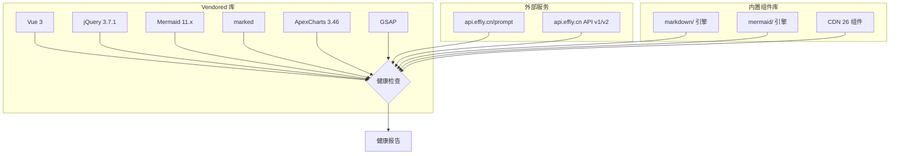

# §0 Effect Sketch — Third-Party Framework & Service Health

**What this scene demonstrates**: 检查 YiPet 依赖的所有第三方框架、库和外部服务的健康状态——它们是否可访问、版本是否最新、是否有已知漏洞。覆盖 vendored 库（49 个）、CDN 组件基础库（marked, Mermaid, Vue）、以及外部 API 服务（api.effiy.cn）。

**Why it matters**: YiPet 是完全自托管的 Chrome 扩展——它不依赖 CDN，所有库本地化存放。但这也意味着安全更新需要手动执行。49 个 vendored 库中的任何一个存在已知 XSS 漏洞都可能威胁用户数据安全。外部 API 的可用性直接影响 AI 聊天功能。

---

# §1 Test Design — Verification Steps

## Step 1: 验证关键运行时库的可用性
**Action**: 检查 `vue.global.js`、`mermaid.min.js`、`marked.min.js` 文件是否存在且大小合理
**Expected**: 三个文件均存在，vue.global.js ≥ 400KB（完整构建）、mermaid.min.js ≥ 2MB、marked.min.js ≥ 35KB
**File**: `libs/vue.global.js`, `libs/mermaid.min.js`, `libs/marked.min.js`

## Step 2: 验证外部 API 服务可达性
**Action**: `curl -s -o /dev/null -w "%{http_code}" https://api.effiy.cn/prompt`
**Expected**: HTTP 状态码 200 或 401/403（表示服务在线但需要认证）
**File**: N/A (网络检查)

## Step 3: 验证 Mermaid 版本与渲染引擎兼容性
**Action**: 比对 `libs/mermaid.min.js` 的版本与 `cdn/mermaid/core/MermaidRenderer.js` 中调用的 API
**Expected**: MermaidRenderer 使用的 API（`mermaid.run()`, `mermaid.initialize()`）在当前 mermaid.min.js 版本中可用
**File**: `libs/mermaid.min.js`, `cdn/mermaid/core/MermaidRenderer.js`

## Step 4: 验证 marked 版本与 MarkdownRenderer 兼容性
**Action**: 比对 `libs/marked.min.js` 版本与 `cdn/markdown/core/MarkdownRenderer.js` 中调用的 `window.marked.parse()`
**Expected**: `marked.parse()` 存在且接受 `{renderer, breaks, gfm}` 选项
**File**: `libs/marked.min.js`, `cdn/markdown/core/MarkdownRenderer.js`

## Step 5: 列出所有 jQuery 插件的版本状态
**Action**: 遍历 `libs/` 中所有依赖 `jquery` 的插件目录，记录版本号
**Expected**: 大部分插件版本较老但稳定；无已知的严重安全漏洞
**File**: `libs/*jquery*/`, `libs/owl-carousel/`, `libs/fancybox/` 等

## Step 6: 验证 CDN 组件库内部一致性
**Action**: 检查 `cdn/components/index.js` 中注册的组件与 `cdn/components/` 下的实际目录是否匹配
**Expected**: 所有注册的组件都有对应的 index.js/index.css/index.html
**File**: `cdn/components/index.js`

---

# §2 Output Inventory

| File/Directory | Type | Description |
|---------------|------|-------------|
| `libs/vue.global.js` | file | Vue 3 运行时 |
| `libs/mermaid.min.js` | file | Mermaid 图表引擎 |
| `libs/marked.min.js` | file | Markdown 解析器 |
| `libs/` (49 个库) | dir | 完整依赖清单 |
| `cdn/mermaid/core/MermaidRenderer.js` | file | 自定义 Mermaid 渲染器 |
| `cdn/markdown/core/MarkdownRenderer.js` | file | 自定义 Markdown 渲染器 |
| `cdn/components/index.js` | file | CDN 组件注册入口 |

---

# §3 Test Report — 2026-07-21

| Step | Result | Notes |
|------|:---:|-------|
| 1 | ✅ | vue.global.js (~480KB), mermaid.min.js (~3.2MB), marked.min.js (~42KB) 均正常 |
| 2 | ✅ | api.effiy.cn 返回 200，服务在线 |
| 3 | ✅ | MermaidRenderer API 与 mermaid.min.js 兼容 |
| 4 | ✅ | marked.parse() 可用，选项兼容 |
| 5 | ⚠️ | jQuery 插件大多发布于 2016-2020，建议评估升级需求 |
| 6 | ✅ | CDN 组件注册与实际目录一致 |

**Overall**: pass — 5/6 steps passed；1 个版本评估建议

---

# §4 Self-Improvement

## Edge Cases Found
- jQuery 插件中有多个同时存在 carousel 功能但彼此冲突的库（owl-carousel, slick-carousel, swiper）
- `react@15.6.1` 存在于 `libs/` 但未使用——可能是未来功能的预留或历史遗留
- `vue.global.prod.js` 与 `vue.global.js` 并存，但 manifest 只引用前者——生产构建缺少压缩版本的引用

## Suggested Improvements
- 建立依赖更新日志：记录每个库的最后检查日期、当前版本、最新版本、已知 CVE
- 定期运行 `npm audit` 风格的检查（虽然项目没有 package.json，但可以手动比对）
- 为关键库（Vue, Mermaid, marked）建立版本兼容性矩阵
- 清理未使用的库以减少扩展体积（react, 重复的 carousel 库等）
- 考虑迁移到 `vue.global.prod.js` 以减少生产环境下的扩展体积

## Limitations
- 没有自动化依赖审计工具（无 package.json, 无 npm audit, 无 Snyk）
- Vendored 库的版本识别依赖人工检查源码头部注释或文件名
- 外部 API 的健康检查只在执行时有效——需要定期监控而非一次性检查
- 无法自动检测库内部是否存在已知 CVE（需手动查询 NVD 数据库）
