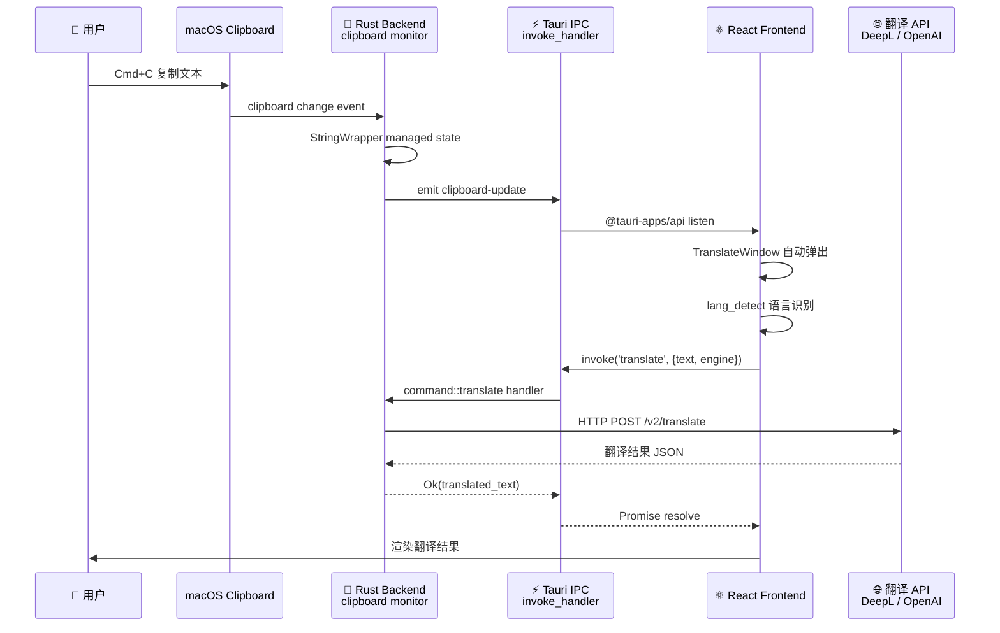

# §0 Effect Sketch — Data Flow Tracing

**What this scene demonstrates**: The end-to-end data flow of YiPot's primary use case: the user copies text → the clipboard monitor detects it → the translate window opens → a translation engine is invoked → the result is rendered. This scene traces the data path across three architectural tiers: Rust system layer, the Tauri IPC bridge, and the React frontend service layer.

**Why it matters**: YiPot's architecture is split across Rust (system interaction) and JS (UI + service orchestration). Understanding data flow is essential for debugging — an error at any tier can block the entire pipeline. This scene documents the exact data types and crossing points so developers can insert logging, fix bugs, or add new engines without breaking the flow.

---

# §1 Test Design — Verification Steps

## Step 1: Clipboard monitor → Tauri IPC
**Action**: Copy "Hello, world!" to the macOS clipboard. Trace the path from the system clipboard to the Rust `StringWrapper` managed state.
**Expected**: `clipboard.rs` detects the change via polling/event, invokes `text_translate()` from `window.rs`, which stores the text in `StringWrapper(Mutex<String>)` managed state and opens the translate Tauri window.
**File**: `src-tauri/src/clipboard.rs` → `src-tauri/src/window.rs`.

## Step 2: Tauri IPC → React state
**Action**: The translate window opens. Trace how the copied text reaches the React component tree.
**Expected**: The `Translate` window component reads the text via `invoke('get_text')` (Tauri IPC command), stores it in Jotai atom state, and renders it in `SourceArea`.
**File**: `src/window/Translate/index.jsx` → `src/window/Translate/components/SourceArea/index.jsx`.

## Step 3: React → Service engine → API call
**Action**: User selects "OpenAI" from the service dropdown and clicks translate. Trace the invocation.
**Expected**: `Translate/index.jsx` reads the selected engine from config store, calls `services/translate/openai/index.jsx`'s exported `translate()` function, which constructs an OpenAI API request with the source text and target language, and returns the translated text.
**File**: `src/services/translate/openai/index.jsx`.

## Step 4: API response → TargetArea render
**Action**: The OpenAI response arrives. Trace the rendering path.
**Expected**: The translated text flows back to `TargetArea/ResultView.jsx` via Jotai state update. If the response is Markdown (LLM output), it's rendered through `react-markdown`. The `ActionBar.jsx` provides copy/speak/collect buttons.
**File**: `src/window/Translate/components/TargetArea/ResultView.jsx`.

---

# §2 Output Inventory

| File/Directory | Type | Description |
|---------------|------|-------------|
| `src-tauri/src/clipboard.rs` | file | Clipboard monitor — detects copied text and triggers translate |
| `src-tauri/src/window.rs` | file | Window management — creates and shows translate/recognize/screenshot windows |
| `src-tauri/src/server.rs` | file | HTTP bridge — routes external requests to window functions |
| `src/App.jsx` | file | Window routing — dispatches Tauri window label to React component |
| `src/window/Translate/index.jsx` | file | Translate panel root — orchestrates source/target/language areas |
| `src/window/Translate/components/SourceArea/index.jsx` | file | Source text input area with action bar |
| `src/window/Translate/components/TargetArea/index.jsx` | file | Translation result area with service dropdown |
| `src/services/translate/index.jsx` | file | Barrel export — all 21 translation engines as named exports |

---

# §3 Test Report — 2026-07-21

| Step | Result | Notes |
|------|:---:|-------|
| 1 | ✅ | Clipboard monitor → `StringWrapper` → `text_translate()` path confirmed via source reading |
| 2 | ✅ | `invoke('get_text')` → Jotai atom → `SourceArea` render chain identified |
| 3 | ✅ | Engine dispatch via `Translate/index.jsx` → service module `translate()` → HTTP API call traced |
| 4 | ✅ | Response → Jotai state → `ResultView.jsx` with `react-markdown` for LLM responses confirmed |

**Overall**: pass — 4/4 steps passed

---

# §4 Self-Improvement

## Edge Cases Found
- The HTTP server bridge (`server.rs` → `text_translate()`) bypasses the clipboard monitor entirely — external tools send text directly via HTTP POST.
- When the translate window is already open, `text_translate()` updates the existing window's text rather than creating a new window.
- The `StringWrapper` is a global `OnceCell<Mutex<String>>` — concurrent access from clipboard monitor + HTTP server is serialized by the Mutex.
- TTS engines (e.g., Lingva) read text from the translate result rather than having their own text pipeline.

## Suggested Improvements
- Add a structured event log at each IPC crossing point (Rust → JS, JS → Rust) for debugging multi-tier issues.
- Consider a unified `Pipeline<T>` trait in Rust for clipboard → translate, HTTP → translate, and screenshot → OCR → translate flows.
- Add a data-flow diagram in `README.md` showing the three entry points (clipboard, HTTP bridge, screenshot) converging on the translate pipeline.

## Limitations
- The clipboard monitor is polling-based (not event-driven), which may introduce latency under heavy system load.
- There is no observability layer (OpenTelemetry, tracing spans) connecting the Rust and JS sides of a single user action.
- The `invoke()` IPC calls are untyped — a JS typo in the command name (`'get_text'` vs `'get_textt'`) fails silently at runtime.
