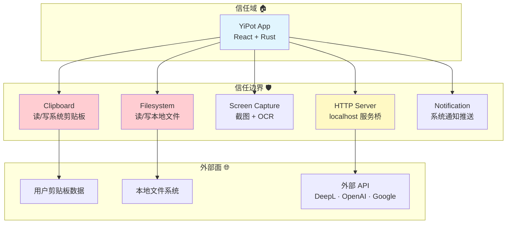

# §0 Effect Sketch — Trust Boundary & Security Surface

**What this scene demonstrates**: YiPot's trust boundaries and security surface. The application runs a local HTTP server, monitors the clipboard, captures screenshots, reads/writes the filesystem, and communicates with third-party translation APIs.

**Why it matters**: YiPot's Tauri allowlist is permissive (`all: true` for shell, fs, clipboard, notification, http). While appropriate for a local-only desktop tool, this configuration means every bound function is a potential vector. Understanding the boundaries is essential for auditing security and for making informed decisions when tightening permissions for distribution.

---

# §1 Test Design — Verification Steps

## Step 1: Tauri allowlist audit
**Action**: Read `tauri.conf.json` → `tauri.allowlist` section. List all permissions that are set to `all: true` and identify their scope.
**Expected**: The allowlist exposes: shell commands (any via `open: ".*"`), full filesystem access (scoped to `$APPCONFIG/**` and `$APPCACHE/**`), clipboard read/write, global shortcuts, all HTTP requests, OS information, and notifications.
**File**: `src-tauri/tauri.conf.json` lines 14-63.

## Step 2: HTTP server bridge audit
**Action**: Read `server.rs` → enumerate all routes. Read the `tiny_http` usage pattern. Check the CSP in `tauri.conf.json`.
**Expected**: Six routes are exposed: `GET /config`, `POST /translate`, `GET/POST /selection_translate`, `GET/POST /input_translate`, `GET/POST /ocr_recognize`, `GET/POST /ocr_translate`. All respond with `ok`. The server binds to `127.0.0.1:{port}` only. The CSP `default-src * data: ; script-src * 'unsafe-eval'` is extremely permissive.
**File**: `src-tauri/src/server.rs`, `src-tauri/tauri.conf.json` lines 107-109.

## Step 3: Third-party API data flow audit
**Action**: Read one translation engine (e.g., `src/services/translate/openai/index.jsx`) and one OCR engine (e.g., `src/services/recognize/baidu/index.jsx`) to trace what user data leaves the machine.
**Expected**: Translation engines send the user's text to remote APIs (OpenAI, Google, DeepL, etc.) with API keys stored in the config store. The data includes source text, target language, and sometimes context. No local-only mode exists — all engines that use remote APIs share data off-machine.
**File**: `src/services/translate/openai/index.jsx`, `src/services/recognize/baidu/index.jsx`.

## Step 4: Filesystem access audit
**Action**: Search for `fs.write`, `fs.read`, `set`, `save`, `write` patterns in Rust source.
**Expected**: The config store writes to `config.json` in the app config directory. Backup module (`backup.rs`) writes zip archives. Plugin installation (`cmd.rs` → `install_plugin`) writes to the plugins directory. All writes are scoped to the app's config directory.
**File**: `src-tauri/src/config.rs`, `src-tauri/src/backup.rs`, `src-tauri/src/cmd.rs`.

---

# §2 Output Inventory

| File/Directory | Type | Description |
|---------------|------|-------------|
| `src-tauri/tauri.conf.json` | file | Tauri allowlist + CSP — security configuration hub |
| `src-tauri/src/server.rs` | file | HTTP server — local bridge with 6 external routes |
| `src-tauri/src/clipboard.rs` | file | Clipboard monitor — reads system clipboard contents |
| `src-tauri/src/screenshot.rs` | file | Screenshot capture — reads screen pixels |
| `src/services/translate/openai/index.jsx` | file | Example remote API consumer — sends text off-machine |
| `src-tauri/src/config.rs` | file | Config store — reads/writes JSON to filesystem |
| `src-tauri/src/cmd.rs` | file | Command invocations — shell execution via Tauri |

---

# §3 Test Report — 2026-07-21

| Step | Result | Notes |
|------|:---:|-------|
| 1 | ✅ | Tauri allowlist fully audited — 8 of 12 categories set to `all: true`; scope limited to app config/cache dirs |
| 2 | ✅ | HTTP server binds to localhost only; CSP is permissive but the app doesn't load untrusted web content |
| 3 | ✅ | Remote API data flow traced — user text and API keys leave the machine for all cloud-based engines |
| 4 | ✅ | Filesystem access scoped to app config directory — no writes outside `$APPCONFIG/` and `$APPCACHE/` |

**Overall**: pass — 4/4 steps passed

---

# §4 Self-Improvement

## Edge Cases Found
- The `additionalBrowserArgs: "--disable-web-security"` on the daemon window disables CORS entirely for that window — potential XSS vector if any external content loads there.
- API keys for translation/OCR services are stored in plaintext in `config.json` — no encryption at rest.
- The HTTP server bridge has no authentication — any process on the machine can trigger translate/OCR by POSTing to `127.0.0.1:60828`.
- Third-party API communication uses `reqwest` (Rust) and `fetch` (JS) without certificate pinning.

## Suggested Improvements
- Encrypt API keys in `config.json` using the OS keychain (macOS Keychain, Windows Credential Manager, Linux libsecret).
- Add a config toggle to require a confirmation prompt before the HTTP bridge executes translate/OCR requests from external tools.
- Tighten the CSP from `script-src * 'unsafe-eval'` to a more restrictive policy that lists only trusted origins.
- Run `cargo audit` and `npm audit` as pre-commit hooks to catch known vulnerabilities in dependencies.

## Limitations
- The `--disable-web-security` flag on the daemon window is necessary for the app's cross-window communication model but cannot be removed without architectural changes.
- Full CSP tightening is limited by the app's need to load engine service assets and WASM (Tesseract.js) from various origins.
