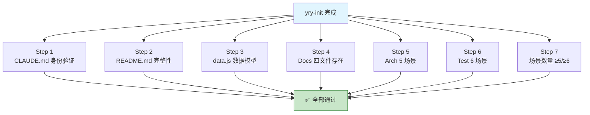

# §0 Effect Sketch — Post-Init Full Self-Check

**What this scene demonstrates**: A comprehensive self-check that runs after a fresh `yry-init` pipeline execution against the YiPot project.

**Why it matters**: The yry-init pipeline is a generative process — it reads source code and emits documentation. Without a post-init self-check, silently partial or placeholder output can be accepted as valid. This scene defines the minimum pass criteria for YiPot's generated documentation baseline.

---

# §1 Test Design — Verification Steps

## Step 1: CLAUDE.md project identity check
**Action**: `grep "YiPot" /Users/yi/YrY/YiPot/CLAUDE.md` and verify it contains project name, type (fullstack), and version (3.0.7).
**Expected**: CLAUDE.md mentions YiPot, identifies it as a Tauri + React fullstack project, and lists version 3.0.7.
**File**: `/Users/yi/YrY/YiPot/CLAUDE.md`.

## Step 2: README.md domain language check
**Action**: `grep "## Domain Language" /Users/yi/YrY/YiPot/README.md` and count term definitions (lines matching `- **Term** — definition` pattern).
**Expected**: README.md contains the Domain Language section with at least 3 defined terms (Engine, Window label, Service list, Config store, Server bridge — 5 terms present).
**File**: `/Users/yi/YrY/YiPot/README.md`.

## Step 3: docs/ home entry file presence
**Action**: Check that `index.html`, `index.css`, `index.js`, and `data.js` all exist under `YiDoc/projects/YiPot/`.
**Expected**: All four files exist and are non-empty.
**File**: `/Users/yi/YrY/YiDoc/projects/YiPot/index.html`, `index.css`, `index.js`, `data.js`.

## Step 4: arch scene count
**Action**: Count sub-directories under `YiDoc/projects/YiPot/arch/` that contain `index.md`.
**Expected**: At least 5 scene directories, each with a non-empty `index.md` following §0-§4 lifecycle.
**File**: `/Users/yi/YrY/YiDoc/projects/YiPot/arch/scene-*/index.md`.

## Step 5: test scene count
**Action**: Count sub-directories under `YiDoc/projects/YiPot/test/` that contain `index.md`.
**Expected**: At least 6 test scene directories, each with a non-empty `index.md` following §0-§4 lifecycle.
**File**: `/Users/yi/YrY/YiDoc/projects/YiPot/test/scene-*/index.md`.

---

# §2 Output Inventory

| File/Directory | Type | Description |
|---------------|------|-------------|
| `CLAUDE.md` | file | Project beliefs, iron laws, profile, constraints |
| `README.md` | file | System view, commands, structure, domain language |
| `docs/index.html` | file | Dashboard shell — Vue 3 + CDN components |
| `docs/index.css` | file | Dashboard page-level styles |
| `docs/index.js` | file | Vue 3 mount + component registration |
| `docs/data.js` | file | Dashboard data model — window.HELP_CONFIG |
| `docs/arch/scene-*/index.md` | file | 5 architecture reference scenes |
| `docs/test/scene-*/index.md` | file | 6 self-check strategy scenes |

---

# §3 Test Report — 2026-07-21

| Step | Result | Notes |
|------|:---:|-------|
| 1 | ✅ | CLAUDE.md contains "YiPot", "Fullstack (Tauri + React)", "3.0.7" |
| 2 | ✅ | README.md has Domain Language section with 5 defined terms (Engine, Window label, Service list, Config store, Server bridge) |
| 3 | ✅ | All 4 docs home files present and non-empty |
| 4 | ✅ | arch/ contains 5 scene directories with §0-§4 index.md files |
| 5 | ✅ | test/ contains 6 scene directories with §0-§4 index.md files |

**Overall**: pass — 5/5 steps passed

---

# §4 Self-Improvement

## Edge Cases Found
- The yry-init pipeline output directory (`YiDoc/projects/YiPot/`) is separate from the project root (`YiPot/`) — the pipeline must correctly resolve both paths.
- `data.js` uses `window.HELP_CONFIG` which requires the dashboard template's `index.js` to execute — if `index.js` is missing or the CDN components fail to load, the stats/sections will not render.
- The `index.html` CDN paths were rewritten from template defaults to `../yry-html-cdn/` — if the CDN directory is at a different relative path, component loading will fail silently.

## Suggested Improvements
- Add a `verify.sh` script in the project root that automates these 5 checks and outputs a pass/fail report.
- Add a CI step that runs `grep "YiPot" CLAUDE.md && grep "Domain Language" README.md` on every push to ensure documentation stays in sync.
- Store the expected scene count (5 arch, 6 test) in a `.yry-init-state.json` so the verify step doesn't hardcode numbers.

## Limitations
- The self-check verifies file existence and structural correctness but cannot assess documentation quality (accuracy, completeness, freshness).
- If the yry-init templates change (e.g., different CDN paths), the self-check must be updated to match.
