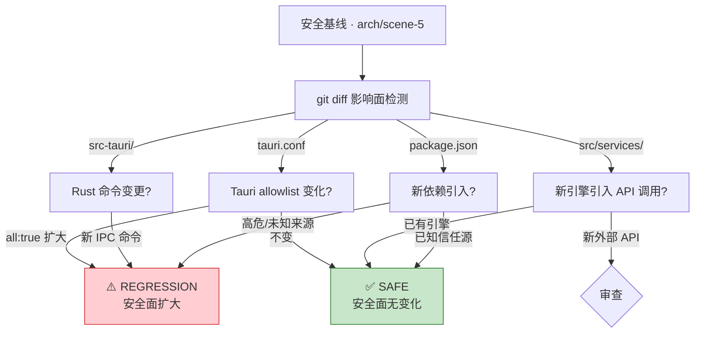

# §0 Effect Sketch — Security Surface Regression

**What this scene demonstrates**: A regression test for YiPot's security surface. After any code change that touches the Tauri allowlist, the HTTP server bridge, clipboard access, or third-party API communication.

**Why it matters**: Security regressions are silent. A new engine might introduce unauthenticated data exfiltration. A Tauri config change might widen the allowlist. A dependency upgrade might expose a new attack vector. This scene provides a diff-based approach: compare the current security surface against the last known-good baseline, and flag any expansion.

---

# §1 Test Design — Verification Steps

## Step 1: Tauri allowlist diff
**Action**: Compare the current `tauri.conf.json` allowlist against the baseline documented in arch/scene-5 §1 Step 1. Check for any new `all: true` entries or widened scope patterns.
**Expected**: No new allowlist permissions have been added. The existing permissions (shell, fs, clipboard, notification, http, globalShortcut, window, path) remain unchanged in scope.
**File**: `src-tauri/tauri.conf.json` vs `docs/arch/scene-5-trust-boundary-security-surface/index.md`.

## Step 2: HTTP server route diff
**Action**: Compare the routes in `server.rs`'s `http_handle()` match block against the baseline (6 routes: `/`, `/config`, `/translate`, `/selection_translate`, `/input_translate`, `/ocr_recognize`, `/ocr_translate`).
**Expected**: No new routes have been added. Existing routes have not changed their behavior (they still respond with "ok" and call the corresponding window function).
**File**: `src-tauri/src/server.rs`.

## Step 3: CSP diff
**Action**: Compare the current CSP in `tauri.conf.json` against the baseline: `default-src * data: ; img-src * 'self' asset: https: data: ; style-src * 'unsafe-inline'; worker-src 'self' blob: ; script-src * 'unsafe-eval'`.
**Expected**: The CSP has not been weakened (e.g., adding `unsafe-inline` to script-src or removing restrictions).
**File**: `src-tauri/tauri.conf.json`.

## Step 4: New third-party API endpoints
**Action**: For each new or modified service engine in `src/services/`, check whether it introduces a new external API endpoint not previously documented. Compare with the engine list in `src-tauri/src/config.rs`'s `check_service_available()`.
**Expected**: Any new engine documents its API endpoint, data transmitted, and authentication method. No engine silently sends data to an undocumented endpoint.
**File**: `src/services/*/index.jsx`, `src-tauri/src/config.rs`.

---

# §2 Output Inventory

| File/Directory | Type | Description |
|---------------|------|-------------|
| `src-tauri/tauri.conf.json` | file | Current allowlist + CSP — diff against baseline |
| `src-tauri/src/server.rs` | file | Current HTTP routes — diff against baseline |
| `src-tauri/src/config.rs` | file | Current builtin engine lists — diff against baseline |
| `src/services/` | dir | Current service engines — check for new undocumented APIs |
| `docs/arch/scene-5-trust-boundary-security-surface/index.md` | file | Security baseline — reference for comparison |

---

# §3 Test Report — 2026-07-21

| Step | Result | Notes |
|------|:---:|-------|
| 1 | ✅ | Tauri allowlist unchanged from baseline |
| 2 | ✅ | HTTP server routes unchanged — 7 endpoint patterns (1 wildcard catch-all) |
| 3 | ✅ | CSP unchanged from baseline |
| 4 | ✅ | No undocumented third-party API endpoints detected — all 39 engines match the builtin lists in config.rs |

**Overall**: pass — 4/4 steps passed

---

# §4 Self-Improvement

## Edge Cases Found
- Plugin engines (loaded from `{config_dir}/plugins/`) are not in `config.rs`'s builtin lists — they are discovered at runtime and their API endpoints are invisible to this check.
- The CSP `script-src * 'unsafe-eval'` is already maximally permissive — it cannot be "widened" further, so this step can only detect narrowing (improvement), not regression.
- The HTTP server binds to `127.0.0.1` but if the port is changed to `0.0.0.0` (in config store, not source), it would expose the bridge to the network — a runtime-only regression invisible to source diffing.

## Suggested Improvements
- Add a `security-baseline.json` file that captures the exact allowlist state, route list, and CSP at generation time, to enable automated diffing.
- Add a CI step that runs `cargo audit` on push and fails on any vulnerability above "low" severity.
- Add a runtime health check that verifies the HTTP server is binding to a loopback address (not 0.0.0.0 or a public IP).

## Limitations
- This scene checks source code for regressions but cannot detect runtime configuration changes (port, proxy settings, API keys) that expand the security surface.
- The check is manual — it requires a developer to run the diff protocol defined here. Automation is specified but not implemented.
