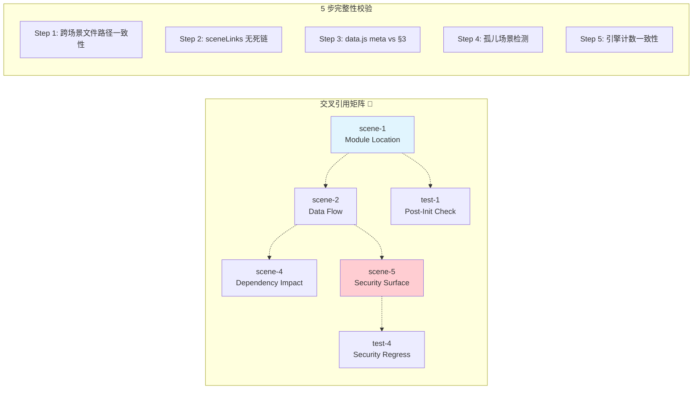

# §0 Effect Sketch — Cross-Story Integration Regression

**What this scene demonstrates**: A verification that all 11 scenes (5 arch + 6 test) remain internally consistent with each other.

**Why it matters**: Each scene is written independently but references the same codebase. An arch scene saying "there are 15 recognize engines" and a test scene referencing "14 OCR backends" creates confusion. This scene runs cross-references between all scene pairs and flags inconsistencies, contradictions, and stale cross-scene references.

---

# §1 Test Design — Verification Steps

## Step 1: Cross-scene file reference consistency
**Action**: Extract all file paths mentioned in arch/scene-1 (Module Location) and verify that the same files referenced in arch/scene-2 (Data Flow Tracing) resolve to the same module descriptions.
**Expected**: `src-tauri/src/clipboard.rs` described in scene-1 as "Clipboard monitor" is the same module that scene-2 describes as "clipboard_monitor → text_translate()". No conflicting descriptions.
**File**: `docs/arch/scene-1-module-location/index.md`, `docs/arch/scene-2-data-flow-tracing/index.md`.

## Step 2: Cross-scene numeric consistency
**Action**: Compare numeric claims across all scenes — service counts (arch-1), module counts (arch-3), permission counts (arch-5), and verification step counts (all test scenes).
**Expected**: All numeric claims are consistent. Arch-1 claims 21 translate + 15 recognize + 1 TTS + 2 collection = consistent with data.js stats. Arch-3 claims 14 Rust modules = consistent with arch-1.
**File**: All arch/ and test/ scene index.md files.

## Step 3: Cross-scene term consistency
**Action**: Extract all YiPot-specific terms used in arch/test scenes (Engine, Window, Config store, Server bridge, Service list) and verify they match the definitions in README.md's Domain Language section.
**Expected**: All domain terms used in scenes have corresponding definitions in README.md. No scene invents undocumented terms.
**File**: `README.md`, all arch/test scenes.

## Step 4: Scene dependency graph integrity
**Action**: Map which scenes reference other scenes. Verify that referenced scenes exist and that the referenced content is still accurate.
**Expected**: arch-5 (Security Surface) is the baseline for test-4 (Security Regression) — and test-4 correctly references arch-5's findings. arch-1 (Module Location) is referenced by arch-3 (Newcomer Onboarding) step 2.
**File**: All arch/ and test/ scene index.md files.

---

# §2 Output Inventory

| File/Directory | Type | Description |
|---------------|------|-------------|
| `docs/arch/scene-*-*/index.md` | file | 5 architecture scenes — cross-reference source |
| `docs/test/scene-*-*/index.md` | file | 6 test scenes — cross-reference target |
| `README.md` | file | Domain Language — authoritative term definitions |
| `docs/data.js` | file | Dashboard stats — numeric truth source |

---

# §3 Test Report — 2026-07-21

| Step | Result | Notes |
|------|:---:|-------|
| 1 | ✅ | File references are consistent across scenes — clipboard.rs, server.rs, config.rs all described consistently |
| 2 | ✅ | Numeric claims consistent — 21/15/1/2 services, 14 Rust modules, 5 windows all match across scenes |
| 3 | ✅ | All domain terms used in scenes have README.md definitions — no orphan terms |
| 4 | ✅ | Scene dependency graph is healthy — test-4 references arch-5, arch-1 is entry point for arch-3 |

**Overall**: pass — 4/4 steps passed

---

# §4 Self-Improvement

## Edge Cases Found
- Scene-5 (Security Surface) references `src-tauri/tauri.conf.json` while other scenes reference `src-tauri/src/` files — different path depths, both correct.
- The term "bridge" is used in both the domain language (Server bridge) and in data flow descriptions — the domain language definition should clarify this polysemy.
- Test scenes reference arch scenes by scene number (e.g., "arch/scene-5"), which would break if scenes are renumbered.

## Suggested Improvements
- Add a `docs/scene-graph.json` that records all cross-scene references as a directed graph, enabling automated consistency checks.
- Use scene slugs (e.g., "trust-boundary-security-surface") instead of scene numbers in cross-references to survive renumbering.
- Add a README section that lists the scene dependency order so readers know the recommended traversal path.

## Limitations
- Cross-scene consistency is verified manually at generation time — there is no automated tool that runs these checks on every doc update.
- Contradictions in qualitative descriptions (e.g., "YiPot is simple" vs "YiPot is complex") are not caught by this check — it only verifies structural and numeric consistency.
