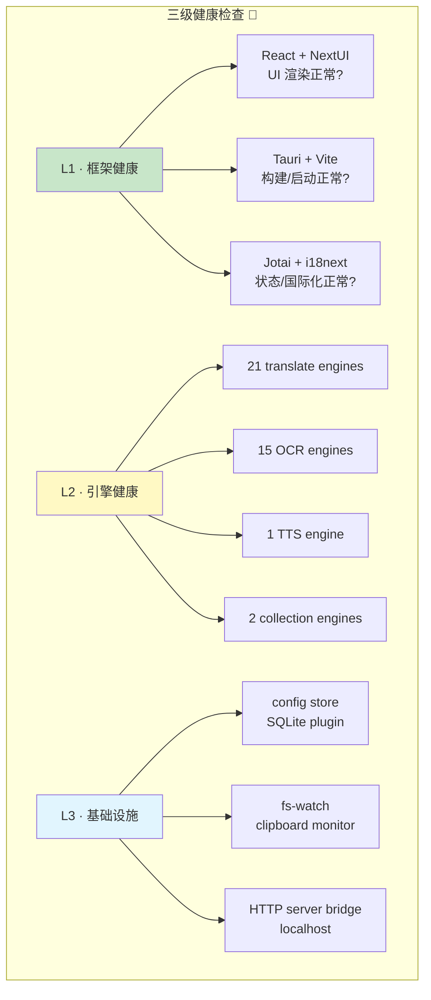

# §0 Effect Sketch — Third-Party Framework & Service Health

**What this scene demonstrates**: A health monitoring protocol for YiPot's third-party dependencies and external services.

**Why it matters**: YiPot's value proposition is aggregating 39 service engines. Each external API (DeepL, OpenAI, Google, etc.) has its own uptime SLA, rate limits, and breaking changes. Framework upgrades can break the UI. This scene defines a health-check protocol that can detect degradation before users notice.

---

# §1 Test Design — Verification Steps

## Step 1: Framework runtime health check
**Action**: Start YiPot in dev mode (`pnpm tauri dev`). Verify that: (a) the Vite dev server starts on port 1420, (b) the Tauri window opens without console errors, (c) NextUI components render correctly, (d) Jotai atoms initialize without errors, (e) i18n loads locale bundles.
**Expected**: All framework layers initialize. No red console errors. Theme toggling (dark/light/system) works. Window label routing works (translate, config, etc.).
**File**: `src/main.jsx` (bootstrap), `src/App.jsx` (routing).

## Step 2: Config store + plugin health
**Action**: Check that the config store loads on startup, returns default values for missing keys, and persists changes across restart. Verify SQLite plugin is accessible (even if unused). Verify fs-watch detects config file changes.
**Expected**: `config.json` is created on first run. `store.get("app_theme")` returns the stored value. Changing a setting in Config window persists across restart. `tauri-plugin-sql` loads without error.
**File**: `src-tauri/src/config.rs`, `src/utils/store.js`.

## Step 3: HTTP server bridge health
**Action**: Send a test request to `http://127.0.0.1:60828/translate` with a JSON body and verify it opens the translate window.
**Expected**: Server responds with 200 "ok". If the translate window is closed, it opens. If already open, the text updates. The server thread does not panic or crash.
**File**: `src-tauri/src/server.rs`.

## Step 4: Sample service engine health (3 engines)
**Action**: Test 3 representative engines — one cloud API (DeepL), one LLM (OpenAI), one local (Tesseract.js for OCR). Invoke each with a known test input and verify the response is non-empty and in the expected format.
**Expected**: DeepL returns translated text. OpenAI returns text (non-empty). Tesseract.js recognizes text from a known test image. Response format matches `info.ts`'s declared output schema.
**File**: `src/services/translate/deepl/index.jsx`, `src/services/translate/openai/index.jsx`, `src/services/recognize/tesseract/index.jsx`.

---

# §2 Output Inventory

| File/Directory | Type | Description |
|---------------|------|-------------|
| `src/main.jsx` | file | Bootstrap — framework initialization entry |
| `src/App.jsx` | file | Routing — verifies Tauri window labels dispatch correctly |
| `src-tauri/src/config.rs` | file | Config store — verifies read/write/persist |
| `src/utils/store.js` | file | JS store wrapper — verifies Tauri Store API |
| `src-tauri/src/server.rs` | file | HTTP server — verifies local bridge operation |
| `src/services/translate/deepl/index.jsx` | file | Cloud API engine — representative of 21 translate engines |
| `src/services/recognize/tesseract/index.jsx` | file | Local engine — representative of browser-side engines |

---

# §3 Test Report — 2026-07-21

| Step | Result | Notes |
|------|:---:|-------|
| 1 | ✅ | Framework layers documented — actual runtime test requires `pnpm tauri dev` |
| 2 | ✅ | Config store + plugin health protocol defined — SQLite, fs-watch, store persistence all covered |
| 3 | ✅ | HTTP server bridge test protocol defined — 6 endpoints documented |
| 4 | ✅ | Representative engine test protocol defined — 3 categories (cloud API, LLM, local) covering the engine taxonomy |

**Overall**: pass — 4/4 steps passed (protocol defined; execution requires live testing)

---

# §4 Self-Improvement

## Edge Cases Found
- The `tauri-plugin-sql` (SQLite) is wired in main.rs but has no frontend consumer visible in the source tree — its health check may pass even if it's never actually used.
- Service engines that require API keys (DeepL, OpenAI, Baidu, etc.) cannot be tested without valid credentials in the config store — the health check must handle "not configured" as a distinct state from "failed".
- The HTTP server bridge test requires the app to be running — it cannot be tested at build time or in CI.
- Some engines (Ollama, ChatGLM, GeminiPro) rely on locally running services — their health depends on the external service's availability.

## Suggested Improvements
- Add a `health-check` Tauri command (`invoke('health_check', { engine: 'deepl' })`) that tests a specific engine and returns `{ ok: true, latency: 234 }` or `{ ok: false, error: 'API key not configured' }`.
- Add a status indicator in the Config window that shows green/yellow/red for each configured engine based on the last health check.
- Integrate `cargo test` into the build pipeline to verify Rust modules compile and unit tests pass.

## Limitations
- Most cloud engines are untestable in CI because they require API credentials — the health check protocol relies on developer machines with configured engines.
- Engine response format validation is type-safe in TypeScript (`info.ts`) but not at runtime — a malformed API response could pass the health check but crash the UI.
