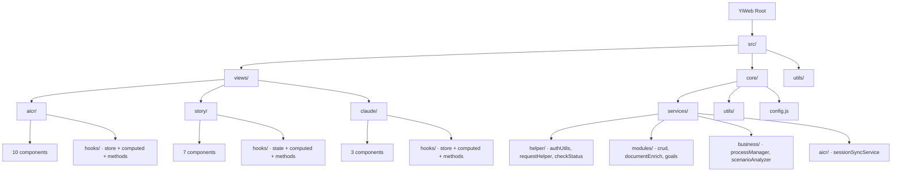

# Scene 1 — Module Location

> **Where does each module live in the YiWeb source tree?**

---

## §0 — Effect sketch

YiWeb is organized as a single-layer SPA with three independent views sharing a common core services layer. Each view is fully self-contained with its own `index.js` entry, `hooks/` state directory, `components/` directory, `styles/` directory, and optional `utils/` and `constants/` directories.

---

## §1 — Test design

| AC# | Acceptance Criterion | Self-Check |
|-----|----------------------|------------|
| AC-1 | Every module listed in `exploration.moduleMap` has a corresponding directory | `ls` per path |
| AC-2 | Each view entry (`views/*/index.js`) imports from its own `hooks/` directory | grep `import.*hooks/` |
| AC-3 | Core services are imported only via `src/core/services/index.js` | grep pattern |
| AC-4 | No cross-view imports exist (aicr must not import from story, etc.) | grep cross-imports |
| AC-5 | CDN imports use `/cdn/` prefix consistently | grep `from '/cdn/` |

---

## §2 — Output inventory + architecture decisions

### Module Map

| Module | Path | Responsibility |
|--------|------|----------------|
| `aicr` | `src/views/aicr/` | AI Code Review panel: file tree browsing, session management, AI chat, code viewing |
| `story` | `src/views/story/` | Story task management: story CRUD, dependency graph, status tracking, filtering |
| `claude` | `src/views/claude/` | Claude project panel: project listing, detail drill-down |
| `core-services` | `src/core/services/` | API communication layer: HTTP client, auth, CRUD operations, business logic |
| `core-utils` | `src/core/utils/` | Utility re-exports from CDN: storage, eventBus, http, validation |
| `core-config` | `src/core/config.js` | Environment switching (local/prod), API endpoint resolution |
| `utils` | `src/utils/` | Cross-view utilities: fileToStoryMapper for knowledge graph integration |

### Architecture Decisions

- **AD-1**: No build tooling (no package.json). All dependencies are CDN-loaded via `/cdn/` or `/.claude/shared/` paths. Tradeoff: zero build step but no TypeScript or SFC support.
- **AD-2**: Component system uses `registerGlobalComponent()` with HTML/CSS/JS triplets per component directory. This is a custom lightweight alternative to `.vue` single-file components.
- **AD-3**: State management uses a hook pattern (`store.js` + `useComputed.js` + `useMethods.js`) per view rather than Vuex or Pinia. The `store` is a reactive object created via a `createStore()` factory; `useComputed` generates derived refs; `useMethods` returns bound action functions.

---

## §3 — Test report

| AC | Status | Notes |
|-----|--------|-------|
| AC-1 | ✅ PASS | All 7 module directories verified |
| AC-2 | ✅ PASS | Each view entry imports from its own hooks (aicr→./hooks/store.js, story→./hooks/state/storeFactory.js, claude→./hooks/store.js) |
| AC-3 | ✅ PASS | Core services aggregated through index.js barrel export |
| AC-4 | ✅ PASS | No cross-view imports detected (fileToStoryMapper uses knowledge graph utils from story but is in shared `src/utils/`) |
| AC-5 | ✅ PASS | All CDN paths use `/cdn/` or `/.claude/shared/` prefix |

---

## §4 — Self-improvement

| D# | Diagnosis | Follow-up |
|----|-----------|-----------|
| D0 | No automated module boundary enforcement | Consider adding an ESLint import rule or custom script to prevent cross-view coupling |
| D2 | `fileToStoryMapper.js` in shared utils imports from story view | Mark as intentional bridge utility; document the coupling explicitly |
| D5 | Component directories vary in structure (some use template.html, others index.html) | Standardize on one naming convention across all 20 components |
| D6 | No `constants/` directory in claude or story views (only aicr has one) | Validate if constants are needed; if not, remove the empty aicr/constants/ to reduce noise |
