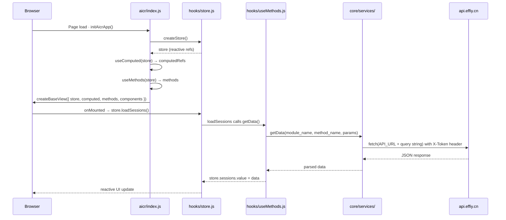

# Scene 2 — Data Flow Tracing

> **Trace a request from the aicr entry point to the API and back.**

---

## §0 — Effect sketch

The data flow in YiWeb follows a unidirectional pattern: entry point creates store → computed refs derive state → methods mutate store → services handle I/O → reactive updates propagate to DOM. There is no two-way binding outside the component templates; all state changes flow through the store.

---

## §1 — Test design

| AC# | Acceptance Criterion | Self-Check |
|-----|----------------------|------------|
| AC-1 | `createBaseView` is called with all three hooks (store, computed, methods) for each view | grep `createBaseView` in each view index.js |
| AC-2 | API calls go through `core/services/` helper functions (getData, postData, sendRequest) | grep import in methods files |
| AC-3 | Auth headers are attached automatically via `requestInterceptor` | Read requestHelper.js line 42-50 |
| AC-4 | Store mutations trigger reactive updates (store.*.value = ...) | grep `.value =` in methods files |
| AC-5 | Error responses are handled via `checkStatus` + `isAuthError` pipeline | Read requestHelper.js line 151-209 |

---

## §2 — Output inventory + architecture decisions

### Data Flow Layers

| Layer | Files | Direction |
|-------|-------|-----------|
| **Entry** | `views/*/index.js` | Creates store, computed, methods; passes to createBaseView |
| **State** | `views/*/hooks/state/store.js` → `hooks/store.js` | Holds all reactive refs (Vue.ref()); provides accessors |
| **Computed** | `views/*/hooks/computed/useComputed.js` | Derives reactive refs from store; pure functions of state |
| **Methods** | `views/*/hooks/useMethods.js` + `hooks/methods/*.js` | Business logic; reads/writes store; calls services |
| **Services** | `core/services/` | HTTP I/O layer: fetch wrapper, auth, CRUD, business domain |
| **Config** | `core/config.js` | Resolves API_URL, DATA_URL, OLLAMA_URL per environment |

### Architecture Decisions

- **AD-1**: All I/O happens through `requestHelper.js` → `sendRequest()`. This is the single choke point for auth headers, timeout handling, error classification, and retry logic. No view-level code calls `fetch()` directly.
- **AD-2**: Streaming responses (for AI chat) use `streamPrompt` / `streamPromptJSON` from `crud.js`, which handle Server-Sent Events (SSE) via fetch with `ReadableStream`. The streaming methods live in `sessionChatContextChatMethods.streaming.js`.
- **AD-3**: The `createBaseView` factory from CDN receives `data` (reactive refs), `methods` (bound functions), and `components` (registered component names). It instantiates a Vue 3 app with computed properties and mounts it to the DOM.

---

## §3 — Test report

| AC | Status | Notes |
|-----|--------|-------|
| AC-1 | ✅ PASS | All 3 views call createBaseView with store+computed+methods |
| AC-2 | ✅ PASS | API calls in useMethods.js import from `core/services/index.js` (getData, postData, batchOperations) |
| AC-3 | ✅ PASS | requestInterceptor at line 37-59 of requestHelper.js calls getAuthHeaders() when withAuth !== false |
| AC-4 | ✅ PASS | Store mutations use `.value =` assignment pattern throughout all methods files |
| AC-5 | ✅ PASS | sendRequest handles 401 via isAuthError + retryOn401 pattern with token-change polling |

---

## §4 — Self-improvement

| D# | Diagnosis | Follow-up |
|----|-----------|-----------|
| D0 | No structured data flow diagram in code comments | The mermaid diagram above should be added to CLAUDE.md for onboarding |
| D2 | `sessionChatContextChatMethods.streaming.js` handles SSE parsing inline | Consider extracting SSE parser into a shared service utility |
| D3 | Multiple methods files call `window.API_URL` directly rather than via config | Audit and unify through `core/config.js` → `buildApiUrl()` |
| D5 | No request/response logging toggle (always logs via logInfo) | Add a `verbose` flag to requestInterceptor config for production quiet mode |
| D7 | Batch operations (`batchRequests`) silently collect errors in a separate object | Surface partial failures to the caller with a combined success/error API |
