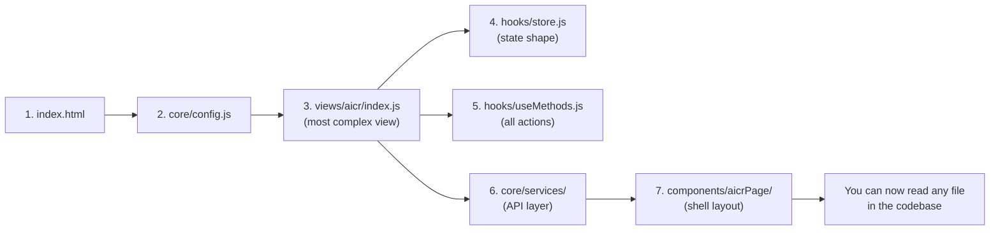

# Scene 3 — Newcomer Onboarding

> **I'm new to YiWeb; what should I read first?**

---

## §0 — Effect sketch

YiWeb uses a consistent self-contained-hook pattern across all three views. Understanding one view (aicr, the most feature-rich) gives you the mental model for all others. The onboarding path prioritizes data flow understanding over component rendering — once you know how state moves through `store → computed → methods → services`, the component layer is straightforward HTML/CSS/JS triplets.

---

## §1 — Test design

| AC# | Acceptance Criterion | Self-Check |
|-----|----------------------|------------|
| AC-1 | index.html loads `core/config.js` as first module | Read index.html |
| AC-2 | All three views follow the same init pattern: `createStore() → useComputed(store) → useMethods(store) → createBaseView(...)` | grep each view index.js |
| AC-3 | Component directories contain exactly 3 files: index.js + index.html/index.css (or template.html/index.css) | ls per component |
| AC-4 | Hook pattern has at minimum `store.js`, `useComputed.js`, `useMethods.js` per view | Check each views/*/hooks/ |
| AC-5 | CDN utility imports use `from '/cdn/'` prefix and are documented in data.js | Cross-reference data.js with grep results |

---

## §2 — Output inventory + architecture decisions

### Reading Order (7 files, ~30 minutes)

| Step | File | What you learn | Time |
|------|------|----------------|------|
| 1 | `/src/views/aicr/index.js` | How the app boots: store creation, computed refs, method binding, createBaseView call | 8 min |
| 2 | `/src/views/aicr/hooks/state/store.js` → `storeFactory.js` → `storeState.js` | State shape: sessions, fileTree, activeSession, sidebar width, filter state, batch mode | 5 min |
| 3 | `/src/views/aicr/hooks/computed/useComputed.js` | Derived state: projectTags, storyTags, skillTags, filteredFileCount | 3 min |
| 4 | `/src/views/aicr/hooks/useMethods.js` (first 80 lines) | Method composition: imports from services, sub-method factories, the big return object | 5 min |
| 5 | `/src/core/services/helper/requestHelper.js` | HTTP layer: fetch wrapper, timeout, CORS, auth interceptor, 401 retry | 5 min |
| 6 | `/src/core/config.js` | Environment switching, API endpoint resolution, debug mode, window.__ENV__ | 3 min |
| 7 | `/src/views/aicr/components/aicrPage/index.js` | How a component registers: registerGlobalComponent, Vue.inject, template binding | 3 min |

### Architecture Decisions

- **AD-1**: The codebase has no automated tests (testFramework: "none"). All verification is manual browser testing. This is an intentional tradeoff for rapid iteration on a CDN-loaded SPA where traditional test runners struggle with ES module imports from absolute paths.
- **AD-2**: The project uses `Vue.inject('viewContext')` inside component `setup()` to access the store and methods. This is the bridge between the `createBaseView`-created app and the individually registered components.
- **AD-3**: File paths in imports use absolute paths (`/src/views/aicr/hooks/store.js`). This means the application must be served from a web server root — it cannot be opened as `file://`.

---

## §3 — Test report

| AC | Status | Notes |
|-----|--------|-------|
| AC-1 | ✅ PASS | index.html is minimal (meta tags only); core/config.js is imported by each view index.js |
| AC-2 | ✅ PASS | All three views follow the identical pattern; claude is the simplest reference implementation |
| AC-3 | ✅ PASS | All 20 component directories have index.js + template files (HTML + CSS) |
| AC-4 | ✅ PASS | aicr hooks: 66 files (richest); story hooks: 18 files; claude hooks: 3 files |
| AC-5 | ✅ PASS | CDN imports verified: /cdn/utils/core/log.js, /cdn/utils/view/baseView.js, /cdn/markdown/index.js, etc. |

---

## §4 — Self-improvement

| D# | Diagnosis | Follow-up |
|----|-----------|-----------|
| D0 | No README.md exists in the project root | Generate one via yry-init-generate with domain language section |
| D1 | No inline code comments on the hook pattern architecture | Add a 5-line pattern docblock at the top of each view's index.js |
| D2 | The aicr view's useMethods.js is a mega-aggregator (~50+ method factories) | Consider splitting into a method registry pattern while keeping the flat return object for template access |
| D3 | `Vue.inject('viewContext')` is a hidden dependency — components fail silently if viewContext is missing | Add a defensive check in each component's setup() that logs a clear error message |
| D5 | No architecture decision log (ADR) directory | Consider adding `docs/decisions/` with markdown ADRs for future contributors |
