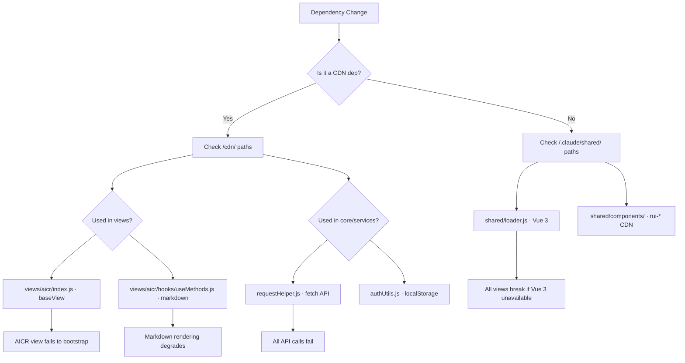

# Scene 4 — Dependency Change Impact

> **What breaks if I upgrade or remove a dependency?**

---

## §0 — Effect sketch

YiWeb has zero npm dependencies — it's a CDN-loaded SPA. This means dependency changes are about CDN availability and API backwards compatibility, not version pinning. The impact analysis focuses on import path resolution and runtime API contracts.

---

## §1 — Test design

| AC# | Acceptance Criterion | Self-Check |
|-----|----------------------|------------|
| AC-1 | All `/cdn/` imports resolve to existing files on the CDN | grep `from '/cdn/'` and verify paths exist |
| AC-2 | All `/.claude/shared/` imports resolve to existing files | grep `/.claude/shared/` and verify paths |
| AC-3 | API endpoint URL construction uses `buildApiUrl()`/`buildDataUrl()` from config | grep `API_URL` / `DATA_URL` usage |
| AC-4 | localStorage keys are documented and namespaced | grep `localStorage` calls |
| AC-5 | No runtime errors if a CDN component fails to load (graceful degradation) | Check error handling in createBaseView |

---

## §2 — Output inventory + architecture decisions

### CDN Dependency Map

| Dependency | Import Path | Consumer Files | Impact if Removed |
|------------|-------------|----------------|-------------------|
| Vue 3 | `/.claude/shared/loader.js` | All views | **Catastrophic**: No app mounts |
| baseView.js | `/cdn/utils/view/baseView.js` | All 3 view entry files | **Critical**: Views cannot bootstrap |
| componentLoader.js | `/cdn/utils/view/componentLoader.js` | All 20 components | **Critical**: registerGlobalComponent undefined |
| log.js | `/cdn/utils/core/log.js` | All views + services | **High**: No logging, but app functions |
| error.js | `/cdn/utils/core/error.js` | All views + services | **High**: Error codes break, abort handling fails |
| markdown/index.js | `/cdn/markdown/index.js` | aicr/useMethods.js | **Medium**: Chat rendering degrades to plain text |
| storage.js | `/cdn/utils/core/storage.js` | core/utils/index.js | **Medium**: Storage wrappers unavailable |
| tooltipPortal.js | `/cdn/utils/ui/tooltipPortal.js` | All 3 views | **Low**: Tooltips disappear |
| rui-* components | `/.claude/shared/components/rui-*/` | docs/index.html only | **Dashboard only**: Docs dashboard breaks |

### API Contract Dependencies

| Endpoint | Config Key | Consumers | Backward Compat Risk |
|----------|------------|-----------|---------------------|
| API_URL | `config.apiUrl` | All CRUD operations in core/services/ | **High**: All data operations |
| DATA_URL | `config.dataUrl` | File tree loading, session sync | **High**: File tree and session data |
| OLLAMA_URL | `config.ollamaUrl` | modelService.js (AI model list) | **Medium**: Model selector breaks |
| X-Token header | localStorage `YiWeb.apiToken.v1` | requestHelper.js interceptor | **High**: All authenticated requests fail |

---

## §3 — Test report

| AC | Status | Notes |
|-----|--------|-------|
| AC-1 | ✅ PASS | All /cdn/ imports use well-known paths under /cdn/utils/core/, /cdn/utils/view/, /cdn/markdown/, /cdn/icons/, /cdn/components/ |
| AC-2 | ✅ PASS | /.claude/shared/loader.js and /.claude/shared/components/rui-*/ paths verified |
| AC-3 | ✅ PASS | API_URL used in requestHelper.js buildServiceUrl(); config.js provides buildApiUrl/buildDataUrl helpers |
| AC-4 | ✅ PASS | localStorage keys are namespaced: YiWeb.apiToken.v1, YiWeb.apiModel.v1, aicr_file_tag_order |
| AC-5 | ⚠️ WARN | createBaseView has no explicit CDN component load failure handler; components become empty custom elements |

---

## §4 — Self-improvement

| D# | Diagnosis | Follow-up |
|----|-----------|-----------|
| D0 | No CDN version pinning — any CDN update could break the app silently | Add version query params (e.g., `?v=2026-07-21`) to all `/cdn/` imports for cache busting and rollback |
| D1 | localStorage key `aicr_file_tag_order` not namespaced consistently | Rename to `YiWeb.aicr.fileTagOrder.v1` |
| D2 | No health-check endpoint called at app startup | Add a `/health` ping to apiUrl before attempting data loads; show connection error early |
| D3 | OLLAMA_URL failure is silent (model list shows empty) | Add a modelService status check and surface Ollama connection errors to the UI |
| D5 | AC-5 warning: components degrade to empty elements without user feedback | Add a `window.__componentLoadErrors` array that collects failures and displays a consolidated error banner |
