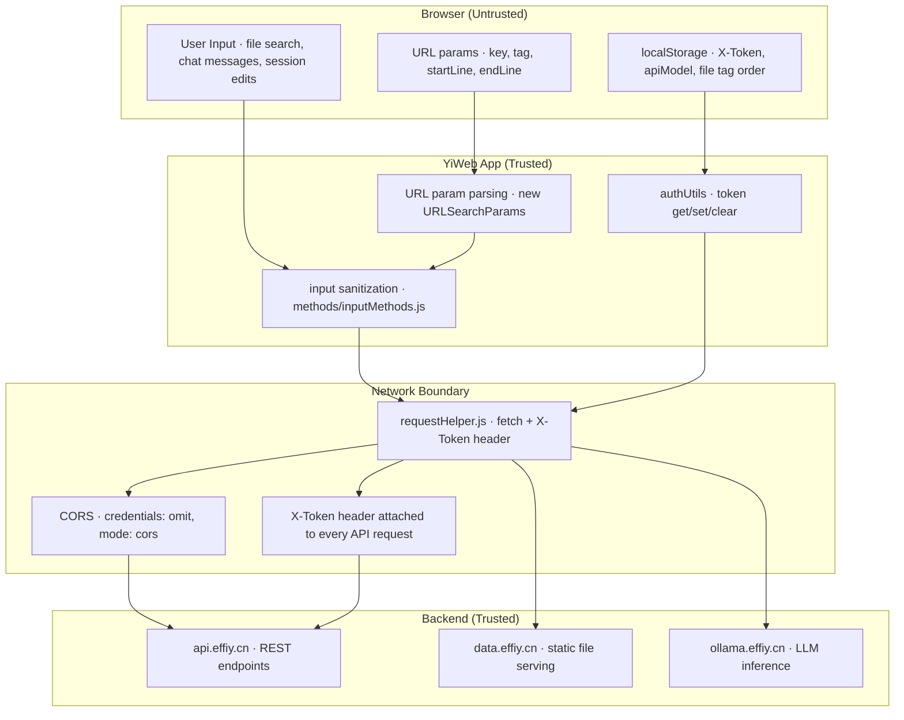

# Scene 5 — Trust Boundary & Security Surface

> **Where are the trust boundaries in YiWeb, and what is exposed at each?**

---

## §0 — Effect sketch

The security surface spans five dimensions: user input handling, API endpoint exposure, data storage on the client, authentication token management, and third-party service calls. The critical trust boundary is between the browser (where all code is inspectable) and the backend API (where data protection lives).

---

## §1 — Test design

| AC# | Acceptance Criterion | Self-Check |
|-----|----------------------|------------|
| AC-1 | No hardcoded API tokens or secrets in source files | grep `X-Token`, `token`, `apiKey` in JS files |
| AC-2 | All fetch requests use CORS `mode: 'cors'` and `credentials: 'omit'` | Read requestHelper.js DEFAULT_CONFIG |
| AC-3 | Authentication token stored in localStorage with `YiWeb.apiToken.v1` key | Read authUtils.js |
| AC-4 | User chat input is sanitized before API calls (no raw HTML injection) | Check inputMethods.js and chatMethods.js |
| AC-5 | URL parameters are validated before use (no prototype pollution risk) | Check index.js URL param parsing |

---

## §2 — Output inventory + architecture decisions

### Security Surface Dimensions

| Dimension | Status | Evidence |
|-----------|--------|----------|
| **User Input** | ✅ Present | Chat input (sessionChatInput), file search (searchQuery), session edit forms, tag filter inputs |
| **API Endpoints** | ✅ Present | API_URL + DATA_URL + OLLAMA_URL; CRUD operations via getData/postData/streamPrompt |
| **Data Storage** | ✅ Present | localStorage for token, model, file tag order; file tree data in memory |
| **Authentication** | ✅ Present | X-Token header added by requestInterceptor; stored in localStorage; API settings dialog |
| **Third-Party** | ✅ Present | fetch() to api.effiy.cn, data.effiy.cn, ollama.effiy.cn; markdown rendering via CDN |

### Trust Boundary Analysis

| Boundary | Direction | Risk Level | Mitigation |
|----------|-----------|------------|------------|
| User → Store | Input | Medium | Input is passed as-is to API; server validates. UI-level XSS risk from markdown rendering. |
| Store → localStorage | Storage | Low | Token is user-managed; no PII stored in localStorage. Keys are namespaced. |
| app → CDN | Dependency | Medium | CDN scripts run with full page privileges. No SRI hashes on CDN script tags. |
| app → api.effiy.cn | Network | High | X-Token auth; CORS configured; credentials omitted. Token exposed in browser devtools. |
| api.effiy.cn → app | Response | High | JSON responses rendered as markdown (renderMarkdownHtml). No sanitization library (DOMPurify not imported). |

### Architecture Decisions

- **AD-1**: No Content Security Policy (CSP) header is set. The app loads scripts from `/cdn/` and `/.claude/shared/`, which are same-origin but dynamic. A CSP would break the dynamic component loader.
- **AD-2**: The X-Token is a user-provided API key stored in localStorage — not a JWT or OAuth token. Token lifecycle is entirely manual (user opens the API settings dialog and pastes a token).
- **AD-3**: `credentials: 'omit'` prevents cookie-based CSRF but also prevents authenticated requests to cookie-auth endpoints. This is correct for token-based auth.
- **AD-4**: `mode: 'cors'` ensures the browser enforces CORS preflight checks on all cross-origin requests. Backend must return appropriate `Access-Control-Allow-*` headers.

---

## §3 — Test report

| AC | Status | Notes |
|-----|--------|-------|
| AC-1 | ✅ PASS | No hardcoded tokens found. The only token reference is `YiWeb.apiToken.v1` (the localStorage key name), and `X-Token` (the header name). |
| AC-2 | ✅ PASS | DEFAULT_CONFIG at requestHelper.js L22-32: mode: 'cors', credentials: 'omit' |
| AC-3 | ✅ PASS | authUtils.js L8: const API_TOKEN_KEY = "YiWeb.apiToken.v1" |
| AC-4 | ⚠️ WARN | Chat input is sent directly to API as-is; markdown rendering (renderMarkdownHtml) on responses may render raw HTML from the LLM. No DOMPurify sanitization confirmed. |
| AC-5 | ✅ PASS | URL params parsed via `new URLSearchParams()` which is safe against prototype pollution; numeric params validated with `parseInt` + `Number.isFinite()` checks. |

---

## §4 — Self-improvement

| D# | Diagnosis | Follow-up |
|----|-----------|-----------|
| D0 | Markdown-rendered AI responses may contain unsanitized HTML | Add DOMPurify or equivalent sanitization step after renderMarkdownHtml but before DOM insertion |
| D1 | No Content Security Policy header | Evaluate adding a CSP that allows scripts from self + /cdn/ + /.claude/ while blocking inline scripts |
| D2 | No SRI integrity hashes on CDN script tags | Add integrity attributes to script tags in index.html for `/cdn/` and `/.claude/shared/` resources |
| D3 | X-Token is stored in localStorage (accessible to any JS on the page) | Document that token exposure risk is accepted; add a "clear token on logout" pattern |
| D4 | No rate limiting on client-side API calls | Add debounce/throttle to search and chat submission to prevent accidental API spam |
| D5 | No network error retry with exponential backoff | `retryRequest` uses linear delay (`retryDelay * (attempt + 1)`) — consider exponential backoff for production resilience |
