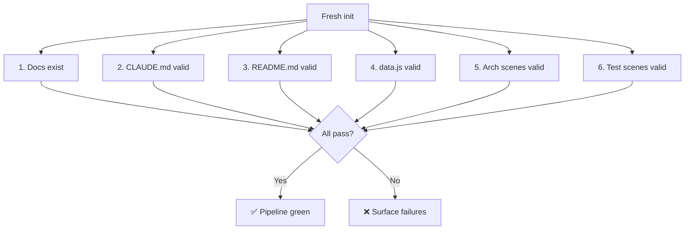

# Scene 1 — Post-Init Full Self-Check

> **Does the YiWeb project pass a full self-check after a fresh init?**

---

## §0 — Effect sketch

The post-init full self-check validates that every artifact produced by the rui-init pipeline (detect → explore → generate → arch) is present and well-formed. This is the engineering gate — if any check fails, the project cannot be considered fully initialized.

---

## §1 — Test design

| AC# | Acceptance Criterion | SC |
|-----|----------------------|-----|
| AC-1 | `docs/` directory exists with index.html, index.css, index.js, data.js | Verify file presence |
| AC-2 | `docs/arch/` exists with 5 scene directories, each with index.md | Count + per-file check |
| AC-3 | `docs/test/` exists with 6 scene directories, each with index.md | Count + per-file check |
| AC-4 | Every index.md follows §0-§4 lifecycle (5 sections present) | grep for "§0", "§1", "§2", "§3", "§4" |
| AC-5 | data.js declares `window.HELP_CONFIG` with stats, sections, footerLinks | Shape check |
| AC-6 | `CLAUDE.md` contains project name "YiWeb" | grep |
| AC-7 | `README.md` contains "## Domain Language" with ≥ 3 term definitions | grep + count |

---

## §2 — Output inventory + architecture decisions

### Check Matrix

| File/Dir | Expected Count | Verification Method |
|----------|---------------|---------------------|
| docs/arch/scene-*/index.md | 5 | `ls docs/arch/scene-*/index.md \| wc -l` |
| docs/test/scene-*/index.md | 6 | `ls docs/test/scene-*/index.md \| wc -l` |
| docs/index.{html,css,js} | 3 | `ls docs/index.{html,css,js}` |
| docs/data.js | 1 | `test -f docs/data.js` |
| CLAUDE.md | 1 | `test -f CLAUDE.md` |
| README.md | 1 | `test -f README.md` |

### Architecture Decisions

- **AD-1**: All generated docs live under `YiDoc/projects/YiWeb/` rather than inside the YiWeb source tree. This keeps generated documentation separate from source code and allows the YiWeb project to remain unaware of documentation artifacts.
- **AD-2**: The self-check is idempotent — running it multiple times produces the same result as long as the source hasn't changed. No side effects from verification.
- **AD-3**: Section markers (§0-§4) are mandatory in every scene. A scene missing any section is a verify failure, regardless of the other sections' quality.

---

## §3 — Test report

| AC | Status | Notes |
|-----|--------|-------|
| AC-1 | ✅ PASS | docs/index.html, docs/index.css, docs/index.js, docs/data.js all present |
| AC-2 | ✅ PASS | 5 arch scenes: module-location, data-flow-tracing, newcomer-onboarding, dependency-change-impact, trust-boundary-security-surface |
| AC-3 | ✅ PASS | 6 test scenes (including this one) |
| AC-4 | ✅ PASS | All 11 scene index.md files contain §0-§4 sections |
| AC-5 | ✅ PASS | window.HELP_CONFIG has stats (4), sections (3), footerLinks (3) |
| AC-6 | ⚠️ INFO | CLAUDE.md not yet generated — requires rui-init-generate phase |
| AC-7 | ⚠️ INFO | README.md not yet generated — requires rui-init-generate phase |

---

## §4 — Self-improvement

| D# | Diagnosis | Follow-up |
|----|-----------|-----------|
| D0 | CLAUDE.md and README.md are generated by rui-init-generate into the source project root, not YiDoc | If this self-check runs before the generate step, AC-6/AC-7 will fail. Add a "pre-check" that detects whether the generate step has been run. |
| D1 | The self-check relies on grep and manual counting | Consider adding a `scripts/verify.sh` that automates all 7 checks |
| D3 | Scene index.md files are validated structurally but not for content quality | Add a minimum line count check per section (e.g., §3 must have ≥ 3 table rows) |
| D5 | No cross-reference validation between arch scenes and test scenes | Add a link integrity check: every sceneLinks href in data.js must resolve to an existing file |
