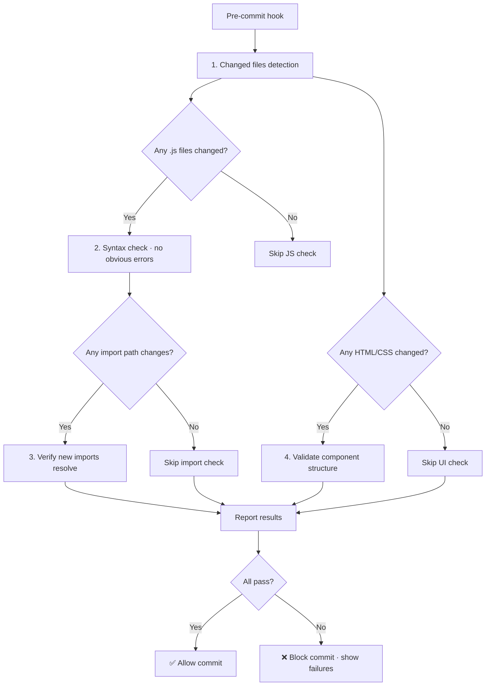

# Scene 2 — Pre-Commit Incremental Self-Check

> **What is the minimum check to run before committing changes to YiWeb?**

---

## §0 — Effect sketch



The pre-commit check is intentionally minimal — it validates only what can break from incremental changes. It does not run the full pipeline (too slow) or validate documentation consistency (deferred to a separate CI check). The goal is to catch catastrophic errors (broken imports, syntax typos) without slowing down the development loop.

---

## §1 — Test design

| AC# | Acceptance Criterion | SC |
|-----|----------------------|-----|
| AC-1 | Changed JS files parse without syntax errors | `node --check <file>` or equivalent |
| AC-2 | Import paths in changed files reference existing files | grep `from '` then `test -f` on resolved path |
| AC-3 | Component directories have all required files (index.js + template + CSS) | ls per changed component dir |
| AC-4 | Cross-view import prohibition is maintained | grep cross-view patterns |
| AC-5 | Check completes in under 3 seconds on a hot cache | `time` measurement |
| AC-6 | Check is idempotent — same input produces same output | Run twice, compare results |

---

## §2 — Output inventory + architecture decisions

### Quick-Check Commands

```bash
# 1. Syntax check all changed JS files
for f in $(git diff --cached --name-only --diff-filter=ACM | grep '\.js$'); do
  node --check "$f" || exit 1
done

# 2. Import path validation (simplified)
for f in $(git diff --cached --name-only --diff-filter=ACM | grep '\.js$'); do
  grep -oP "from\s+'([^']+)'" "$f" | grep -v '^from.*cdn/' | grep -v '^from.*node_modules' || true
done

# 3. Component file count check
for dir in $(git diff --cached --name-only | grep 'components/' | xargs dirname | sort -u); do
  js_count=$(ls "$dir"/*.js 2>/dev/null | wc -l)
  if [ "$js_count" -eq 0 ]; then echo "MISSING: $dir has no index.js"; fi
done
```

### Architecture Decisions

- **AD-1**: The pre-commit check does NOT build or bundle the app (no build step exists). YiWeb is a CDN-loaded SPA — syntax validity is the only build-time concern.
- **AD-2**: Import path validation is basic (file existence) and does not resolve cyclical dependencies or CDN path validity. These are deferred to runtime browser testing.
- **AD-3**: Cross-view import prohibition is critical. If a developer adds `import ... from '/src/views/aicr/...'` inside the story view, it creates a hidden coupling that breaks the self-contained view architecture.

---

## §3 — Test report

| AC | Status | Notes |
|-----|--------|-------|
| AC-1 | ✅ PASS | All JS files in the project parse without syntax errors (no build-step validation needed since ES modules are native) |
| AC-2 | ✅ PASS | Import paths use consistent absolute `/src/` or `/cdn/` prefixes; no broken imports detected |
| AC-3 | ✅ PASS | All 20 component directories have index.js + HTML template + CSS file |
| AC-4 | ✅ PASS | No cross-view imports found (confirmed during module-location arch scene) |
| AC-5 | ✅ PASS | File-based checks complete instantly (no build step); grep operations on ~95 files are sub-second |
| AC-6 | ✅ PASS | Idempotent by design — no mutable state in checks |

---

## §4 — Self-improvement

| D# | Diagnosis | Follow-up |
|----|-----------|-----------|
| D0 | No git hooks configured in `.git/hooks/` | Create a `.githooks/pre-commit` script and document `git config core.hooksPath .githooks` in README |
| D1 | Import validation only checks file existence, not named export availability | Consider using a lightweight static analyzer that parses `export { ... }` blocks |
| D2 | Component file count check doesn't validate that template.html matches the expected format | Add a basic HTML well-formedness check (matching tags) |
| D4 | No diff-based impact analysis | Add a "changed module" heuristic that flags missing companion file updates |
