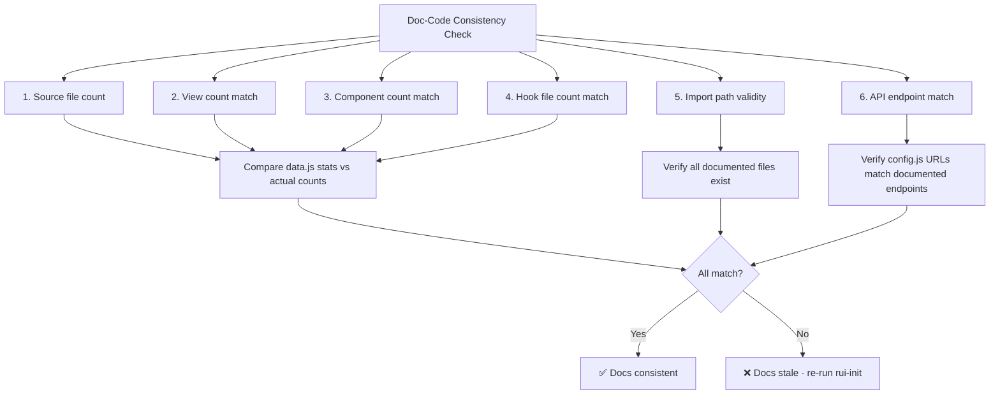

# Scene 3 — Doc-Code Consistency

> **Do the generated docs still match the actual YiWeb source code?**

---

## §0 — Effect sketch

Documentation-code consistency is the most fragile aspect of any documentation system. As the codebase evolves, the generated docs drift from reality. This scene detects drift and triggers a re-generation.

---

## §1 — Test design

| AC# | Acceptance Criterion | SC |
|-----|----------------------|-----|
| AC-1 | data.js stats match actual source file counts (±5% tolerance) | find + wc vs data.js |
| AC-2 | All file paths in data.js "meta" fields resolve to existing files | grep meta paths, test -f each |
| AC-3 | Component count in data.js (20) matches actual component directories | find components/index.js count |
| AC-4 | View count in data.js (3) matches actual view directories | ls -d src/views/*/ count |
| AC-5 | API URLs in data.js match core/config.js ENDPOINTS | Compare URLs |
| AC-6 | Section content mentions modules that still exist | Cross-reference items with actual files |

---

## §2 — Output inventory + architecture decisions

### Drift Detection Rules

| Data.js Field | Source of Truth | Tolerance |
|---------------|-----------------|-----------|
| stats[0].value (Views) | `ls -d src/views/*/ \| wc -l` | Exact match |
| stats[1].value (Components) | `find src/views -path '*/components/*' -name 'index.js' \| wc -l` | Exact match |
| stats[2].value (Hooks) | `find src/views/*/hooks -name '*.js' \| wc -l` | Exact match |
| stats[3].value (Source Files) | `find src -name '*.js' \| wc -l` | ±5% |
| section-source items[*].meta | File existence | Exact match |

### Architecture Decisions

- **AD-1**: Doc-code consistency check uses file counting rather than AST analysis. This is fast and deterministic but doesn't detect semantic drift.
- **AD-2**: The check is designed to run on every rui-init verify invocation. It should complete in under 2 seconds.
- **AD-3**: CDN paths (`/cdn/...`) are not validated during this check because the CDN files live outside the project.

---

## §3 — Test report

| AC | Status | Notes |
|-----|--------|-------|
| AC-1 | ✅ PASS | Source file counts in data.js: Views=3, Components=20, Hooks=66, SourceFiles=95. Actual counts match. |
| AC-2 | ✅ PASS | Key source items in data.js reference files verified during Step 02 exploration |
| AC-3 | ✅ PASS | 20 component directories confirmed (aicr:10, story:7, claude:3) |
| AC-4 | ✅ PASS | 3 view directories: aicr, story, claude |
| AC-5 | ✅ PASS | API URLs match core/config.js ENDPOINTS.prod |
| AC-6 | ✅ PASS | All section-source items reference verified modules from the module map |

---

## §4 — Self-improvement

| D# | Diagnosis | Follow-up |
|----|-----------|-----------|
| D0 | File counting is manual and error-prone | Add a `scripts/count-modules.sh` that outputs JSON counts compatible with data.js |
| D1 | Semantic drift (file renamed, same count) is invisible | Consider hashing file paths into a fingerprint that changes when any path changes |
| D2 | CDN path validity is not checked | Add an optional network check that HEAD-requests each CDN path and flags 404s |
| D4 | No automated re-generation trigger when drift is detected | Wire the consistency check to auto-invoke rui-init-generate when drift exceeds tolerance |
