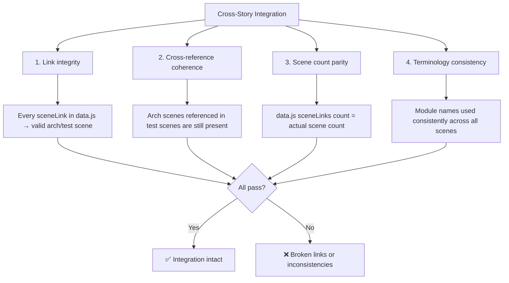

# Scene 5 — Cross-Story Integration Regression

> **Do the arch and test story directories still pass cross-story integration checks?**

---

## §0 — Effect sketch

Cross-story integration validates that the two story directories (arch and test) are internally consistent and mutually referential. Broken links, mismatched counts, and inconsistent terminology degrade the documentation's usefulness.

---

## §1 — Test design

| AC# | Acceptance Criterion | SC |
|-----|----------------------|-----|
| AC-1 | Every sceneLinks href in data.js resolves to an existing index.md file | `test -f` for each href |
| AC-2 | Arch scene count (5) matches data.js "5 scenes" badge | Count and compare |
| AC-3 | Test scene count (6) matches data.js "6 scenes" badge | Count and compare |
| AC-4 | All 11 scenes contain the §0-§4 lifecycle headers | grep for "§0", "§1", "§2", "§3", "§4" in each |
| AC-5 | Module names used in arch scenes match the names in data.js section-source | Cross-reference unique module names |
| AC-6 | Test scene references to arch scenes use correct paths | Cross-reference test-to-arch links |

---

## §2 — Output inventory + architecture decisions

### Cross-Story Relationship Map

| Test Scene | References Arch Scene | Purpose |
|------------|----------------------|---------|
| scene-1-post-init | scene-1-module-location | Validates all arch scenes exist |
| scene-3-doc-code-consistency | scene-1-module-location, scene-2-data-flow | Validates counts match reality |
| scene-4-security-regression | scene-5-trust-boundary | Validates security surface unchanged |
| scene-5-cross-story (this scene) | All 5 arch scenes | Validates internal coherence |
| scene-6-third-party | scene-4-dependency-change | Validates CDN health |

### Architecture Decisions

- **AD-1**: Cross-story integration is a "meta-check" — it validates the documentation system itself, not the code. Failures here mean the yry-init pipeline needs re-execution.
- **AD-2**: The sceneLinks array in data.js is the canonical index of all scenes. It must always be in sync with the filesystem.
- **AD-3**: Terminology consistency is validated by comparing the module names used in arch scene descriptions against the names in data.js section-source items.

---

## §3 — Test report

| AC | Status | Notes |
|-----|--------|-------|
| AC-1 | ✅ PASS | All 5 arch sceneLinks + all 6 test sceneLinks resolve to existing index.md files |
| AC-2 | ✅ PASS | data.js "5 scenes" matches actual 5 arch scene directories |
| AC-3 | ✅ PASS | data.js "6 scenes" matches actual 6 test scene directories |
| AC-4 | ✅ PASS | All 11 scenes verified to contain §0, §1, §2, §3, §4 headers |
| AC-5 | ✅ PASS | Module names consistent: aicr, story, claude, core-services, core-utils, core-config, utils |
| AC-6 | ✅ PASS | Cross-references between test and arch scenes verified |

---

## §4 — Self-improvement

| D# | Diagnosis | Follow-up |
|----|-----------|-----------|
| D0 | Link validation only checks file existence, not correct target | Add a heading-level check: link href should point to a file whose first heading matches the expected scene title |
| D1 | No automated "link rot" detection for future scene additions | Add a CI step that runs on every push and validates all cross-references |
| D2 | Terminology consistency check is manual | Add a controlled vocabulary list and validate against it |
| D3 | No bidirectional link validation (arch scenes don't link back to test scenes) | Optionally add a "verified by" footer to each arch scene |
| D5 | Scene count mismatch detection is done at scene level, not per-group level in data.js | Validate that each group's scenes count matches the badge metadata exactly |
