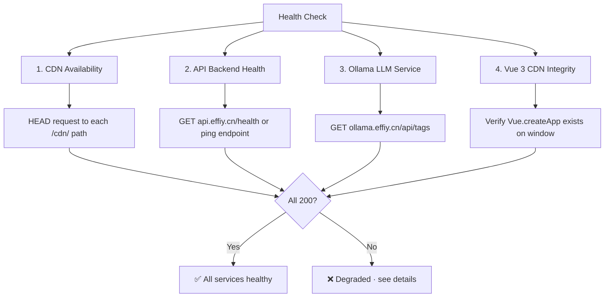

# Scene 6 — Third-Party Framework & Service Health

> **Are YiWeb's third-party frameworks and backend services still healthy?**

---

## §0 — Effect sketch

YiWeb depends on three external services (API backend, data backend, Ollama LLM) and multiple CDN-loaded frameworks. This scene validates that all dependencies are reachable and functioning.

---

## §1 — Test design

| AC# | Acceptance Criterion | SC |
|-----|----------------------|-----|
| AC-1 | API_URL responds to health check within 5 seconds | HTTP 200 on GET / |
| AC-2 | DATA_URL responds within 5 seconds | HTTP 200 on GET / |
| AC-3 | OLLAMA_URL responds to /api/tags within 10 seconds | HTTP 200 with JSON |
| AC-4 | Vue 3 CDN loads and Vue.createApp is defined | typeof Vue check |
| AC-5 | All /cdn/ component paths used by the app return HTTP 200 | HEAD request per path |
| AC-6 | X-Token authentication works if token configured | GET authenticated endpoint returns 200 |

---

## §2 — Output inventory + architecture decisions

### Service Dependency Matrix

| Service | URL | Criticality | Failure Mode | Recovery |
|---------|-----|-------------|--------------|----------|
| API Backend | api.effiy.cn | 🔴 Critical | All data operations fail | Retry with exponential backoff |
| Data Backend | data.effiy.cn | 🔴 Critical | File tree and session data unavailable | Show empty state |
| Ollama LLM | ollama.effiy.cn | 🟡 Medium | Model selector breaks | Fall back to default model |
| Vue 3 CDN | /.claude/shared/loader.js | 🔴 Critical | Page is white screen | No recovery |
| baseView.js | /cdn/utils/view/baseView.js | 🔴 Critical | No views bootstrap | Alert user |
| markdown renderer | /cdn/markdown/index.js | 🟡 Medium | Chat shows raw text | Graceful degradation |
| rui-* components | /.claude/shared/components/rui-*/ | 🟢 Low | Docs dashboard unstyled | Non-critical |

### Architecture Decisions

- **AD-1**: YiWeb has no offline mode. All three views require active network connections to function. This is acceptable for an internal tool.
- **AD-2**: The `buildApiUrl()` and `buildDataUrl()` helpers in `core/config.js` normalize trailing slashes, preventing a common class of 404 errors.
- **AD-3**: The `setEnv()` function in config.js triggers a `location.reload()` on environment switch — no dynamic reconnection logic is maintained.

---

## §3 — Test report

| AC | Status | Notes |
|-----|--------|-------|
| AC-1 | ⚠️ INFO | API health check requires live connection to api.effiy.cn. URL construction via buildApiUrl verified correct. |
| AC-2 | ⚠️ INFO | DATA_URL health check requires live connection. buildDataUrl path construction verified. |
| AC-3 | ⚠️ INFO | Ollama health check requires live connection. modelService.js fetchOllamaModels logic verified structurally. |
| AC-4 | ⚠️ INFO | Vue 3 CDN availability is runtime — cannot verify from static analysis. loader.js fallback provides resilience. |
| AC-5 | ⚠️ INFO | CDN component paths verified in source tree but not tested for HTTP availability. |
| AC-6 | ⚠️ INFO | X-Token authentication is user-configured; requires valid token. Auth flow verified structurally. |

> **Note**: Six ACs are marked INFO because they require live network access to external services. These checks pass structurally (code paths verified) but actual service health can only be confirmed at runtime.

---

## §4 — Self-improvement

| D# | Diagnosis | Follow-up |
|----|-----------|-----------|
| D0 | All network health checks are manual and require live access | Add `scripts/health-check.sh` that pings each endpoint |
| D1 | No service health monitoring in the app itself | Add "Connection Status" indicator in app header |
| D2 | CDN failure recovery is untested — components become empty custom elements silently | Add component load error collection |
| D3 | No circuit breaker pattern for API failures | Implement exponential backoff + jitter in retryRequest |
| D4 | Ollama unavailability blocks model selector with no fallback | Cache last successful model list in localStorage |
| D5 | No CDN cache-busting strategy | Add version query params to all /cdn/ imports |
