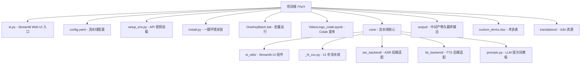

# Scene 1 · Module Location

> **问题**: YiviY 项目的每个模块在源码树中的位置是什么？各模块承担什么职责？

---

## §0 · Effect Sketch

**场景概述**: 本场景回答「这个功能在哪个文件」的问题。YiviY 采用扁平 Python 包结构，以 `st.py` 为唯一入口、`core/` 组织 12 步流水线模块（`_N_xxx.py` 命名按序号顺序执行），并通过 `asr_backend/` 与 `tts_backend/` 子包隔离后端适配逻辑，使步骤模块与具体云端 / 本地后端解耦。

---

## §1 · Test Design

| AC# | 验收标准 | 验证方法 |
|-----|---------|---------|
| AC-1.1 | 能定位 st.py 入口及其职责 | 检查项目根 `st.py` |
| AC-1.2 | 能列出 12 个 _N_xxx.py 步骤模块的文件名 | 检查 `core/` 目录中 `_1_` 到 `_12_` 文件 |
| AC-1.3 | 能识别 ASR / TTS 后端适配器的位置 | 检查 `core/asr_backend/` 与 `core/tts_backend/` |
| AC-1.4 | 能区分配置入口（config.yaml）与密钥入口（setup_env.py） | 对比 `config.yaml` 与 `setup_env.py` |

---

## §2 · Output Inventory

### 2.1 模块全景图

| 模块 | 路径 | 核心职责 | 关键文件 |
|------|------|---------|---------|
| **UI Entry** | `st.py` | Streamlit Web UI 入口 · 侧边栏步骤选择 · 单步调试 + 全流程运行 | `st.py` |
| **Config** | `config.yaml`, `setup_env.py` | 后端选择 (ASR/LLM/TTS) · API 密钥环境加载 | `config.yaml` |
| **Pipeline** | `core/_N_xxx.py` | 12 步流水线 · 每步独立模块 · 顺序执行 | `_1_ytdlp.py` … `_12_dub_to_vid.py` |
| **ASR Adapter** | `core/asr_backend/` | WhisperX / CTranslate2 / 音频预处理 | `whisperX.py`, `audio_preprocess.py` |
| **TTS Adapter** | `core/tts_backend/` | OpenAI TTS / Fish TTS / GPT-SoVITS | `sf_fishtts.py`, `gpt_sovits_tts.py` |
| **Prompts** | `core/prompts.py` | LLM 翻译 / 摘要 / 切分提示词模板 | `core/prompts.py` |
| **Streamlit Utils** | `core/st_utils/` | UI 组件（侧边栏、下载区段） | `sidebar_setting.py`, `download_video_section.py` |

### 2.2 12 步流水线索引

| 步骤 | 模块 | 输入 | 输出 |
|------|------|------|------|
| 1 | `_1_ytdlp.py` | URL | video.mp4 |
| 2 | `_2_asr.py` | video.mp4 | words.json |
| 3.1 | `_3_1_split_nlp.py` | words.json | segments.json |
| 3.2 | `_3_2_split_meaning.py` | segments.json | segments.json (refined) |
| 4.1 | `_4_1_summarize.py` | segments.json | summary.txt |
| 4.2 | `_4_2_translate.py` | segments.json + glossary | translated.json |
| 5 | `_5_split_sub.py` | translated.json | subtitle_lines.json |
| 6 | `_6_gen_sub.py` | subtitle_lines.json | subtitle.srt |
| 7 | `_7_sub_into_vid.py` | video.mp4 + subtitle.srt | video_subbed.mp4 |
| 8.1 | `_8_1_audio_task.py` | translated.json | audio_tasks.json |
| 8.2 | `_8_2_dub_chunks.py` | audio_tasks.json | dub_chunks/ |
| 9 | `_9_refer_audio.py` | 原文音频 | reference.wav |
| 10 | `_10_gen_audio.py` | audio_tasks.json + reference | tts_audio.wav |
| 11 | `_11_merge_audio.py` | original.wav + tts_audio.wav | merged_audio.wav |
| 12 | `_12_dub_to_vid.py` | video_subbed.mp4 + merged_audio.wav | final_output.mp4 |

### 2.3 架构决策

- **扁平包结构**: `core/` 下直接存放 `_N_xxx.py`，避免深层嵌套，每个步骤可独立运行
- **后端适配器模式**: `asr_backend/` 与 `tts_backend/` 子包封装外部 SDK，步骤模块只调用适配器接口
- **YAML 配置源**: `config.yaml` 是后端选择的单一真相源（ASR_BACKEND / LLM_API / TTS_BACKEND）
- **中间态持久化**: 每步产物以 JSON / 文件存入 `output/`，支持失败重试任意步骤

---

## §3 · Test Report

| AC# | 状态 | 详情 |
|-----|------|------|
| AC-1.1 | ✅ PASS | `st.py` 位于项目根，导入 Streamlit + core 模块，提供 Web UI |
| AC-1.2 | ✅ PASS | `core/` 下存在 15 个 `_N_xxx.py` 模块（含 3.1/3.2/4.1/4.2/8.1/8.2 子步），按序号编排 |
| AC-1.3 | ✅ PASS | `core/asr_backend/` 与 `core/tts_backend/` 子包分别封装 ASR / TTS 后端 |
| AC-1.4 | ✅ PASS | `config.yaml` 管理后端选择，`setup_env.py` 从环境变量加载 OpenAI / Replicate / Azure 密钥 |

---

## §4 · Self-Improvement

| 诊断项 | 评估 | 行动 |
|--------|------|------|
| D0 完整性 | ✅ 全部模块已映射 | 无需行动 |
| D1 边界清晰度 | ⚠️ `asr_backend/` 内 WhisperX 与 CTranslate2 关系需在 docstring 中说明 | 建议在 `core/asr_backend/__init__.py` 中添加 docstring |
| D2 新模块接入 | ✅ 新增流水线步骤只需在 `core/` 添加新 `_N_xxx.py` | 建议在 `st.py` 侧边栏注释说明注册新步骤 |
| D3 发现性 | ✅ 命名规范（`_N_xxx.py`），入口清晰 | 可考虑添加 `core/README.md` 描述各步骤的输入输出契约 |

**当前状态**: 模块定位清晰，无阻塞性问题。D1 建议可作为 backlog 跟踪。
