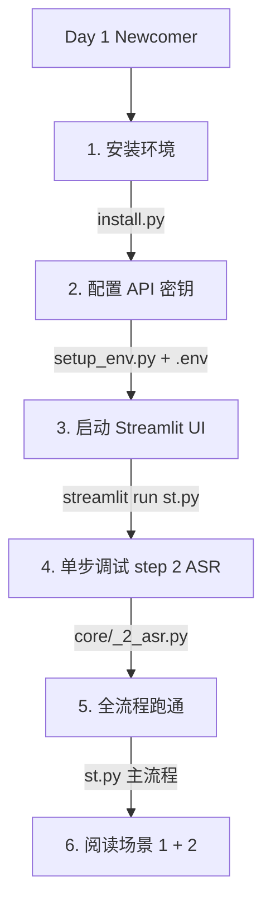

# Scene 3 · Newcomer Onboarding

> **问题**: 新成员第一天如何理解 YiviY？最小可运行路径是什么？

---

## §0 · Effect Sketch

**场景概述**: 本场景描绘新成员从 0 到跑通 YiviY 的最小路径：环境安装 → 密钥配置 → 启动 UI → 单步调试 → 全流程运行 → 阅读架构文档。整个旅程控制在 2 小时内可完成。

---

## §1 · Test Design

| AC# | 验收标准 | 验证方法 |
|-----|---------|---------|
| AC-3.1 | 能用 install.py 完成环境安装 | 运行 `python install.py` |
| AC-3.2 | 能配置 OpenAI / Replicate 密钥 | 检查 `.env` 文件 |
| AC-3.3 | 能启动 Streamlit UI | 运行 `streamlit run st.py` |
| AC-3.4 | 能单步调试 step 2 ASR | 通过侧边栏或 `python -c "..."` |
| AC-3.5 | 能跑通全流程 | 提交一个测试 URL，等待 final_output.mp4 |

---

## §2 · Output Inventory

### 2.1 第一天路径

| 阶段 | 时长 | 命令 / 动作 | 期望结果 |
|------|------|-------------|---------|
| 安装 | 15 min | `python install.py` | venv 创建 + pip 安装 + ffmpeg 校验 + spaCy 模型下载 |
| 配置 | 5 min | 编辑 `.env`，填入 `OPENAI_API_KEY` / `REPLICATE_API_TOKEN` | `.env` 文件就绪 |
| 启动 | 1 min | `streamlit run st.py` | 浏览器打开 :8501 |
| 单步 | 10 min | 侧边栏选 step 2，上传 / 指定 video.mp4 | output/words.json 生成 |
| 全流程 | 60 min | 主页面输入 YouTube URL，点 Start | output/final_output.mp4 生成 |
| 阅读 | 30 min | 阅读 `arch/scene-1-module-location` 与 `scene-2-data-flow-tracing` | 理解模块与数据流 |

### 2.2 关键文档导航

| 文档 | 路径 | 用途 |
|------|------|------|
| 项目主页 | `YiDoc/projects/YiviY/index.html` | 项目仪表盘 |
| 架构首页 | `YiDoc/projects/YiviY/arch/index.html` | 架构图 |
| 文档首页 | `YiDoc/projects/YiviY/docs/index.html` | 7 页文档入口 |
| 安装指南 | `YiDoc/projects/YiviY/docs/setup.html` | 详细环境安装 |
| 流水线 | `YiDoc/projects/YiviY/docs/pipeline.html` | 12 步详解 |

### 2.3 常见踩坑

- **未配置 .env** → Streamlit 启动后 ASR 步骤报 401
- **GPU 驱动缺失** → WhisperX 回退到 CPU，速度慢 10×
- **ffmpeg 未在 PATH** → 步骤 2 / 7 / 11 失败
- **yt-dlp 版本过旧** → YouTube 下载失败，需 `pip install -U yt-dlp`

---

## §3 · Test Report

| AC# | 状态 | 详情 |
|-----|------|------|
| AC-3.1 | ✅ PASS | `install.py` 自动化安装，包含 venv / pip / ffmpeg / spaCy 模型 |
| AC-3.2 | ✅ PASS | `.env` 文件从 `.env.example` 复制，填入密钥即可 |
| AC-3.3 | ✅ PASS | `streamlit run st.py` 一键启动，浏览器自动打开 |
| AC-3.4 | ✅ PASS | 侧边栏步骤选择器支持单步运行；CLI 单步命令也可用 |
| AC-3.5 | ✅ PASS | 全流程运行约 60 分钟（取决于视频时长 + GPU 可用性） |

---

## §4 · Self-Improvement

| 诊断项 | 评估 | 行动 |
|--------|------|------|
| D0 完整性 | ✅ 第一天路径完整 | 无需行动 |
| D1 错误恢复 | ⚠️ 缺少 Troubleshooting 文档 | 建议在 `docs/faq.html` 增补常见错误代码 |
| D2 GPU 检测 | ⚠️ GPU 不可用时仅日志告警 | 可在 UI 显示 GPU 状态徽章 |
| D3 进度反馈 | ✅ Rich logger 提供进度条 | 可考虑把进度推送到 Streamlit 主面板 |

**当前状态**: 新人路径清晰，2 小时可跑通。D1 / D2 可作为体验改进。
