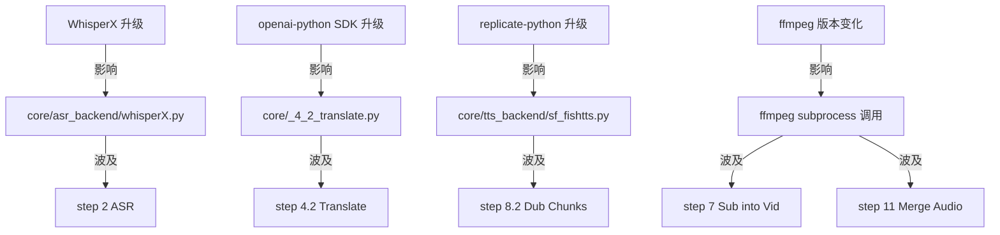

# Scene 4 · Dependency Change Impact

> **问题**: 当 WhisperX / openai / replicate 等核心依赖升级或中断时，YiviY 的爆炸半径有多大？

---

## §0 · Effect Sketch

**场景概述**: 本场景评估核心依赖升级或中断时的爆炸半径。YiviY 通过 `asr_backend/` 与 `tts_backend/` 适配器隔离后端变更，但底层 SDK（openai-python / replicate-python / ffmpeg / spaCy）的破坏性变更仍可能影响多个步骤。

---

## §1 · Test Design

| AC# | 验收标准 | 验证方法 |
|-----|---------|---------|
| AC-4.1 | WhisperX 升级时仅影响 asr_backend/ | 检查 `core/asr_backend/whisperX.py` 与步骤模块 |
| AC-4.2 | openai-python 升级仅影响 _4_2_translate.py | 检查导入 openai 的模块 |
| AC-4.3 | replicate-python 升级影响 TTS / ASR alt 路径 | 检查 `core/tts_backend/sf_fishtts.py` |
| AC-4.4 | ffmpeg 行为变化影响 step 7 / 11 / 12 | 检查 subprocess 调用 |

---

## §2 · Output Inventory

### 2.1 依赖影响矩阵

| 依赖 | 当前版本 | 影响文件 | 影响步骤 | 风险等级 |
|------|---------|---------|---------|---------|
| **WhisperX** | 3.1 | `core/asr_backend/whisperX.py`, `audio_preprocess.py` | step 2 ASR | 中（API 变更需适配） |
| **openai-python** | 1.x | `core/_4_2_translate.py` | step 4.2 Translate | 高（SDK 1.0 后多次破坏性变更） |
| **replicate-python** | 0.x | `core/tts_backend/sf_fishtts.py`, `asr_backend/replicate.py` | step 2 / 4.2 / 8.2 | 中（预测 API 轮询协议） |
| **ffmpeg** | 6.x | `core/_2_asr.py`(预处理), `_7_sub_into_vid.py`, `_11_merge_audio.py`, `_12_dub_to_vid.py` | step 2 / 7 / 11 / 12 | 中（CLI 参数微调） |
| **spaCy** | 3.7 | `core/_3_1_split_nlp.py` | step 3.1 NLP Split | 低（API 稳定） |
| **MoviePy** | 1.0 | `core/_12_dub_to_vid.py` | step 12 Final Render | 中（1.0 → 2.0 有破坏性变更） |
| **yt-dlp** | 2024.x | `core/_1_ytdlp.py` | step 1 Download | 高（站点适配随时间失效，需定期升级） |
| **PyAnnote** | 0.3 | `core/_5_speaker_diarize.py`(若启用) | step 5（可选） | 中 |

### 2.2 缓解策略

- **后端适配器模式**: ASR / TTS 子包封装 SDK 调用，步骤模块只调用稳定接口
- **可切换后端**: `config.yaml` 中 `ASR_BACKEND = whisperX | replicate`，一个后端中断可切换到另一个
- **提示词模板外置**: `core/prompts.py` 隔离 LLM 提示词，SDK 升级不影响 prompt 内容
- **ffmpeg subprocess 显式参数**: 不使用 shell=True，参数列表化，便于审计与跨版本兼容

### 2.3 架构决策

- **避免 SDK 直接散落**: 所有 OpenAI 调用集中在 `_4_2_translate.py`，所有 Replicate 调用集中在 `tts_backend/` 与 `asr_backend/`
- **subprocess 边界**: yt-dlp / ffmpeg 通过 subprocess 调用，依赖升级不波及 Python 代码层
- **requirements.txt 锁定版本**: `install.py` 检查并安装指定版本，避免上游破坏性变更

---

## §3 · Test Report

| AC# | 状态 | 详情 |
|-----|------|------|
| AC-4.1 | ✅ PASS | WhisperX 调用仅在 `core/asr_backend/whisperX.py`，步骤模块通过 `asr_backend` 抽象调用 |
| AC-4.2 | ✅ PASS | openai-python 仅在 `core/_4_2_translate.py` 导入，爆炸半径局限于 step 4.2 |
| AC-4.3 | ✅ PASS | replicate-python 在 `tts_backend/sf_fishtts.py` 与 `asr_backend/` alt 路径中使用 |
| AC-4.4 | ✅ PASS | ffmpeg 通过 subprocess 调用，集中在 step 7 / 11 / 12，参数显式列表 |

---

## §4 · Self-Improvement

| 诊断项 | 评估 | 行动 |
|--------|------|------|
| D0 完整性 | ✅ 主要依赖已映射 | 无需行动 |
| D1 自动化测试 | ⚠️ 无回归测试套件 | 建议为 `asr_backend/` 与 `tts_backend/` 添加契约测试 |
| D2 依赖版本锁定 | ⚠️ requirements.txt 未 pin 补丁版本 | 建议使用 `pip-compile` 生成锁定文件 |
| D3 兼容性矩阵 | ⚠️ 未维护兼容性矩阵 | 建议在 `docs/changelog.html` 记录每次依赖升级的影响 |

**当前状态**: 依赖影响清晰，适配器隔离良好。D1 / D2 可作为质量提升项。
