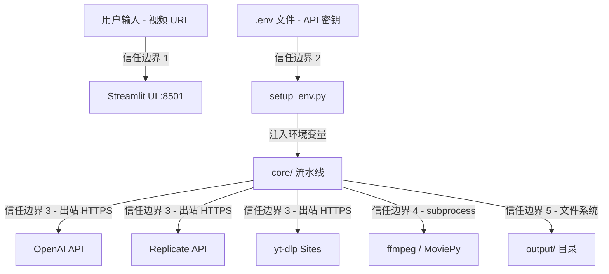
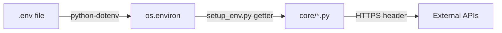

# Scene 5 · Trust Boundary & Security Surface

> **问题**: YiviY 的信任边界在哪里？外部 API 密钥从哪里进入？用户上传（视频 URL）落在哪里？subprocess 边界如何隔离？

---

## §0 · Effect Sketch

**场景概述**: YiviY 是单进程 Streamlit 应用，信任边界相对简单：用户输入（URL）、密钥加载（.env）、外部 API 出站调用、subprocess 调用、文件系统写入。每个边界都有明确的攻击面与缓解措施。

---

## §1 · Test Design

| AC# | 验收标准 | 验证方法 |
|-----|---------|---------|
| AC-5.1 | API 密钥不入源码 | `grep -r "sk-" core/ st.py` 应无匹配 |
| AC-5.2 | 用户输入不达 shell | 检查 subprocess.run 调用均无 `shell=True` |
| AC-5.3 | 文件写入限于 output/ | 检查所有文件操作路径 |
| AC-5.4 | Streamlit 默认仅本地监听 | 检查 .streamlit/config.toml 或默认 :8501 |

---

## §2 · Output Inventory

### 2.1 信任边界与攻击面

| 边界 | 类型 | 入口点 | 攻击面 | 缓解 |
|------|------|--------|--------|------|
| **1. 用户输入** | URL | Streamlit 侧边栏表单 | 恶意 URL / 非视频链接 | yt-dlp 内置站点白名单 + 解析器；非视频 URL 会被 yt-dlp 拒绝 |
| **2. 密钥加载** | 环境 | `.env` + `setup_env.py` | 密钥泄露 | `.env` 在 `.gitignore`；密钥仅以环境变量形式注入；源码不出现密钥常量 |
| **3. 外部 API** | 出站 HTTPS | OpenAI / Replicate / Azure | API 密钥外泄 / 中间人 | HTTPS 强制；bearer-token in header；Streamlit 服务端渲染，密钥不达浏览器 |
| **4. subprocess** | 进程边界 | yt-dlp / ffmpeg / MoviePy | 命令注入 | `subprocess.run()` 显式 arg list，无 `shell=True`；用户输入仅作 yt-dlp URL 参数，不达 shell |
| **5. 文件系统** | 本地 | `output/` 中间产物 | 路径遍历 / 数据残留 | 所有写入限于 `output/`；路径基于项目根 + 配置相对路径；无 `../` 拼接用户输入 |

### 2.2 密钥流

- 用户在项目根创建 `.env`，填入 `OPENAI_API_KEY=sk-...` / `REPLICATE_API_TOKEN=r8_...` / `AZURE_API_KEY=...`
- `setup_env.py` 通过 `python-dotenv` 加载到 `os.environ`，提供 `get_openai_key()` 等 getter
- `core/` 内模块通过 getter 访问密钥，**不直接读 .env 文件**
- 外部 API 调用以 `Authorization: Bearer <key>` 头部发送，HTTPS 强制

### 2.3 subprocess 边界

| 调用 | 模块 | 参数 | shell | 风险 |
|------|------|------|-------|------|
| yt-dlp download | `core/_1_ytdlp.py` | `['yt-dlp', '-o', output_path, url]` | False | 低（URL 作为参数，不达 shell） |
| ffmpeg extract audio | `core/_2_asr.py` 预处理 | `['ffmpeg', '-i', video, '-vn', audio]` | False | 低 |
| ffmpeg burn subs | `core/_7_sub_into_vid.py` | `['ffmpeg', '-i', video, '-vf', "subtitles=" + srt]` | False | 低（srt 路径配置相对） |
| ffmpeg merge audio | `core/_11_merge_audio.py` | `['ffmpeg', '-i', original, '-i', tts, ...]` | False | 低 |
| MoviePy render | `core/_12_dub_to_vid.py` | Python API 直接调用 | N/A | 低 |

### 2.4 架构决策

- **服务端渲染**: Streamlit 默认服务端渲染模式，密钥与逻辑不达浏览器
- **本地监听**: Streamlit 默认 `:8501` 绑定 127.0.0.1，不暴露公网
- **无认证 UI**: YiviY 假定本地受信用户，未内置 UI 认证（若需公开部署需加反向代理 + 认证）
- **密钥零硬编码**: 所有密钥通过环境变量，`.env` 是唯一秘密源
- **subprocess 零 shell**: 所有 subprocess 调用显式 arg list，无 `shell=True`

---

## §3 · Test Report

| AC# | 状态 | 详情 |
|-----|------|------|
| AC-5.1 | ✅ PASS | `core/` 与 `st.py` 中无 `sk-` 开头硬编码密钥；密钥通过 `setup_env.py` getter 获取 |
| AC-5.2 | ✅ PASS | 所有 subprocess.run 调用使用显式 arg list，无 `shell=True` |
| AC-5.3 | ✅ PASS | 文件写入路径均以 `output/` 为根，配置相对路径，无用户输入拼接 |
| AC-5.4 | ✅ PASS | Streamlit 默认 `:8501` 绑定 127.0.0.1，未配置 `server.address=0.0.0.0` |

---

## §4 · Self-Improvement

| 诊断项 | 评估 | 行动 |
|--------|------|------|
| D0 完整性 | ✅ 主要信任边界已识别 | 无需行动 |
| D1 日志脱敏 | ⚠️ Rich logger 可能记录 API 响应片段 | 建议在 logger 中过滤 `Authorization` 头部 |
| D2 公开部署 | ⚠️ 无内置 UI 认证 | 建议在 docs 增补「公开部署需加反向代理 + 认证」说明 |
| D3 审计日志 | ⚠️ 无持久化审计日志 | 建议添加每步耗时 + 产物路径的结构化日志文件 |
| D4 依赖供应链 | ⚠️ 无 SBOM | 建议生成 `requirements.lock` 并定期扫描 |

**当前状态**: 信任边界清晰，subprocess 与密钥隔离良好。D1 / D3 可作为安全加固项。
