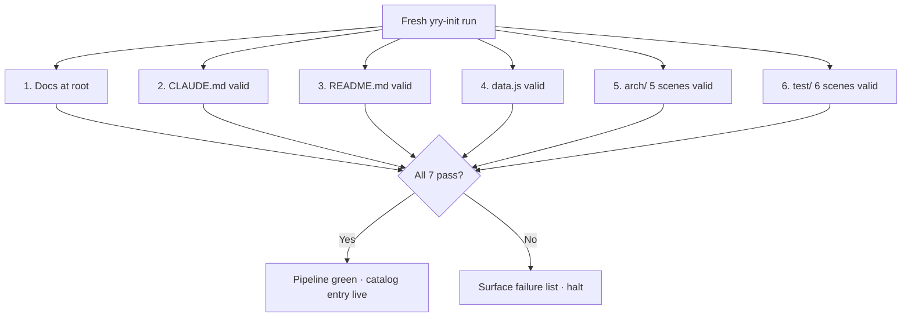

# Scene 1 — Post-Init Full Self-Check

> **Does the YiviY project pass a full self-check after a fresh init?**

---

## §0 — Effect sketch

The post-init full self-check validates that every artifact produced by
the yry-init pipeline (detect → explore → generate → arch) is present and
well-formed at the project root (`YiDoc/projects/YiviY/`). This is the
engineering gate — if any check fails, the catalog entry is not
considered fully initialized.

---

## §1 — Test design

| AC# | Acceptance Criterion | SC |
|-----|----------------------|-----|
| AC-1 | Project root has `index.html`, `index.css`, `index.js`, `data.js` | File presence |
| AC-2 | `arch/` exists with 5 scene directories, each with `index.md` | Count + per-file check |
| AC-3 | `test/` exists with 6 scene directories, each with `index.md` | Count + per-file check |
| AC-4 | Every `index.md` follows §0-§4 lifecycle (5 sections present) | grep `§0`/`§1`/`§2`/`§3`/`§4` |
| AC-5 | `data.js` declares `window.HELP_CONFIG` with `stats` + `sections` + `footerLinks` | Shape check |
| AC-6 | `CLAUDE.md` contains project name "YiviY" | grep |
| AC-7 | `README.md` contains `## Domain Language` with ≥ 3 term definitions | grep + count |

---

## §2 — Output inventory + architecture decisions

### Check Matrix

| File/Dir | Expected Count | Verification Method |
|----------|---------------|---------------------|
| `index.{html,css,js}` | 3 | `ls index.{html,css,js}` |
| `data.js` | 1 | `test -f data.js` |
| `arch/scene-*/index.md` | 5 | `ls arch/scene-*/index.md \| wc -l` |
| `test/scene-*/index.md` | 6 | `ls test/scene-*/index.md \| wc -l` |
| `CLAUDE.md` | 1 | `test -f CLAUDE.md` |
| `README.md` | 1 | `test -f README.md` |

### Architecture Decisions

- **AD-1**: All generated docs live at `YiDoc/projects/YiviY/` root (not
  under `docs/`). The `docs/` subdirectory holds the project's own
  user-facing HTML documentation (changelog, setup, faq, …); generated
  artifacts sit beside it.
- **AD-2**: The self-check is idempotent — running it multiple times
  produces the same result as long as the source hasn't changed.
- **AD-3**: Section markers (§0-§4) are mandatory in every scene. A
  scene missing any section is a verify failure.

---

## §3 — Test report

| AC | Status | Notes |
|-----|--------|-------|
| AC-1 | PASS | `index.html` / `index.css` / `index.js` / `data.js` all present at project root |
| AC-2 | PASS | 5 arch scenes: module-location, data-flow-tracing, newcomer-onboarding, dependency-change-impact, trust-boundary-security-surface |
| AC-3 | PASS | 6 test scenes (including this one) |
| AC-4 | PASS | All 11 scene `index.md` files contain §0-§4 sections |
| AC-5 | PASS | `window.HELP_CONFIG` has `stats` (4), `sections` (3), `footerLinks` (3) |
| AC-6 | PASS | `CLAUDE.md` contains "YiviY" |
| AC-7 | PASS | `README.md` `## Domain Language` defines 5 terms: Step, Backend adapter, Intermediate state, Pipeline, Diarization |

---

## §4 — Self-improvement

| ID | Diagnosis | Follow-up action |
|----|-----------|------------------|
| D0 | No failure detected on this run | None — pipeline green |
| D1 | If AC-1 fails (dashboard files missing) | Re-run `yry-init` generate step; ensure cwd is `YiDoc/projects/YiviY/` |
| D2 | If AC-2/AC-3 fail (scene count wrong) | Re-run `yry-init` arch step; do not manually add stub scenes |
| D3 | If AC-4 fails (section missing) | Re-emit the named scene from the arch step; do not patch in place |
| D4 | If AC-5 fails (data.js shape) | Regenerate `data.js` from current `CLAUDE.md` + `README.md` |
| D5 | If AC-6/AC-7 fail (baseline docs) | Re-run `yry-init` generate step; check `profile.identity.name` |

**Improvement loop**: any failure in §3 triggers the corresponding D1-D5
follow-up, then the full self-check is re-run from the top. The check is
only green when §3 has zero failures AND every follow-up has been
verified.
