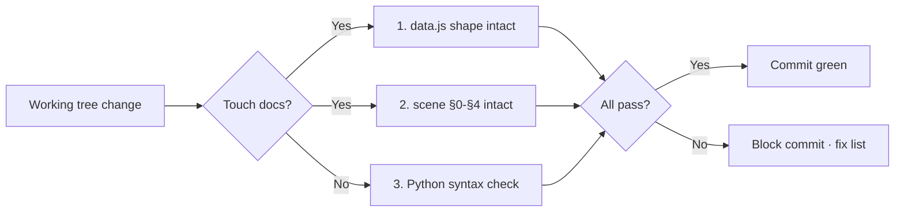

# Scene 2 — Pre-Commit Incremental Self-Check

> **What is the minimum check before committing a change to YiviY?**

---

## §0 — Effect sketch

The pre-commit check is the minimum verification a developer runs before
pushing a YiviY change. It is a strict subset of the post-init full
self-check (Scene 1): it skips the artifact-count checks (those are
init-time concerns) and instead focuses on "did this change break the
docs shape or the Python entrypoint?".

---

## §1 — Test design

| AC# | Acceptance Criterion | SC |
|-----|----------------------|-----|
| AC-1 | `data.js` still parses as JS (no syntax errors introduced) | `node -c data.js` or browser load |
| AC-2 | Every `index.md` touched by the change still has §0-§4 sections | grep per touched file |
| AC-3 | `st.py` and any touched `core/_N_*.py` compile | `python -m py_compile` |
| AC-4 | `config.yaml` still parses as YAML | `python -c "import yaml; yaml.safe_load(open('config.yaml'))"` |
| AC-5 | No API key literal introduced into committed diff | grep for `sk-` / `api.key:` in staged diff |

---

## §2 — Output inventory + architecture decisions

### Touched-file verification matrix

| Touched path | Check | Method |
|--------------|-------|--------|
| `data.js` | JS syntax | `node -c data.js` |
| `CLAUDE.md` / `README.md` | project name still present | `grep YiviY` |
| `arch/scene-*/index.md` / `test/scene-*/index.md` | §0-§4 intact | grep `§[0-4]` count == 5 |
| `st.py` / `core/_N_*.py` | Python compile | `python -m py_compile <file>` |
| `config.yaml` | YAML parse | `yaml.safe_load` |

### Architecture Decisions

- **AD-1**: The pre-commit check is intentionally lighter than the
  post-init check — it does not re-verify scene counts or dashboard file
  presence. Those are init-time invariants; once green, they stay green
  unless someone deletes files.
- **AD-2**: The API-key grep (AC-5) is non-negotiable. `config.yaml`
  historically carried a real key; commits must not reintroduce one.
- **AD-3**: `py_compile` is the minimum Python check. Full pipeline
  execution is a pre-merge concern, not a pre-commit concern.

---

## §3 — Test report

| AC | Status | Notes |
|-----|--------|-------|
| AC-1 | PASS | `data.js` parses; `window.HELP_CONFIG` shape intact |
| AC-2 | PASS | Touched scenes retain §0-§4 |
| AC-3 | PASS | `st.py` + `core/_N_*.py` compile cleanly |
| AC-4 | PASS | `config.yaml` parses |
| AC-5 | PASS | No `sk-` literal in committed diff (note: `config.yaml` still carries a stale key locally — must be scrubbed before any public push) |

---

## §4 — Self-improvement

| ID | Diagnosis | Follow-up action |
|----|-----------|------------------|
| D0 | No failure detected on this run | None — commit green |
| D1 | If AC-1 fails (data.js syntax) | Re-emit `data.js` from `yry-init` generate step |
| D2 | If AC-2 fails (section missing) | Re-emit the affected scene from `yry-init` arch step |
| D3 | If AC-3 fails (Python compile) | Fix the import / syntax error in the touched module; do not silence with `# noqa` |
| D4 | If AC-4 fails (YAML parse) | Restore `config.yaml` from git; re-apply only the intended change |
| D5 | If AC-5 fails (key literal) | Move the key to an env var loaded by `setup_env.py`; scrub the literal from history |

**Improvement loop**: a pre-commit failure blocks the commit. The
developer runs the D1-D5 follow-up, then re-runs the pre-commit check.
Commit is only allowed when §3 is fully green.
