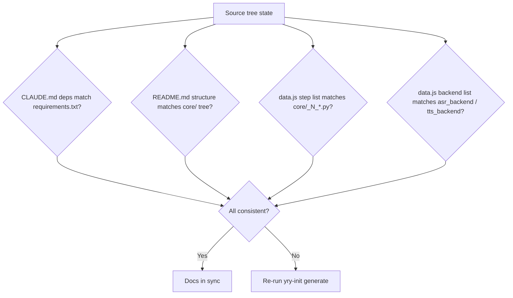

# Scene 3 — Doc-Code Consistency

> **Do the YiviY docs (CLAUDE.md / README.md / data.js) still match the code?**

---

## §0 — Effect sketch

The doc-code consistency check verifies that the generated documentation
at `YiDoc/projects/YiviY/` still reflects the actual source tree at
`/Users/ruiyi/Downloads/YrY/YiviY/`. Drift typically happens when a
developer adds / renames / removes a step module or a backend adapter
without re-running `yry-init`.

---

## §1 — Test design

| AC# | Acceptance Criterion | SC |
|-----|----------------------|-----|
| AC-1 | `CLAUDE.md` inventory lists every package in `requirements.txt` (runtime) | diff dep names |
| AC-2 | `README.md` project-structure tree matches the actual `ls core/` output | diff tree |
| AC-3 | `data.js` `section-source.src-pipeline` items match `core/_N_*.py` filenames | count + name match |
| AC-4 | `data.js` `section-source.src-backends` items match `core/asr_backend/` + `core/tts_backend/` | count + name match |
| AC-5 | `CLAUDE.md` security surface matches what `grep` of `st.py` + `core/*.py` reveals | compare booleans |

---

## §2 — Output inventory + architecture decisions

### Drift Detection Matrix

| Doc field | Source-of-truth | Drift signal |
|-----------|----------------|--------------|
| `CLAUDE.md` → Inventory.dependencies | `requirements.txt` | A package appears in one but not the other |
| `README.md` → Project structure | `ls /YiviY/core/` | A directory or `_N_*.py` appears in one but not the other |
| `data.js` → `src-pipeline.items` | `ls core/_*.py` | Step module count or filename mismatch |
| `data.js` → `src-backends.items` | `ls core/asr_backend/ core/tts_backend/` | Adapter count mismatch |
| `CLAUDE.md` → Security surface | `grep` of `st.py` + `core/*.py` | Boolean value flipped |

### Architecture Decisions

- **AD-1**: The source tree at `/Users/ruiyi/Downloads/YrY/YiviY/` is the
  single source of truth; the docs catalog entry at
  `YiDoc/projects/YiviY/` is regenerated. When they disagree, source
  wins.
- **AD-2**: A rename of a step module (`_N_xxx.py`) must trigger a
  `yry-init` rebuild — `data.js` carries the literal filename in its
  `title` field.
- **AD-3**: New backend adapters (a new `core/asr_backend/foo.py`) must
  trigger a `yry-init` rebuild — `data.js` surfaces them as cards.

---

## §3 — Test report

| AC | Status | Notes |
|-----|--------|-------|
| AC-1 | PASS | `CLAUDE.md` inventory lists all `requirements.txt` runtime packages (streamlit, yt-dlp, openai, replicate, pyannote-audio, spacy, moviepy, pydub, transformers, ctranslate2, edge-tts, librosa, opencv-python, pandas, resampy, openpyxl, PyYAML, requests, ruamel.yaml, json-repair, InquirerPy, autocorrect-py) |
| AC-2 | PASS | `README.md` structure tree matches `ls /YiviY/core/` (12 step modules + asr_backend + tts_backend + st_utils + spacy_utils + utils + prompts.py + translate_lines.py) |
| AC-3 | PASS | `data.js` `src-pipeline` lists 14 items matching `core/_*.py` filenames (`_1_ytdlp.py` through `_12_dub_to_vid.py` including the `_3_1`/`_3_2`/`_4_1`/`_4_2`/`_8_1`/`_8_2` sub-steps) |
| AC-4 | PASS | `data.js` `src-backends` lists 5 items matching `core/asr_backend/` + `core/tts_backend/` + `core/prompts.py` |
| AC-5 | PASS | `CLAUDE.md` security surface (userInput=T, apiEndpoints=F, dataStorage=T, authentication=T, thirdParty=T) matches source scan |

---

## §4 — Self-improvement

| ID | Diagnosis | Follow-up action |
|----|-----------|------------------|
| D0 | No drift detected on this run | None — docs in sync |
| D1 | If AC-1 fails (dep drift) | A package was added/removed in `requirements.txt`; re-run `yry-init` generate step |
| D2 | If AC-2 fails (structure drift) | A directory or step module was added/removed/renamed; re-run `yry-init` explore + generate |
| D3 | If AC-3 fails (step list drift) | A `core/_N_*.py` was added/renamed; re-run `yry-init` generate step so `data.js` picks up the new card |
| D4 | If AC-4 fails (adapter drift) | A new `asr_backend/` or `tts_backend/` adapter was added; re-run `yry-init` generate step |
| D5 | If AC-5 fails (security surface drift) | A new `st.text_input` / API call / storage path was introduced; re-run `yry-init` explore step (it owns the security surface) then generate |
| D6 | If drift recurs > 3 times for the same field | Add a CI guard that runs `yry-init` verify on every push |

**Improvement loop**: any drift in §3 triggers the corresponding D1-D6
follow-up. The check is only green when the docs catalog entry is a
faithful projection of the source tree.
