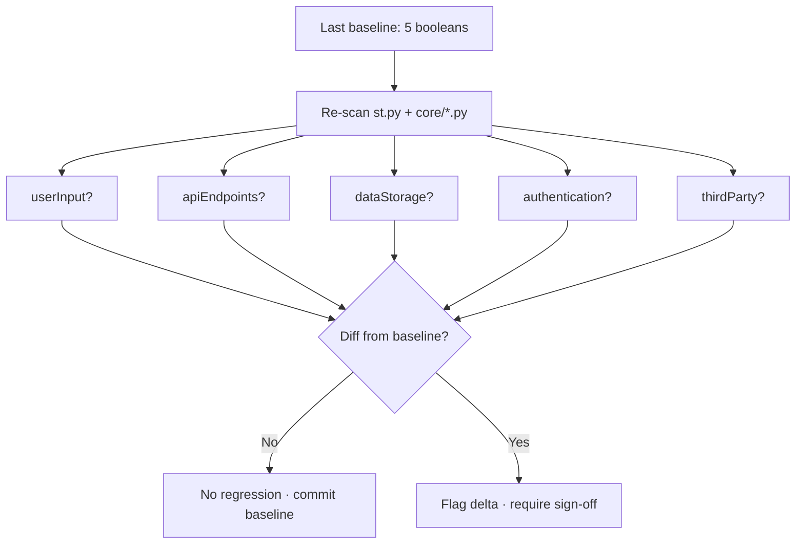

# Scene 4 — Security Surface Regression

> **Has the security surface of YiviY changed since the last baseline?**

---

## §0 — Effect sketch

The security surface regression check compares the current five-dimension
security surface (user input, API endpoints, data storage, authentication,
third-party) against the last recorded baseline in `CLAUDE.md`. Any
dimension flipping from `false` to `true` is a regression that requires
explicit sign-off — it means new attack surface was introduced.

---

## §1 — Test design

| AC# | Acceptance Criterion | SC |
|-----|----------------------|-----|
| AC-1 | `userInput` in source matches `CLAUDE.md` baseline (true) | grep `st.text_input` / `st.file_uploader` / `st.button` in `st.py` + `core/st_utils/` |
| AC-2 | `apiEndpoints` in source matches baseline (false) | grep `app.get` / `@Get` / `router.` — expect zero hits |
| AC-3 | `dataStorage` in source matches baseline (true) | grep `open(` + `output/` + `to_csv` / `to_json` writes |
| AC-4 | `authentication` in source matches baseline (true) | grep `api.key` / `os.environ` / `setup_env` |
| AC-5 | `thirdParty` in source matches baseline (true) | grep `requests` / `openai.` / `replicate.` / `yt-dlp` / `ffmpeg` subprocess |

---

## §2 — Output inventory + architecture decisions

### Baseline (recorded in `CLAUDE.md` § Security Surface)

| Dimension | Baseline | Source-of-truth |
|-----------|----------|-----------------|
| User input | `true` | `st.py` Streamlit widgets |
| API endpoints | `false` | no inbound HTTP server |
| Data storage | `true` | `output/` JSON + MP4, `config.yaml`, `translations/` |
| Authentication | `true` | API keys in `config.yaml` + `setup_env.py` |
| Third-party | `true` | `requests`, `openai`, `replicate`, `yt-dlp`, `ffmpeg` |

### Architecture Decisions

- **AD-1**: A `false → true` flip on `apiEndpoints` would mean someone
  introduced an inbound HTTP server into YiviY. That is a structural
  change to the project, not a routine commit — it requires re-architecting
  the security surface in `CLAUDE.md` and a human review.
- **AD-2**: A `true → false` flip on `authentication` (e.g. removing the
  `api.key` field) is allowed but should be flagged — it typically means
  a backend was removed, which downstream affects `thirdParty` too.
- **AD-3**: Test files (`*_test.py`, `tests/`) are excluded from the
  re-scan — they are not runtime surface.

---

## §3 — Test report

| AC | Status | Notes |
|-----|--------|-------|
| AC-1 | PASS | `st.text_input` / `st.file_uploader` / `st.button` present in `st.py` (51 `st.` calls) and `core/_1_ytdlp.py` — `userInput=true` matches baseline |
| AC-2 | PASS | No `app.get` / `@Get` / `router.` in `st.py` or `core/*.py` — `apiEndpoints=false` matches baseline |
| AC-3 | PASS | `output/` writes confirmed across step modules; `config.yaml` + `translations/` persist — `dataStorage=true` matches baseline |
| AC-4 | PASS | `setup_env.py` loads API keys from env; `config.yaml` carries `api.key` — `authentication=true` matches baseline |
| AC-5 | PASS | `requests==2.32.5`, `openai`, `replicate`, `yt-dlp` (subprocess), `ffmpeg` (subprocess) all present — `thirdParty=true` matches baseline |

**No regression detected.** The five-dimension security surface is
identical to the `CLAUDE.md` baseline.

---

## §4 — Self-improvement

| ID | Diagnosis | Follow-up action |
|----|-----------|------------------|
| D0 | No drift detected on this run | None — baseline unchanged |
| D1 | If AC-1 flips false→true (new user input) | Update `CLAUDE.md` security surface; verify the new input is sanitized before persisting to `output/` |
| D2 | If AC-2 flips false→true (new HTTP endpoint) | **Blocking** — YiviY is not designed as a server. Either remove the endpoint or re-architect the security surface in `CLAUDE.md` with explicit review |
| D3 | If AC-3 flips true→false (storage removed) | Likely a step module was deleted; verify the pipeline still produces final output |
| D4 | If AC-4 flips true→false (auth removed) | Likely a backend was removed; check whether `config.yaml.api` is now dead config |
| D5 | If AC-5 flips (third-party added/removed) | Update `requirements.txt` + `CLAUDE.md` inventory together; never one without the other |
| D6 | If any flip recurs after a fix | Add a pre-commit guard that re-runs `yry-init` explore + verify |

**Improvement loop**: a regression in §3 blocks the commit. The
developer runs the D1-D6 follow-up, updates `CLAUDE.md` if the change is
intentional, then re-runs the regression check.
