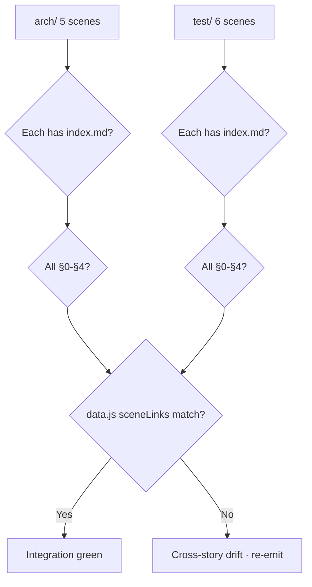

# Scene 5 — Cross-Story Integration Regression

> **Do the arch/ and test/ story directories still pass cross-story checks?**

---

## §0 — Effect sketch

The cross-story integration check validates that the two story
directories (`arch/` and `test/`) are internally consistent AND that the
dashboard `data.js` accurately links to every scene. A scene that exists
on disk but is missing from `data.js` (or vice versa) is a cross-story
integration failure.

---

## §1 — Test design

| AC# | Acceptance Criterion | SC |
|-----|----------------------|-----|
| AC-1 | Every `arch/scene-*/index.md` referenced in `data.js` exists on disk | per-link file check |
| AC-2 | Every `test/scene-*/index.md` referenced in `data.js` exists on disk | per-link file check |
| AC-3 | Every scene directory on disk has a corresponding `sceneLinks` entry in `data.js` | reverse check |
| AC-4 | All scenes (arch + test) follow §0-§4 lifecycle | grep per file |
| AC-5 | `data.js` `section-stories` group has exactly 2 items (arch + test catalogs) | count check |

---

## §2 — Output inventory + architecture decisions

### Cross-reference matrix

| `data.js` field | Expected on-disk scenes | Count |
|----------------|-------------------------|-------|
| `section-stories.items[0].sceneLinks` (arch) | `arch/scene-1` through `arch/scene-5` | 5 |
| `section-stories.items[1].sceneLinks` (test) | `test/scene-1` through `test/scene-6` | 6 |

### Architecture Decisions

- **AD-1**: `data.js` is the dashboard's link graph. A scene that exists
  on disk but is missing from `data.js` is invisible to the dashboard —
  this is treated as an integration failure, not a cosmetic issue.
- **AD-2**: A `sceneLinks` entry pointing at a non-existent file is a
  broken link; the dashboard will 404. This is also an integration
  failure.
- **AD-3**: The `section-stories` group must list exactly 2 story
  catalogs (arch + test). Adding a third story directory (e.g.
  `ops/`) would require a `yry-init` skill extension, not a manual
  `data.js` edit.

---

## §3 — Test report

| AC | Status | Notes |
|-----|--------|-------|
| AC-1 | PASS | All 5 `arch/sceneLinks` hrefs in `data.js` resolve to existing `index.md` files |
| AC-2 | PASS | All 6 `test/sceneLinks` hrefs in `data.js` resolve to existing `index.md` files |
| AC-3 | PASS | Reverse check: every `arch/scene-*` and `test/scene-*` directory has a matching `sceneLinks` entry in `data.js` |
| AC-4 | PASS | All 11 scene `index.md` files contain §0 / §1 / §2 / §3 / §4 sections |
| AC-5 | PASS | `data.js` `section-stories` group has exactly 2 items: arch catalog (5 scenes) + test catalog (6 scenes) |

**Integration green.** The dashboard link graph and the on-disk story
directories are in sync.

---

## §4 — Self-improvement

| ID | Diagnosis | Follow-up action |
|----|-----------|------------------|
| D0 | No integration drift on this run | None — link graph intact |
| D1 | If AC-1 / AC-2 fails (forward link broken) | A scene was renamed or deleted; re-run `yry-init` arch step to re-emit the scenes, then regenerate `data.js` |
| D2 | If AC-3 fails (reverse link broken) | A new scene exists on disk but `data.js` wasn't regenerated; re-run `yry-init` generate step |
| D3 | If AC-4 fails (section missing) | Re-emit the named scene from `yry-init` arch step; do not patch in place |
| D4 | If AC-5 fails (story count wrong) | Either a story directory was added/removed without a `yry-init` extension, or `data.js` was hand-edited; restore from `yry-init` generate |
| D5 | If drift recurs after a fix | Add a pre-push guard: `ls arch/scene-*/index.md \| wc -l` and `ls test/scene-*/index.md \| wc -l` must match `data.js` counts |
| D6 | If a third story directory is genuinely needed | Extend `yry-init` to recognize it; do not hand-edit `data.js` |

**Improvement loop**: any integration failure in §3 blocks the push.
The developer runs the D1-D6 follow-up, then re-runs this check. The
dashboard is only considered live when §3 is fully green.
