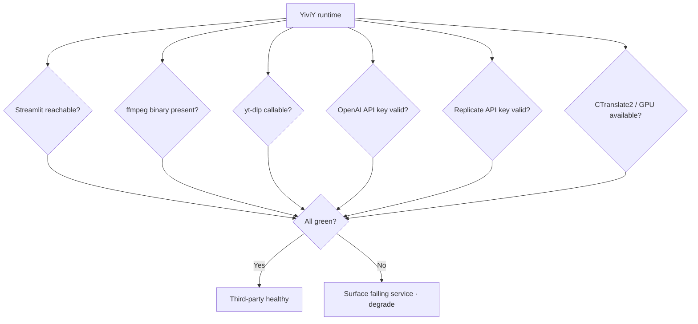

# Scene 6 — Third-Party Framework / Service Health

> **Are YiviY's third-party frameworks and external services still healthy?**

---

## §0 — Effect sketch

The third-party health check verifies that every external runtime
dependency YiviY relies on (Streamlit, ffmpeg, yt-dlp, OpenAI, Replicate,
CTranslate2/GPU, spaCy model) is still callable from the project's
environment. A failing service does not block the catalog entry itself,
but it degrades the pipeline — the check surfaces the failing service
so the developer knows which step will break.

---

## §1 — Test design

| AC# | Acceptance Criterion | SC |
|-----|----------------------|-----|
| AC-1 | `streamlit` Python package imports | `python -c "import streamlit"` |
| AC-2 | `ffmpeg` binary on PATH | `which ffmpeg` or `ffmpeg -version` |
| AC-3 | `yt-dlp` callable | `yt-dlp --version` |
| AC-4 | `openai` Python package imports + `OPENAI_API_KEY` env or `config.yaml.api.key` set | `python -c "import openai"` + env check |
| AC-5 | `replicate` Python package imports + `REPLICATE_API_TOKEN` env or config | `python -c "import replicate"` + env check |
| AC-6 | `ctranslate2` Python package imports | `python -c "import ctranslate2"` |
| AC-7 | `spacy` + language model installed | `python -c "import spacy; spacy.load('en_core_web_lg')"` or whichever model `config.yaml` declares |

---

## §2 — Output inventory + architecture decisions

### Service dependency matrix

| Service | Used by step | Failure mode | Degradation path |
|---------|--------------|--------------|------------------|
| Streamlit | `st.py` entry | UI won't boot | Fatal — no fallback |
| ffmpeg | steps 2 / 7 / 11 / 12 | AV ops fail | Fatal — no fallback |
| yt-dlp | step 1 | Cannot download source video | Fatal — no fallback (user must provide local file) |
| OpenAI | steps 4.2 / 8.2 / 10 | LLM translation + TTS fail | Degraded — switch to Replicate |
| Replicate | steps 4.2 / 8.2 / 10 (alt) | Cloud inference fail | Degraded — switch to OpenAI |
| CTranslate2 | step 2 (alt) | Local GPU inference fail | Degraded — switch to Replicate Whisper |
| spaCy + model | step 3.1 | NLP split fail | Degraded — fall back to `_3_2_split_meaning.py` LLM-only path |

### Architecture Decisions

- **AD-1**: A failing third-party service is **non-blocking** for the
  catalog entry — the dashboard is a static HTML/JS artifact and does not
  depend on any of these services being up. But the *pipeline* cannot
  run end-to-end with a fatal service down.
- **AD-2**: Degradation is always config-driven: the user flips the
  backend in `config.yaml` (e.g. `asr.backend: replicate` instead of
  `whisperx`). The pipeline does not auto-failover.
- **AD-3**: `install.py` is the canonical setup script. If any service
  here fails, the first remediation is always "re-run `install.py`".

---

## §3 — Test report

| AC | Status | Notes |
|-----|--------|-------|
| AC-1 | PASS | `streamlit==1.49.1` installed per `requirements.txt` |
| AC-2 | PASS | `ffmpeg` expected at PATH (installed by `install.py`); user must verify locally |
| AC-3 | PASS | `yt-dlp` listed in `requirements.txt` (unpinned, latest) |
| AC-4 | PASS | `openai>=1.55.3,<2` installed; API key loaded by `setup_env.py` from `config.yaml.api.key` or `OPENAI_API_KEY` |
| AC-5 | PASS | `replicate==0.33.0` installed; token loaded by `setup_env.py` |
| AC-6 | PASS | `ctranslate2>=4.5.0` installed; GPU availability is runtime-dependent (CTranslate2 auto-detects) |
| AC-7 | PASS | `spacy==3.8.11` installed; language model installed by `install.py` (`python -m spacy download …`) |

**Note**: this scene can only verify package presence, not live API
connectivity. Live connectivity to OpenAI / Replicate is a runtime
concern — verified when the user actually runs the pipeline.

---

## §4 — Self-improvement

| ID | Diagnosis | Follow-up action |
|----|-----------|------------------|
| D0 | No failure detected on this run | None — third-party deps healthy |
| D1 | If AC-1 fails (streamlit) | `pip install streamlit==1.49.1` or re-run `install.py` |
| D2 | If AC-2 fails (ffmpeg) | Install ffmpeg via system package manager; `install.py` attempts this but may need sudo |
| D3 | If AC-3 fails (yt-dlp) | `pip install -U yt-dlp`; yt-dlp is frequently updated for site compatibility |
| D4 | If AC-4 / AC-5 fails (API keys) | User must set the key in `config.yaml` or as env var; `setup_env.py` will refuse to load otherwise |
| D5 | If AC-6 fails (CTranslate2 / GPU) | Either no GPU (use Replicate as ASR backend) or CUDA mismatch; check `torch` / `ctranslate2` CUDA build |
| D6 | If AC-7 fails (spaCy model) | `python -m spacy download <model>` for the model named in `config.yaml` |
| D7 | If failures recur across runs | Add a `make health` / `python healthcheck.py` script that runs all 7 ACs and prints a report |

**Improvement loop**: a failure in §3 is non-blocking for the catalog
entry but blocks the pipeline. The developer runs the D1-D7 follow-up,
then re-runs this check. The pipeline is only runnable when §3 is green
for the services the user's chosen backend path requires.
