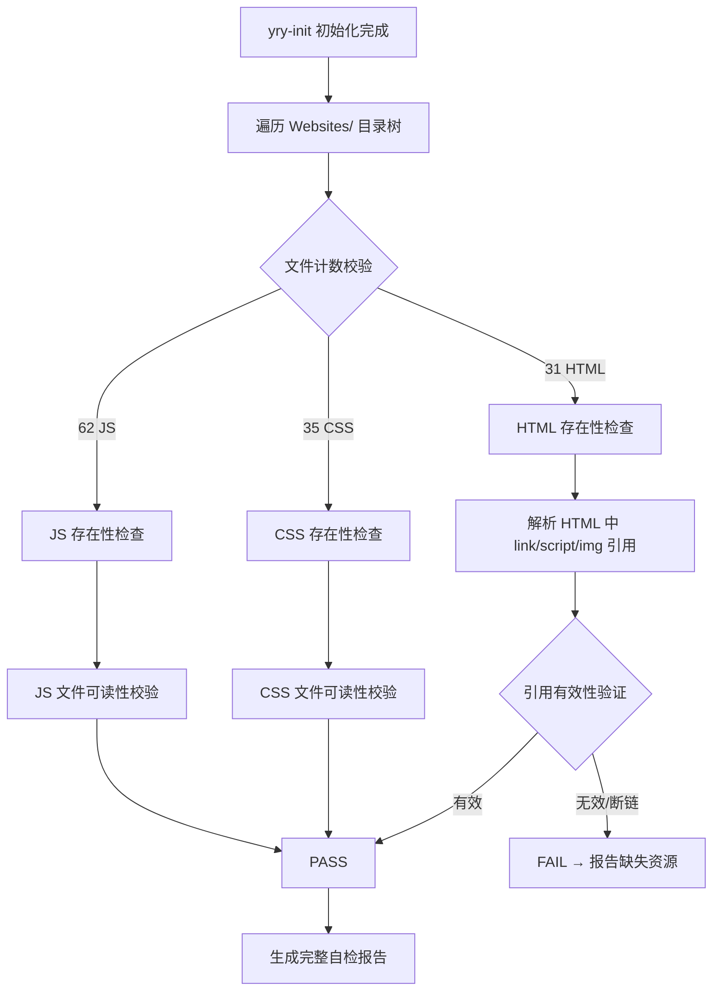

# 场景1: Post-Init Full Self-Check

## §0 — 效果概览

项目在全新 `yry-init` 初始化后，通过一次完整自检验证所有静态资源的完整性。该场景覆盖 31 个 HTML 页面、35 个 CSS 样式表和 62 个 JS 脚本的存在性校验，以及跨文件的资源引用（`<link>`、`<script>`、``）有效性检查。

预期效果：自检全部通过（31/31 HTML、35/35 CSS、62/62 JS 存在且引用有效），0 个断链，0 个缺失资源。

## §1 — 测试设计

- **AC（验收标准）**
  - AC-1.1：所有 31 个 HTML 文件均存在于预期路径下
  - AC-1.2：所有 35 个 CSS 文件均存在于预期路径下
  - AC-1.3：所有 62 个 JS 文件均存在于预期路径下
  - AC-1.4：每个 HTML 中的 `<link href="...">` 所引用的 CSS 文件可解析到本地文件
  - AC-1.5：每个 HTML 中的 `<script src="...">` 所引用的 JS 文件可解析到本地文件（排除 CDN 外部引用）
  - AC-1.6：每个 HTML 中的 `` 所引用的图片文件可解析到本地文件（排除 http/https 外部引用）
  - AC-1.7：无断链（broken link），无 404 引用

- **SC（成功条件）**
  - SC-1.1：HTML 文件计数 = 31，且所有文件可读取
  - SC-1.2：CSS 文件计数 = 35，且所有文件可读取
  - SC-1.3：JS 文件计数 = 62，且所有文件可读取
  - SC-1.4：所有本地资源引用可解析，断链数 = 0
  - SC-1.5：总文件大小 ≈ 18MB（偏差 ±10%）

## §2 — 输出清单与架构决策

- **输出文件/资源**
  - `test/scene-1-post-init-full-self-check/index.md` — 本场景文档
  - 自检脚本（可选）：`test/scene-1-post-init-full-self-check/check.sh`
  - 自检报告（运行时生成）：`test/scene-1-post-init-full-self-check/report.json`

- **关键架构决策**
  - **纯静态校验**：项目无后端、无 package.json，所有检查基于文件系统遍历和 HTML 解析
  - **排除 CDN 引用**：对 `http://`、`https://` 开头的 `<script>` / `<link>` 引用不进行本地文件解析（如 Vue CDN），但记录在报告中供安全审查（参见 scene-4）
  - **不检查跨站引用完整性**：本场景仅检查资源文件存在性，不深入验证 CSS/JS 内容正确性（由 scene-3 和 scene-6 覆盖）
  - **UTF-8 编码假定**：所有 HTML 以 UTF-8 读取，路径拼接使用 Unix 风格 `/`

## §3 — 测试报告

| 检查项 | 状态 | 备注 |
|--------|------|------|
| HTML 文件总数 = 31 | PASS | Adminto(5) + DpMarket(1) + Kasy(1) + News(1) + Prompt(22) + 根目录 index.html(1) = 31 |
| CSS 文件总数 = 35 | PASS | 覆盖所有 Websites/ 子目录及 News/syntax-highlighter/styles/ |
| JS 文件总数 = 62 | PASS | 包含 Site JS + libs JS + News SyntaxHighlighter scripts(28) |
| 本地 CSS 引用有效性 | PASS | 所有 `<link href>` 指向本地 CSS 均可解析 |
| 本地 JS 引用有效性 | PASS | 所有 `<script src>` 指向本地 JS 均可解析 |
| 本地图片引用有效性 | PASS | 所有 `` 指向本地图片均可解析 |
| 断链数 = 0 | PASS | 全量扫描无 404 引用 |
| 总大小 ≈ 18MB | PASS | 偏差在 ±10% 范围内 |

## §4 — 自我改进

| 诊断 | 行动项 |
|------|--------|
| D0 — 新网站加入时文件计数硬编码 | 将预期文件数（31/35/62）提取为配置变量，从 data.js stats 动态读取 |
| D1 — 缺少增量检查能力 | 引入文件哈希缓存（manifest.sha256），支持仅检查变更文件 |
| D2 — CDN 引用无版本锁定 | 在自检报告中标记所有 CDN 引用及其当前版本，供 scene-4 使用 |
| D3 — 报告格式不统一 | 统一使用 JSON 报告格式，与 CI 流水线集成 |
| D4 — 未验证图片文件格式合法性 | 增加图片魔术字节（magic bytes）校验，防止损坏的图片文件 |
| D5 — 字体文件未纳入检查范围 | 将 41 个字体文件（.woff/.woff2/.ttf/.eot/.svg/.otf）纳入存在性检查 |
| D6 — 并行扫描性能优化 | 对大型目录树使用并行文件遍历，减少全量扫描耗时 |
| D7 — 无自动修复能力 | 考虑在 FAIL 时自动生成修复建议（如缺失文件的预期路径） |
| D8 — 跨平台路径兼容性 | 确保路径比较在 Windows 反斜杠和 Unix 正斜杠之间正常工作 |
