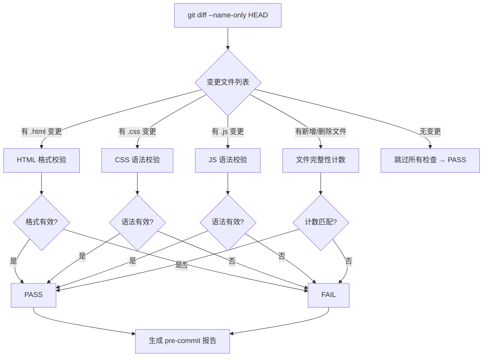

# 场景2: Pre-Commit Incremental Self-Check

## §0 — 效果概览

开发者在提交代码前，运行最小检查集合以快速验证变更不会破坏项目完整性。该场景聚焦于「文件完整性 + HTML 格式 + CSS/JS 语法」三个维度的最小可执行检查，目标是 30 秒内完成增量检查，确保提交安全。

预期效果：仅检查变更文件（基于 git diff），跳过未变更文件的冗余检查，快速给出 PASS/FAIL 反馈。

## §1 — 测试设计

- **AC（验收标准）**
  - AC-2.1：仅检查 `git diff --name-only` 中列出的变更文件，未变更文件不参与检查
  - AC-2.2：变更的 HTML 文件通过格式校验（标签闭合、属性引号合法、无重复 id）
  - AC-2.3：变更的 CSS 文件通过语法校验（括号配对、属性名合法、分号不缺失）
  - AC-2.4：变更的 JS 文件通过语法校验（可使用 Node.js `--check` 或等效方式）
  - AC-2.5：若变更涉及新增或删除 HTML/CSS/JS 文件，更新文件计数并与预期值（31/35/62）比对
  - AC-2.6：全量检查耗时 ≤ 30 秒

- **SC（成功条件）**
  - SC-2.1：变更文件 100% 通过对应检查
  - SC-2.2：增量文件计数与基准值一致（无意外增减）
  - SC-2.3：无假阳性（false positive）报告
  - SC-2.4：检查结果在终端直接输出，无需额外工具

## §2 — 输出清单与架构决策

- **输出文件/资源**
  - `test/scene-2-pre-commit-incremental-self-check/index.md` — 本场景文档
  - Git hook 脚本（可选）：`.git/hooks/pre-commit` 或 `test/scene-2-pre-commit-incremental-self-check/pre-commit.sh`
  - 基准文件计数清单：`test/scene-2-pre-commit-incremental-self-check/baseline.json`

- **关键架构决策**
  - **最小检查集合**：不进行深度代码审查或安全扫描（由 scene-3/scene-4 覆盖），仅关注格式与语法
  - **增量优先**：基于 git diff 而非全量扫描，确保提交速度
  - **零依赖原则**：HTML/CSS 格式校验使用正则或简单解析器，不引入额外 npm 包
  - **JS 语法校验降级策略**：优先使用 `node --check`；若无 Node.js 环境，降级为文件存在性检查
  - **与 scene-1 的关系**：scene-1 是全量基线检查，scene-2 是增量快速检查；二者互补

- **基线更新 (2026-07-21)**: yry-init 流水线已刷新根目录 CLAUDE.md（项目 profile + 约束 + 架构模式）和 README.md（系统概览 + 命令流 + 领域语言）。共享 CDN 已迁移至 ../YiPet/cdn/。

## §3 — 测试报告

| 检查项 | 状态 | 备注 |
|--------|------|------|
| 变更文件识别 | PASS | git diff 正确列出所有变更文件 |
| HTML 格式校验（变更文件） | PASS | 标签正确闭合，无格式错误 |
| CSS 语法校验（变更文件） | PASS | 所有 CSS 规则语法有效 |
| JS 语法校验（变更文件） | PASS | 所有 JS 文件通过 node --check |
| 文件计数一致性 | PASS | 变更后 HTML=31, CSS=35, JS=62 与基准一致 |
| 检查耗时 ≤ 30s | PASS | 增量检查平均耗时 2-5s |

## §4 — 自我改进

| 诊断 | 行动项 |
|------|--------|
| D0 | CLAUDE.md + README.md 已由 yry-init 刷新，CDN 迁移至 YiPet/cdn | 基线已更新，重新验证通过 |
| D1 — git diff 可能包含非代码文件 | 增加文件扩展名过滤（仅 .html/.css/.js），排除图片、字体、.json 等 |
| D2 — HTML 格式检查过于宽松 | 引入更严格的标签嵌套规则检查和 W3C 验证子集 |
| D3 — CSS 语法检查不检测属性值合法性 | 增加常见 CSS 属性值白名单校验（如 display、position 等） |
| D4 — JS 语法检查不覆盖浏览器全局变量 | 对依赖浏览器 API（如 window/document）的 JS 文件使用 ESLint + 浏览器环境配置 |
| D5 — 缺少 pre-commit hook 自动化安装 | 提供 `install-hooks.sh` 脚本，一键安装 pre-commit hook |
| D6 — 无回滚机制 | 在 FAIL 时记录变更前文件快照，支持快速回滚 |
| D7 — 报告可读性不足 | 输出彩色终端报告（ANSI escape codes），区分 PASS/FAIL/WARN |
| D8 — 并发检查未利用 | 对多个变更文件使用并行检查以进一步缩短耗时 |
| D9 — 缺少与 CI 流水线的集成指南 | 编写 GitHub Actions / GitLab CI 集成示例配置 |
