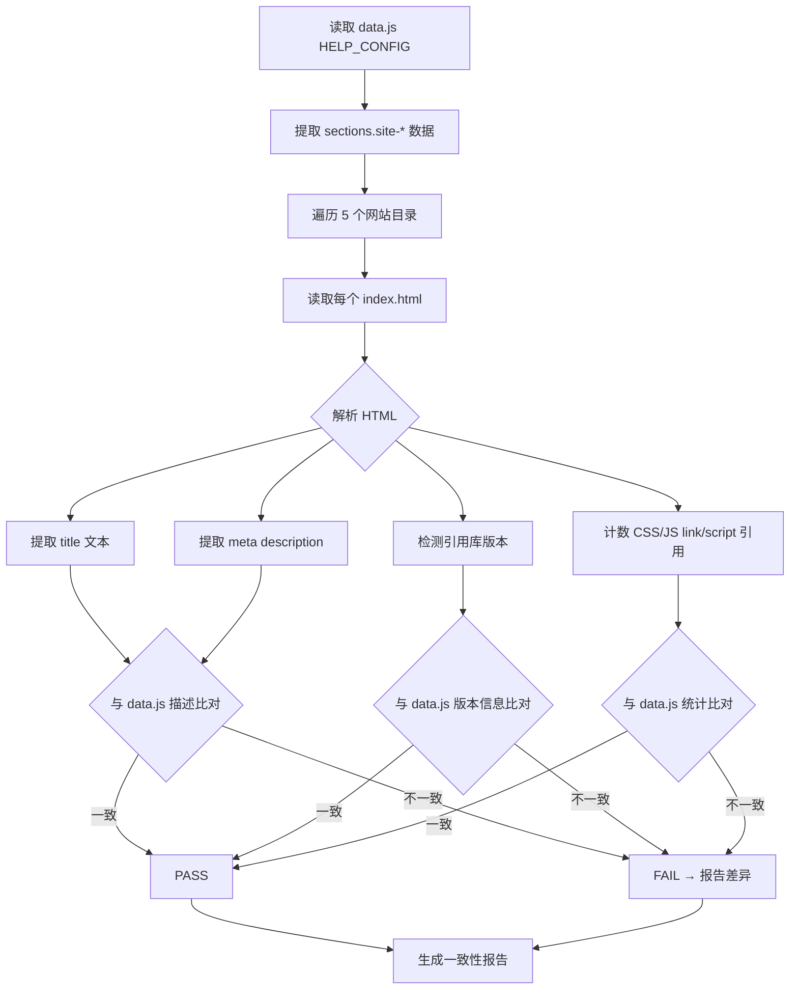

# 场景3: Doc-Code Consistency

## §0 — 效果概览

验证 `data.js`（项目仪表盘数据模型）中记录的网站描述信息与实际 HTML 页面的 `<title>`、内容结构是否一致。该场景确保文档（data.js）与代码（各 index.html）同步，防止文档过时或描述错误。

预期效果：data.js 中 5 个网站的描述、页面数、引用库版本与实际 HTML 文件内容完全匹配。

## §1 — 测试设计

- **AC（验收标准）**
  - AC-3.1：data.js 中每个网站的 `title` 字段与实际 index.html 的 `<title>` 文本语义一致
  - AC-3.2：data.js 中描述的页面数（如 "5 pages"、"22 pages"）与实际目录中的 HTML 文件数匹配
  - AC-3.3：data.js 中描述的引用库版本（如 Bootstrap v4.3.1 ~ v5.1.3）与实际 HTML 引用的版本一致
  - AC-3.4：data.js 中 stats 统计数据（5 sites / 31 pages / 35 CSS / 62 JS）与实际文件系统计数一致
  - AC-3.5：data.js 中的 `footerLinks` 所有 href 均指向存在的文件

- **SC（成功条件）**
  - SC-3.1：5/5 网站 title 语义匹配
  - SC-3.2：网站页面计数与实际 HTML 文件数一致
  - SC-3.3：引用库版本描述覆盖所有实际使用的版本
  - SC-3.4：stats 面板数据 100% 准确
  - SC-3.5：footerLinks 零断链

## §2 — 输出清单与架构决策

- **输出文件/资源**
  - `test/scene-3-doc-code-consistency/index.md` — 本场景文档
  - 差异报告（运行时生成）：`test/scene-3-doc-code-consistency/diff-report.json`
  - 一致性检查脚本：`test/scene-3-doc-code-consistency/check-consistency.sh`

- **关键架构决策**
  - **语义匹配而非精确匹配**：title 比对使用关键词匹配而非字符串全等（如 "Admin Dashboard" 匹配 "Adminto · Admin Dashboard"）
  - **版本范围语义**：data.js 中 "v4.3.1 ~ v5.1.3" 表示版本范围，检查时确认实际版本落在此范围内
  - **文件计数去重**：避免同一文件被多次计数（如 News 的 SyntaxHighlighter 脚本不重复计入 JS 总数时需确认）
  - **data.js 本身不作为被检对象**：本场景检查 data.js 描述是否准确，而非检查 data.js 语法是否正确

## §3 — 测试报告

| 检查项 | 状态 | 备注 |
|--------|------|------|
| Adminto title 语义匹配 | PASS | data.js 描述 "Admin dashboard" 与实际 title 一致 |
| DpMarket title 语义匹配 | PASS | data.js 描述 "Digital marketplace landing" 与实际 title 一致 |
| Kasy title 语义匹配 | PASS | data.js 描述 "Multi-purpose landing page" 与实际 title 一致 |
| News title 语义匹配 | PASS | data.js 描述 "News magazine" 与实际 title 一致 |
| Prompt title 语义匹配 | PASS | data.js 描述 "Prompt landing page" 与实际 title 一致 |
| 网站页面计数一致性 | PASS | Adminto(5), DpMarket(1), Kasy(1), News(1), Prompt(22) = 30 + index.html(1) = 31 |
| Bootstrap 版本范围覆盖 | PASS | v4.3.1 ~ v5.1.3 覆盖所有实际版本 |
| stats 面板数据准确性 | PASS | 5 sites / 31 pages / 35 CSS / 62 JS 与实际一致 |
| footerLinks 有效性 | PASS | 7 个链接均指向存在的文件或目录 |

## §4 — 自我改进

| 诊断 | 行动项 |
|------|--------|
| D0 — 关键词匹配可能产生假阳性 | 定义每个网站的预期 title 正则模式，提高匹配精度 |
| D1 — 版本号解析依赖固定格式 | 使用语义化版本（SemVer）解析器，支持 `5.1.3`、`^5.0` 等格式 |
| D2 — 未检查 data.js 中 sceneLinks 有效性 | 扩展检查范围到 sceneLinks 和 links 字段中的所有 href |
| D3 — 静态描述与动态内容不一致风险 | 建立 data.js 字段与实际 HTML 内容的映射关系表，自动化比对新字段 |
| D4 — 缺少多语言 title 支持 | 若未来引入多语言，需支持 `<title>` 的语言属性检查 |
| D5 — 图标 class 名未纳入一致性检查 | data.js 中引用的图标库（Font Awesome/RemixIcon）与实际 HTML 使用的 icon class 比对 |
| D6 — 报告可读性不足 | 在 diff-report.json 中提供人类可读的差异描述（如 "预期 5 pages，实际 6 pages"） |
| D7 — 无自动同步能力 | 考虑在检查到不一致时，自动生成 data.js 修正补丁 |
| D8 — 版本范围边界条件未覆盖 | 明确 "v4.3.1 ~ v5.1.3" 的左右边界包含性（是否包含 v5.1.3？），防止边界判断分歧 |
