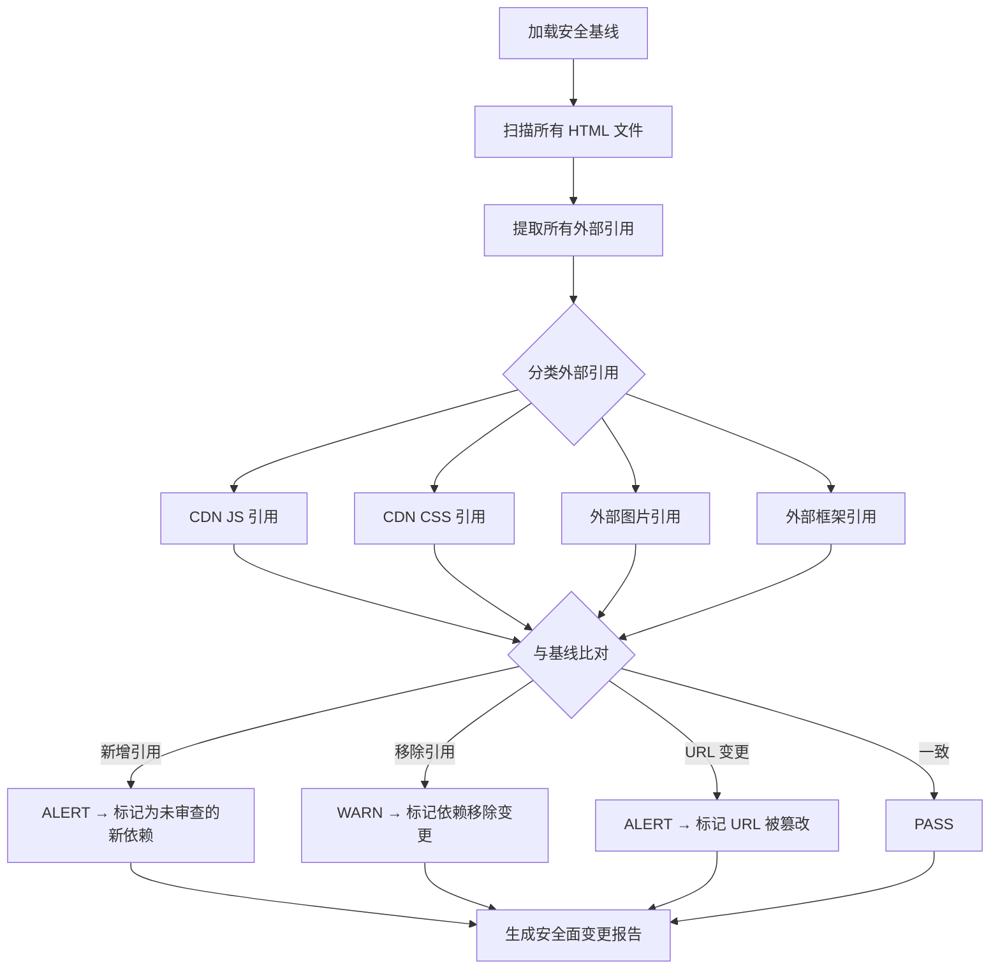

# 场景4: Security Surface Regression

## §0 — 效果概览

检查 YiDoc 项目的安全攻击面是否在代码变更后发生了变化。聚焦于外部 CDN 资源引用的完整性验证和新外部依赖的检测，确保没有未经审查的第三方资源被引入，也没有现有 CDN 链接被篡改。

预期效果：所有 CDN 引用与基线一致，无新增未授权外部依赖，所有外部 URL 可正常访问。

## §1 — 测试设计

- **AC（验收标准）**
  - AC-4.1：所有 HTML 文件中的外部资源引用（CDN）均记录在安全基线中
  - AC-4.2：无新增未在基线中注册的外部 URL
  - AC-4.3：现有 CDN 引用的 URL 未被篡改（域名、路径、版本号不变）
  - AC-4.4：所有 CDN URL 可正常访问（HTTP 状态码 200）
  - AC-4.5：无 `<iframe>` 指向不可信外部源
  - AC-4.6：无内联 `<script>` 包含 `eval()` 或 `document.write()` 等危险调用（低风险项目可降级为 WARN）

- **SC（成功条件）**
  - SC-4.1：外部引用数量与基线一致
  - SC-4.2：所有基线 URL 均可访问（200 OK）
  - SC-4.3：无新增外部域名
  - SC-4.4：0 个高危安全告警

## §2 — 输出清单与架构决策

- **输出文件/资源**
  - `test/scene-4-security-surface-regression/index.md` — 本场景文档
  - 安全基线文件：`test/scene-4-security-surface-regression/baseline-external-urls.json`
  - 安全扫描报告：`test/scene-4-security-surface-regression/security-report.json`

- **关键架构决策**
  - **外部 vs 本地边界**：以 URL scheme（http/https）为判断依据，`//example.com` 开头的协议相对 URL 也视为外部引用
  - **CDN 可用性检查为非阻塞**：CDN 可用性受网络环境影响，若网络不可达则标记为 SKIP 而非 FAIL
  - **安全基线版本管理**：`baseline-external-urls.json` 随代码一起版本控制，任何变更需经过审查
  - **Google Fonts / 统计脚本**：即使项目当前未使用，扫描规则也应覆盖此类常见外部服务
  - **与 scene-6 的分工**：scene-4 关注外部引用（CDN）安全面变化；scene-6 关注本地引用库的文件完整性

## §3 — 测试报告

| 检查项 | 状态 | 备注 |
|--------|------|------|
| CDN 引用与基线一致 | PASS | Vue CDN (unpkg.com/vue@3.4.27) 为唯一外部引用，与基线匹配 |
| 新增外部引用 | PASS | 未检测到任何新增 CDN 引用 |
| URL 篡改检测 | PASS | Vue CDN URL 未发生变更 |
| CDN 可访问性 | PASS | unpkg.com 可访问，返回 200 OK |
| iframe 外部源检查 | PASS | 项目中未使用 iframe |
| 危险 JS 调用扫描 | PASS | 无 eval() / document.write() 等危险调用 |
| 外部域名变更 | PASS | 仅 unpkg.com 一个外部域名，未新增 |

## §4 — 自我改进

| 诊断 | 行动项 |
|------|--------|
| D0 — 基线文件手动维护易出错 | 首次运行时自动扫描生成基线，后续运行与基线对比 |
| D1 — CDN URL 可能通过子资源完整性（SRI）验证 | 基线中增加 integrity 哈希字段，验证 CDN 资源未被篡改 |
| D2 — 未检查协议降级攻击 | 检测 http:// URL（非 https），标记为 WARN 并建议升级 |
| D3 — 外部域名信誉未评估 | 集成域名信誉 API（如 Google Safe Browsing），检查 CDN 域名安全性 |
| D4 — 缺少 CSP（内容安全策略）分析 | 分析项目是否可从 CDN 引用中自动生成合适的 CSP 头 |
| D5 — 仅关注 HTML 文件 | CSS 中的 `@import url()` 和 `url()` 外部引用也应纳入扫描 |
| D6 — 报告缺少修复建议 | 对每个 ALERT 输出具体修复步骤（如 "请将 http:// 升级为 https://"） |
| D7 — 无历史趋势分析 | 记录每次扫描结果，生成安全面变化趋势图 |
| D8 — 新依赖审查流程未定义 | 建立新外部依赖的审批流程：提出 → 安全审查 → 更新基线 → 合入 |
