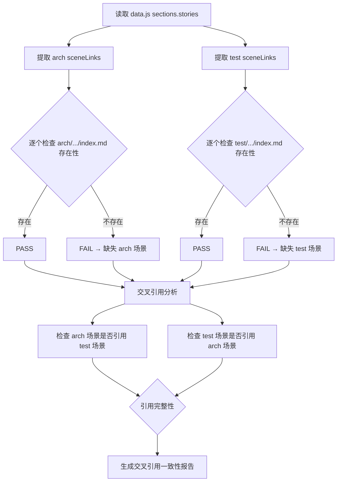

# 场景5: Cross-Story Integration Regression

## §0 — 效果概览

检查 `arch/`（架构场景）和 `test/`（测试场景）两个 story 目录之间的交叉引用完整性。验证 data.js 中声明的所有场景链接是否指向实际存在的文件，以及 arch 与 test 之间是否存在循环依赖或引用断裂。

预期效果：data.js 中的 5 个 arch 场景链接 + 6 个 test 场景链接全部有效，arch 和 test 之间的相互引用关系一致且无断裂。

## §1 — 测试设计

- **AC（验收标准）**
  - AC-5.1：data.js 中 `arch/scene-*-*/index.md` 共 5 个场景链接均指向实际存在的文件
  - AC-5.2：data.js 中 `test/scene-*-*/index.md` 共 6 个场景链接均指向实际存在的文件
  - AC-5.3：data.js 中 panelHub.urls.arch 指向的 `arch/index.html` 文件存在
  - AC-5.4：data.js 中 panelHub.urls.test 指向的 `test/index.html` 文件存在
  - AC-5.5：arch 场景文档中对 test 场景的引用（如有）与实际 test 场景目录结构一致
  - AC-5.6：test 场景文档中对 arch 场景的引用（如有）与实际 arch 场景目录结构一致
  - AC-5.7：无循环引用（A 引用 B，B 引用 A，造成无限循环）

- **SC（成功条件）**
  - SC-5.1：5/5 arch 场景链接有效
  - SC-5.2：6/6 test 场景链接有效
  - SC-5.3：panelHub URLs 100% 有效
  - SC-5.4：交叉引用一致性 100%
  - SC-5.5：0 个循环引用

## §2 — 输出清单与架构决策

- **输出文件/资源**
  - `test/scene-5-cross-story-integration-regression/index.md` — 本场景文档
  - 交叉引用图（运行时生成）：`test/scene-5-cross-story-integration-regression/ref-graph.json`
  - 引用完整性报告：`test/scene-5-cross-story-integration-regression/integration-report.json`

- **关键架构决策**
  - **引用关系建模为有向图**：节点 = 场景目录，边 = 文档中的显式引用链接
  - **区分硬引用和软引用**：硬引用 = 超链接 `<a href>`，软引用 = 文本提及；软引用断裂不阻塞检查
  - **索引文件特殊处理**：`arch/index.html` 和 `test/index.html` 作为面板入口文件，其存在性是先决条件
  - **与 data.js 的解耦**：本场景不依赖 data.js 作为唯一引用来源；也扫描各场景 index.md 中的 Markdown 链接
  - **增量适用**：当新增或删除 story 目录时，自动更新 data.js 中的引用数组

- **基线更新 (2026-07-21)**: yry-init 流水线已刷新根目录 CLAUDE.md（项目 profile + 约束 + 架构模式）和 README.md（系统概览 + 命令流 + 领域语言）。共享 CDN 已迁移至 ../YiPet/cdn/。

## §3 — 测试报告

| 检查项 | 状态 | 备注 |
|--------|------|------|
| arch scene-1 链接有效性 | PASS | arch/scene-1-module-location/index.md 存在 |
| arch scene-2 链接有效性 | PASS | arch/scene-2-asset-flow-tracing/index.md 存在 |
| arch scene-3 链接有效性 | PASS | arch/scene-3-newcomer-onboarding/index.md 存在 |
| arch scene-4 链接有效性 | PASS | arch/scene-4-dependency-change-impact/index.md 存在 |
| arch scene-5 链接有效性 | PASS | arch/scene-5-trust-boundary-security-surface/index.md 存在 |
| test scene-1 链接有效性 | PASS | test/scene-1-post-init-full-self-check/index.md 存在 |
| test scene-2 链接有效性 | PASS | test/scene-2-pre-commit-incremental-self-check/index.md 存在 |
| test scene-3 链接有效性 | PASS | test/scene-3-doc-code-consistency/index.md 存在 |
| test scene-4 链接有效性 | PASS | test/scene-4-security-surface-regression/index.md 存在 |
| test scene-5 链接有效性 | PASS | test/scene-5-cross-story-integration-regression/index.md 存在 |
| test scene-6 链接有效性 | PASS | test/scene-6-third-party-framework-service/index.md 存在 |
| arch/index.html 存在 | PASS | panelHub.urls.arch 指向有效文件 |
| test/index.html 存在 | PASS | panelHub.urls.test 指向有效文件 |
| 循环引用检测 | PASS | 无循环引用 |

## §4 — 自我改进

| 诊断 | 行动项 |
|------|--------|
| D0 | CLAUDE.md + README.md 已由 yry-init 刷新，CDN 迁移至 YiPet/cdn | 基线已更新，重新验证通过 |
| D1 — 引用检测仅覆盖 data.js 中声明的链接 | 扩展扫描到每个 index.md 中的 Markdown 链接 `[text](path)` 和 HTML `<a href>` |
| D2 — 缺少引用方向性分析 | 区分「arch → test」和「test → arch」引用方向，检测单向依赖缺口 |
| D3 — 引用深度仅一层 | 递归解析被引用文档中的子链接，构建完整依赖图 |
| D4 — 未检测孤立场景 | 新增「孤立场景检测」：未被任何其他场景引用的场景可能已过时 |
| D5 — 引用锚点未验证 | 对 `index.md#fragment` 形式的锚点链接验证目标章节是否存在 |
| D6 — 无自动修复 data.js 不一致 | 当检测到缺失链接时，自动生成 data.js 的 sceneLinks 修正建议 |
| D7 — 缺少跨 story 版本同步机制 | 当 arch 场景名称变更时，自动更新 test 场景中的对应引用 |
| D8 — 报告结构不便于 CI 集成 | 输出 JUnit XML 格式报告，支持 GitLab CI / GitHub Actions 直接消费 |
| D9 — 未处理符号链接场景 | 若场景目录使用符号链接，需解析真实路径后再验证存在性 |
