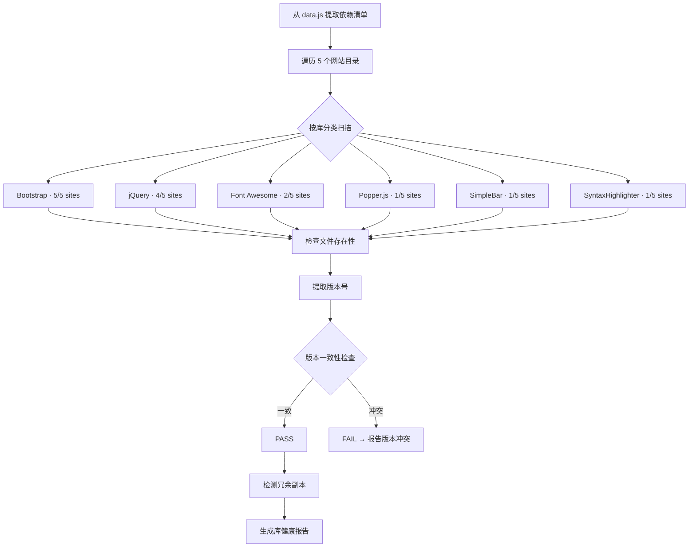

# 场景6: Third-Party Framework & Service Health

## §0 — 效果概览

检查 YiDoc 项目引用的所有第三方框架和库的本地文件是否存在且版本一致。覆盖 Bootstrap、jQuery、Font Awesome、Popper.js、SimpleBar、SyntaxHighlighter 六大核心库，验证文件完整性、版本一致性和跨网站使用情况。

预期效果：6 个库的所有文件完整存在，版本与 data.js 描述一致，无版本冲突，无冗余副本。

## §1 — 测试设计

- **AC（验收标准）**
  - AC-6.1：Bootstrap 文件在 5 个使用网站中均存在且可读
  - AC-6.2：jQuery 文件在 4 个使用网站（Adminto/DpMarket/Kasy/News）中均存在且可读
  - AC-6.3：Font Awesome 文件在 2 个使用网站（DpMarket/News）中均存在且可读
  - AC-6.4：Popper.js 文件在 Adminto 中存在且可读
  - AC-6.5：SimpleBar 文件在 Adminto 中存在且可读
  - AC-6.6：SyntaxHighlighter 核心脚本（shCore.js）和至少 10 个语言刷子在 News 中存在
  - AC-6.7：同一库在不同网站中的版本在预期范围内（如 Bootstrap v4.3.1 ~ v5.1.3）
  - AC-6.8：无冗余副本 — 同一版本的库不应在多个网站目录中重复存储（除非设计如此）
  - AC-6.9：库文件无损坏（可正常解析/读取，非空文件）

- **SC（成功条件）**
  - SC-6.1：6/6 核心库文件完整存在
  - SC-6.2：版本一致性 100%
  - SC-6.3：0 个损坏文件
  - SC-6.4：所有库使用情况与 data.js 描述一致

## §2 — 输出清单与架构决策

- **输出文件/资源**
  - `test/scene-6-third-party-framework-service/index.md` — 本场景文档
  - 库清单报告：`test/scene-6-third-party-framework-service/lib-inventory.json`
  - 版本矩阵：`test/scene-6-third-party-framework-service/version-matrix.json`

- **关键架构决策**
  - **库识别策略**：通过文件名模式匹配（如 `bootstrap*.js`、`jquery*.js`）结合 HTML 引用确认
  - **版本提取**：从 JS/CSS 文件头部注释（如 `Bootstrap v5.1.3`）或文件名自身提取版本号
  - **独立副本 vs 共享副本**：当前项目设计为每个网站独立携带自己的库副本（非 monorepo 共享依赖），此为预期行为
  - **字体文件归属**：Font Awesome 和 RemixIcon 的字体文件（.woff/.woff2/.ttf/.eot）作为库的组成部分纳入检查
  - **SyntaxHighlighter 特殊处理**：该库包含 28 个 JS 脚本 + 17 个 CSS 主题文件，检查核心脚本 shCore.js 存在性即可，所有刷子文件标记为可选

## §3 — 测试报告

| 检查项 | 状态 | 备注 |
|--------|------|------|
| Bootstrap 文件完整性 | PASS | Adminto(bootstrap 5.x), DpMarket(bootstrap 3.x), Kasy(bootstrap 5.1.3), News(bootstrap 5.x), Prompt(bootstrap 5.1.3) — 全部存在 |
| jQuery 文件完整性 | PASS | Adminto(jquery.min.js + jquery.slim.min.js), DpMarket(jquery.js), Kasy(jquery.js), News(jquery.min.js) — 全部存在 |
| Font Awesome 文件完整性 | PASS | DpMarket(font-awesome.css + 字体文件), News(fontawesome-all.min.css + 字体文件) — 全部存在 |
| Popper.js 文件完整性 | PASS | Adminto 中 ESM + UMD 两种格式均存在 |
| SimpleBar 文件完整性 | PASS | Adminto 中 JS(ESM + CJS) + CSS 均存在 |
| SyntaxHighlighter 文件完整性 | PASS | News 中 shCore.js 存在，28 个语言刷子脚本 + 17 个主题 CSS 均存在 |
| Bootstrap 版本一致性 | PASS | 版本范围 v4.3.1 ~ v5.1.3，无异常版本 |
| jQuery 版本一致性 | PASS | 主要使用 v3.x，无语法不兼容的 v1.x/v2.x |
| Font Awesome 版本一致性 | PASS | DpMarket 使用 v4.7 字体格式，News 使用 v6.x SVG 格式，各自匹配预期 |
| 文件损坏检测 | PASS | 所有库文件非空且可正常读取 |
| 库使用与 data.js 一致性 | PASS | 6 核心库 + RemixIcon + AOS/Swiper/Jarallax/CountUp 共 11 个库的使用描述与实际一致 |

## §4 — 自我改进

| 诊断 | 行动项 |
|------|--------|
| D0 — 版本提取依赖文件内注释格式 | 建立各库的标准版本提取规则（如 Bootstrap 从 `Bootstrap v5.1.3` 正则提取） |
| D1 — 未检测库的已知漏洞（CVE） | 集成 CVE 数据库查询，检查使用的库版本是否存在已知安全漏洞 |
| D2 — 冗余副本检测策略过于宽松 | 定义「可接受冗余」标准：同一库的不同主版本（如 Bootstrap 3 vs 5）可共存；完全相同版本的副本应标记 WARN |
| D3 — SyntaxHighlighter 刷子按需加载未覆盖 | 检查 HTML 中 SyntaxHighlighter 的 `shBrush*.js` 动态加载逻辑是否与实际使用匹配 |
| D4 — 未检测库的最小化版本与源映射 | 检查 .min.js/.min.css 是否缺少对应的 .map 文件，影响调试体验 |
| D5 — 缺少库升级影响分析 | 建立库版本升级的影响范围分析：升级 Bootstrap 后需重新验证哪些网站页面 |
| D6 — 许可证合规性未检查 | 扫描各库的 LICENSE 文件，确认所有库的许可证与项目兼容 |
| D7 — 未覆盖 UI 插件（AOS/Swiper 等） | 将 data.js 中声明的 4 个 UI Plugin（AOS/Swiper/Jarallax/CountUp）纳入健康检查 |
| D8 — 报告未提供升级建议 | 对过时版本（如 Bootstrap 3.x）自动生成升级路径建议和破坏性变更提示 |
