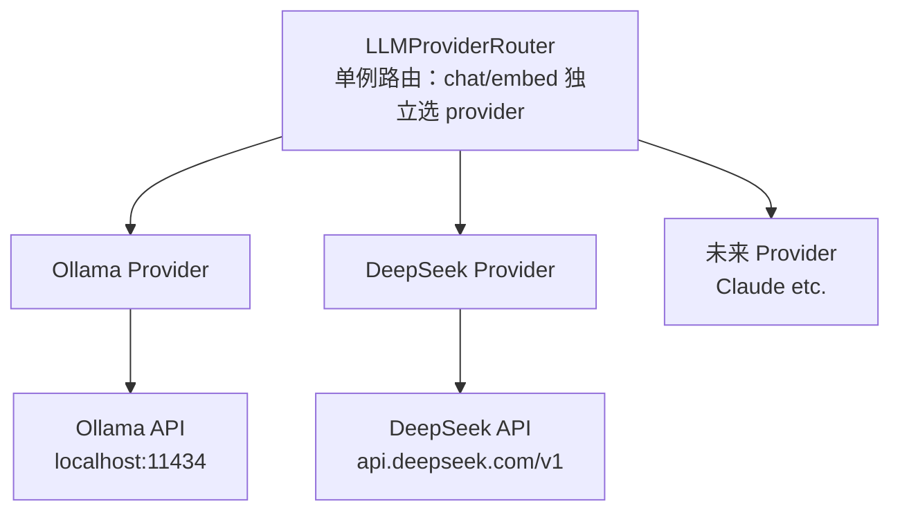
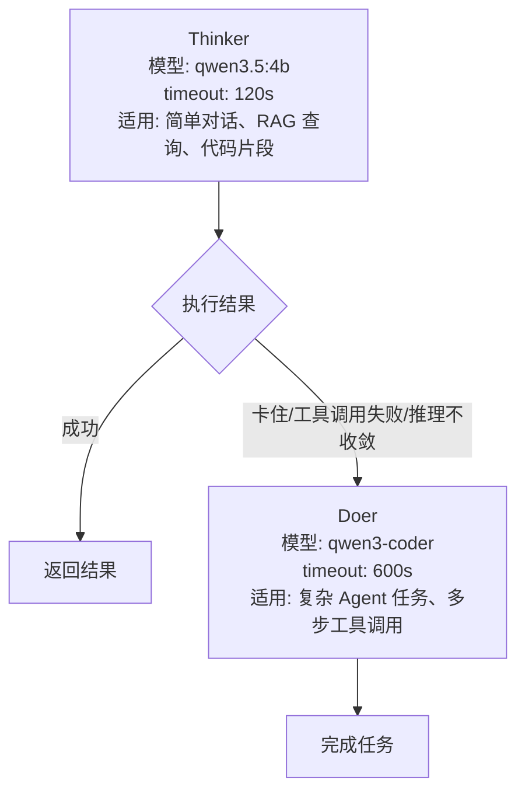
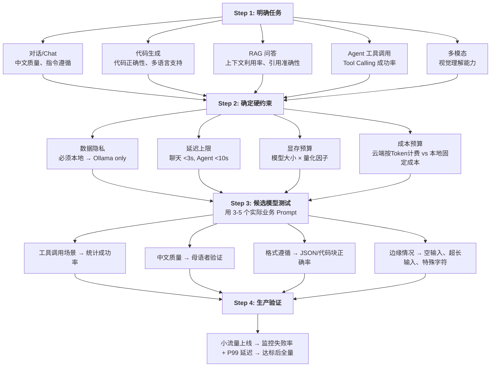
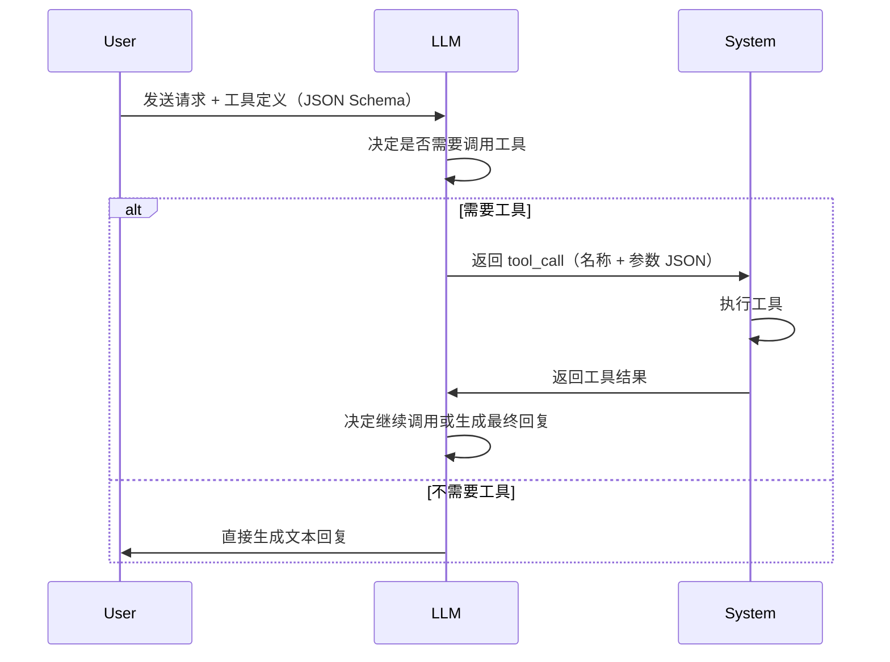

# LLM 基础概念与选型指南

> **适用场景：** 为新功能选择模型、评估模型是否称职、理解 YiAi 中 LLM 调用链路的实现细节。

## 1. 核心概念

### 1.1 Token 与分词

Token 是模型处理文本的最小语义单元，由 **分词器（Tokenizer）** 将原始文本切分而成。主流分词算法为 **BPE（Byte-Pair Encoding）**，核心思想是反复合并高频字符对，构建子词级词表。

| 概念 | 定义 | YiAi 实际数据 |
|---|---|---|
| **上下文窗口（Context Window）** | 模型单次能处理的最大 Token 数（输入 + 输出） | qwen3.5 默认 32K，通过 `ollama_num_ctx` 配置 |
| **输入 Token（Prompt Tokens）** | Prompt + 对话历史 + 工具调用结果 | Agent 单轮 2K-8K，RAG 查询 1K-3K |
| **输出 Token（Completion Tokens）** | 模型生成的回复 | RAG 通过 `rag.num_predict: 512` 限制 |
| **最大输出 Token（Max Tokens）** | 单次请求输出上限 | Ollama API 通过 `num_predict` 控制 |

> **中文 vs 英文：** 中文约 1.5-2 个字符/Token，英文约 4 个字符/Token（0.75 个单词）。同等语义下，中文 Token 消耗约为英文的 1.5-2 倍。qwen 系列使用自己的 tokenizer，中文效率优于 LLaMA 系列。

**Token 消耗的隐性成本：**
- **System Prompt** 在每次请求中重复消耗输入 Token
- **工具定义（Tool Schema）** 的 JSON Schema 描述文本计入输入 Token，工具越多扣减越多
- **对话历史** 随轮次线性增长，长对话可能撑爆上下文窗口

### 1.2 采样参数

模型输出的是词表上的**概率分布**（logits → softmax → probabilities），采样参数控制如何从这个分布中选择 Token。

| 参数 | 取值范围 | 机制 | YiAi 默认值 |
|---|---|---|---|
| **Temperature** | 0.0 — 2.0 | 将 logits 除以温度值后再 softmax。τ→0 趋向 argmax（确定性），τ→∞ 趋向均匀分布（随机） | chat: 0.7，RAG: 0.0 |
| **Top-p（Nucleus）** | 0.0 — 1.0 | 按概率从高到低累加，仅从累积概率 ≥ p 的最小 Token 集合中采样 | Ollama 默认 0.9 |
| **Top-k** | 1 — N | 仅从概率最高的 k 个 Token 中采样 | Ollama 默认 40 |
| **重复惩罚（Repeat Penalty）** | 1.0 — 2.0 | 对已生成的 Token 施加概率衰减，`score_i /= penalty` if token_i already appeared | 默认 1.0（不惩罚） |

**参数组合策略：**

```
确定性任务（代码生成、数据提取、RAG）：
  temperature=0.0, 不设 top_p/top_k

平衡任务（通用对话）：
  temperature=0.7, top_p=0.9（Ollama 默认）

创意任务（头脑风暴、文案）：
  temperature=1.0-1.2, top_p=0.95

需要格式约束（JSON 输出）：
  temperature=0.0 + JSON Schema 约束（OpenAI 的 response_format）
  Ollama 通过 prompt 中强调格式来间接控制
```

> **经验法则：** 不要同时调整 Temperature 和 Top-p。两者都是控制随机性的参数，双重约束使行为难以预测。OpenAI 官方建议只调一个，另一个保持默认。

### 1.3 关键推理参数

| 参数 | 作用 | YiAi 配置 |
|---|---|---|
| **num_ctx** | 上下文窗口大小（Token 数） | `ollama_num_ctx`，默认由模型决定 |
| **num_predict** | 最大生成 Token 数 | chat: 4096（`max_tokens`），RAG: 512 |
| **num_gpu** | 使用 GPU 层数 | Ollama 自动检测，可强制指定 |
| **num_thread** | CPU 推理线程数 | Ollama 自动配置 |
| **mirostat** | 自适应采样算法，动态调整困惑度 | Ollama 支持但 YiAi 未启用 |

## 2. 模型架构基础

### 2.1 Transformer 核心组件

当前所有主流 LLM 均基于 **Transformer** 架构（2017, Vaswani et al.）。理解其核心组件有助于做出正确的模型选择。

#### 自注意力机制（Self-Attention）

```
Attention(Q, K, V) = softmax(QK^T / √d_k) · V

Q: Query  — 当前 Token "想要查找什么"
K: Key    — 所有 Token "能提供什么"
V: Value  — 所有 Token "实际传递的信息"
√d_k:     缩放因子，防止点积过大导致 softmax 梯度消失
```

- **计算复杂度 O(n²)**，n 为序列长度——这是上下文窗口越大越慢的根本原因
- **多头注意力（Multi-Head Attention）**：并行运行多组 Attention，每组关注不同子空间（语法/语义/位置）
- **GQA（Grouped-Query Attention）**：多个 Q 头共享一组 K/V 头，减少 KV Cache 显存占用——qwen3.5 使用此优化

#### KV Cache

推理时，每个 Token 的 Key 和 Value 矩阵被缓存，下一个 Token 只需计算当前的 Q 与所有历史的 K 做点积：

```
无缓存：每一步 O(n² · d)，生成 m 个 Token 总计 O(m · n² · d)
有缓存：每一步 O(n · d)，生成 m 个 Token 总计 O(m · n · d)
```

- KV Cache 的显存占用 = `2 × num_layers × num_kv_heads × head_dim × context_len × 2 bytes (FP16)`
- 对于 32 层、8 KV 头、128 维的模型在 32K 上下文下：约 2GB 仅用于 KV Cache
- **这就是长上下文消耗大量显存的原因，也是 GQA/MQA 存在的价值**

#### 位置编码

Transformer 本身对 Token 顺序无感知，需要位置编码注入位置信息：

- **绝对位置编码（Sinusoidal/可学习）**：为每个位置分配唯一向量。缺点：无法外推到训练长度之外。
- **RoPE（Rotary Position Embedding）**：通过对 Q/K 向量施加旋转变换编码相对位置。qwen/LLaMA 系列使用此方案。支持通过调整旋转基频（theta）扩展上下文窗口。

### 2.2 架构范式

| 架构 | 原理 | 代表模型 | 对推理的影响 |
|---|---|---|---|
| **Dense（稠密）** | 每次前向传播激活全部参数 | qwen2.5 (7B/72B) | 推理速度稳定，显存需求 = 模型大小 |
| **MoE（混合专家）** | 每次仅激活部分"专家"子网络 | qwen3.5-MoE, DeepSeek-V4, Mixtral | 激活参数少 → 推理快；但总参数大 → 显存需求高（需加载全部专家） |
| **Encoder-Decoder** | 编码器处理输入，解码器生成输出 | T5, BART | 翻译/摘要专用，YiAi 不使用 |
| **Decoder-Only** | 仅用解码器，自回归生成 | GPT, qwen, LLaMA 全部 | 当前主流，YiAi 所有模型均为此类 |

### 2.3 量化（Quantization）

将模型参数从高精度（FP16/BF16）压缩到低精度（INT8/INT4），降低显存和计算需求。

| 量化格式 | 精度 | 显存节省 | 质量损失 | YiAi 适用性 |
|---|---|---|---|---|
| **FP16** | 16-bit | 基准 | 无 | GPU 充足时的选择 |
| **Q8_0** | 8-bit | ~50% | <0.5% | 几乎无损，优先使用 |
| **Q4_K_M** | 4-bit（混合精度） | ~70% | <2% | Ollama 默认，YiAi 推荐 |
| **Q2_K** | 2-bit | ~85% | 5-10% | 极端场景，不建议 |
| **IQ4_XS** | 4-bit（重要性感知） | ~75% | <1.5% | 比 Q4_K_M 更好但非所有模型支持 |

> **Ollama 的量化标签：** `qwen3.5:4b` 默认拉取 Q4_K_M 量化版。显式指定如 `qwen3.5:4b-q8_0` 可获取 8-bit 版。YiAi 在 GPU 显存有限时，Q4_K_M 是最佳平衡点。

### 2.4 推理优化技术

| 技术 | 原理 | 适用场景 |
|---|---|---|
| **Continuous Batching** | 动态合并多个请求的推理批次，无需等整个批次完成 | 高并发 API 服务（vLLM, TGI） |
| **Speculative Decoding** | 用小模型快速生成候选 Token，大模型并行验证 | 低延迟场景，以吞吐换延迟 |
| **Flash Attention** | 分块计算 Attention，减少 HBM 读写 | 长上下文场景，Ollama 已集成 |
| **Prompt Caching** | 缓存 System Prompt 和前缀的 KV Cache | 多轮对话、RAG 场景 |

> YiAi 当前使用 Ollama 的默认推理引擎（llama.cpp），已内置 Flash Attention 和 KV Cache。高并发场景可考虑部署 vLLM 或 TGI 替代。

## 3. YiAi 的 LLM 架构

### 3.1 Provider 抽象层

YiAi 实现了两层 Provider 抽象，以支持多后端和自动降级：



**`LLMProviderRouter`（`src/services/ai/llm_provider.py`）** 的职责：

- **Chat 和 Embedding 提供者独立选择**：可 chat 用 DeepSeek、embed 用 Ollama
- **自动回退（Fallback）**：DeepSeek 不可用时自动切到 Ollama，用户无感知
- **健康检查**：启动时验证所有 Provider 的连通性
- **配置驱动**：通过 `config.yaml` 的 `llm.chat_provider` 和 `llm.embed_provider` 控制

```
# config.yaml 关键配置
ollama:
  url: "http://localhost:11434"
  chat_timeout: 600          # 10 分钟，Agent 复杂任务可能很长

deepseek:
  api_key: ""                # 留空则不注册此 Provider
  base_url: "https://api.deepseek.com/v1"
  default_model: "deepseek-chat"
  chat_timeout: 120

llm:
  chat_provider: "ollama"    # 可选 deepseek
  embed_provider: "ollama"   # 可选 deepseek
```

### 3.2 ModelRuntime — 流式推理引擎

**`ModelRuntime`（`src/services/ai/model_runtime.py`）** 是比 Provider 更上层的抽象，专门处理 SSE 流式响应的生成。与 `LLMProviderRouter` 的不同在于：它包含完整的流控逻辑（心跳、超时、重试）。

```
ModelRuntime
├── OllamaRuntime    — 本地 Ollama 流式推理，Pi 风格的异步队列
├── OpenAIRuntime    — DeepSeek/OpenAI 兼容 API，支持 Vision
└── RAGRuntime       — RAG 检索增强（CondensePlusContextChatEngine）
                      失败时回退到 OllamaRuntime
```

**OllamaRuntime 的流控机制：**

```
┌─ OllamaRuntime.stream_chat() ──────────────────────┐
│                                                     │
│  worker thread (sync)          main loop (async)   │
│  ┌──────────────┐              ┌───────────────┐   │
│  │ ollama.chat()│──queue.put──→│ asyncio.wait   │   │
│  │ stream=True  │  (delta)     │ _for(queue,    │   │
│  │              │              │  timeout=15s)  │   │
│  └──────────────┘              │                │   │
│                                │ 超时15秒 →     │   │
│                                │ heartbeat:     │   │
│                                │ {phase:"think"} │   │
│                                │ 总超时 600s →  │   │
│                                │ error          │   │
│                                └───────────────┘   │
│                                                     │
│  关键设计：                                          │
│  - to_thread 跑同步的 ollama.Client，不阻塞 event loop│
│  - 15s 心跳防止 SSE 连接被代理/浏览器断开             │
│  - 600s 硬超时保护，防止模型卡死占住连接               │
│  - Token Usage 在 done 帧中通过 prompt_eval_count /   │
│    eval_count 回流到前端                              │
└─────────────────────────────────────────────────────┘
```

### 3.3 Thinker/Doer 双模策略

这是 YiAi Agent 的核心执行模式：



> 详细模型对比与选型记录见 [../platform/02-平台-LLM对比.md](../platform/02-平台-LLM对比.md)。

### 3.4 错误分类与用户反馈

YiAi 的 `classify_error()` 函数（`src/domain/ai/chat.py`）将原始异常映射为用户可操作的消息：

| 错误类型 | 触发条件 | 用户体验 |
|---|---|---|
| `connection_refused` | ECONNREFUSED, connect failed | "无法连接 AI 服务，请检查 LLM 服务器是否运行" |
| `timeout` | 请求超过 `ollama_chat_timeout`（600s） | "AI 服务响应超时，请尝试更短的提问" |
| `model_not_found` | 模型名不存在、未拉取 | "请求的模型不可用，请检查模型名称" |
| `context_overflow` | 输入超过上下文窗口 | "对话过长，请开启新会话或总结之前讨论" |
| `rate_limit` | 请求过于频繁（Ollama 不支持，DeepSeek 可能） | "请求太频繁，请稍后再试" |
| `connection_error` | 网络中断、DNS 解析失败 | "连接中断，服务器可能在重启" |

### 3.5 Token 用量追踪

每次非流式调用 `OllamaProvider.chat()` 的返回值中包含：

```python
ChatResponse(
    content="...",
    model="qwen3.5:4b",
    provider=ProviderType.OLLAMA,
    usage={
        "prompt_tokens": data.get("prompt_eval_count", 0),     # 输入 Token
        "completion_tokens": data.get("eval_count", 0),        # 输出 Token
    },
    finish_reason=data.get("done_reason", "stop"),
)
```

流式调用中，`OllamaRuntime.stream_chat()` 在 `done=True` 时返回 usage 帧，前端可用于展示 Token 消耗统计。

## 4. 模型选型决策框架

### 4.1 四步决策法



### 4.2 选型检查清单

- [ ] 用实际业务 Prompt 测试过至少 3 个候选模型
- [ ] 工具调用成功率 >80%（Agent 场景必须）
- [ ] P99 延迟在 SLO 内（聊天 <3s，Agent <10s）
- [ ] 上下文窗口 ≥ 预期最大 RAG 召回片段 + 对话历史
- [ ] 中文质量经母语者验证通过
- [ ] 显存占用（模型 + KV Cache）在 GPU 可用显存内
- [ ] 成本在预期调用量下可接受
- [ ] 部署方式（本地/云端）满足隐私合规要求

### 4.3 本地部署 vs 云端 API

| 维度 | 本地 Ollama（YiAi 当前方案） | 云端 API（DeepSeek 作为补充） |
|---|---|---|
| **数据隐私** | 全部留在本地，零外部传输 | 需评估供应商隐私条款和数据用途 |
| **成本模型** | 固定硬件成本（GPU 服务器），无边际成本 | 按 Token 计费，高吞吐场景边际成本显著 |
| **延迟构成** | 模型推理 2-10s + 队列等待 | 网络 RTT + 服务商推理 + 可能的排队 |
| **模型选择** | 限于开源模型，但可自由切换 | 可选择最新闭源前沿模型 |
| **可靠性** | 依赖本地硬件，单点故障 | 多 AZ 部署，SLA 保障 |
| **运维负担** | 需要管理 GPU 硬件、驱动、Ollama 升级 | 零运维 |
| **Token 用量可见性** | Ollama API 返回 eval_count | 各厂商 Dashboard 详细展示 |

**混合策略（YiAi 当前方向）：**

```
┌─ LLMProviderRouter ──────────────────────────────┐
│                                                    │
│  chat_with_fallback(messages):                     │
│    try DeepSeek.chat()                             │
│    except → logger.warning(...)  →  Ollama.chat()  │
│                                                    │
│  原则: 优先用本地 Ollama，云端 API 作为降级/补充     │
│  切换触发: api_key 未配置 → 仅 Ollama              │
│           运行时异常 → 自动 fallback               │
└────────────────────────────────────────────────────┘
```

### 4.4 模型类别速查

| 类别 | 代表模型 | 最佳场景 | 局限性 |
|---|---|---|---|
| **前沿闭源（云端）** | Claude Opus 4.7, GPT-5.5 | 复杂推理、代码生成、微妙语义 | 成本高、延迟不可控、数据外传 |
| **平衡闭源（云端）** | Claude Sonnet 4.6, DeepSeek-Chat | 通用场景，性价比好 | 极复杂任务能力不足 |
| **本地开源（Ollama）** | qwen3.5, DeepSeek-V4, LLaMA 4 | 数据隐私、离线、零边际成本 | 硬件要求高，能力天花板低 |
| **编程专用** | qwen3-coder, DeepSeek-Coder | 代码生成与工具调用 | 通用能力弱于通用模型 |

## 5. 工具调用（Tool Calling）

### 5.1 机制概述

Tool Calling 让 LLM 不仅能生成文本，还能调用外部工具（函数）。核心流程：



### 5.2 YiAi 的工具系统

YiAi 实现了 Pi 风格的可插拔工具系统（`src/domain/ai/tools.py`）：

```python
@dataclass
class ToolDefinition:
    name: str                    # 唯一标识，如 "web_search"
    description: str             # 给 LLM 看的人类可读描述
    parameters: Dict[str, Any]   # JSON Schema 参数定义
    execute: Callable            # 异步执行函数
    requires_confirmation: bool  # 是否需要用户确认（写操作/删除操作）

@dataclass
class ToolResult:
    call_id: str
    name: str
    content: str                 # LLM 直接消费的结果文本
    error: Optional[str]
    duration_ms: float           # 执行耗时（性能诊断）
    terminate: bool              # 提示 Agent 循环可在此批工具后终止
```

**关键设计考量：**

- **工具描述是 Prompt 工程的一部分** — 清晰、准确的描述直接影响 LLM 选择工具的准确性
- **参数 Schema 遵循 JSON Schema 规范** — LLM 训练时已见过此格式，遵循规范提升调用正确率
- **结果截断** — 长工具结果（如文件内容）需截断，否则撑爆上下文窗口
- **确认门控** — 写/删除类工具标记 `requires_confirmation=True`，防止 LLM 自主执行危险操作

### 5.3 Tool Calling 的模型选择建议

不同模型对 Tool Calling 的支持程度差异很大：

- **qwen3-coder** 专为工具调用训练，是 YiAi 的 Doer 模型
- **qwen3.5** 支持工具调用但稳定性不如 qwen3-coder，适合不需要工具的 Thinker 场景
- **qwen2.5** 不支持原生 Tool Calling，只能通过 Prompt 约定间接模拟
- **云端 API（DeepSeek/Claude/GPT）** 普遍有良好的原生支持

## 6. 常见问题

### Q: Temperature 和 Top-p 同时设置会怎样？

同时设置相当于对概率分布做两次独立变换。OpenAI 官方建议只调整其中一个。YiAi 的 OllamaProvider 默认只传 `temperature`，RAG 场景设为 `0.0` 确保确定性。

### Q: 上下文窗口越大越好吗？

不是。代价有三：1) 推理速度随序列长度平方增长（无 Flash Attention 时）；2) KV Cache 显存线性增长；3) Token 消耗增加。RAG 场景 8K-16K 通常足够，长文档分析可能需要 32K+。YiAi 通过 `ollama_num_ctx` 可调。

### Q: 量化模型质量损失有多大？

Q4_K_M（Ollama 默认）通常质量损失 <2%，显存节省 ~70%。绝大多数场景下用户感觉不到差异。但以下场景需谨慎：数学推理、代码生成（语法细节敏感）、长文本一致性。

### Q: Agent 工具调用失败怎么处理？

YiAi 的 Doer/Thinker 架构已内置应对策略：Thinker 调用失败后自动升级到 Doer。单模型内可通过以下手段提升：

1. 清晰区分"工具名不存在"（返回可用工具列表）和"参数错误"（返回参数 Schema）
2. 最多重试 2 次，失败后终止 Agent 循环
3. 将工具调用失败作为对话上下文反馈给 LLM，让它自我纠正

## 7. 反模式

| 反模式 | 为什么失败 | YiAi 的正确做法 |
|---|---|---|
| 不看任务直接选"最强"模型 | 榜单不反映你的具体场景；强模型更慢更贵 | 按 Thinker/Doer 分级选用不同模型 |
| 所有流量走同一个模型 | 简单对话和复杂 Agent 对模型要求完全不同 | Thinker 处理简单任务，Doer 处理复杂任务 |
| 选了模型就不再重评 | 新模型发布频繁，旧模型相对能力下降 | 每季度重评模型选择 |
| 忽视 Token 消耗 | 长 System Prompt + 大上下文 = 隐性成本 | 监控 prompt_eval_count，精简 System Prompt |
| 工具描述写得含糊 | LLM 无法准确判断何时调用、传什么参数 | 工具描述写得具体明确，参数类型/含义写清 |
| 工具结果不截断 | 返回整篇文件内容撑爆上下文窗口 | 限制结果长度，必要时让 LLM 二次请求 |
| 忽略超时配置 | Agent 多步工具调用可能执行很久 | YiAi 默认 600s 超时，带 15s 心跳保活 |

---

## 8. YiAi LLM 配置速查

```yaml
# config.yaml — LLM 相关配置速查
ollama:
  url: "http://localhost:11434"    # Ollama 服务地址
  chat_timeout: 600                # 单次请求 10 分钟硬超时

llm:
  chat_provider: "ollama"          # ollama | deepseek
  embed_provider: "ollama"         # ollama | deepseek

rag:
  embed_model: "nomic-embed-text"  # Embedding 模型
  llm_model: "qwen3.5:4b"         # RAG 生成模型
  temperature: 0.0                 # RAG 使用确定性推理
  num_predict: 512                 # RAG 回复最大 Token
  top_k: 3                         # 检索返回 Top-3 文档片段
  chunk_size: 512                  # 文档分块大小
  chunk_overlap: 40                # 分块重叠（保持上下文连续）
  hybrid_retrieval_enabled: true   # 向量 + BM25 混合检索
  rerank_enabled: true             # LLM 重排序
  hyde_enabled: true               # 假设文档嵌入提升检索精度
  sentence_window_enabled: true    # 句子窗口检索
  chat_timeout: 180                # RAG 查询超时 3 分钟

deepseek:
  api_key: ""                      # 留空不注册，仅用 Ollama
  base_url: "https://api.deepseek.com/v1"
  default_model: "deepseek-chat"
  chat_timeout: 120
```