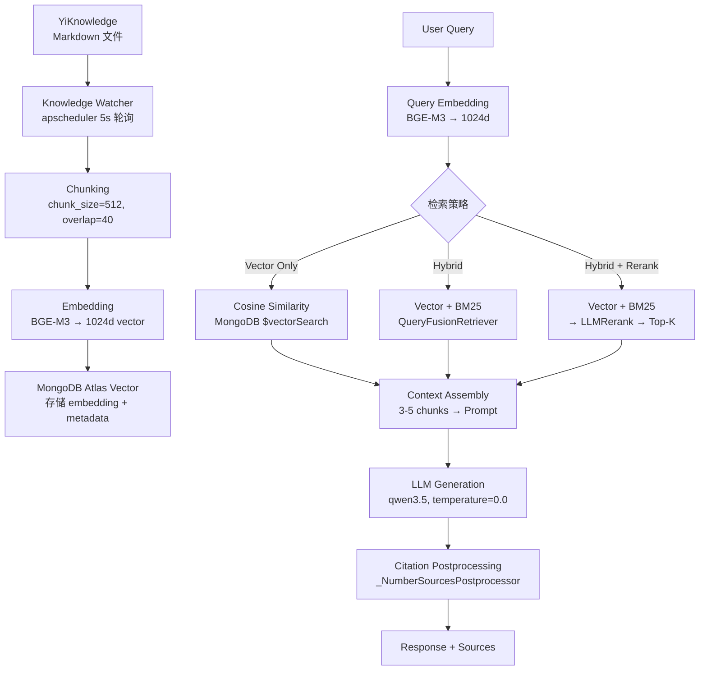

# RAG 设计模式

> **RAG (Retrieval-Augmented Generation，检索增强生成) 将 LLM 回答锚定在外部知识上，从根本上抑制幻觉。** YiAi 的 RAG 模块基于 llama_index，服务 YiVad 知识库问答和 YiPet 上下文检索。**适用场景：** 设计 RAG Pipeline、调试检索质量、选择检索策略、优化分块方案。

## 1. RAG Pipeline 架构



RAG 的核心价值在于**将 LLM 从"记忆型"转变为"检索型"**。与其依赖模型训练时记住的知识（可能过时、可能错误），不如让模型从最新、可验证的知识库中检索相关信息后再生成回答。

## 2. 检索策略

### 2.1 四种策略对比

| 策略 | 原理 | 精度 | 召回 | 延迟 | YiAi 支持 |
|---|---|---|---|---|---|
| **Vector Only** | Embed query → Cosine similarity 匹配 | 中 | 中 | ~15ms | 是（默认） |
| **BM25 Only** | 稀疏关键词匹配（TF-IDF 变体，基于词频和逆文档频率） | 高（精确匹配） | 低（同义词丢失） | ~5ms | 是 |
| **Hybrid（Vector + BM25）** | 两路召回 → QueryFusionRetriever 通过 RRF 融合排序 | 高 | 高 | ~20ms | 是（推荐） |
| **Hybrid + Rerank** | Hybrid 初筛 + LLMRerank 精细重排序 | 最高 | 高 | ~200ms | 是 |

**RRF (Reciprocal Rank Fusion)** 是一种无需调参的融合算法：对每个文档在两路检索中的排名取倒数后求和，排名越靠前的文档得分越高。相比线性加权，RRF 不需要手动设定两路检索的权重。

### 2.2 策略选择指南

```
查询类型判断
├─ 精确匹配（错误码、函数名、文件名、配置项）
│   → BM25 为主，Vector 补充
│   例："ERR_422"、"db_create"、"config.yaml"、"chunk_size"
│   原因：这些精确字符串的 embedding 可能与语义相近但内容不同的文档匹配
│
├─ 语义查询（概念解释、操作指南、原理分析）
│   → Vector 为主，BM25 补充
│   例："如何处理 Agent 工具调用失败？"、"RAG 和长上下文的区别"
│   原因：同义词和改写需要语义理解，关键词匹配覆盖不全
│
├─ 混合查询（既有关键词又有语义意图）
│   → Hybrid（推荐，覆盖绝大多数生产场景）
│   例："RAG 的 chunk_size 配置在哪里？"
│
└─ 高精度问答（答案必须准确无误，如配置参数、法律条款）
    → Hybrid + Rerank
    例："YiAi 的 Agent 超时配置是多少秒？"
    代价：额外 ~200ms LLM 调用延迟
```

### 2.3 YiAi 实现

```python
# YiAi/src/domain/rag/settings.py — 检索器配置
from llama_index.core.retrievers import QueryFusionRetriever
from llama_index.core.postprocessor import LLMRerank

# Hybrid 检索（Vector + BM25）
if hybrid_retrieval_enabled:
    retriever = QueryFusionRetriever(
        retrievers=[vector_retriever, bm25_retriever],
        similarity_top_k=top_k,         # 默认 3，两路各取 top_k 后融合
        num_queries=1,                  # 不对原始 query 做变体扩展
        mode="reciprocal_rerank",       # RRF 融合算法，无需手动设权
    )

# LLM 重排序 — 对候选文档逐条打分
if rerank_enabled:
    postprocessor = LLMRerank(
        choice_batch_size=5,           # 每次批量评估 5 个候选
        top_n=top_k,                   # 重排序后保留 Top-K 送入 LLM 生成
    )
```

## 3. 分块策略

分块（Chunking）是 RAG 系统中**对检索质量影响最大但最容易被忽视的环节**。分块太大，检索结果噪音多，LLM 难以聚焦；分块太小，上下文碎片化，关键信息被截断。

### 3.1 三种策略对比

| 策略 | Chunk 大小 | Overlap | 优点 | 缺点 | 适用场景 |
|---|---|---|---|---|---|
| **Fixed-size** | 512-1024 tokens | 10-20% | 简单可控，延迟可预测 | 可能在句子中间截断，破坏语义 | 通用场景 |
| **Sentence-aware** | 按句子边界动态 | 1-2 句 | 语义完整，不截断句子 | 大小不均（短则 50、长则 2000+ tokens） | 自然语言文档 |
| **Markdown-section** | 按 `##` 章节切分 | 无 | 结构对齐，每块即一个完整章节 | 章节大小不可控（可能超限） | YiKnowledge 结构化文档 |

### 3.2 YiAi 配置

```yaml
# config.yaml — RAG 分块配置
rag:
  chunk_size: 512                    # 每个 chunk 的 token 数（约 350-400 中文字符）
  chunk_overlap: 40                  # 相邻 chunk 重叠 40 tokens（~8%），保持跨 chunk 上下文
  sentence_window_enabled: true      # 句子窗口检索 — 检索时扩大返回范围
```

### 3.3 分块大小选择指南

| Chunk Size | 适合 | 不适合 | 典型场景 |
|---|---|---|---|
| **256-512** | FAQ、代码片段、API 参考文档 | 长篇论述、需要上下文的回答 | 快速定位具体信息 |
| **512-1024**（YiAi 默认） | 通用知识库、技术文档 | 需要完整文档级别的回答 | 知识库问答 |
| **1024-2048** | 论文、技术报告、长文分析 | 精确检索（噪音多，定位不准） | 深度研究 |
| **2048+** | 全文摘要、文档级别问答 | 检索精度显著下降，延迟增加 | 文档理解 |

> **经验法则：** chunk_size 越小，检索越精确但越碎片化；越大，上下文越完整但噪音越多。YiAi 的 512 tokens 是中文技术文档的平衡点——约 350-400 个中文字符，恰好覆盖一个完整的知识点。

## 4. 增强技术

### 4.1 技术对比

| 技术 | 原理 | 提升点 | 代价 | YiAi 状态 |
|---|---|---|---|---|
| **HyDE**（假设文档嵌入） | LLM 先根据用户问题生成"假设答案"，用假设答案的 embedding 做检索 | 召回率 +10-15% | 多一次 LLM 调用（~2s） | 已启用 |
| **Sentence Window** | 检索时以匹配句子为中心，返回其前后各 k 句作为上下文窗口 | 上下文连贯性显著提升 | 无额外 LLM 调用 | 已启用 |
| **LLM Rerank** | 用 LLM 对候选文档逐条评分后重新排序 | 精度 +10-20% | 多一次 LLM 调用（~1s） | 已启用 |
| **Query Rewriting** | LLM 将用户简短查询改写为更详细的检索查询 | 召回率 +5-10% | 多一次 LLM 调用 | 未启用 |
| **Multi-Query** | 从不同角度生成多个查询变体，合并检索结果 | 召回率 +10-20% | 2-3 次额外 LLM 调用 | 未启用 |

### 4.2 HyDE 原理详解


**为什么有效：** 用户查询往往很短（10-20 字），信息密度低，embedding 表示能力有限。假设答案由 LLM 生成，包含丰富的技术细节和专业术语，其 embedding 与知识库中真实文档的语义分布更接近，因此检索精度更高。这本质上是**用 LLM 的生成能力弥补 embedding 模型在短文本上的表示不足**。

### 4.3 Sentence Window 原理

```
原始检索：返回匹配 chunk（512 tokens）
Sentence Window：返回匹配 chunk + 前 1 chunk + 后 1 chunk（~1536 tokens）
                   └── 匹配句子 ──┘

效果：LLM 看到的是包含匹配句子的完整上下文段落，而非被截断的碎片
代价：单次返回的 token 数增加 3 倍，但上下文质量大幅提升
```

## 5. 引用与来源锚定

### 5.1 引用模式对比

| 模式 | 示例 | YiAi 支持 | 适用场景 |
|---|---|---|---|
| **行内编号** | "Agent 超时默认 600s [1]" | 是（`_NumberSourcesPostprocessor`） | 知识库问答 |
| **来源列表** | 答案末尾列出所有引用文件路径 | 是 | 所有 RAG 回答 |
| **逐句标注** | 每个句子标注对应的来源文件 | 否（计划中） | 高精度场景（法律、医疗） |
| **相关度分数** | 显示每个来源与查询的相关度得分 | 否（调试模式可用） | 检索质量调试和评估 |

### 5.2 YiAi 实现

```python
# YiAi/src/domain/rag/chat_engine.py — 引用后处理
from llama_index.core.postprocessor import NumberedAnnotationPostprocessor

# 行内编号引用：自动在回答中插入 [1], [2], [3]
postprocessor = NumberedAnnotationPostprocessor()

# Prompt 层面强制引用行为
"""
## 回答规则
1. 所有回答必须锚定在提供的上下文中，不得使用训练数据
2. 每个事实性陈述末尾标注来源：[来源: 文件名]
3. 如果提供的上下文中不包含答案，明确说明"当前知识库中没有相关信息"
4. 如果多篇文档之间存在矛盾，指出矛盾并分别标注来源
"""
```

## 6. Scope Filtering（检索范围过滤）

YiAi 支持三种粒度的检索范围控制，避免跨域噪音：

| 范围 | 过滤方式 | 使用场景 | 示例 |
|---|---|---|---|
| **Per-File**（单文件） | 精确匹配文件路径 | 用户针对特定文档提问 | "这份 API 文档说了什么？" |
| **Folder-Scoped**（目录级） | `file_path` 前缀正则匹配 | 限定在某个角色或子域内检索 | "所有工程师文档中关于部署的方案" |
| **Full KB**（全库） | 无过滤 | 跨角色全局搜索 | "整个知识库中所有关于 Agent 的内容" |

```python
# YiAi/src/domain/rag/indexer.py — Scope 过滤实现
# 目录级检索：仅检索 engineer/ 下的文档
metadata_filters = {
    "file_path": {"$regex": "^YiKnowledge/engineer/"}
}

# 单文件检索：仅检索指定文件
metadata_filters = {
    "file_path": "YiKnowledge/engineer/build/implement-api.md"
}
```

**最佳实践**：默认使用 Folder-Scoped 检索，因为大多数问题在特定领域内。全库检索仅在用户明确需要跨域搜索时使用，避免检索噪音。

## 7. 检索质量诊断

### 7.1 检索不相关的常见原因

按排查优先级：

1. **Embedding 模型不匹配** — 索引用 BGE-M3，查询用 nomic-embed → 向量空间不一致，检索结果随机。**必须保持索引和查询使用同一模型**
2. **Chunk 大小不当** — 太大（2000+ tokens）导致检索粒度粗，太小（256 tokens）导致上下文碎片化。从 512 开始调，每次调整后重新索引并对比
3. **查询太短** — 10 字的查询信息量有限，embedding 表示能力不足。开启 HyDE 生成假设答案增强查询
4. **同义词/术语不匹配** — 用户说"部署"但文档写"发布"，纯向量检索可能漏掉。开启 Hybrid 检索（BM25 补充关键词匹配）
5. **分块策略与文档结构不匹配** — 结构化文档（代码、配置）用 Sentence-aware 可能切分不当。考虑按 Markdown-section 切分

### 7.2 检索质量评估指标

| 指标 | 定义 | YiAi 目标 |
|---|---|---|
| **Recall@K** | Top-K 结果中包含正确答案的比例 | > 90% @ K=5 |
| **MRR**（Mean Reciprocal Rank） | 第一个正确答案排名的倒数均值 | > 0.8 |
| **上下文利用率** | LLM 回答中实际引用检索结果的比例 | > 80% |
| **幻觉率** | 回答中包含检索结果之外信息的比例 | < 10% |

## 8. 常见问题

### Q: 为什么检索到的文档不相关？

按优先级排查：Embedding 模型一致性 → Chunk 大小 → 查询信息量（是否需开 HyDE）→ 检索策略（是否需 Hybrid）。

### Q: 什么时候用 Hybrid + Rerank 而不是纯 Hybrid？

当检索精度直接影响用户体验时（配置查询、法律条款、医疗建议）。代价是 ~200ms 额外延迟。YiAi 默认 Hybrid，高精度场景按需开启 Rerank。

### Q: 更换 Embedding 模型需要做什么？

完整流程：
1. 记录当前模型的检索基准指标（Recall@5, MRR）
2. 拉取新模型（如 `ollama pull bge-m3`）
3. 修改 `config.yaml` 中 `rag.embed_model`
4. 删除旧向量索引
5. 运行 `python scripts/reindex_knowledge.py` 重新索引全部文档
6. 用 10 个标准查询对比新旧模型指标
7. 确认无回归后切换

### Q: RAG 和长上下文窗口哪个更好？

**不是二选一，而是协同使用。** RAG 适合"大海捞针"——从海量文档中检索最相关的几条信息。长上下文窗口适合"精读一本书"——分析单个完整文档的全部内容。YiAi 的组合策略：RAG 检索 Top-K 片段 → LLM 在上下文中综合推理。

## 9. 反模式

| 反模式 | 为什么失败 | YiAi 的正确做法 |
|---|---|---|
| Chunk 无 Overlap | 上下文在边界处丢失，跨 chunk 的关键信息被截断 | 至少 8-10% overlap（YiAi 默认 40/512 ≈ 8%） |
| 纯 Vector 做精确匹配查询 | "ERR_422" 和 "error code 422" 的 embedding 可能不近 | 错误码、函数名、配置项用 BM25/Hybrid |
| 无 Rerank 做高精度场景 | Hybrid 返回候选但排序可能不够精确，LLM 可能关注到不相关的片段 | 高精度场景开启 LLMRerank |
| Embedding 模型索引和查询不一致 | 不同模型产生不同向量空间的 embedding，余弦相似度无意义 | 索引和查询必须同一模型，在配置中统一管理 |
| 不限制检索返回数量 | 返回 20+ chunks 撑爆上下文窗口，LLM 无法有效处理 | Top-K = 3-5（YiAi 默认 3），按需调整 |
| RAG Context 无来源标注 | 用户无法验证回答真实性，幻觉回答看起来也很可信 | 始终标注 `[来源: file.md]`，强制 Prompt 要求引用 |
| 分块大小一刀切 | FAQ（200 字）和论文（5000 字）需要完全不同的粒度 | 根据文档类型调整 chunk_size，或开启 Sentence Window |
| 仅依赖向量检索 | 关键词匹配场景（错误码、API 名称）纯向量检索效果差 | 始终启用 Hybrid 检索，覆盖语义 + 关键词两种匹配方式 |

---

## 10. YiAi RAG 配置速查

```yaml
# config.yaml — RAG 相关配置
rag:
  embed_model: "bge-m3"            # Embedding 模型（Ollama 本地）
  llm_model: "qwen3.5:4b"          # 生成模型
  temperature: 0.0                  # 确定性推理，保证回答一致性
  num_predict: 512                  # 回复最大 Token 数
  top_k: 3                          # 检索返回 Top-K 文档片段
  chunk_size: 512                   # 文档分块大小（tokens）
  chunk_overlap: 40                 # 分块重叠大小（保持跨块上下文连续）

  # 增强技术
  hybrid_retrieval_enabled: true    # Vector + BM25 混合检索（推荐始终开启）
  rerank_enabled: true              # LLM 重排序（高精度场景）
  hyde_enabled: true                # 假设文档嵌入（短查询增强）
  sentence_window_enabled: true     # 句子窗口检索（上下文连贯性）

  chat_timeout: 180                 # RAG 查询超时 3 分钟
```