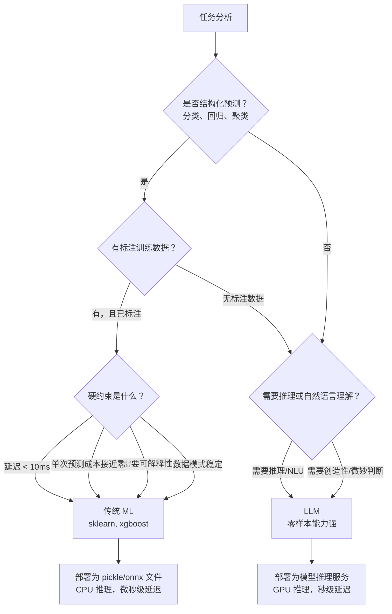

# 传统机器学习模式

> **适用场景：** 当 LLM 是过度设计时——结构化预测、模式匹配或统计分析场景中，更小、更快、更经济的传统 ML 模型往往更合适。**核心原则：用合适的工具解决合适的问题，不要用大炮打蚊子。**

## 1. 传统 ML vs LLM — 决策框架



### 1.1 选择对比表

| 场景 | 选传统 ML | 选 LLM |
|---|---|---|
| **任务性质** | 结构化预测（分类、回归） | 需要推理或自然语言理解 |
| **训练数据** | 有标注训练数据 | 无训练数据，需要零样本能力 |
| **延迟要求** | < 10ms | > 100ms 可接受 |
| **单次预测成本** | 接近零（CPU 推理） | 需要 GPU，按 Token 计费 |
| **可解释性** | 需要（特征权重、决策路径可解释） | 不要求（端到端黑盒可接受） |
| **模式稳定性** | 稳定，不需要频繁重训练 | 模式频繁变化，Prompt 调整比重训练更快 |
| **典型任务** | 文本分类、用户聚类、异常检测、数值预测 | 对话、摘要、翻译、代码生成、开放式问答 |

## 2. 模式一：文本分类

### 2.1 应用场景：YiKnowledge 文件自动标注

基于文件内容自动预测应归属的角色目录（engineer、producter、leader 等），减少人工分类工作量。

```python
from sklearn.feature_extraction.text import TfidfVectorizer
from sklearn.linear_model import LogisticRegression
from sklearn.model_selection import train_test_split
from sklearn.metrics import classification_report

# 1. 准备训练数据：已标注的 YiKnowledge 文件
texts = [...]      # 文件内容列表
labels = [...]     # 角色目录标签：engineer, producter, leader, aier, srer, executiver, curator

# 2. 特征提取：TF-IDF 将文本转为稀疏向量
vectorizer = TfidfVectorizer(
    max_features=5000,       # 保留最重要的 5000 个词
    ngram_range=(1, 2),      # 单字 + 双字组合（中文分词友好）
    min_df=2                 # 至少在 2 个文档中出现才保留
)
X = vectorizer.fit_transform(texts)
y = labels

# 3. 训练多分类模型
X_train, X_test, y_train, y_test = train_test_split(X, y, test_size=0.2, random_state=42)
model = LogisticRegression(multi_class='multinomial', max_iter=1000)
model.fit(X_train, y_train)

# 4. 评估
y_pred = model.predict(X_test)
print(classification_report(y_test, y_pred))

# 5. 预测新文件
new_vec = vectorizer.transform([new_file_content])
predicted_role = model.predict(new_vec)[0]
predicted_proba = model.predict_proba(new_vec)[0]  # 各角色的概率分布
```

### 2.2 适用场景清单

- 文档自动分类（按主题、角色、类型）
- 工单自动路由（按问题类型分配团队）
- 垃圾内容/不当内容检测
- 用户反馈情感分析（正面/负面/中性）
- 代码语言/框架自动识别

## 3. 模式二：聚类

### 3.1 应用场景：发现用户反馈中的共性主题

将大量用户反馈或聊天会话按内容相似度分组，发现高频问题和共性需求。

```python
from sklearn.cluster import KMeans
from sklearn.feature_extraction.text import TfidfVectorizer
import numpy as np

# 1. 文本向量化
vectorizer = TfidfVectorizer(max_features=3000, ngram_range=(1, 2))
X = vectorizer.fit_transform(feedback_texts)

# 2. 肘部法则确定最优聚类数 k
inertias = []
for k in range(2, 15):
    kmeans = KMeans(n_clusters=k, random_state=42, n_init=10)
    kmeans.fit(X)
    inertias.append(kmeans.inertia_)
# 选择 inertia 下降速率明显变缓的点作为最优 k

# 3. 执行聚类
optimal_k = 5  # 根据肘部法则确定
kmeans = KMeans(n_clusters=optimal_k, random_state=42, n_init=10)
clusters = kmeans.fit_predict(X)

# 4. 查看每个簇的关键词（理解主题）
terms = vectorizer.get_feature_names_out()
for i in range(optimal_k):
    centroid = kmeans.cluster_centers_[i]
    top_indices = centroid.argsort()[-10:][::-1]  # 权重最高的 10 个词
    top_terms = [(terms[j], centroid[j]) for j in top_indices]
    print(f"簇 {i}（{sum(clusters == i)} 条反馈）: {top_terms}")

# 5. 为每个簇命名（人工解读）
# 例：簇 0 = "Agent 工具调用失败"，簇 1 = "RAG 检索不准确"，簇 2 = "模型响应慢"
```

### 3.2 适用场景清单

- 用户反馈主题发现与归类
- 用户行为分群（活跃度、功能偏好）
- 日志错误模式聚类（发现高频异常）
- 聊天会话主题归类
- 代码变更模式发现

## 4. 模式三：异常检测

### 4.1 应用场景：API 流量异常检测

监控 YiAi API 的请求模式，自动发现 DDoS 攻击、异常流量突增或服务性能退化。

```python
from sklearn.ensemble import IsolationForest
import numpy as np

# 1. 构建特征矩阵
# 每行表示一个时间窗口（如 1 分钟），特征包括：
# - requests_per_min: 请求数
# - error_rate: 错误率
# - avg_latency_ms: 平均延迟
# - p99_latency_ms: P99 延迟
# - unique_users: 独立用户数
features = np.array([
    [rpm, error_rate, avg_latency, p99_latency, users]
    for timestamp, rpm, error_rate, avg_latency, p99_latency, users in metrics
])

# 2. Isolation Forest: 通过随机划分树来隔离异常点
# contamination: 预期的异常比例（根据历史经验设定）
model = IsolationForest(
    contamination=0.05,       # 预计 5% 的数据点为异常
    random_state=42,
    n_estimators=100          # 树的数量
)
predictions = model.fit_predict(features)
# 返回 1 = 正常，-1 = 异常

# 3. 定位异常时间窗口
anomalies = [
    (i, metrics[i])
    for i, p in enumerate(predictions)
    if p == -1
]

# 4. 分析异常原因
for idx, (ts, rpm, err, lat, p99, users) in anomalies:
    # 判断异常类型
    if rpm > np.mean([m[1] for m in metrics]) * 3:
        print(f"[{ts}] 流量突增异常: RPM={rpm}")
    if err > 0.1:
        print(f"[{ts}] 错误率异常: error_rate={err:.1%}")
    if p99 > 500:
        print(f"[{ts}] 延迟异常: P99={p99}ms")
```

### 4.2 适用场景清单

- API 流量异常检测（DDoS、突发流量）
- 用户异常行为检测（账号盗用、异常操作模式）
- 服务性能退化自动发现
- 日志异常模式识别
- 资源使用异常预警（CPU、内存突增）

## 5. 模式四：回归预测

### 5.1 应用场景：GPU 显存使用预测

根据用户负载特征（并发数、模型大小、上下文长度）预测 GPU 显存占用，辅助容量规划。

```python
from sklearn.ensemble import GradientBoostingRegressor
from sklearn.model_selection import cross_val_score
import numpy as np

# 1. 特征工程
# 特征：active_users, concurrent_requests, model_size_gb, avg_context_len, batch_size
X = np.array([
    [users, reqs, model_size, ctx_len, batch]
    for users, reqs, model_size, ctx_len, batch in historical_data
])
y = np.array([mem_gb for mem_gb in memory_usage_history])  # 目标：GPU 显存占用

# 2. 训练梯度提升回归模型（精度高，自带特征重要性）
model = GradientBoostingRegressor(
    n_estimators=100,
    max_depth=4,
    learning_rate=0.1,
    random_state=42
)
model.fit(X, y)

# 3. 特征重要性分析 — 哪些因素对显存影响最大
importances = model.feature_importances_
feature_names = ["活跃用户", "并发请求", "模型大小(GB)", "上下文长度", "批次大小"]
for name, importance in sorted(zip(feature_names, importances), key=lambda x: -x[1]):
    print(f"{name}: {importance:.1%}")

# 4. 预测
predicted_memory = model.predict([[100, 50, 7, 32768, 1]])[0]
print(f"预测显存占用: {predicted_memory:.1f} GB")
```

### 5.2 适用场景清单

- 资源需求预测（显存、CPU、存储）
- 任务完成时间估算
- 用户增长/流量趋势预测
- 模型推理延迟预估
- 成本预测（API Token 用量）

## 6. YiAi 实际应用矩阵

| ML 模式 | YiAi 应用场景 | 数据来源 | 预期效果 |
|---|---|---|---|
| 分类 | RSS 文章按主题自动标注 | `rss` 集合 | 减少 80% 人工分类工作量 |
| 分类 | Bug 严重等级自动判定 | `bugs` 集合 | 提升分配效率 |
| 聚类 | 聊天会话按主题分组 | `sessions` 集合 | 发现高频问题和用户需求 |
| 聚类 | 知识库文档相似度分析 | `knowledge_files` 集合 | 发现重复/冲突内容 |
| 异常检测 | Ollama 推理延迟异常告警 | 应用日志 | 提前发现模型服务退化 |
| 异常检测 | API 调用模式异常检测 | 请求日志 | 识别恶意流量和异常行为 |
| 回归 | Embedding 生成时间预估 | 文件大小 + chunk 数量 | 为索引任务提供 ETA |
| 回归 | GPU 显存使用预测 | 历史监控数据 | 辅助硬件扩容决策 |

## 7. 训练 vs 推理 — 资源对比

| 阶段 | 传统 ML（sklearn/xgboost） | LLM（Ollama/API） |
|---|---|---|
| **训练** | CPU 上数分钟到数小时 | GPU 集群上数天到数周 |
| **推理** | CPU 上微秒到毫秒 | GPU 上秒级 |
| **重训练** | 数据分布变化时需要 | 通过 Prompt 工程替代重训练 |
| **部署** | pickle/onnx 文件，任意服务器 | 模型推理服务（Ollama/vLLM），需要 GPU |
| **硬件要求** | 普通 CPU 服务器 | GPU 服务器（成本 10-100x） |
| **批次推理** | 天然支持，延迟可预测 | 依赖推理框架的 Continuous Batching |

## 8. 反模式

| 反模式 | 为什么失败 | 正确做法 |
|---|---|---|
| 用 LLM 做分类任务 | 比 sklearn 慢 1000 倍、贵 1000 倍，且结果不可解释 | 用 sklearn 做结构化预测，LLM 留给推理和 NLU 任务 |
| ML 模型不做评估 | 训练集上看起来好，生产环境却失败 | 预留 20% 数据做测试集，监控精确率/召回率/F1 |
| 在偏差数据上训练 | 模型学习并放大偏差，输出具有系统性歧视 | 检查训练数据分布，测试多样化输入 |
| 部署后不监控 | 数据分布漂移导致模型性能静默退化 | 追踪预测分布变化，设置漂移告警阈值 |
| 特征工程不足 | 垃圾进垃圾出，模型无法学到有意义的模式 | 投入时间做特征分析，理解每个特征与目标的物理关系 |
| 忽略类别不平衡 | 少数类被完全忽视，模型偏向多数类 | 使用 class_weight='balanced' 或 SMOTE 过采样 |