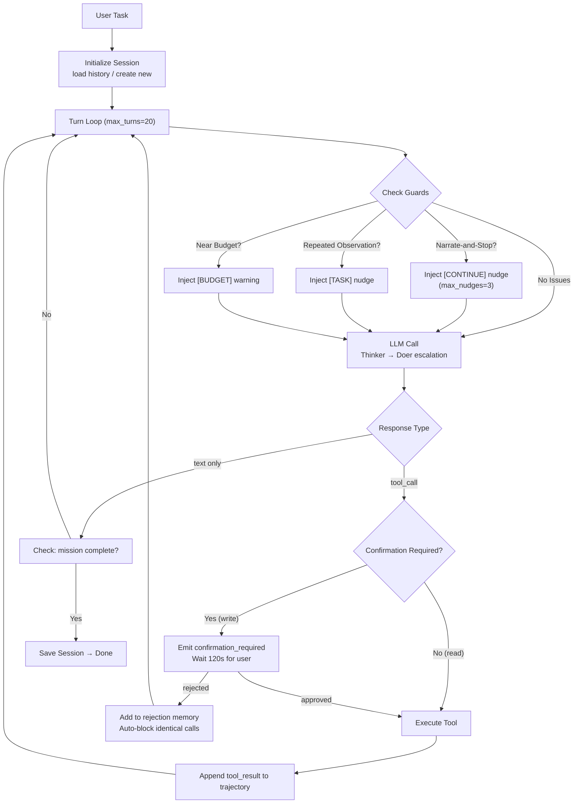
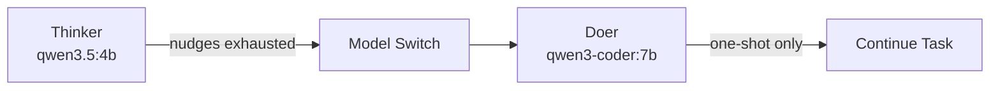
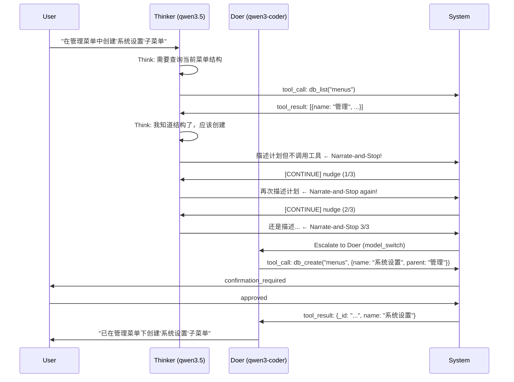

# Agent Architecture Patterns

> **An AI agent is a loop: observe → think → act → observe.** YiAi 的 Agent 循环（`domain/ai/agent.py`）经过多次迭代，融入了 7 种韧性模式。**适用场景：** 设计新的 Agent 行为、调试 Agent 循环卡住、添加新的工具类型。

## 1. Core Loop 架构



### 1.1 关键数据流

| 阶段 | 输入 | 处理 | 输出 |
|---|---|---|---|
| **Observe** | User task + agent_messages 轨迹 | LLM 推理 | text 或 tool_call |
| **Think** | tool_call (name + arguments) | ToolRegistry.validate | validated call 或 error |
| **Act** | validated tool_call | Tool.execute() | ToolResult (content, error, duration) |
| **Observe** | ToolResult | 追加到 agent_messages | 下一轮 LLM 调用的上下文 |

## 2. 七种韧性模式

### 2.1 Narrate-and-Stop Guard

**问题：** 模型描述了工具但不调用（"I will now use db_create to..." 然后就停了）。

**检测：** 检查 response text 是否包含已注册但未执行的工具名称。

**处理：** 注入 `[CONTINUE]` nudge 消息，提示模型实际调用工具。最多 nudge 3 次（`max_nudges`）。

**代码位置：** `domain/ai/agent.py` `_check_narrate_and_stop()`

```python
# 核心逻辑（简化）
nudged_tools = [
    name for name in tool_registry.list_names()
    if name in response_text and name not in called_tools
]
if nudged_tools and nudge_count < max_nudges:
    inject_message("[CONTINUE] You mentioned tools but didn't call them. Call the tool now.")
```

### 2.2 Failure-Based Model Escalation

**问题：** Thinker（qwen3.5）在复杂任务上卡住。

**处理：** Nudge 耗尽后 → 切换到 Doer（qwen3-coder）。发射 `model_switch` 事件。仅升级一次。



**代码位置：** `domain/ai/agent.py` `_try_escalate_model()`

### 2.3 Confirmation Gate

**问题：** 写操作需要用户确认。

**处理：** 发射 `confirmation_required` 事件 → 暂停循环 → 轮询 decision store（120s 超时）。被拒绝的调用加入 rejection memory，自动阻止重试。

**代码位置：** `domain/ai/agent.py` `_wait_for_confirmation()`

```
Tool Call → requires_confirmation?
├─ No → Execute immediately
└─ Yes → Emit confirmation_required
         ├─ approved → Execute
         ├─ rejected → Add to _session_rejections → Skip
         └─ timeout (120s) → Skip with error
```

### 2.4 Turn-Budget Awareness

**问题：** 模型不知道自己的轮次限制，过度规划后被截断。

**处理：** 距离 `max_turns` 3 轮内时，注入 `[BUDGET]` 消息。每轮检查一次。

**代码位置：** `domain/ai/agent.py` `_budget_warning()`

```python
if remaining_turns <= 3 and not budget_warned:
    inject_message(f"[BUDGET] {remaining_turns} turns remaining. Prioritize essential steps.")
    budget_warned = True  # one-shot per run
```

### 2.5 Repeated-Observation Spin Guard

**问题：** 模型重复调用同一个工具，得到相同结果，陷入循环。

**检测：** 连续 3 次相同的 observation（工具名 + 结果）。

**处理：** 注入 `[TASK]` nudge 引导模型换个方法。纯描述轮次（无工具调用）重置计数器。

**代码位置：** `domain/ai/agent.py` `_check_spin_guard()`

### 2.6 Oversized Result Bounding

**问题：** `db_list` 返回 75K tokens，超出上下文窗口。

**处理：** 工具结果按比例截断：head 70% + tail 22% + note（保留开头和结尾，中间丢弃）。UI 和持久化保留完整内容。

**代码位置：** `domain/ai/agent.py` `_bound_tool_result()`

### 2.7 Resume-by-Session

**问题：** `max_turns_reached` 后恢复会话，会重新执行已完成的写操作。

**处理：** 持久化完整的 `agent_messages` 轨迹。恢复时重建轨迹 + 注入 `[RESUME]` 标记。

**代码位置：** `domain/ai/agent.py` `save_session_history()` / `load_session_history()`

## 3. 工具设计模式

| 模式 | 描述 | YiAi 示例 | 优势 |
|---|---|---|---|
| **Generic Tools** | 一个工具处理多个 collection，通过参数区分 | `db_create(collection, data)` 而非 `menu_create(...)` | 避免代码爆炸 |
| **Schema-as-Context** | 工具返回 collection schema，LLM 据此推理 | `db_schema` 返回字段定义 + 验证规则 | LLM 不需要记忆 schema |
| **Read-before-Write** | 读操作不限制；写操作需确认门 | `db_list`（自由）vs `db_create`（需确认） | 安全与效率平衡 |
| **Orphan Guard** | 删除前检查子节点 | `db_delete` 检查 `parent_ref_field` | 防止孤儿数据 |

### 3.1 ToolDefinition 结构

```python
# YiAi/src/domain/ai/tools.py
@dataclass
class ToolDefinition:
    name: str                    # 唯一标识
    description: str             # LLM 可见的描述（决定何时调用）
    parameters: Dict[str, Any]   # JSON Schema
    execute: Callable            # 异步执行函数
    requires_confirmation: bool  # 是否需要用户确认（写/删除操作）
    
@dataclass
class ToolResult:
    call_id: str
    name: str
    content: str                 # LLM 直接消费的结果文本
    error: Optional[str]
    duration_ms: float           # 执行耗时（性能诊断）
    terminate: bool              # 提示 Agent 循环可终止
```

## 4. Thinker/Doer 协作流程



## 5. 常见问题

### Q: 如何决定 max_turns 的值？

YiAi 默认 20。简单任务（单步 CRUD）2-5 轮，复杂任务（多步组合）5-15 轮。设置过低导致任务截断，过高浪费资源。经验：观察生产环境 Average Turns to Completion，设为 P95 × 1.5。

### Q: Narrate-and-Stop 为什么频繁发生？

qwen3.5 的默认行为倾向于"描述"而非"执行"。这是训练数据分布的结果（对话数据多于工具调用数据）。无法完全消除，只能通过 nudge + escalation 缓解。

### Q: 为什么工具结果需要截断？

一次 `db_list` 可能返回 75K tokens。不加截断直接撑爆 32K 上下文窗口，导致后续 LLM 调用失败。Head+Tail 截断保留 92% 的信息密度（开头有最重要内容，结尾有统计摘要）。

### Q: Agent 循环和 RAG 可以并存吗？

可以。YiAi 的 Agent 支持通过工具调用 RAG 检索：Agent 判断需要查阅知识库 → 调用 `knowledge_search` 工具 → RAG 返回结果 → Agent 基于结果继续推理。

## 6. 反模式

| 反模式 | 为什么失败 | YiAi 的正确做法 |
|---|---|---|
| 硬编码领域工具 | `menu_create`, `bug_create`, `story_create` → 代码爆炸 | 泛型工具 + Schema-as-Context |
| 写操作无确认门 | Agent 自主删除/修改数据，不可逆 | 所有写/删除操作标记 `requires_confirmation=True` |
| 无 max_turns 限制 | 坏的工具调用模式可以无限循环 | 默认 20 轮，3 轮前预算警告 |
| 断开连接不中止 Agent | 用户关闭标签页但 Agent 继续执行 120s | 检测 SSE 连接断开 → 中止 Agent |
| 工具描述含糊 | LLM 不知道工具何时用、传什么参数 | 描述包含：做什么、何时用、参数含义、返回值 |
| 不考虑 Token 消耗 | 工具结果 + 对话历史轻松撑爆上下文 | 结果截断 + 上下文 Compaction |

---

## 7. YiAi Agent 配置速查

```yaml
# config.yaml / agent.py 常量
agent:
  thinker_model: "qwen3.5:4b"        # Thinker 模型
  thinker_timeout: 120                # Thinker 超时（秒）
  fallback_model: "qwen3-coder:7b"    # Doer 模型
  doer_timeout: 600                   # Doer 超时（秒）
  max_turns: 20                       # 最大轮次
  max_nudges: 3                       # Thinker 最大 nudge 次数
  confirmation_timeout: 120           # 确认门超时（秒）
  budget_warning_turns: 3             # 提前多少轮发预算警告
  spin_guard_threshold: 3             # 连续相同 observation 触发 spin guard
  result_head_ratio: 0.70             # 结果截断 head 比例
  result_tail_ratio: 0.22             # 结果截断 tail 比例
  session_ttl: 3600                   # 会话历史保留时长（秒）
```