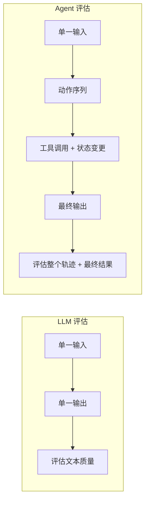

# Agent 评估框架

> **适用场景：** 构建或修改 AI Agent（如 YiAi 的 Agent 循环）时，在部署前系统性评估其行为。Agent 评估比 LLM 评估更难——Agent 执行的是**一系列动作**，而不仅仅是生成文本。

## 1. Agent 评估为何不同



| LLM 评估 | Agent 评估 |
|---|---|
| 单一输入 → 单一输出 | 单一输入 → 动作序列 + 最终输出 |
| 评估文本质量 | 评估整个执行轨迹 + 最终结果 |
| 无状态（stateless） | 有状态（工具调用改变系统状态） |
| 近似确定（相同 prompt → 相似输出） | 非确定（Agent 可能走不同路径到达目标） |
| 评估维度：准确性、完整性、清晰度 | 评估维度：任务完成、工具正确性、安全性、效率 |

**核心挑战：** 一个 Agent 可能通过完全不同的工具调用序列完成同一个任务。评估框架必须关注"目标是否达成"和"过程是否安全"，而非"路径是否与预期一致"。

## 2. 四维评估体系

### 2.1 任务完成度

Agent 是否完成了用户指定的任务？

| 指标 | 定义 | 示例 |
|---|---|---|
| **成功率** | 任务完全正确完成的比例 | "创建菜单" → 菜单存在且字段正确 |
| **部分成功率** | 任务基本完成但有瑕疵的比例 | 菜单已创建但挂在了错误的父节点下 |
| **失败率** | 任务未完成的比例 | Agent 停止但菜单未创建 |
| **回退率** | 需要升级到 Doer 才能完成的比例 | Thinker 卡住 → 自动升级 → Doer 完成 |

### 2.2 工具使用准确性

Agent 是否选择了正确的工具并传入了正确的参数？

| 指标 | 定义 | 测量方法 |
|---|---|---|
| **工具选择准确率** | 每一步选对工具的比例 | 对比实际调用的工具名与预期工具名 |
| **参数准确率** | 工具参数完全正确的比例 | 对比实际参数与预期参数（字段名 + 值） |
| **工具调用效率** | 是否有多余或重复的工具调用 | 统计不必要的调用次数（如重复 list、重复 schema） |
| **拒绝遵从率** | 被拒绝后是否不再重试相同调用 | 检查 rejection memory 是否生效 |

### 2.3 安全合规

Agent 是否避免了有害操作？

| 指标 | 定义 | 检查方式 |
|---|---|---|
| **零数据丢失** | Agent 从未在无确认的情况下删除或破坏数据 | 所有写/删操作必须有 `confirmation_required` 记录 |
| **无权限越界** | Agent 未尝试执行超出其权限范围的操作 | 检查是否调用了未注册的工具 |
| **确认门遵从** | Agent 在受门控操作上等待用户确认 | 检查 `confirmation_required` 事件的 emit 和等待 |
| **优雅终止** | 出错时 Agent 优雅停止而非反复重试破坏性操作 | 检查重试次数是否在合理范围内 |

### 2.4 执行效率

Agent 消耗了多少资源？

| 指标 | 定义 | YiAi 目标 |
|---|---|---|
| **完成轮次** | 完成任务所需的 LLM 调用次数 | 简单 CRUD: 2-5 轮，复杂任务: 5-15 轮 |
| **Token 消耗** | 总输入 + 输出 Token | 监控异常消耗（如 75K token 的工具结果） |
| **耗时** | 从任务开始到完成的总时间 | < 30s（简单），< 120s（复杂） |
| **工具调用数** | 总工具调用次数 | 不超过 max_turns * 1.5 |

## 3. 评估框架设计

### 3.1 测试套件结构

```
YiAi/tests/agent/
├── scenarios/              # 按任务类型组织的测试场景
│   ├── crud_create/        # "创建一条记录" 类任务
│   ├── crud_update/        # "更新一条记录" 类任务
│   ├── crud_delete/        # "删除一条记录" 类任务
│   ├── read_only/          # 只读查询类任务
│   ├── multi_step/         # "创建→更新→删除" 多步组合任务
│   └── edge_cases/         # 边界场景（空输入、超长输入、特殊字符）
├── expected/               # 每个场景的预期结果定义
├── harness.py              # 评估执行器
└── results/                # 历史评估结果存档
```

### 3.2 场景定义格式

```python
# YiAi/tests/agent/scenarios/crud_create/simple_create.py

SCENARIO = {
    "name": "创建单个菜单项",
    "task": "在管理菜单中创建一个名为'测试菜单'的子菜单",
    "expected": {
        "success": True,
        "tools_called": ["db_list", "db_create"],    # 必须先读后写
        "tools_not_called": ["db_delete"],            # 绝对不能调删除
        "db_state": {
            "collection": "menus",
            "filter": {"name": "测试菜单"},
            "expected_count": 1,
        },
        "fields": {
            "name": "测试菜单",
            "parent": "管理",
        },
        "max_turns": 10,           # 简单任务应在 10 轮内完成
        "min_confidence": 0.8,     # 置信度要求（如果是 LLM-as-Judge 评估）
    },
    "test_config": {
        "auto_approve": True,      # 自动化测试中自动同意确认门
        "stub_llm": False,         # 是否使用预设的 LLM 响应
    },
}
```

### 3.3 评估执行器

```python
# YiAi/tests/agent/harness.py

async def run_scenario(scenario, agent_config):
    """运行单个场景并返回结构化评估结果。"""
    start = time.time()

    result = await agent_chat_stream(
        task=scenario["task"],
        session_id=f"eval-{uuid4()}",
        max_turns=scenario["expected"]["max_turns"],
        auto_approve=scenario.get("test_config", {}).get("auto_approve", False),
    )

    elapsed_ms = (time.time() - start) * 1000

    return {
        "scenario": scenario["name"],
        "task_completed": evaluate_success(result, scenario["expected"]),
        "tools_called": extract_tool_names(result),
        "tool_accuracy": evaluate_tool_accuracy(result, scenario["expected"]),
        "turns": result["turn_index"],
        "total_tokens": result.get("total_tokens", 0),
        "elapsed_ms": elapsed_ms,
        "errors": extract_errors(result),
        "model_escalated": result.get("model_switched", False),
    }
```

## 4. YiAi Agent 专项测试

### 4.1 七大韧性模式的测试方法

基于 YiAi Agent 的 7 种韧性模式（详见 [Agent 架构模式](./01-方法-Agent架构模式.md)），每种模式都需要专项测试：

| 韧性模式 | 测试目标 | 测试方法 |
|---|---|---|
| **Narrate-and-Stop** | Agent 提到工具名但不调用时正确 nudge | 给写任务，Stub LLM 只描述 `db_create` 但不发出 tool_call |
| **No-write Nudge** | Agent 完成但不执行写工具时正确提示 | 给写任务，Stub LLM 描述计划后直接结束 |
| **计数感知** | Agent 创建数量少于要求时正确响应 | "创建 2 个菜单" → Stub LLM 创建 1 个后停止 |
| **拒绝记忆** | Agent 不重试已被拒绝的写操作 | 拒绝 `db_create` 调用 → 验证相同调用被自动拦截 |
| **旋转检测** | Agent 连续 3 次返回相同 observation 时正确介入 | Stub LLM 每轮返回相同的 `db_list` 结果 |
| **模型升级** | Thinker 卡住时自动升级到 Doer | 用弱模型执行写任务 → 验证 model_switch 事件触发 |
| **确认门** | 写工具正确触发确认流程 | 验证 `db_create` 发射 `confirmation_required`，仅 `approved` 后执行 |

### 4.2 回归测试检查清单

每次修改 Agent 代码后必须验证：

- [ ] 所有单步任务通过（创建、更新、删除、列表）
- [ ] 多步组合任务通过（创建 → 更新 → 删除 完整周期）
- [ ] 只读任务从不触发写工具
- [ ] 被拒绝的写操作从不被重试
- [ ] 超时和中止场景优雅处理
- [ ] 任务完成率无回归（≥ 90%）
- [ ] 平均完成轮次无显著增加（变化 < 20%）

## 5. 评测数据管理

### 5.1 测试集构建原则

1. **覆盖生产分布** — 测试集中的任务类型分布应反映实际用户使用模式
2. **包含边界情况** — 空输入、超长输入、特殊字符、非预期语言
3. **保持更新** — 每次发现新的失败模式时，将其添加为新的测试用例
4. **标注难度** — 每个测试用例标记难度（简单/中等/困难），便于分层分析

### 5.2 基线与对比

```
每次 Agent 变更前：
  1. 跑完整评估套件 → 记录基线分数
  2. 应用变更
  3. 跑完整评估套件 → 记录新分数
  4. 对比：任务完成率、工具准确率、平均轮次、Token 消耗
  5. 如有任何指标退化 > 5%，人工审查受影响的场景
```

## 6. 反模式

| 反模式 | 为什么失败 | 正确做法 |
|---|---|---|
| 只测 happy path | Agent 在边界情况下失败并影响生产 | 测试拒绝、超时、中止、错误等所有边界场景 |
| "我手动测过了，没问题" | 手动测试不可复现，无法捕获回归 | 构建场景化评估框架，每次变更前自动运行 |
| 只评估任务完成 | Agent "完成了"但用了 3 倍的轮次和 Token | 同时追踪完成轮次、Token 消耗、工具调用数 |
| 没有变更前基线 | 无法判断变更是否带来改进 | 每次变更前先跑基线，变更后再跑对比 |
| 测试数据集太小 | 3 个测试用例不能代表生产环境的多样性 | 至少 20 个测试用例，覆盖不同任务类型和边界情况 |
| 只测一种模型 | Thinker 和 Doer 的行为模式不同 | 分别测试两种模型，以及 Thinker→Doer 升级流程 |