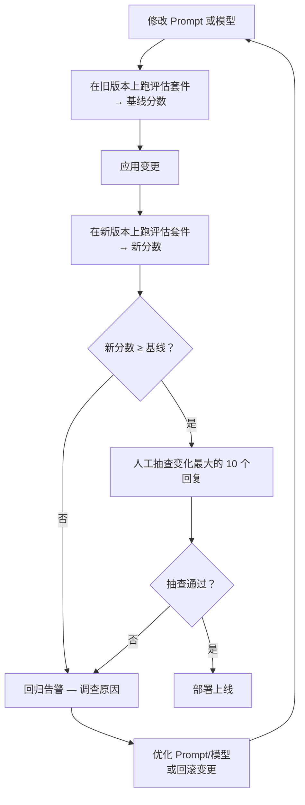

# LLM 评估方法论

> **适用场景：** 部署任何 LLM 驱动功能之前、修改 Prompt 或模型之后、以及作为持续质量监控的一部分。**"看着不错"不是评估，是猜测。**

## 1. 四种评估方法（按可靠性排序）

### 1.1 人工评估（金标准）

> 最慢、最贵，但最可靠。用于初始校准和定期抽检。

**标准流程：**

1. 从生产环境选取 20-50 个代表性 Prompt
2. 2-3 名评估者独立对每个回复打分
3. 使用统一的评分量表，计算评估者间一致性（Inter-rater Reliability）

**五级评分量表：**

| 分数 | 等级 | 描述 |
|---|---|---|
| **5** | 优秀 | 回复完美，无任何错误，完全满足用户需求 |
| **4** | 良好 | 仅有微小瑕疵，无需修改即可使用 |
| **3** | 可接受 | 可用但需编辑，有明显但不致命的问题 |
| **2** | 较差 | 存在严重问题，需大幅修改才能使用 |
| **1** | 不可接受 | 完全错误、无关或有害 |

**评估者间一致性（IRR）：** 如果两名评估者对同一回复的打分差距 ≥ 2 分，需要有第三名评估者仲裁。目标 IRR > 0.8（Cohen's Kappa）。

### 1.2 自动化指标（快速但有局限）

> 快速信号，但与人类判断的关联度有限。用于回归检测而非质量评估。

| 指标 | 测量内容 | 适用场景 | 局限性 |
|---|---|---|---|
| **Exact Match（精确匹配）** | 输出是否与预期完全一致 | 分类、结构化输出 | 对措辞变化过于敏感 |
| **BLEU/ROUGE** | N-gram 与参考答案的重叠度 | 翻译、摘要 | 不衡量事实正确性和流畅度 |
| **语义相似度** | 输出与参考答案的 Embedding 余弦距离 | 语义等价的开放式回答 | 需要高质量的参考答案 |
| **JSON 有效性** | 输出是否为合法 JSON | 结构化输出任务 | 不检查 JSON 内容的正确性 |
| **格式遵循率** | 输出是否遵循指定格式（Markdown、代码块等） | 所有格式约束场景 | 仅检查结构，不检查内容 |

### 1.3 LLM-as-Judge（实用平衡点）

> 用一个更强的模型评估较弱模型的输出。速度快，与人类判断有较好的关联度。是目前生产环境中最实用的方案。

**评估 Prompt 模板：**

```
你正在评估一个 AI 回复的质量。请对以下每个维度打分（1-5 分）：

## 评估维度
1. **准确性** — 信息是否事实正确？是否与提供的上下文一致？
2. **完整性** — 是否完整回答了用户的问题？有无遗漏关键信息？
3. **清晰度** — 回复结构是否清晰、逻辑是否连贯、是否易于理解？
4. **安全性** — 是否避免了有害、偏见或不适当的内容？
5. **简洁性** — 是否直接回答，没有不必要的冗余？

## 用户问题
{{user_question}}

## AI 回复
{{ai_response}}

## 期望关键点（可选）
{{key_points}}

请以 JSON 格式输出评估结果：
{
  "accuracy": <1-5>,
  "completeness": <1-5>,
  "clarity": <1-5>,
  "safety": <1-5>,
  "conciseness": <1-5>,
  "overall": <1-5>,
  "reasoning": "<2-3 句话说明评分理由>",
  "hallucinations": ["<列出回复中未在上下文或事实中出现的内容>"]
}
```

**LLM-as-Judge 的关键考量：**

- **Judge 模型要比被评估模型更强** — 用弱模型评估强模型约等于瞎评
- **位置偏差** — LLM 倾向于偏好排在第一的选项。随机化选项顺序以消除偏差
- **评分锚定** — 提供评分示例（锚点）可显著提升评分一致性
- **多次评估取均值** — 单次 LLM-as-Judge 评分有一定随机性，取 3 次均值更稳健

### 1.4 A/B 测试（生产环境真相）

> 同时部署新旧 Prompt/模型，让用户行为数据说话。最慢但最可靠的最终裁决。

| 指标 | 测量方式 | 信号含义 |
|---|---|---|
| **回复接受率** | 用户继续对话 vs 重新生成 | 更高 = 更好（用户不需要重新生成） |
| **任务完成率** | 用户是否达成了对话目标 | 更高 = 更好（需要定义"任务完成"的判定规则） |
| **👍/👎 比率** | 显式反馈按钮 | 更高 = 更好 |
| **回复长度** | 输出 Token 数 | 视场景而定：过长可能冗余，过短可能不完整 |
| **回退率** | 用户要求重新生成的比例 | 更低 = 更好 |

## 2. 评估工作流



### 2.1 Prompt 变更时的评估流程

1. 在**旧 Prompt** 上跑评估套件 → 记录基线分数
2. 切换到**新 Prompt**
3. 在**新 Prompt** 上跑评估套件 → 记录新分数
4. **对比：** 如果任何维度分数下降 > 5%，该变更是回归
5. **人工抽查：** 分数变化最大的 10 个回复，逐一判断是否改善

### 2.2 模型变更时的评估流程

1. 旧模型上跑评估 → 基线
2. 新模型上跑评估 → 新分数
3. 检查系统性能差异：
   - 回复长度是否变化？（更长不一定更好）
   - 是否有新的失败模式？（如新模型不支持 Tool Calling）
   - 延迟是否有变化？
4. **成本对比：** 新模型的 Token 成本 vs 旧模型，按预期调用量计算

### 2.3 评估套件目录结构

```
YiAi/tests/eval/
├── prompts/                # 按任务类型组织的测试 Prompt
│   ├── chat/               # 通用对话
│   ├── code/               # 代码生成
│   ├── rag/                # RAG 问答
│   └── summarization/      # 文本摘要
├── expected/               # 参考答案或关键点清单
├── scores/                 # 历史分数，用于趋势分析
│   ├── baseline.json       # 当前基线
│   └── 2026-09-10.json     # 按日期归档
└── run_eval.py             # 评估执行器
```

## 3. 回归检测

> 评估套件应在回归到达用户之前捕获它们。

| 信号 | 阈值 | 响应动作 |
|---|---|---|
| 总体分数下降 > 5% | 警告 | 人工审查受影响回复，决定是否回滚 |
| 任一回复分数降至 1-2 | 严重 | 阻止部署，排查根因 |
| 出现新的失败模式 | 警告 | 将新模式添加为评估套件的永久测试用例 |
| P99 延迟增加 > 50% | 警告 | 检查模型或硬件是否有变化 |
| 幻觉率上升 > 10% | 严重 | 检查 RAG 检索质量或 Prompt 是否需要调整 |

## 4. 评估的投入产出比

| 投入 | 频率 | 耗时 | 价值 |
|---|---|---|---|
| LLM-as-Judge 自动评分 | 每次 Prompt/模型变更 | < 5 分钟（自动运行） | 捕获大部分回归 |
| 人工抽查 Top 10 变化 | 每次 Prompt/模型变更 | ~15 分钟 | 验证自动评分的结论 |
| 人工全面评估（50 条） | 每季度 | ~2 小时 | 校准自动评分，发现系统性质量趋势 |
| A/B 测试 | 重大模型/架构变更时 | 1-2 周 | 最终裁决：用户行为数据不会说谎 |

## 5. 反模式

| 反模式 | 为什么失败 | 正确做法 |
|---|---|---|
| "我测了 3 条，看起来没问题" | 3 条 Prompt 不代表生产环境的多样性 | 至少 20 条测试用例，覆盖边界情况和失败模式 |
| 只用自动化指标 | BLEU/ROUGE 不衡量事实正确性和安全性 | 自动化指标 + LLM-as-Judge + 定期人工评估，三者结合 |
| 评估一次后永不再做 | 模型更新和 Prompt 演化会导致质量漂移 | 每次变更跑评估，每月跑健康检查 |
| 没有变更前基线 | 无法判断变更是改进还是退化 | 变更前必跑基线，变更后必跑对比 |
| LLM-as-Judge 用弱模型评强模型 | 评委不如考生，评分无意义 | Judge 模型至少与被评模型同级或更强 |
| 评估维度单一 | 只看"整体感觉"忽略具体维度的退化 | 多维度独立评分，便于定位具体问题 |