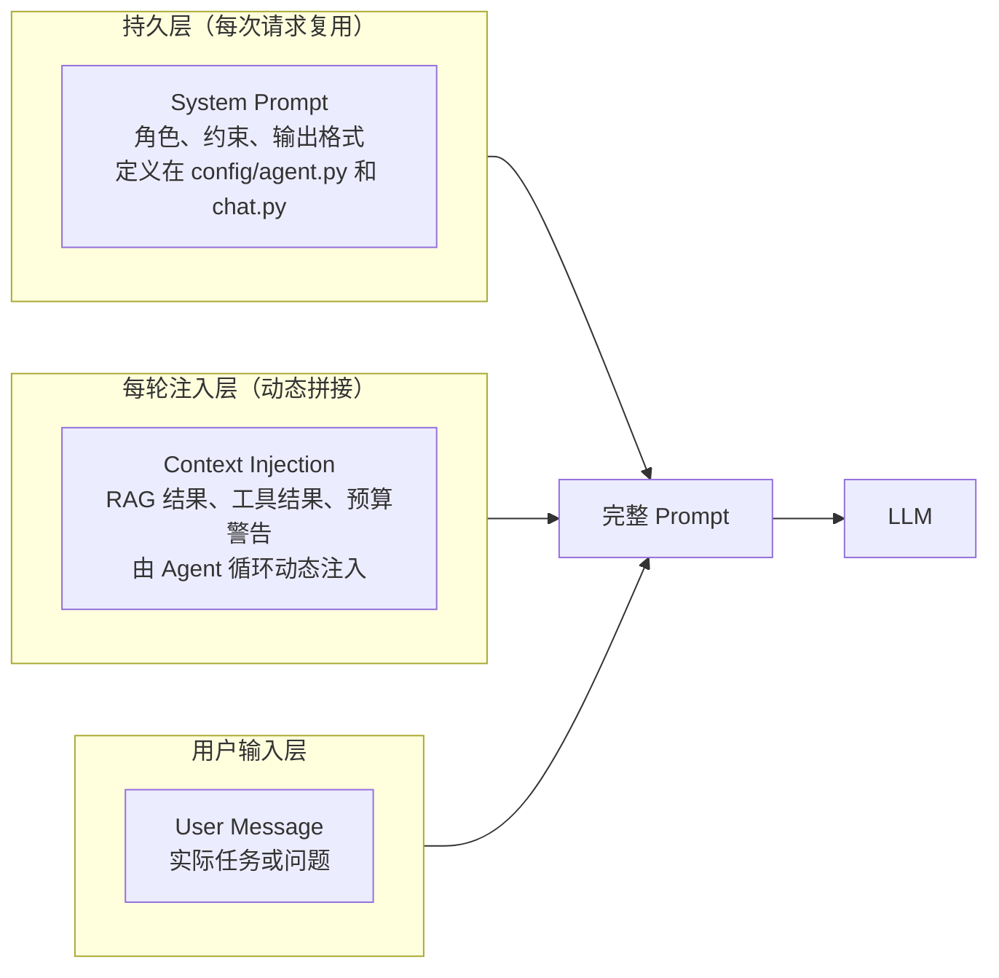
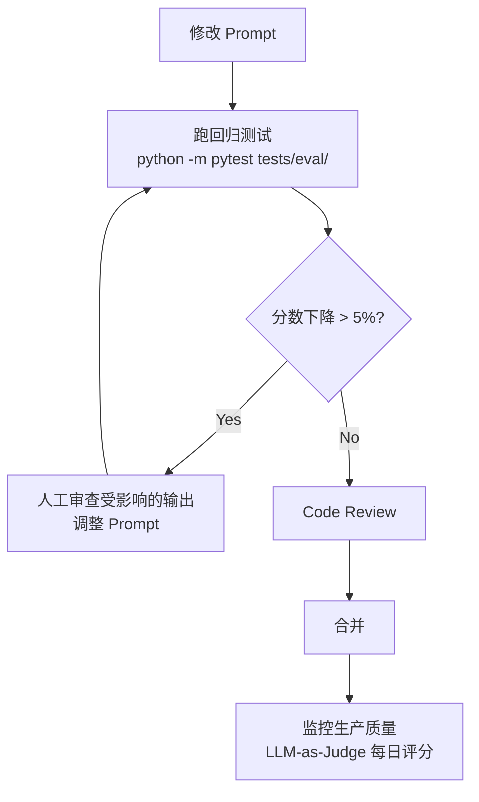

# Prompt Engineering Guide

> **Prompts are code.** 它们存放在版本控制中，遵循相同的 review 周期，变更时跑回归测试。**适用场景：** 设计新的 System Prompt、调试 LLM 输出质量、为 Agent 添加工具定义、优化 Token 消耗。

## 1. Prompt 三层结构

YiAi 中每次 LLM 调用由三层组成，各层职责和生命周期不同：



### 1.1 各层职责

| 层 | 生命周期 | 修改频率 | Token 消耗 | YiAi 位置 |
|---|---|---|---|---|
| **System Prompt** | 会话级（不变） | 低（功能变更时） | 每次请求消耗 | `domain/ai/chat.py` system_prompt，`domain/ai/agent.py` AGENT_SYSTEM_PROMPT |
| **Context Injection** | 每轮变化 | 高（每轮可能不同） | 动态，需精细控制 | `domain/ai/agent.py` `_inject_mission_if_needed()`，RAG `chat_engine.py` |
| **User Message** | 单次 | — | 用户控制 | 前端传入 |

### 1.2 Token 消耗视角

System Prompt 在每次请求中重复消耗输入 Token，是最大的隐性成本之一：

```
单次会话 10 轮对话:
  System Prompt (800 tokens) × 10 轮 = 8,000 tokens
  Context Injection (avg 500 tokens) × 10 轮 = 5,000 tokens  
  User Messages (avg 50 tokens) × 10 轮 = 500 tokens
  ─────────────────────────────────────────────
  总输入 Token ≈ 13,500
  System Prompt 占比 ≈ 60%
```

> **关键洞察：** 精简 System Prompt 是降低 Token 消耗最有效的手段。每减少 100 tokens 的 System Prompt，10 轮对话就节省 1,000 tokens。

## 2. System Prompt 设计模式

### 2.1 核心模式

| 模式 | 示例 | 适用场景 | YiAi 实际使用 |
|---|---|---|---|
| **角色定义** | "You are an AI agent in the YrY monorepo..." | 所有场景 | `agent.py` AGENT_SYSTEM_PROMPT |
| **行为约束** | "Never invent data. If unsure, say so." | Agent, RAG | RAG prompt: "只用提供的上下文回答" |
| **输出格式** | "Respond in JSON: {section, content, sources}" | 结构化输出 | SQL 生成 prompt、翻译 prompt |
| **工具感知** | "You have access to: db_list, db_create..." | Agent | `agent.py` 动态注入 tool_definitions |
| **安全边界** | "Read-only by default. Only use write tools when explicitly asked." | Agent | Agent 安全约束 section |

### 2.2 YiAi Chat System Prompt 解析

YiAi 通用聊天的 System Prompt（`domain/ai/chat.py`）：

```
[角色]
You are a assistant for overseas after-sales...

[能力声明]  
You are an AI assistant with access to knowledge base...

[行为约束]
- Current date: {current_date}
- Never invent data. If unsure, say so.
- Answer in the same language as the user's question.

[工具/能力可用性]
- Knowledge base: {available/unavailable}
- RAG search: {available/unavailable}
```

**设计要点：**
- **角色先行** — 第一句定义身份，模型据此调整语气和知识范围
- **动态能力声明** — 根据 `config.yaml` 开关控制是否告诉模型有 RAG/知识库能力
- **日期注入** — `current_date` 让模型知道"今天"是什么，处理时效性问题
- **语言跟随** — "same language as user" 避免中英文混杂

### 2.3 YiAi Agent System Prompt 解析

Agent 的 System Prompt（`domain/ai/agent.py` AGENT_SYSTEM_PROMPT）更复杂：

```
[角色 + 上下文]
You are an AI agent in the YrY monorepo...

[工具使用规则]  ← 核心
1. Read before you write
2. Write tools require confirmation
3. One tool at a time
4. Verify after writing  
5. Stop when done
6. Handle errors gracefully

[工具定义]  ← 每轮动态替换
{ {tool_definitions} }

[当前任务]
{ {task} }
```

**设计要点：**
- **规则排序有意为之** — "Read before you write" 排第一，因为这是最重要也最容易被模型忽略的规则
- **工具定义动态注入** — 不在 System Prompt 中硬编码，而是根据注册的工具动态生成 JSON Schema
- **任务独立于 System Prompt** — 将 User Task 放在最末尾，遵循"末位优先"（recency bias）原则

## 3. Context Injection 模式

Context Injection 是 Prompt 工程中最容易被忽视但影响最大的部分。YiAi 中有 4 种注入模式：

### 3.1 四种注入模式

| 模式 | 触发时机 | 注入位置 | 示例 | YiAi 代码位置 |
|---|---|---|---|---|
| **RAG 锚定** | 每次 RAG 查询前 | User Message 之前 | "相关文档:\n[chunk 1]\n[chunk 2]" | `domain/rag/chat_engine.py` |
| **工具结果** | 每次工具调用后 | 作为新的 tool message | `[Tool result: db_list]\n[{...}]` | `domain/ai/agent.py` `_execute_tool()` |
| **预算警告** | 距 max_turns 3 轮内 | 作为 system message 注入 | `[BUDGET] 3 turns remaining. Compress non-essential steps.` | `domain/ai/agent.py` `_budget_warning()` |
| **任务重注入** | Compaction 后 | 作为 system message 注入 | "Original task: create 2 menus for sidebar..." | `domain/ai/agent.py` `_inject_mission_if_needed()` |

### 3.2 注入顺序规则

```
完整 Prompt 组装顺序（每次 LLM 调用）:
1. System Prompt（固定）
2. [BUDGET] 警告（条件注入，仅近 max_turns 时）
3. [TASK] 重注入（条件注入，仅 Compaction 后）
4. RAG Context（条件注入，仅 RAG 查询时）
5. 对话历史（agent_messages 轨迹）
6. User Message
```

### 3.3 设计原则

- **注入要有时效性** — Budget 只在最后 3 轮注入，不会每轮都提醒
- **注入要可追溯** — 注入内容以特定标记（`[BUDGET]`、`[TASK]`）包裹，debug 时可以区分
- **注入不覆盖用户输入** — 注入内容放在 User Message 之前，不会修改用户的原始请求

## 4. 工具定义即 Prompt

Tool Calling 场景下，工具的 JSON Schema 定义是 Prompt 的一部分，直接影响 LLM 选择工具的准确性。

### 4.1 Tool Schema 设计原则

```python
# YiAi/src/domain/ai/tools.py — ToolDefinition
@dataclass
class ToolDefinition:
    name: str                    # 唯一标识，如 "db_create"
    description: str             # ← 这是 Prompt！LLM 据此决定是否调用
    parameters: Dict[str, Any]   # JSON Schema ← 这也是 Prompt！LLM 据此构造参数
```

**Tool Description 设计规则：**

| 规则 | 坏示例 | 好示例 |
|---|---|---|
| **说清做什么** | "Creates data" | "Create a new document in a database collection" |
| **说清何时用** | — | "Use this when the user asks to add, insert, or create something" |
| **说清限制** | — | "Requires user confirmation before execution" |
| **说清返回什么** | — | "Returns the created document with its _id" |

### 4.2 参数 Schema 设计

```python
# 好的参数 Schema
"parameters": {
    "type": "object",
    "properties": {
        "collection": {
            "type": "string",
            "description": "The collection to create the document in. One of: menus, sessions, bugs, users."
        },
        "data": {
            "type": "object",
            "description": "The document fields to set. Must include all required fields for this collection."
        }
    },
    "required": ["collection", "data"]
}
```

**关键：** `description` 中枚举可选值（"One of: menus, sessions, bugs, users"）比让 LLM 猜更可靠。这直接降低 `collection` 参数的错误率。

## 5. Prompt 版本管理

### 5.1 管理策略

```
YiAi/
├── src/domain/ai/
│   ├── agent.py          # AGENT_SYSTEM_PROMPT（版本：git blame）
│   ├── chat.py           # chat system_prompt（版本：git blame）
│   └── prompts/          # 独立 Prompt 文件（未来方向）
│       ├── code_review.py
│       └── translation.py
```

**当前状态：** YiAi 的 Prompt 内嵌在 Python 文件中（`agent.py`、`chat.py`），通过 git 追踪变更。

**推荐方向：** 将 Prompt 提取到独立文件，便于：
- 非工程师参与 Prompt 优化（不需要读 Python 代码）
- 运行 Prompt 专用的 diff 和回归测试
- A/B 测试不同 Prompt 版本

### 5.2 变更流程



## 6. 常见问题

### Q: System Prompt 多长合适？

YiAi 的经验值：Chat 场景 200-400 tokens，Agent 场景 400-800 tokens。超过 1000 tokens 的 System Prompt 应该审视是否所有内容都需要"每次请求都重复"。

### Q: 如何判断 Prompt 修改是否有效？

三步验证：
1. **跑回归测试** — 至少 20 个真实 Prompt，对比新旧分数
2. **检查 Token 消耗** — 确认未显著增加输入 Token
3. **人工抽查 Top 10** — 分数变化最大的 10 个输出，逐个判断是否改进

### Q: Temperature=0.0 还需要关注 Prompt 质量吗？

需要。Temperature=0.0 不是 magic fix——它消除的是采样随机性，但不消除模型对 Prompt 的敏感性。糟糕的 Prompt 在 Temperature=0.0 下同样产生糟糕的输出，只是每次一样糟糕而已。

### Q: 工具定义太多会有什么问题？

每个工具定义占用 200-500 tokens 的输入空间。10 个工具 = 2,000-5,000 tokens 仅工具定义。这挤占了对话历史和 Context 的空间。YiAi 的做法：按需注册工具，不用的不注入。

## 7. 反模式

| 反模式 | 为什么失败 | YiAi 的正确做法 |
|---|---|---|
| System Prompt 过大 | 每次请求消耗 Token，挤占上下文窗口 | Chat 200-400 tokens，Agent 400-800 tokens |
| 代码中硬编码 Prompt | 修改需要改 Python 代码，非工程师无法参与 | 提取到独立 Prompt 文件，通过变量替换注入 |
| 无输出格式约束 | LLM 自由发挥，后端解析困难 | 明确指定格式：JSON schema、markdown 结构、字段列表 |
| 工具描述写得含糊 | LLM 无法准确判断何时调用 | 工具描述包含：做什么、何时用、限制、返回什么 |
| 忽略 Token 消耗 | 长 System Prompt × 多轮对话 = 隐性成本 | 监控 prompt_eval_count，精简 System Prompt |
| 不用 RAG 锚定，全部塞 System Prompt | System Prompt 膨胀，信息密度低 | 知识放 RAG 检索，Prompt 只放行为和约束 |
| Prompt 修改后不跑回归 | 看似小的措辞改动可能导致质量大幅下降 | 改 Prompt 前跑基线，改后跑回归，对比分数 |

---

## 8. YiAi Prompt 配置速查

```yaml
# 各场景推荐参数
chat:
  system_prompt_length: 200-400    # tokens
  temperature: 0.7
  max_tokens: 4096

rag:
  system_prompt_length: 300-500    # tokens（含引用格式约束）
  temperature: 0.0                 # 确定性
  num_predict: 512
  context_chunks: 3-5              # 注入的文档块数量

agent:
  system_prompt_length: 400-800    # tokens（含工具使用规则）
  temperature: 0.0-0.1             # 工具选择确定
  max_turns: 20
  nudge_max: 3
  confirmation_timeout: 120        # 秒

code_review:
  system_prompt_length: 200-300    # tokens
  temperature: 0.0-0.2
  max_tokens: 2000
```