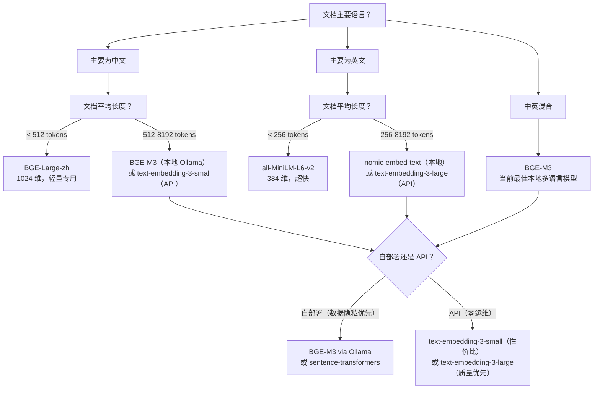

# Embedding 模型选型指南

> **适用场景：** 搭建 RAG、语义搜索或任何将文本转换为向量的功能时。Embedding 模型的选择**直接决定检索质量的上限**——生成模型再强，检索不到正确内容也是徒劳。

## 1. 关键选型维度

| 维度 | 评估要点 | 对系统的影响 |
|---|---|---|
| **语言支持** | 是否支持中文？是否多语言？中英混合文档表现如何？ | 不支持中文的模型在 YiKnowledge 上检索近乎随机 |
| **向量维度** | 384 / 768 / 1024 / 1536 / 3072 | 维度越高表达能力越强，但存储成本线性增长（1024 维 × 100K 条 ≈ 400MB） |
| **最大输入长度** | 单次 Embedding 支持的 Token 上限（256 / 512 / 8192） | 超出上限的文本会被截断，丢失信息 |
| **推理延迟** | 单条文本的 Embedding 耗时 | 影响索引构建速度和查询响应时间 |
| **吞吐量** | 每秒可处理的文档数 | 全量重索引时直接决定等待时间 |
| **部署方式** | Ollama 本地 / sentence-transformers / API 服务 | 影响数据隐私、运维成本和网络延迟 |

## 2. 主流模型对比

| 模型 | 维度 | 最大 Token | 中文支持 | 本地部署 | 最佳场景 |
|---|---|---|---|---|---|
| **BGE-M3** | 1024 | 8192 | 优秀 | Ollama | **中文 RAG 首选** — YiAi 当前方案 |
| **BGE-Large-zh** | 1024 | 512 | 优秀 | 本地 | 中文短文本，512 tokens 以内 |
| **text-embedding-3-small** | 512/1536 | 8191 | 良好 | API only | 高性价比多语言（OpenAI） |
| **text-embedding-3-large** | 256/1024/3072 | 8191 | 良好 | API only | 高质量多语言（OpenAI），支持 Matryoshka 降维 |
| **all-MiniLM-L6-v2** | 384 | 256 | 不支持 | 本地 | 英文轻量级，速度最快 |
| **nomic-embed-text** | 768 | 8192 | 部分支持 | Ollama | 英文长文档 |
| **mxbai-embed-large** | 1024 | 512 | 不支持 | Ollama | 英文高质量 |
| **GTE-Qwen2-7B** | 3584 | 32768 | 优秀 | Ollama | 极致质量，显存占用大（~14GB） |

## 3. 选型决策树



## 4. YiAi 当前方案：BGE-M3

YiAi 通过 `llama_index` + Ollama 使用 BGE-M3 本地 Embedding：

```python
# YiAi/src/domain/rag/settings.py
from llama_index.embeddings.ollama import OllamaEmbedding

embed_model = OllamaEmbedding(
    model_name="bge-m3",
    base_url="http://localhost:11434",
)
```

### 选择 BGE-M3 的 5 个理由

1. **中文优先** — BGE 系列是中文 Embedding 的标杆，在 C-MTEB 中文基准上排名靠前
2. **多语言能力** — 能在中文文档中正确处理英文技术术语（如 API、RAG、Agent）
3. **长上下文** — 8192 Token 上限，无需切分即可处理大部分 YiKnowledge 文件
4. **本地部署** — Ollama 运行，数据零外传，零 API 成本
5. **1024 维平衡点** — 既有足够的表达力捕获语义细节，又不会导致存储成本过高

### BGE-M3 的 Matryoshka 特性

BGE-M3 支持 Matryoshka Representation Learning（套娃表示学习），可以在不重新训练的情况下将 1024 维向量截断为 512 或 256 维，按需在质量和存储之间权衡：

```
1024 维 → 完整质量，推荐生产使用
 512 维 → 存储减半，质量下降约 2-3%
 256 维 → 存储减至 1/4，质量下降约 5-8%，适合大规模检索场景
```

## 5. 性能基准

| 模型 | 索引吞吐量（docs/s） | 查询延迟（P99） | 100K 文档存储占用（1024 维基准） |
|---|---|---|---|
| BGE-M3 | ~50 | ~15ms | ~400 MB |
| all-MiniLM-L6-v2 | ~200 | ~5ms | ~150 MB（384 维） |
| nomic-embed-text | ~40 | ~20ms | ~300 MB（768 维） |
| GTE-Qwen2-7B | ~15 | ~35ms | ~1.4 GB（3584 维） |

## 6. 迁移触发器

| 触发条件 | 推荐操作 |
|---|---|
| 中文检索质量持续不达标（Recall@5 < 80%） | 评估 BGE-M3 的更大变体或 GTE-Qwen2-7B |
| Embedding 延迟超过 50ms（P99） | 切换到更小的模型，或为 Ollama 添加 GPU |
| 向量存储成本过高（> 1GB/100K docs） | 启用 BGE-M3 的 Matryoshka 降维（1024 → 512） |
| 需要更好的多语言检索 | 评估 Cloud API 方案（text-embedding-3-large） |
| 新模型在 C-MTEB 基准上显著超越 BGE-M3 | 用 10 个标准查询对比新旧模型后决定是否切换 |

## 7. 反模式

| 反模式 | 为什么失败 | 正确做法 |
|---|---|---|
| 用纯英文模型处理中文文档 | Embedding 无法捕获中文语义，检索结果近乎随机排列 | 中文文档用 BGE-M3，切换前在真实文档上测试检索质量 |
| 所有文档用相同的分块大小 | FAQ（150 字）和技术报告（5000 字）需要不同的粒度 | 短文档用小分块（256-512），长文档用大分块（512-1024） |
| 不切分直接 Embedding 长文档 | 超出模型最大 Token 限制，内容被截断，关键信息丢失 | 先切分再 Embedding，分块大小不超出模型限制 |
| 从不重新评估 Embedding 模型 | 新模型持续发布，当前模型可能已非最优选择 | 每年评估一次，用检索质量基准对比候选模型和当前模型 |
| 索引和查询使用不同的 Embedding 模型 | 不同模型产生不同向量空间的 embedding，余弦相似度无意义 | 索引和查询必须用同一个模型，在配置中统一管理，添加运行时检查 |
| 仅关注模型榜单排名 | 榜单使用通用数据集，不代表你的特定文档和查询模式 | 用自己的 10-20 个真实查询做检索质量基准测试 |