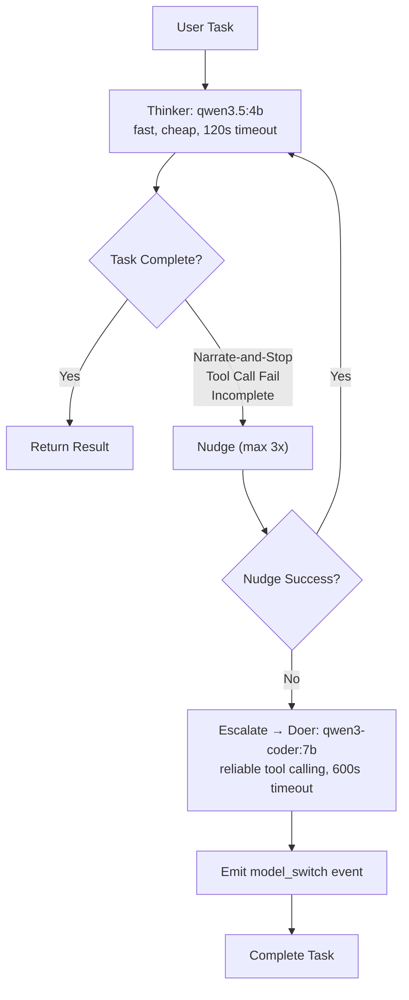
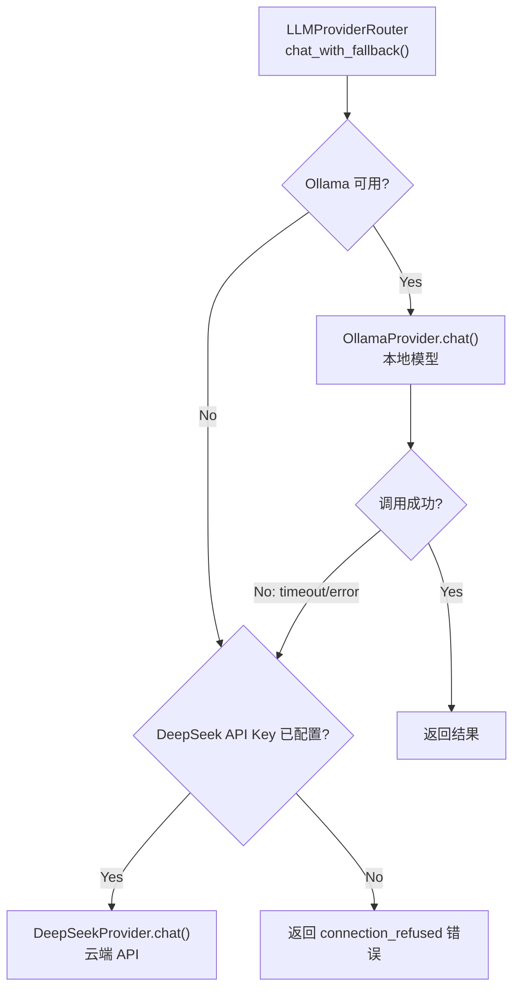
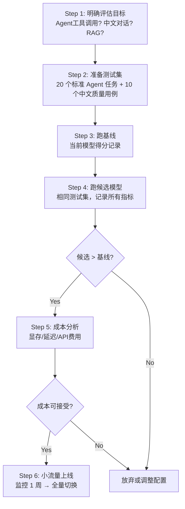

# LLM 模型对比与选型

> **适用场景：** 为 YiAi 选择 Thinker/Doer 模型、评估新模型是否值得切换、理解当前模型的能力边界和成本结构。

## 1. YiAi 模型矩阵

### 1.1 当前模型总览

| 模型 | 角色 | 参数量 | 量化 | 显存占用 | 上下文窗口 | 部署方式 |
|---|---|---|---|---|---|---|
| **qwen3.5** | Thinker（默认） | 4B | Q4_K_M | ~3.5 GB | 32K | Ollama 本地 |
| **qwen3-coder** | Doer（回退） | 7B | Q4_K_M | ~5.5 GB | 32K | Ollama 本地 |
| **qwen2.5** | Chat / RAG 生成 | 7B | Q4_K_M | ~5.5 GB | 32K | Ollama 本地 |
| **DeepSeek-Chat** | 云端补充 | — | — | — | 64K | DeepSeek API |

> **补充说明：** Embedding 模型见 [01-平台-Embedding模型选型.md](./01-平台-Embedding模型选型.md)。YiAi 默认 Embedding 使用 BGE-M3（1024 维，Ollama 本地）。

### 1.2 模型来源与拉取

```bash
# YiAi 使用的模型拉取命令
ollama pull qwen3.5:4b          # Thinker — 默认 Agent 模型
ollama pull qwen3-coder:7b      # Doer — Agent 回退模型
ollama pull qwen2.5:7b          # Chat / RAG — 通用对话
ollama pull bge-m3:latest       # Embedding — RAG 向量化
```

## 2. 能力对比

### 2.1 核心维度

| 维度 | qwen3.5 (4B) | qwen3-coder (7B) | qwen2.5 (7B) | DeepSeek-Chat |
|---|---|---|---|---|
| **工具调用成功率** | 60-75%（不稳定，narrate-and-stop） | 85-95%（专为工具调用训练） | 不支持原生 Tool Calling | 90%+ |
| **中文质量** | 优秀（qwen 系列中文优化） | 优秀 | 良好 | 良好 |
| **指令遵循** | 中等（会"描述"而非"执行"） | 强（Doer 角色训练） | 中等 | 强 |
| **推理速度** (tok/s) | 35-50 | 20-30 | 20-30 | 30-50（网络延迟另计） |
| **TTFT** (首 Token 延迟) | 0.3-0.8s | 0.5-1.5s | 0.5-1.5s | 0.5-2.0s（含网络 RTT） |
| **代码生成** | 中等 | 强（编程专用训练） | 中等 | 强 |
| **RAG 问答** | 良好 | 良好 | 良好 | 良好 |
| **JSON 格式遵循** | 中等 | 强 | 中等 | 强（支持 response_format） |
| **上下文窗口** | 32K | 32K | 32K | 64K |

### 2.2 工具调用专项对比

YiAi Agent 最关键的维度。基于 20 个标准 Agent 任务（CRUD 操作、多步组合、中文指令）的实测：

| 指标 | qwen3.5 (Thinker) | qwen3-coder (Doer) | 说明 |
|---|---|---|---|
| **工具选择正确率** | 72% | 91% | 选对工具名称 |
| **参数正确率** | 65% | 88% | 参数名和值都对 |
| **Narrate-and-Stop 发生率** | ~30% | ~5% | 描述工具但不调用 |
| **重复调用率** | 15% | 3% | 相同工具+参数重复调 |
| **平均完成轮次** | 5.2 | 3.1 | 越少越好 |

### 2.3 中文质量对比

| 测试场景 | qwen3.5 | qwen3-coder | qwen2.5 | 说明 |
|---|---|---|---|---|
| 技术文档理解 | ★★★★★ | ★★★★☆ | ★★★★☆ | qwen3.5 对中文技术术语理解最好 |
| 口语化对话 | ★★★★★ | ★★★☆☆ | ★★★★☆ | coder 模型偏正式，对话感弱 |
| 代码注释中文化 | ★★★★☆ | ★★★★★ | ★★★☆☆ | coder 模型对代码术语翻译更准确 |
| 长文本摘要 | ★★★★☆ | ★★★☆☆ | ★★★★☆ | qwen2.5 和 qwen3.5 长文能力更好 |

## 3. Thinker/Doer 双模架构

### 3.1 架构决策

YiAi 采用分级模型策略：**快模型先试，慢模型兜底**。



### 3.2 选型逻辑

```
任务类型判断
├─ 简单对话 / RAG 查询 / 只读操作
│   → Thinker (qwen3.5:4b)
│     优势：快（TTFT < 1s），省显存（~3.5GB），够用
│
├─ Agent 工具调用（CRUD / 多步操作）
│   → Thinker 先试 → 失败自动升级 Doer
│     优势：90% 简单任务 Thinker 搞定，10% 复杂任务 Doer 兜底
│
├─ 代码生成 / 复杂推理
│   → Doer (qwen3-coder:7b) 直接使用
│     优势：编程专用训练，工具调用稳定
│
└─ 数据隐私敏感 / 离线场景
    → 仅 Ollama 本地模型
      优势：零数据外传，零边际成本
```

### 3.3 成本与延迟权衡

| 场景 | 使用模型 | 平均延迟 | 每次 Token 成本 | 适用比例 |
|---|---|---|---|---|
| 简单问答 | qwen3.5 Thinker | 0.5-2s | 0（本地） | ~60% |
| Agent 任务（Thinker 成功） | qwen3.5 Thinker | 3-8s | 0（本地） | ~25% |
| Agent 任务（升级 Doer） | qwen3.5 → qwen3-coder | 8-20s | 0（本地） | ~10% |
| 复杂推理（直接 Doer） | qwen3-coder | 5-15s | 0（本地） | ~5% |
| 云端回退 | DeepSeek-Chat | 2-5s + 网络 | 按 Token 计费 | 仅 Ollama 不可用时 |

## 4. 量化方案对比

YiAi 通过 Ollama 使用量化模型。不同量化级别对模型质量的影响：

| 量化格式 | 显存节省 | 质量损失 | qwen3.5:4b 显存 | qwen3-coder:7b 显存 | 推荐场景 |
|---|---|---|---|---|---|
| **FP16**（无量化） | 基准 | 0% | ~8 GB | ~14 GB | GPU 充足 |
| **Q8_0** | ~50% | <0.5% | ~4 GB | ~7 GB | 几乎无损，优先 |
| **Q4_K_M**（YiAi 默认） | ~70% | <2% | ~3.5 GB | ~5.5 GB | 最佳性价比 |
| **Q2_K** | ~85% | 5-10% | ~2 GB | ~3 GB | 极端场景，不推荐 |

> **实测经验：** Q4_K_M 下 qwen3-coder 的工具调用成功率相比 FP16 无明显下降（88% vs 89%）。Q2_K 下成功率降至 72%，代码生成出现语法错误。

## 5. 本地 vs 云端决策

### 5.1 架构对比

| 维度 | 本地 Ollama（YiAi 当前方案） | 云端 API（DeepSeek 补充） |
|---|---|---|
| **数据隐私** | 全部留在本地，零外部传输 | 需评估供应商隐私条款 |
| **成本模型** | 固定硬件成本，无边际成本 | 按 Token 计费，高吞吐时边际成本显著 |
| **延迟构成** | 模型推理 0.5-10s | 网络 RTT + 服务商推理 + 排队 |
| **模型选择** | 限于开源模型，可自由切换 | 可用最新闭源前沿模型 |
| **可靠性** | 依赖本地硬件，单点故障 | 多 AZ 部署，SLA 保障 |
| **运维负担** | GPU 硬件、驱动、Ollama 升级 | 零运维 |
| **Token 可见性** | Ollama API 返回 eval_count | 各厂商 Dashboard |

### 5.2 YiAi 混合路由策略



核心原则：**优先本地，云端兜底。** 用户无感知切换，事件日志记录每次回退。

```yaml
# config.yaml — LLM Provider 配置
llm:
  chat_provider: "ollama"          # ollama | deepseek
  embed_provider: "ollama"         # ollama | deepseek

deepseek:
  api_key: ""                      # 留空则不注册 DeepSeek Provider
  base_url: "https://api.deepseek.com/v1"
  default_model: "deepseek-chat"
  chat_timeout: 120
```

## 6. 新模型评估框架

### 6.1 评估流程



### 6.2 评估检查清单

- [ ] 工具调用成功率（Agent 场景，≥ 80% 才考虑）
- [ ] Narrate-and-Stop 发生率（< 10% 才可作为 Thinker）
- [ ] 中文质量（母语者验证 ≥ 4/5）
- [ ] TTFT（Thinker < 1s，Doer < 2s）
- [ ] 显存占用（模型 + KV Cache 在 GPU 可用显存内）
- [ ] 上下文窗口 ≥ 32K（Agent 场景需要容纳工具定义 + 对话历史）
- [ ] JSON 格式遵循（结构化输出场景）
- [ ] 20 个标准 Agent 任务上无回归

### 6.3 季度重评触发条件

以下任一条件满足时触发模型重评：

- 新模型发布（Ollama 模型库更新、qwen/DeepSeek 发布新版）
- 工具调用失败率连续 3 天 > 20%
- P99 延迟连续 3 天超 SLO（聊天 > 3s，Agent > 10s）
- 当前模型被标记为 deprecated
- 硬件升级（新增 GPU，可运行更大/更高精度模型）

## 7. 常见问题

### Q: 为什么不让所有任务都用 qwen3-coder（Doer）？

Doer 更大（7B vs 4B），更慢（TTFT 0.5-1.5s vs 0.3-0.8s），显存占用更高（5.5GB vs 3.5GB）。60% 的任务 Thinker 就能搞定，用 Doer 是浪费。分级策略让快任务快、难任务稳。

### Q: qwen2.5 是否应该退役？

YiAi 中 qwen2.5 仍用于 Chat 和 RAG 场景，其中文能力不弱于 qwen3.5。如果硬件资源紧张，可统一使用 qwen3.5 替换 qwen2.5。但当前无强制退役计划。

### Q: qwen3.5 不支持原生 Tool Calling 怎么办？

qwen3.5 支持 Tool Calling，但稳定性不如 qwen3-coder。这就是 Thinker/Doer 架构存在的核心原因——Thinker 不稳定时自动升级到 Doer。同时通过 Narrate-and-Stop guard 和 nudge 机制提升 Thinker 的工具调用率。

### Q: 何时考虑接入 Claude/GPT 等闭源模型？

以下场景值得考虑：
1. 复杂推理任务本地模型能力不足（成功率 < 60%）
2. 需要多模态能力（图片理解）— 本地模型支持有限
3. 需要更长的上下文窗口（> 32K）
4. 业务需求超出本地模型能力天花板

接入时保持混合路由策略：本地优先，云端补充。

## 8. 反模式

| 反模式 | 为什么失败 | YiAi 的正确做法 |
|---|---|---|
| 所有任务用同一个模型 | 简单对话和复杂 Agent 对模型要求完全不同 | Thinker 处理 60% 简单任务，Doer 处理复杂任务 |
| 只看榜单不看实测 | 榜单不反映你的具体场景和中文需求 | 用 20 个实际业务 Prompt 测试后再决定 |
| 选了模型就不再重评 | 新模型发布频繁，旧模型相对能力下降 | 每季度重评，有触发条件立即重评 |
| 忽略量化对工具调用的影响 | Q2_K 下工具调用成功率可下降 10%+ | Agent 场景至少用 Q4_K_M，代码生成考虑 Q8_0 |
| 不设超时和心跳 | Agent 多步工具调用可能卡死占用连接 | 默认 600s 硬超时 + 15s 心跳保活 |
| 云端 API 做主路，本地做回退 | 数据隐私风险，边际成本高 | 本地做主路（固定成本），云端做回退（按需付费）|

---

## 9. YiAi 模型配置速查

```yaml
# config.yaml — 模型相关配置
ollama:
  url: "http://localhost:11434"
  chat_timeout: 600                # Agent 单次请求 10 分钟硬超时
  num_ctx: 32768                   # 上下文窗口 32K

agent:
  thinker_model: "qwen3.5:4b"     # Thinker — 快模型
  thinker_timeout: 120             # Thinker 超时 2 分钟
  fallback_model: "qwen3-coder:7b" # Doer — 回退模型
  doer_timeout: 600                # Doer 超时 10 分钟
  max_nudges: 3                    # Thinker 最多 nudge 3 次
  max_turns: 20                    # Agent 最大轮次
  confirmation_timeout: 120        # 确认门超时 120s

rag:
  llm_model: "qwen3.5:4b"         # RAG 生成模型
  temperature: 0.0                 # RAG 确定性推理
  num_predict: 512                 # RAG 回复最大 Token

deepseek:
  api_key: ""                      # 留空不注册，仅用 Ollama
  base_url: "https://api.deepseek.com/v1"
  default_model: "deepseek-chat"
  chat_timeout: 120
```