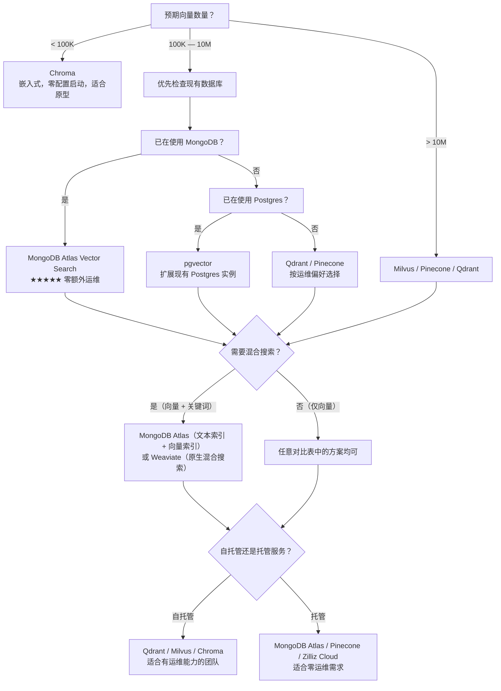

# 向量数据库选型指南

> **适用场景：** 搭建 RAG Pipeline 时，或评估当前向量存储是否仍然是最佳选择。**核心原则：在需要专用方案之前，优先使用已有的基础设施。引入新技术栈的运维成本往往被低估。**

## 1. 关键选型维度

| 维度 | 评估要点 |
|---|---|
| **规模** | 预期存储多少向量？（1K / 1M / 100M+ ）不同量级需要不同的架构设计 |
| **查询延迟** | 目标 P99 延迟是多少？一般 RAG 场景 < 50ms 可接受，实时搜索需要 < 10ms |
| **召回率** | Recall@10 和 Recall@100 是多少？影响检索质量，与索引类型直接相关 |
| **元数据过滤** | 能否在向量搜索前后进行元数据过滤？（如按 `tags`、`status`、`category` 过滤） |
| **混合搜索** | 是否支持向量 + 关键词（BM25）混合搜索？对 RAG 质量至关重要 |
| **索引类型** | HNSW / IVF / DiskANN — 不同的索引类型影响延迟与召回率的权衡 |
| **运维成本** | 自托管 vs 托管服务；维护负担、升级复杂度、监控集成 |
| **生态适配** | 是否与现有技术栈集成？是否已有团队经验？ |

## 2. 主流向量数据库对比

| 数据库 | 类型 | 最佳场景 | 规模上限 | 托管服务 | YiAi 适配度 |
|---|---|---|---|---|---|
| **MongoDB Atlas Vector** | 文档数据库 + 向量 | 已使用 MongoDB 的项目 | 10M+ 向量 | Atlas（托管） | ★★★★★ 当前方案 |
| **Chroma** | 嵌入式向量数据库 | 原型开发、小规模 | 100K 向量 | 无 | ★★★☆☆ 仅原型 |
| **Qdrant** | 专用向量数据库 | 高性能搜索 | 1B+ 向量 | Qdrant Cloud | ★★★★☆ MongoDB 超规模后 |
| **Milvus** | 分布式向量数据库 | 大规模生产 | 10B+ 向量 | Zilliz Cloud | ★★☆☆☆ 当前规模过度设计 |
| **Pinecone** | 托管向量数据库 | 零运维、快速启动 | 1B+ 向量 | 仅托管 | ★★★☆☆ 如需全托管 |
| **pgvector** | PostgreSQL 扩展 | 已使用 Postgres 的项目 | 10M 向量 | 通过 Postgres 托管 | ★★★☆☆ 如使用 Postgres |
| **Weaviate** | 向量数据库 + GraphQL | 开箱即用的混合搜索 | 1B+ 向量 | Weaviate Cloud | ★★★☆☆ 混合搜索优秀 |
| **Elasticsearch** | 搜索引擎 + 向量 | 已有 ES 且需要全文搜索 + 向量搜索 | 10M+ 向量 | Elastic Cloud | ★★★☆☆ 日志 + 搜索 + 向量一体 |

## 3. 选型决策树



## 4. YiAi 当前方案：MongoDB Atlas Vector Search

YiAi 使用 **MongoDB Atlas Vector Search** — 这是正确的选择，原因有四：

1. **全数据单一数据库** — 无需维护独立的向量存储。文档、会话、向量全在同一 MongoDB 实例中
2. **已在使用 MongoDB** — YiVad、YiAi、YiPet 的所有业务数据都在 MongoDB，引入新数据库增加运维负担
3. **原生混合搜索** — `$vectorSearch` + `$search`（文本索引）可组合实现向量 + BM25 混合检索
4. **元数据过滤** — 支持在向量搜索前按 `tags`、`category`、`roles` 等字段预过滤，缩小搜索空间

### 向量索引配置

```javascript
// YiAi — MongoDB Atlas Vector Search 索引定义
{
  "mappings": {
    "dynamic": true,
    "fields": {
      "embedding": {
        "type": "knnVector",
        "dimensions": 1024,          // 与 BGE-M3 的维度匹配
        "similarity": "cosine"       // 余弦相似度（最常用的向量距离度量）
      }
    }
  }
}
```

### 混合检索查询模式

```python
# YiAi 的混合检索：向量搜索 + 元数据过滤
pipeline = [
    {
        "$vectorSearch": {
            "index": "vector_index",
            "path": "embedding",
            "queryVector": query_embedding,
            "numCandidates": 100,     # 初筛候选数，通常为 limit 的 5-10 倍
            "limit": 10               # 返回 Top-K
        }
    },
    {
        "$match": {                   # 元数据过滤（后过滤）
            "tags": {"$in": context_tags},
            "status": "stable"        # 仅检索状态为 stable 的内容
        }
    },
    {
        "$project": {                 # 不返回向量，减少网络传输
            "embedding": 0
        }
    }
]
```

### 为什么不用专用向量数据库？

**当前规模不构成切换的理由。** YiAi 的向量数量在 10K-100K 级别，MongoDB Atlas Vector Search 在这个量级下延迟 < 20ms（P99），完全满足 RAG 场景。引入专用向量数据库（Qdrant、Milvus）在当前规模下是**过早优化**——增加的运维复杂度超过获得的性能提升。

## 5. 索引类型对比

| 索引类型 | 原理 | 延迟 | 召回率 | 内存占用 | 适用场景 |
|---|---|---|---|---|---|
| **HNSW**（分层可导航小世界图） | 构建多层图结构，搜索时从顶层向下逐渐逼近最近邻 | 最低 | 最高（> 99%） | 高（需全量加载） | 低延迟、高召回场景（YiAi 当前） |
| **IVF**（倒排文件索引） | 用 K-Means 聚类将向量空间分割，搜索仅扫描相关聚类 | 中等 | 中等（90-95%） | 中等 | 大规模、可接受少量召回损失 |
| **DiskANN**（磁盘索引） | 将索引存储在 SSD 上，仅缓存热数据在内存 | 高 | 高（> 98%） | 最低 | 超大规模、成本敏感型场景 |

## 6. 迁移触发器

何时从 MongoDB Atlas Vector 迁移到专用向量数据库：

| 触发条件 | 推荐方向 |
|---|---|
| 向量数超过 10M 且 P99 延迟 > 200ms | 评估 Qdrant（Rust 实现，延迟优化）或 Milvus（分布式扩展） |
| 需要亚 10ms 级查询延迟 | Qdrant（纯向量搜索延迟最低） |
| 需要基于磁盘的索引以控制成本 | Milvus + DiskANN（SSD 存储索引，内存仅缓存热数据） |
| MongoDB Atlas 的向量搜索成本显著超过专用方案 | 做 TCO 对比（含运维人力成本）后决定 |
| 需要联邦搜索能力（跨多个独立的向量集合） | Milvus / Weaviate 的分布式架构更合适 |

## 7. 反模式

| 反模式 | 为什么失败 | 正确做法 |
|---|---|---|
| MongoDB 完全够用时引入专用向量数据库 | 增加运维复杂度而没有对应的性能收益 | 先用现有数据库，直到实际遇到瓶颈才考虑迁移 |
| 仅根据基准测试选型 | 基准测试使用理想条件；你的数据和查询模式完全不同 | 用自己的真实数据和查询模式做 PoC 测试 |
| 忽略元数据过滤的性能 | 仅靠向量搜索返回大量不相关结果；过滤是关键 | 在选型阶段就测试向量搜索 + 元数据过滤的组合延迟 |
| 没有迁移预案 | 后期切换向量数据库很痛苦（需要重索引所有 Embedding） | 在架构设计阶段就记录迁移触发条件和流程 |
| 忽略混合搜索的架构支持 | 很多向量数据库提供"向量 + 关键词"搜索，但实现质量和性能差异很大 | 选型时重点测试混合搜索模式——这是 RAG 的生产环境常态 |
| 不考虑 Embedding 模型的维度变化 | 切换 Embedding 模型后维度可能不同（384 → 1024），需重建索引 | 选择支持动态维度的数据库，或预留维度变更的重建流程 |