# Create Diagrams with Mermaid — From Beginner to Expert

> **As an** engineer, **I want to** create professional diagrams using Mermaid's text-based syntax, **so that** I can version-control diagrams alongside code, render them in any Markdown environment, and integrate them into automated documentation pipelines.

> Mermaid turns Markdown-like text into 7 types of diagrams — version-controllable, diffable, and CI/CD-friendly.

## Summary

- **Mermaid turns text into diagrams** — 7 diagram types: flowchart, sequence, state, class, ER, gantt, and pie. No drag-and-drop GUI needed.
- **Text-based = version-controllable** — diagrams live in `.mmd` files or Markdown code blocks. `git diff` works on them. PRs can review diagram changes. CI/CD can auto-render.
- **5 core types cover 90% of needs**: flowchart (process/workflow), sequence (API/interaction), state (lifecycle/FSM), class (object model), ER (database schema). Gantt (timeline) and pie (distribution) complete the toolkit.
- **15 built-in themes** via beautiful-mermaid CLI + full custom color control. Pick `tokyo-night` for dark docs, `github-light` for light docs.
- **Rendering options**: GitHub/GitLab render Mermaid natively in Markdown; beautiful-mermaid CLI produces SVG/PNG; Mermaid Live Editor for prototyping.
- **This guide includes 20+ copy-pasteable demo diagrams** across 5 domains: software architecture, DevOps, AI/ML, product, and database.

## Core viewpoints

- **Mermaid's killer feature is not the syntax — it's that diagrams become code** — A `.mmd` file can be committed to git, reviewed in a PR, diffed against previous versions, and auto-rendered in CI/CD. This eliminates "diagram rot" where Visio/Draw.io files sit in a shared drive, never updated. The diagram lives with the code it describes.

- **Choose the right diagram type for the question** — Flowcharts answer "what happens next?"; sequence diagrams answer "who talks to whom and when?"; state diagrams answer "what states can this be in?"; class diagrams answer "how are objects related?"; ER diagrams answer "how is data structured?"; Gantt charts answer "what's the timeline?"; pie charts answer "what's the distribution?" A flowchart of API calls is a sequence diagram in disguise.

- **Start simple, add complexity only when the diagram demands it** — 5 nodes with clear labels communicates more than a 50-node monstrosity. Use subgraphs to group complexity; split diagrams exceeding ~30 nodes.

- **Theme matters for readability** — Dark-mode readers see a white diagram as blinding; light-mode readers see a dark diagram as murky. Always pick a theme matching your docs' color scheme.

- **Good labels > pretty layout** — Mermaid auto-layouts nodes. You can't micromanage positioning, but you CAN make diagrams readable with descriptive labels, consistent direction, and logical grouping. Invest in the text, not the pixels.

## Key information

### 0. Quick reference cheat sheet

**Node shapes (flowchart):**

| Shape | Syntax | When |
|---|---|---|
| Rectangle | `A[Process]` | Action / step |
| Stadium | `A([Start])` | Entry / exit |
| Diamond | `A{Decision?}` | Branch / condition |
| Cylinder | `A[(Database)]` | Persistent store |
| Hexagon | `A{{External API}}` | Third-party / boundary |
| Circle | `A((Junction))` | Connector |

**Arrows (flowchart):** `-->` normal · `-.->` dotted/optional · `==>` thick/emphasis · `--text-->` labeled

**Message arrows (sequence):** `->>` sync call · `-->>` async/response · `-x` error · `-)` fire-and-forget

**Relationships (class):** `--|>` inheritance · `..|>` interface · `--*` composition · `--o` aggregation · `-->` association

**Cardinality (ER):** `||--||` 1:1 · `||--o{` 1:N · `}o--o{` M:N · `||--|{` 1:1+

**Direction:** `flowchart LR` (left-right) · `TB` (top-bottom, default) · `RL` · `BT`

---

### 1. Getting started

#### 1.1 Your first diagram

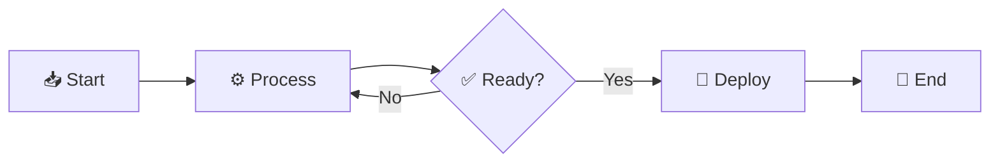

Every Mermaid diagram has three parts: **type declaration** (`flowchart LR`), **nodes** (`A[Start]`), and **edges** (`A --> B`).

#### 1.2 Three ways to render

| Method | Best for | Platform |
|---|---|---|
| ` ```mermaid ` code block | Docs, README, wikis | GitHub / GitLab / Notion |
| [Mermaid Live Editor](https://mermaid.live/) | Quick prototyping | Browser |
| beautiful-mermaid CLI | Batch render, CI/CD | `python render_mermaid.py --input diag.mmd --output diag.svg` |

#### 1.3 CLI quick-start

```bash
# Single diagram → SVG
python .claude/skills/mermaid/render_mermaid.py \
  --input my-diagram.mmd --output my-diagram.svg --theme tokyo-night

# Batch render directory
python .claude/skills/mermaid/batch_render.py \
  --input-dir ./diagrams --output-dir ./output --format svg --theme github-light
```

---

### 2. Seven diagram types — with real-world demos

#### 2.1 Flowchart — Process & Workflow

**When:** mapping processes, decision trees, system architecture, onboarding flows.

**Direction:** `LR` (wide screens), `TB` (tall), `RL`, `BT`

**All node shapes:**

| Shape | Syntax | Use |
|---|---|---|
| Rectangle | `A[Text]` | Process step |
| Stadium | `A([Text])` | Start / End |
| Diamond | `A{Text}` | Decision / branch |
| Cylinder | `A[(Text)]` | Database |
| Hexagon | `A{{Text}}` | External system |
| Subroutine | `A[[Text]]` | Sub-process |
| Circle | `A((Text))` | Junction |
| Parallelogram | `A[/Text/]` | I/O |
| Trapezoid | `A[\Text\]` | Manual step |

**All connections:** `-->` normal · `---` undirected · `-.->` dotted · `==>` thick · `--label-->` labeled

**Demo 1: CI/CD pipeline (DevOps)**

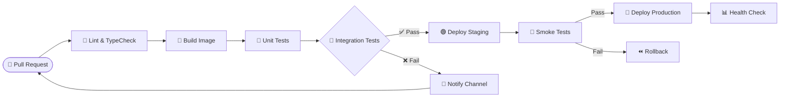

**Demo 2: User registration flow (Product)**

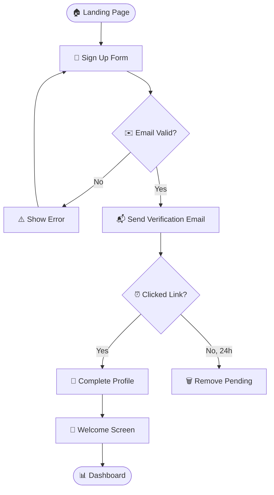

**Demo 3: Incident response flow (SRE)**

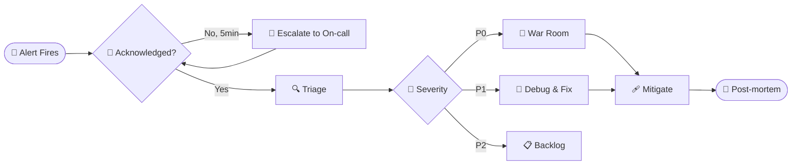

---

#### 2.2 Sequence Diagram — API & Service Interactions

**When:** service-to-service communication, API flows, auth handshakes, message queues.

**Message arrows:**

| Arrow | Meaning |
|---|---|
| `->>` | Sync call (request) |
| `-->>` | Async / response |
| `-x` | Error (sync) |
| `--x` | Error (async) |
| `-)` | Fire-and-forget |
| `--)` | Fire-and-forget (async) |

**Activations:** `+` activates lifeline box; `-` deactivates it. Makes latency visible.

**Control flow:** `alt`/`else` (branch), `opt` (optional), `loop` (repeat), `par`/`and` (parallel)

**Demo 4: OAuth 2.0 Authorization Code flow**

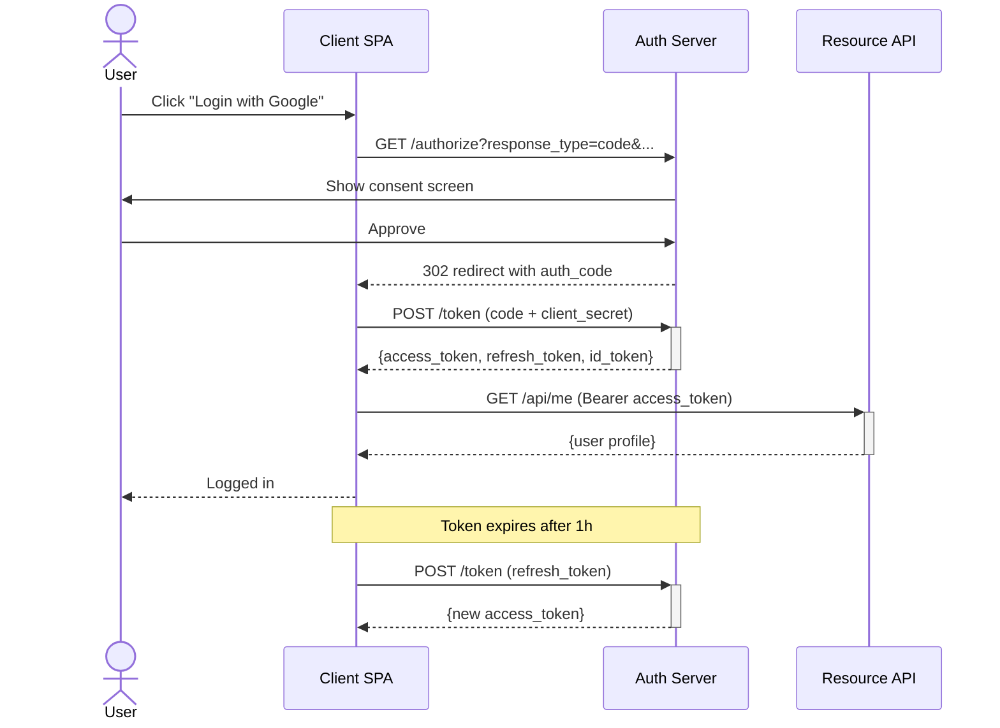

**Demo 5: RAG query flow (AI)**

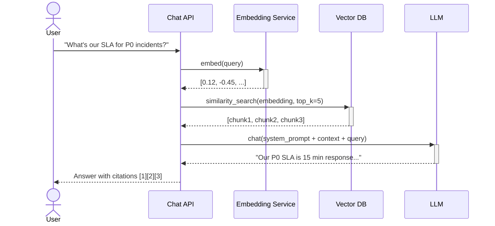

**Demo 6: WebSocket real-time sync**

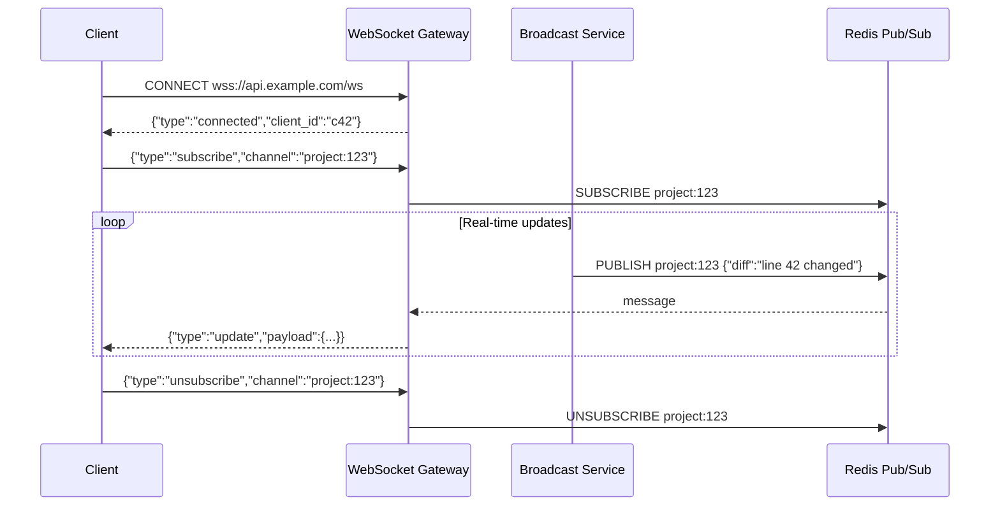

---

#### 2.3 State Diagram — Lifecycle & FSM

**When:** order lifecycles, user sessions, deployment states, workflow status machines.

**Demo 7: Kubernetes Pod lifecycle**

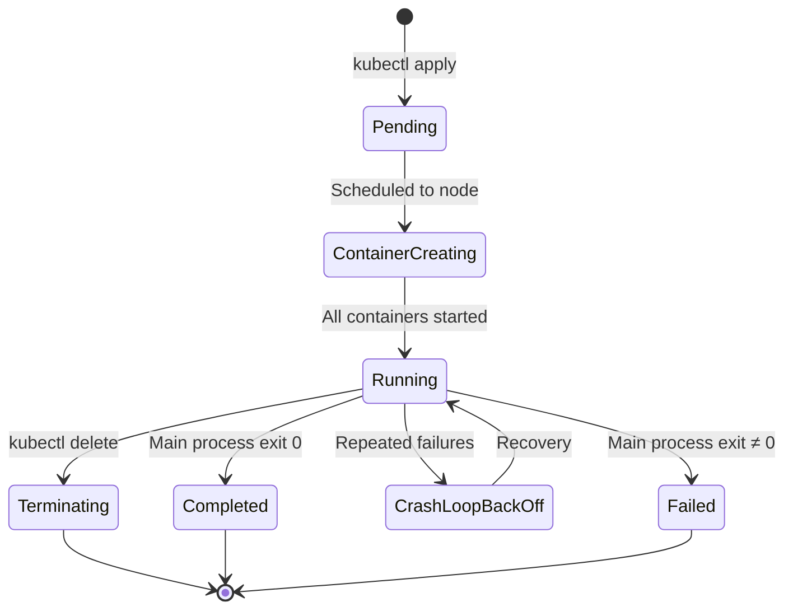

**Demo 8: User subscription lifecycle**

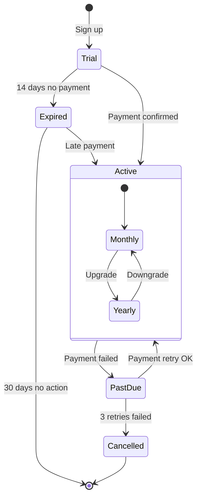

**Demo 9: Deployment rollout state machine**

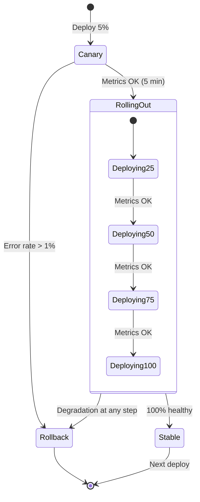

---

#### 2.4 Class Diagram — Object Model & OOP Design

**When:** designing object models, class hierarchies, API data structures.

**Visibility:** `+` Public · `-` Private · `#` Protected · `~` Package

**Relationships:** `A --|> B` inheritance · `A ..|> B` interface realization · `A --* B` composition · `A --o B` aggregation · `A --> B` association · `A ..> B` dependency

**Demo 10: E-commerce domain model**

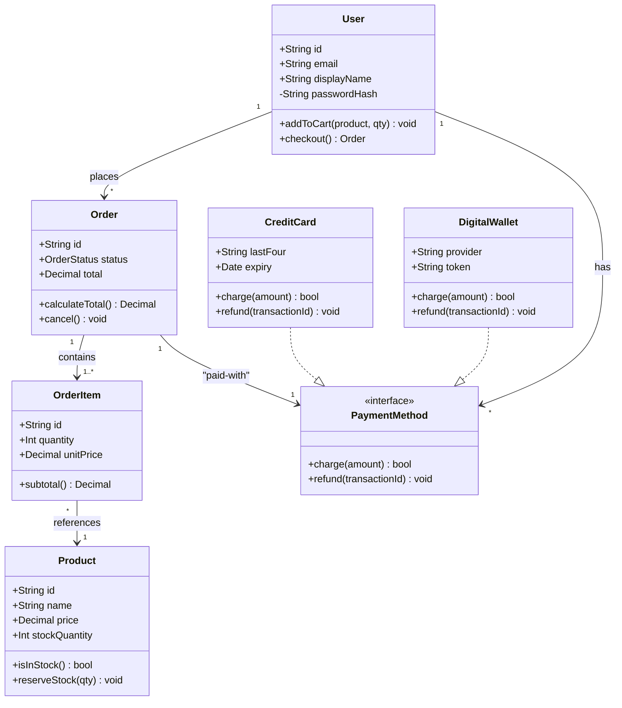

---

#### 2.5 ER Diagram — Database Schema

**When:** designing schemas, documenting table relationships, planning data models.

**Cardinality:** `||--||` 1:1 · `||--o{` 1:N · `}o--o{` M:N · `||--|{` 1:1+ · `}|--|{` 1+:1+

**Demo 11: Full e-commerce schema**

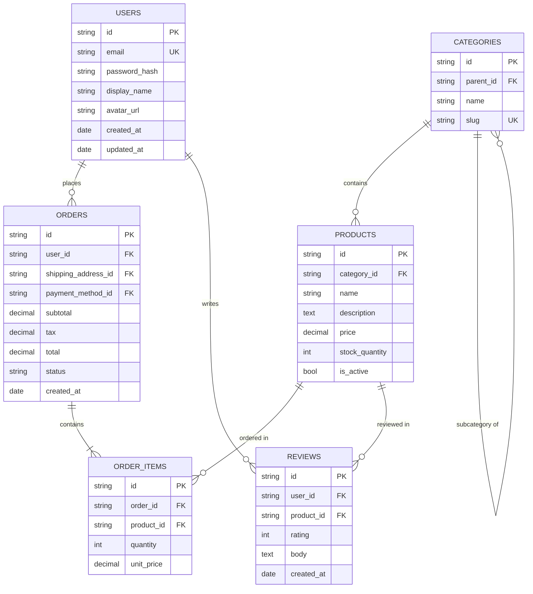

---

#### 2.6 Gantt Chart — Timeline & Project Planning

**When:** project roadmaps, release schedules, sprint planning, migration timelines.

**Demo 12: 3-month feature rollout**

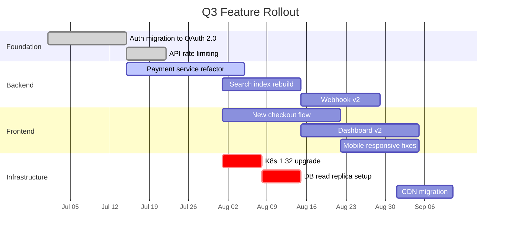

**Demo 13: Incident response timeline (SRE)**

```mermaid
gantt
    title P0 Incident: Payment Gateway Down
    dateFormat HH:mm
    axisFormat %H:%M

    section Detection
    Alert fires (latency > 5s)     :crit, done, a1, 14:30, 1min
    On-call acknowledges           :done, a2, 14:31, 1min

    section Diagnosis
    Check payment gateway metrics  :done, d1, 14:32, 3min
    Identify DB connection pool exhaustion :done, d2, 14:35, 5min
    Root cause: slow query on orders table :done, d3, 14:40, 2min

    section Mitigation
    Kill slow queries              :crit, done, m1, 14:42, 1min
    Increase connection pool       :crit, done, m2, 14:43, 2min
    Verify recovery                :done, m3, after m2, 3min
    Service restored               :milestone, 14:48, 0min

    section Follow-up
    Add index on orders.created_at :f1, 15:00, 30min
    Post-mortem draft              :f2, 15:30, 60min
```

---

#### 2.7 Pie Chart — Distribution & Composition

**When:** resource allocation, error distribution, traffic breakdown, cost composition.

**Demo 14: Cloud cost breakdown**

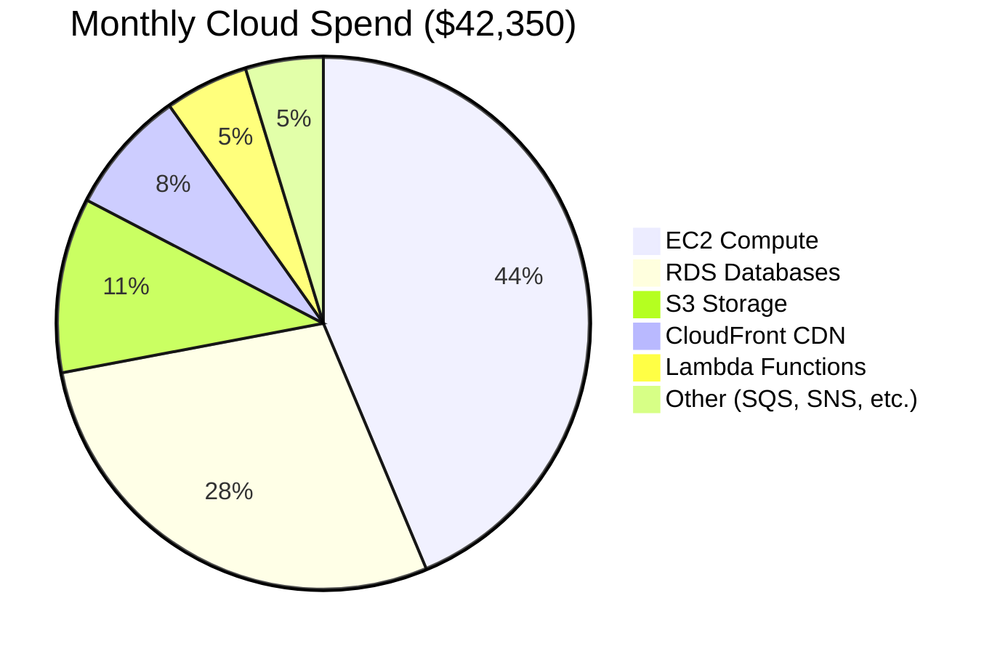

**Demo 15: Error distribution by type**

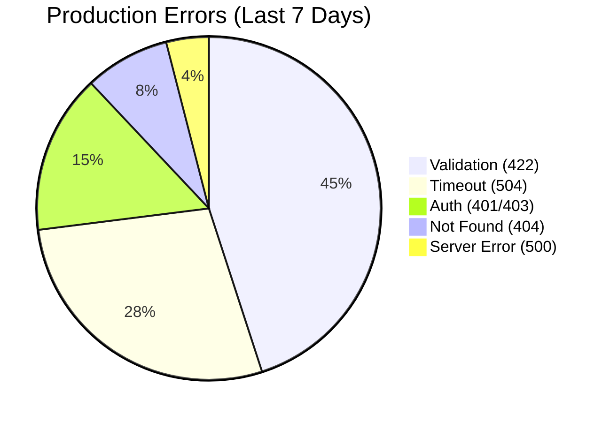

---

### 3. Advanced techniques (进阶)

#### 3.1 Subgraphs — Group related nodes

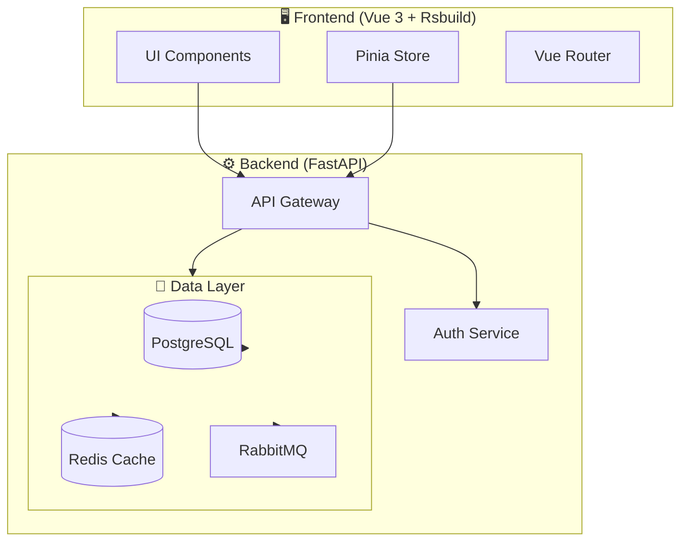

**Subgraph tips:**
- Use `subgraph ID["Human-Readable Label"]` for clear titles
- Add `direction LR` inside subgraphs with multiple nodes to keep them compact
- One level of nesting is almost always enough

#### 3.2 Styling — CSS-like node decoration

**Inline styles:**
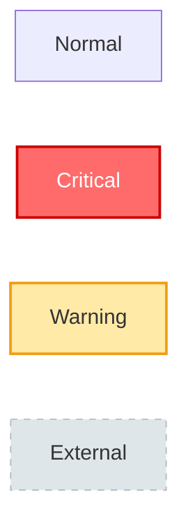

**Class-based (apply to many):**
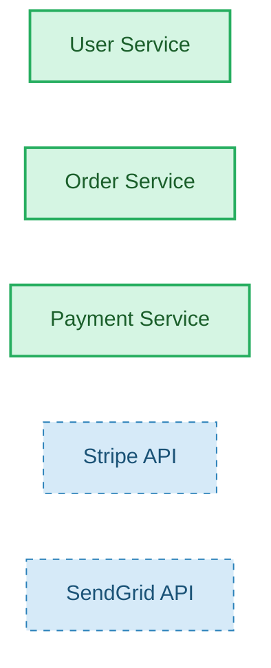

**Style properties:** `fill` · `stroke` · `stroke-width` · `color` (text) · `stroke-dasharray` (dotted: `5`, dashed: `10,5`)

#### 3.3 Mermaid in CI/CD pipelines

```yaml
# .github/workflows/docs.yml
- name: Render Mermaid diagrams
  run: |
    python .claude/skills/mermaid/batch_render.py \
      --input-dir ./docs/diagrams \
      --output-dir ./docs/assets/diagrams \
      --format svg \
      --theme github-light
```

For **VitePress**: `npm install vitepress-plugin-mermaid` → add `withMermaid()` to config.
For **Docusaurus**: built-in `@docusaurus/theme-mermaid` plugin.
For **GitHub/GitLab**: native rendering — just write ` ```mermaid ` blocks.

---

### 4. Demo gallery — 6 real-world scenarios

#### 4.1 Microservices architecture (Flowchart)

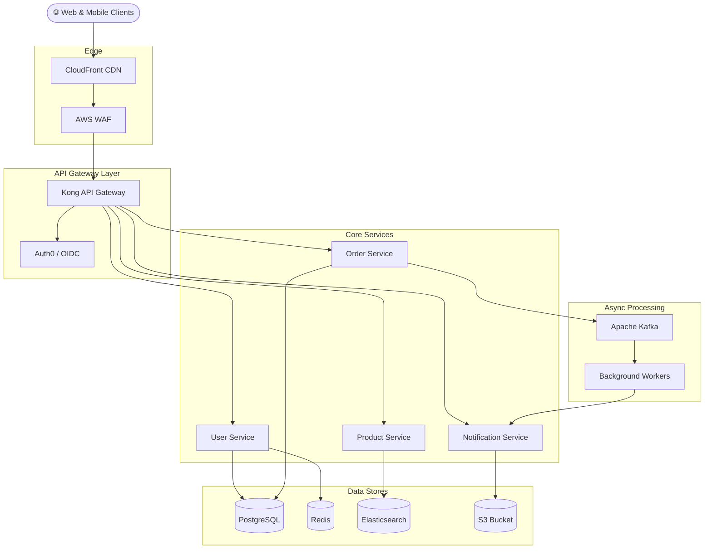

#### 4.2 ML model training pipeline (Flowchart)

```mermaid
flowchart LR
    Raw[🗂️ Raw Data Lake] --> Validate[✅ Data Validation]
    Validate --> Feature[🔧 Feature Engineering]
    Feature --> Split{✂️ Train/Val/Test Split}
    Split --> Train[🏋️ Train Model]
    Train --> Eval[📊 Evaluate]
    Eval --> Check{🎯 Metrics OK?}
    Check -->|Yes| Register[📦 Register Model]
    Check -->|No| Tune[🔧 Hyperparameter Tune]
    Tune --> Train
    Register --> Deploy[🚀 Deploy to Staging]
    Deploy --> Shadow[👻 Shadow Traffic Test]
    Shadow --> ProdCheck{✅ Prod-ready?}
    ProdCheck -->|Yes| Live[🟢 Promote to Production]
    ProdCheck -->|No| Rollback[⏪ Rollback]
```

#### 4.3 JWT authentication flow (Sequence)

```mermaid
sequenceDiagram
    actor U as User
    participant SPA as SPA Client
    participant BFF as BFF / API Gateway
    participant Auth as Auth Service
    participant DB as User DB
    participant Redis as Token Cache

    U->>SPA: Enter email + password
    SPA->>+BFF: POST /auth/login {email, password}
    BFF->>+Auth: authenticate(credentials)
    Auth->>+DB: SELECT user WHERE email = ?
    DB-->>-Auth: {id, hash, salt}
    Auth->>Auth: bcrypt.verify(password, hash)
    Auth->>+Redis: SET token → user_id (TTL 1h)
    Redis-->>-Auth: OK
    Auth-->>-BFF: {access_token, refresh_token}
    BFF-->>-SPA: Set-Cookie + JSON response
    SPA-->>U: Redirect to dashboard

    Note over SPA,BFF: ── Subsequent requests ──

    SPA->>+BFF: GET /api/orders (Cookie: token)
    BFF->>+Redis: GET token
    Redis-->>-BFF: user_id
    BFF-->>-SPA: 200 {orders: [...]}
```

#### 4.4 Git branching strategy (Flowchart)

```mermaid
flowchart TB
    subgraph Timeline["⏳ Timeline (top to bottom)"]
        direction TB

        subgraph Main["main branch"]
            M1[🏷️ v1.0.0] --> M2[🏷️ v2.0.0]
            M2 --> M3[🏷️ v3.0.0]
        end

        subgraph Feature["feature/payment-v2"]
            F1[🔀 branch from v2] --> F2[💻 commits]
            F2 --> F3[🔀 PR → merge to develop]
        end

        subgraph Develop["develop"]
            D1[🔀 branch from main] --> D2[merged: payment-v2]
            D2 --> D3[merged: search-v2]
            D3 --> D4[✅ RC1 → merge to main]
        end

        subgraph Hotfix["hotfix/bug-123"]
            H1[🔀 branch from v2] --> H2[🐛 fix]
            H2 --> H3[🔀 PR → merge to main + develop]
        end

        subgraph Release["release/v3.0.0"]
            R1[🔀 branch from develop] --> R2[🧪 QA testing]
            R2 --> R3[🐛 bug fixes]
            R3 --> R4[✅ merge to main]
        end
    end

    M1 --> D1
    M2 --> D1
    F3 --> D2
    H3 --> M2
    H3 --> D2
    D4 --> M3
    R4 --> M3
```

#### 4.5 Real-time chat architecture (Flowchart)

```mermaid
flowchart TB
    Client([💬 Chat Clients])

    subgraph Edge["WebSocket Layer"]
        WS1[WS Server 1]
        WS2[WS Server 2]
        LB[Load Balancer]
    end

    subgraph Services["Chat Services"]
        Room[Room Manager]
        Presence[Presence Service]
        History[Message History]
    end

    subgraph PubSub["Pub/Sub"]
        Redis[Redis Pub/Sub]
    end

    subgraph Store["Persistence"]
        PG[(PostgreSQL)]
        ES[(Elasticsearch)]
    end

    Client --> LB
    LB --> WS1
    LB --> WS2
    WS1 --> Room
    WS2 --> Room
    Room --> Redis
    Redis --> WS1
    Redis --> WS2
    Room --> Presence
    Presence --> Redis
    History --> PG
    History --> ES
    Room --> History
```

#### 4.6 Database migration plan (Gantt)

```mermaid
gantt
    title Monolith-to-Microservices DB Migration
    dateFormat YYYY-MM-DD
    axisFormat %b %d

    section Phase 1 — Analyze
    Schema audit & dependency map     :done, p1a, 2026-08-01, 7d
    Identify bounded contexts         :done, p1b, after p1a, 3d
    Plan migration order              :done, p1c, after p1b, 2d

    section Phase 2 — Extract
    Extract User schema to new DB     :active, p2a, 2026-08-13, 14d
    Dual-write adapter               :active, p2b, 2026-08-13, 14d
    Backfill historical data          :p2c, 2026-08-20, 7d
    Cutover User reads               :p2d, after p2c, 2d

    section Phase 3 — Extract
    Extract Order schema              :p3a, 2026-09-01, 14d
    Extract Product schema            :p3b, 2026-09-15, 14d
    Deprecate monolith tables         :p3c, 2026-10-01, 7d

    section Milestones
    Phase 1 complete                  :milestone, m1, 2026-08-12, 0d
    User service independent          :milestone, m2, 2026-08-27, 0d
    Migration complete                :milestone, m3, 2026-10-08, 0d
```

---

### 5. Expert patterns (精通)

#### 5.1 The 7-30 rule for diagram sizing

| Node count | Verdict | Action |
|---|---|---|
| 1–7 | ✅ Optimal | Reader holds it in working memory |
| 8–15 | ✅ Good | Use subgraphs to group |
| 16–30 | ⚠️ Manageable | Consider splitting if complex |
| 30+ | ❌ Too large | Split into overview + detail diagrams |

#### 5.2 Progressive disclosure pattern

```
docs/diagrams/
├── architecture/
│   ├── system-overview.mmd       ← 10,000 ft (5–10 nodes)
│   ├── api-layer.mmd             ← Detail: gateway internals
│   ├── data-flow.mmd             ← Detail: async pipeline
│   └── deployment-topology.mmd   ← Detail: infra layout
├── workflows/
│   ├── user-registration.mmd     ← End-to-end flow
│   ├── checkout-flow.mmd         ← Purchase funnel
│   └── incident-response.mmd     ← SRE runbook
└── database/
    ├── schema-core.mmd           ← Core entities
    ├── schema-analytics.mmd      ← Analytics tables
    └── schema-audit-log.mmd      ← Audit trail
```

#### 5.3 Theme selection matrix

| Context | Theme | Why |
|---|---|---|
| GitHub README / wiki | `github-light` / `github-dark` | Matches platform |
| Design docs (dark site) | `tokyo-night` | Modern, developer-friendly |
| Print / PDF reports | `zinc-light` | Highest contrast on paper |
| Enterprise wiki | `nord` | Professional, calm |
| Presentations | `zinc-light` | Projector-friendly |
| Embedded in both modes | `base` + custom variables | Adapts to parent page |

#### 5.4 Diagram-as-documentation pattern

```mermaid
%% diagrams/architecture/system-overview.mmd
%% Owner: Platform Team
%% Updated: 2026-08-09
%% Description: Service boundaries, data flow, and external dependencies

flowchart TB
    %% -- External --
    Client([Web & Mobile Clients])
    ThirdParty{{Payment Gateway}}

    %% -- API Layer --
    subgraph API["API Gateway Layer"]
        GW[Kong Gateway]
        Auth[Auth Service]
    end

    %% -- Core --
    subgraph Core["Core Services"]
        direction LR
        Users[User Service]
        Orders[Order Service]
        Products[Product Service]
    end

    %% -- Data --
    subgraph Data["Data Layer"]
        PG[(PostgreSQL)]
        Cache[(Redis)]
    end

    Client --> GW
    GW --> Auth
    GW --> Users & Orders & Products
    Orders --> ThirdParty
    Users & Orders & Products --> PG
    Users --> Cache
```

`%%` comments are ignored by the renderer but visible in `git diff` and code review.

#### 5.5 The "one diagram, one question" principle

| You want to show... | Use |
|---|---|
| Process flow, steps, decisions | Flowchart |
| Service-to-service calls, timing | Sequence |
| Object lifecycle, status transitions | State |
| Object hierarchy, API data shapes | Class |
| Table relationships, schema design | ER |
| Timeline, milestones, dependencies | Gantt |
| Proportions, composition | Pie |

A diagram that tries to answer "architecture + data model + deployment topology" is three diagrams trying to be one. Split them.

#### 5.6 Mermaid for AI-assisted development

- **Provide `.mmd` as context** — AI models natively understand Mermaid syntax; an architecture diagram gives the model a precise mental model of your system.
- **Generate from code** — ask AI to "draw a Mermaid sequence diagram of the auth flow in this codebase."
- **Review in PRs** — `.mmd` files are plain text; AI can review diagram changes for logical errors just like code.

---

## Action recommendations

1. **Start today** — add one ` ```mermaid ` flowchart of your main workflow to your project README. Lowest friction, immediate value.
2. **Copy from the demo gallery** (Section 4) — find a diagram close to your use case, paste it into a `.mmd` file, and adapt.
3. **Set up a `docs/diagrams/` directory** — `architecture/`, `workflows/`, `database/` — each with `.mmd` files.
4. **Pick a theme and stick with it** — `tokyo-night` for dark docs, `github-light` for light docs. Consistency > novelty.
5. **Add rendering to CI/CD** — use `batch_render.py` so published docs always have up-to-date SVGs.
6. **Apply the 7-30 rule** — if a diagram hits 30 nodes, stop and split. Progressive disclosure beats one giant diagram.
7. **Iterate on mermaid.live** — prototype syntax there, then copy into `.mmd` files for version control.
8. **Version diagrams with code** — commit `.mmd` in the same PR as the code changes they document.

## Anti-patterns / common misuse

- **Flowchart for API interactions** — If participants send messages to each other, use a sequence diagram. A 20-node flowchart labeled "Service A calls Service B" is a sequence diagram in disguise.
- **The 80-node monolith diagram** — Nobody reads it. Nobody updates it. Split into overview + detail via progressive disclosure.
- **Default theme everywhere** — The default theme clashes with dark-mode docs. Always specify a theme.
- **Meaningless labels** — `A`, `B`, `C` is useless six months later. Use `[User Authenticates]` not `[Step 1]`.
- **No cardinality on relationships** — `User --> Order` is ambiguous; `User "1" --> "*" Order` is precise.
- **Deep subgraph nesting** — Subgraphs inside subgraphs inside subgraphs = visual chaos. One level is enough.
- **Mixing concerns** — Don't show deployment topology AND data flow AND class hierarchy in one diagram. One diagram = one question.
- **No activation boxes in sequence diagrams** — Without `+`/`-` markers, you can't see where time is spent. Activations make latency visible.

## Related

- **Skill references**: [DIAGRAM_TYPES.md](../../../.claude/skills/mermaid/references/DIAGRAM_TYPES.md) — comprehensive syntax for all diagram types; [THEMES.md](../../../.claude/skills/mermaid/references/THEMES.md) — 15 themes with decision tree
- **Live editor**: https://mermaid.live/ — prototype diagrams interactively
- **Official docs**: https://mermaid.js.org/ — full syntax documentation
- **CLI tooling**: `.claude/skills/mermaid/` — `render_mermaid.py` and `batch_render.py`
- **Documentation workflow**: [claude-code-tips.md](./claude-code-tips.md) — Mermaid in AI-assisted development
- **Diagram directory blueprint**: [directory-blueprint.md](../../knowledge-curator/diagrams/directory-blueprint.md) — organizing diagram files in a knowledge base
