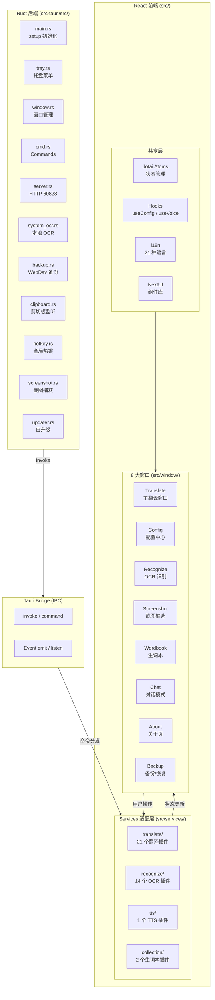

# YiPot 架构设计

> 完整架构详见 [engineer/projects/0005-项目-YiPot项目.md](../../../projects/0005-项目-YiPot项目.md)。本文为快速参考摘要。

## 分层架构

```
src-tauri/src/  → Rust 后端（主进程）：托盘、窗口管理、HTTP 服务、OCR、备份
      ↓ Tauri Bridge（IPC: invoke / command）
src/services/   → 服务适配层：30+ 翻译/识别/TTS/生词本插件
      ↓
src/window/     → React 前端（渲染进程）：8 大窗口 UI 组件
```

### 各层职责与约束

| 层 | 职责 | 禁止 |
|---|---|---|
| **Rust 后端** `src-tauri/src/` | 系统能力封装：托盘、剪贴板、热键、截图、HTTP 60828、本地 OCR、WebDav 备份、升级、窗口生命周期 | 不能包含翻译业务逻辑，仅提供原语命令 |
| **Tauri Bridge** | 前后端 IPC 通信：`invoke()` 调用 Rust `#[tauri::command]`，事件双向推送 | Window 组件不能直接调用，必须走 services/ 层 |
| **Services 层** `src/services/` | 插件适配：translate/recognize/tts/collection 四类插件统一接口（info.ts / index.jsx / Config.jsx） | 不能直接访问 tauri::api（system_ocr 除外） |
| **Window 层** `src/window/` | React UI：Main 翻译窗口、Config、OCR、Screenshot、Wordbook、Chat、About、Backup | 不能直接 invoke Rust commands，必须走 services/hooks |

## 关键数据流

### 划词翻译数据流

```
用户划词（任意应用）
  → 系统热键 / 剪贴板监听（Rust: hotkey.rs + clipboard.rs）
  → window.rs 唤起 Translate 窗口并传参
  → React: src/window/Translate/ 接收 initialText
  → services/translate/index.jsx → 当前选中翻译插件（如 deepl/index.jsx）
  → 插件调用第三方 HTTP API（或本地 ecdict 离线词典）
  → Jotai atom 更新 → TargetArea 增量渲染
  → 可选：TTS 朗读（services/tts/）→ 生词本收藏（services/collection/）
```

### 截图 OCR 流水线

```
用户触发截图热键
  → Rust: screenshot.rs 捕获屏幕 → 全屏截图显示
  → Screenshot 窗口（React）用户框选区域
  → Rust: system_ocr.rs 调用本地 Tesseract / 平台原生 OCR（macOS Vision）
  → OCR 结果回传 → Recognize 窗口展示
  → 可选：一键翻译 → translate 插件流程
  → 识别失败 → 弹窗提示 + 允许切换至云端 OCR（baidu/tencent 等）
```

### invoke / command 调用链路

```
React (window/)
  ↓ 禁止直接调用
Hooks (useConfig.jsx, useVoice.jsx, ...)
  ↓
Services (src/services/*/) or Utils (src/utils/invoke_plugin.js)
  ↓ window.__TAURI__.invoke('method_name', args)
Tauri Bridge (序列化 JSON)
  ↓
Rust: #[tauri::command] fn method_name() -> Result<T, Error>
  ↓ anyhow::Result 统一错误
cmd.rs / server.rs / backup.rs 等模块
  ↓
返回 Result<T> → 前端 Promise resolve / reject
```

## 三端降级策略

| 故障场景 | 系统行为 | 影响 | 用户感知 |
|---|---|---|---|
| **网络离线** | translate 服务自动回退到本地 ECDICT 离线词典（`services/translate/ecdict/`），基于 SQLite 本地词库 | 仅支持中英互译，例句/发音不可用 | 右下角 Toast 提示"离线模式：使用本地词典" |
| **OCR 失败**（本地 Tesseract 报错/识别空结果） | Recognize 窗口弹窗提示，引导切换至云端 OCR 插件（baidu_accurate / tencent_accurate） | 当前图片需要重新识别 | 弹窗 + 切换按钮，可保留选中区域 |
| **翻译超时**（第三方 API 无响应） | 熔断器模式：首次 2s → 4s → 8s 指数退避，连续 3 次失败后 30s 内不再调用该插件，自动切换到备用翻译服务 | 当前查询切换到次选插件 | Toast 提示"服务超时，已切换备用引擎" |
| **TTS 不可用** | 禁用朗读按钮，不阻塞翻译主流程 | TTS 功能临时不可用 | 按钮置灰 + Tooltip 提示 |
| **剪贴板无权限**（Linux Wayland） | 剪切板翻译功能降级为手动粘贴，设置页提示开启权限 | 剪切板监听失效 | Config → General 页黄色警示条 |

## 组件交互图（Mermaid）



## 端口与网络约定

| 端口 | 用途 | 说明 |
|---|---|---|
| `60828` | Rust 内嵌 HTTP Server | PopClip / SnipDo 扩展通过 `http://127.0.0.1:60828` 调用翻译 API |
| `1420` | Vite 前端 Dev Server | `pnpm tauri dev` 时本地渲染进程热更新端口 |

## Bundle ID 与文件系统

| 项目 | 值 |
|---|---|
| Bundle ID | `com.yipot.desktop` |
| macOS 配置目录 | `~/Library/Application Support/com.yipot.desktop/` |
| Windows 配置目录 | `%APPDATA%\com.yipot.desktop\` |
| Linux 配置目录 | `~/.config/com.yipot.desktop/` |
| 配置文件（Rust） | `config.rs` → `config.json` + `serde_json` 默认值 |
| 配置文件（前端） | `store.js` → 持久化 Jotai atoms |
