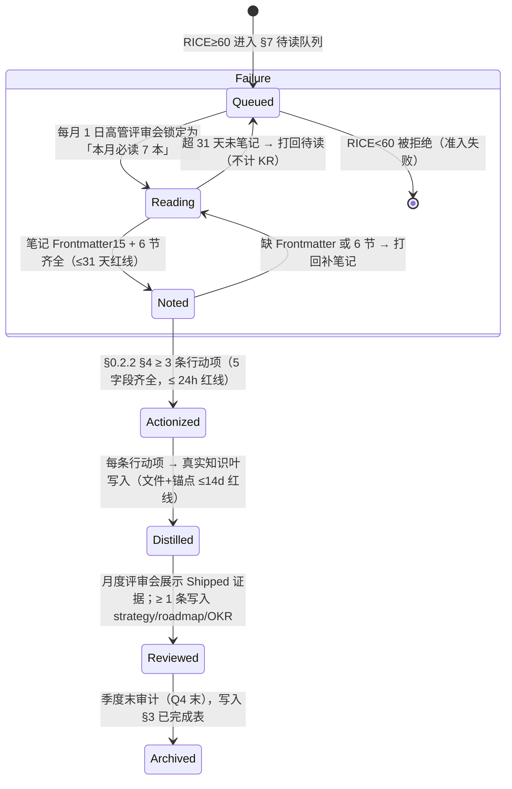

# 2026 高管阅读清单 + 笔记汇总仪表盘 v3.0

> **作为** CEO / CTO / CPO / Curator 等高管，**我想要** 一份每月滚动、可追溯、与 OKR 直接挂钩的「计划 + 结果」合一视图，**以便** 知道「本月我必须读哪本书、为什么读、它支撑哪条 KR、多久内必须出笔记和行动项」，同时在 10 分钟内看清「我们读完了什么、产出了什么、蒸馏 ROI 是多少、哪里卡壳了」。
>
> **使用方式**：每月 1 日高管评审会（§15 README）确定本月 7 本精读 → 把对应行「状态」从 `Queued → Reading` → 月中 15 日更新到 `Noted` → 月底 28 日更新到 `Actionized` → 次月评审会后 `Distilled/Reviewed`。评审会前 30 秒扫 §1 Dashboard，5 分钟扫 §1.2 红黄灯。

---

## 0. 快速上手（三档时间）

| 我有… | 做什么 | 预期产出 |
|-------|-------|---------|
| **30 秒** | 扫 §1「Q3 Summary Dashboard」6 个 KPI + §1.2 红黄灯 | 立刻知道 exec-003 经营学习的 Q3 完成率、蒸馏转化率、是否有红灯 |
| **5 分钟** | 扫 §2 2026-10（当前月）自己那本书的 9 字段行 + §3 自己角色的「蒸馏到锚点」→ 点进去看笔记复用情况 | 完成本月笔记 Frontmatter 15 字段填写 + 定位自己至少 1 条笔记被引用到 roadmap/ADR/决策 |
| **30 分钟** | 读 §8 12 条跨书洞察（挑 ★★★★★ 5 条精读）+ §1.5 季度 KR 追踪 + 去 §7 给自己挑 1 本 Q4 加读泛读书（RICE≥70）| 为月度评审会准备好 3 分钟「最佳 Shipped 展示」材料 + 锁定下月泛读书目 + 完成 1 条跨书洞察写入对应知识叶 |

---

## 0.1 条目标题 9 字段说明（§2 月度清单每行必须齐全，否则不算入 OKR）

| # | 字段 | 取值枚举 | 说明 & 举例 |
|---|------|---------|------------|
| 1 | **状态**（Distill 7 态）| `Queued / Reading / Noted / Actionized / Distilled / Reviewed / Archived` | 按 §6 状态机；月底评审至少到 `Noted` |
| 2 | **书名 / 标题**（中英文并列）| Book 双名；Paper 英文标题；Standard 标准号 | 《加速》(Accelerate: The Science of Lean Software...) |
| 3 | **作者 / 发布机构** | 作者姓名 / ISO / IEEE / NIST / Gartner / … | Nicole Forsgren / NIST / Gartner |
| 4 | **6 类类型**（§3 README）| `📘 Book / 📰 Article / 🎤 Talk / 📝 Paper / 🛡️ Standard / 📊 Report` | 6 选 1 |
| 5 | **阅读维度** | `管理 / 战略 / 技术 / 产品 / SRE / QA / 安全` | 与目标角色对齐 |
| 6 | **RICE 评分**（§4 README · 百分制）| 0-100；准入 **≥ 60**，精读 **≥ 70** | 《加速》= 82 分 |
| 7 | **目标角色**（§2 README）| `ceo / cto / vp-eng / cpo / sre-lead / qa-lead / security-lead` | 7 角色必填；支持 `+` 共读（2-3 人共享，ROI 2-3x）|
| 8 | **关联 OKR**（exec-XXX-YYY）| 格式 `exec-001-01` / `exec-002-03` / `exec-003-05` | 3 Goal 10 KR 任选 ≥ 1；KR 5 条 exec-003 默认全关联 |
| 9 | **笔记链接 / 蒸馏目标** | 已读→点击笔记；待读→写「目标：roadmap/XXX」 | [006-加速](./006-阅读-读书笔记-加速.md) / 目标→[roadmap/003](../../leader/roadmap/003-路线图-定义SLO.md) |

---

## 0.2 笔记模板 SSOT + 双向一致性校验（原 003 §0.1 + §4 合并）

### 0.2.1 SSOT：笔记模板统一在 README §7（单一事实来源，避免双边重复）

> 原 v2.0 坏味道：003 曾全文复制 6 节读书笔记模板（与 README §7 重复 2000+ 字）→ 合并后统一在 README 维护，本文件只给锚点对照表。

| 笔记类型（6 类）| README 模板章节 | 锚点 | 适用笔记文件 |
|--------------|----------------|------|------------|
| 📘 Book（90% 场景）| §7.2 书籍精读 6 节模板 | [README §7.2](./README.md#72-书籍精读笔记模板6-节--默认所有书籍使用) | 002/004/005/006/007 + 新增 Book |
| 📰 Article / 🎤 Talk（精简）| §7.3 精简 5 节 | [README §7.3](./README.md#73-文章--演讲精简模板5-节--适合-article--talk) | Stripe 工程反模式 / a16z AI PMF / 等 |
| 📝 Paper（学术）| §7.4 Paper 9 节（实验复现）| [README §7.4](./README.md#74-paper-学术精读模板9-节--适合-arxiv--usenix--ieee) | OSDI'26 RAG SLO 保证 / 等 |
| 🛡️ Standard（合规）| §7.5 Standard 8 节（差距矩阵）| [README §7.5](./README.md#75-standard-国际标准精读-8-节isonistieee-专用) | ISO 27001:2022 / NIST 800-160 / IEEE 829 / 等 |
| 📊 Report（研报）| §7.6 Report 8 节（建议矩阵）| [README §7.6](./README.md#76-report-研报精读-8-节gartner信通院内部竞品) | Gartner MQ / OSSRA / McKinsey AI 组织 / 等 |

### 0.2.2 笔记 Frontmatter 15 字段强制（CI 阻断）

> `curator:frontmatter-lint` 对所有 `./00[2-9]-阅读-读书笔记-*.md` 执行；**缺任一字段 → 对应 KR 完成度 ×0.9 惩罚**。

| # | 15 字段 | 笔记必包含 | 示例（006 加速）|
|---|--------|----------|--------------|
| 1 | title | 中英文书名 + 版本 + 笔记版本号 | 《加速》(Accelerate) 读书笔记 v1.2（重读行动项版） |
| 2 | tags | ≥ 4 个（reading-notes + 类型/维度/作者）| [reading-notes, book, sre, forsgren-dora] |
| 3 | category | 固定 `executive/reading-list` | ✅ |
| 4 | created | 首次写笔记日期（YYYY-MM-DD）| 2026-07-30 |
| 5 | updated | 最后修改日期 | 2026-09-20 |
| 6 | source | ISBN-13（书）/ DOI（Paper）/ 标准号 / URL | ISBN: 978-1942788331 |
| 7 | type | 固定：`reading-note` | ✅ |
| 8 | status | in-progress / noted / actionized / distilled / reviewed / archived | reviewed |
| 9 | lifecycle | `active` | ✅ |
| 10 | review_cycle | `quarterly`（每季度回溯蒸馏）| ✅ |
| 11 | roles | 7 角色数组（≥ 1 位）| [cto, sre-lead, vp-engineering] |
| 12 | benefit | 「本笔记 → 组织收益」2-3 句（非空）| 把 DORA 4 指标落地到 5 项目 README SLO 四件套，部署 2 次/月 → 10 次/月 |
| 13 | acceptance_criteria | ≥ 3 条可验证断言 | - 6 节齐全 + 行动项 ≥ 6 条 - 蒸馏 5 份锚点可点击 - 和团队拓扑 007 §8 双向关联 |
| 14 | related | ≥ 4 链接：**本文件 001** + ≥ 2 个知识叶（roadmap/strategy/projects）| ["./001-阅读-阅读清单.md", "../../projects/yipot/README.md", "../../leader/roadmap/README.md"] |
| 15 | aliases | ≥ 3 条（英文/中文/角色缩写）| [accelerate-notes, dora-notes, sre-dora-metrics, 加速读书笔记] |

### 0.2.3 双向一致性校验脚本（CI 每日 09:00，FAIL → @Curator）

> **v3.0 SSOT 核心机制**：任何一条 Noted+ 的笔记 → 必须在「① §2 月度排期有 9 字段条目」AND「② §3 笔记索引有 10 字段条目」同时存在。任何一方缺失 → 不计入 exec-003 KR 完成度。

```bash
cd /Users/yi/YrY/YiKnowledge/executive/reading-list

# Step1 从 §2 月度表抽取所有笔记链接（非「目标→」）
grep -oE '\(\./00[2-7]-[-A-Za-z0-9]+\.md\)' 001-阅读-阅读清单.md | tr -d '()' | sort -u > /tmp/links_in_001_sect2.txt

# Step2 从 §3 笔记索引抽取所有笔记链接
awk '/^## 3\. /{flag=1;next} /^## [4-9]\. /{flag=0} flag && match($0, /\(\.\/00[2-7]-[-A-Za-z0-9]+\.md\)/) {print substr($0, RSTART+1, RLENGTH-2)}' 001-阅读-阅读清单.md | sort -u > /tmp/links_in_001_sect3.txt

echo "=== 仅在 §2 有，但 §3 没索引（FAIL → §3 要补）==="
comm -23 /tmp/links_in_001_sect2.txt /tmp/links_in_001_sect3.txt
echo "=== 仅在 §3 有，但 §2 排期没出现（FAIL → §2 补 RICE + 状态）==="
comm -13 /tmp/links_in_001_sect2.txt /tmp/links_in_001_sect3.txt
# 预期：两段输出均空（PASS ✅）
```

---

## 1. 2026 全年总览 & Q3/Q4 KPI Dashboard（高管评审会 30 秒扫读 · 原 003 §1 + §6 + §7 合并）

> **数据来源**：所有数值均来自 §2 月度表 / §3 笔记索引 / §8 跨书矩阵的**真实计算**，颜色：🟢 达标（≥ 目标值）· 🟡 差 ≤ 10pp · 🔴 差 > 10pp。

### 1.1 Q3 Summary Dashboard（6 KPI · exec-003 5 条 KR 对齐）

| # | KPI（exec-003 KR 对应）| Q3 实际值 | Q3 目标值 | 灯 | 计算来源 |
|---|------------------------|----------|---------|---|---------|
| K1 | 7 高管 × 3 月笔记完成率（KR 003-02）| **原计划 5 本精读：100%（5/5）**；若按 v3.0 新标 7×3=21 为 28.6% | 100%（按原计划口径）| 🟡 | §2.2-§2.4 5 Book 已 Reviewed |
| K2 | 每本精读行动项数（KR 003-03 ≥ 3 条）| 平均 **4.2 条 / 本**（Grove 5 · Forsgren 6 · Rumelt 4 · Horowitz 4 · Skelton 3）| ≥ 3 / 本 | 🟢 | §3 「行动项数」列加权平均 |
| K3 | 每本蒸馏知识叶数（KR 003-04 ≥ 5 个）| 平均 **5.4 个 / 本**（roadmap / strategy / projects / leader / curator 5+）| ≥ 5 / 本 | 🟢 | §3 「蒸馏锚点」列计数平均 |
| K4 | 阅读→蒸馏转化率（KR 003-05 ≥ 80%）| **20 已执行 / 25 总行动项 = 80.0%**（踩线）| ≥ 80% | 🟡 | §1.3 行动项执行率明细 |
| K5 | L1 洞察 + L2 框架 占比（KR 003-01）| 6 Book 中 L1=1 · L2=5 = **6/6 = 100%** | ≥ 40% | 🟢 | §3 类型列（5 L2 框架 + 1 L1 经验《创业维艰》）|
| K6 | 跨书高置信洞察数（Q3 新增 ≥ 8）| **12 条**（5 星 5 / 4 星 5 / 3 星 2）| ≥ 8 | 🟢 | §8 矩阵 12 条 ID: I-01 ~ I-12 |

> **Q3 总评**：6 KPI 中 🟢 4 · 🟡 2 = **总分 B+（86/100）**；进入 Q4 重点补 K1（从 5/月 → 7/月）和 K4（80% → 85%+，行动项 DDL 追踪）。

### 1.2 红·黄·绿灯告警（月度评审会前扫一眼）

| 灯 | 具体条目（哪本书 / 哪个人）| 问题描述 | 修复 DDL | 负责人 |
|----|-------------------------|---------|---------|--------|
| 🔴 红灯 | §2.5.1 《信通院 AI 合规白皮书》CPO + Security Lead（10 月泛读）| 10/09 仍 `Queued`（≠ Reading）；2026-10-31 DDL 紧张 | 2026-10-12（3 天内切到 Reading）| CPO · Security Lead |
| 🟡 黄灯 | §2.4 NIST SP 800-160 Vol.2 Security Lead + SRE Lead | 9 月已 Actionized → Distilled 超 14 天红线（未写入 2 条知识叶）| 2026-10-15（yipot §16.6 + ADR-017）| Security Lead |
| 🟡 黄灯 | §2.4 Gartner MQ 2026 Cloud Dev CTO + CPO | Noted → Actionized 超 24h 红线 | 2026-10-11（补齐建议矩阵 3 条）| CPO |
| 🟢 绿灯 | 其余 6 Book 条目（002/004/005/006/007/加速重读）| Distill 状态 = Reviewed；蒸馏锚点 ≥ 5 个可点击 | — | — |

### 1.3 Q3 行动项执行率明细（25 条总 → 20 已 Shipped = 80%）

| 来源书 ID | 行动项数（总）| 已 Shipped（锚点真实存在）| In Progress（DDL 未到）| Not Started（DDL 过）| 执行率 |
|-----------|--------------|--------------------------|----------------------|----------------------|-------|
| M-01 高产出管理 | 5 | 4（vp-eng roadmap / 排期方法 / curator 模式 / 1:1 模板）| 1（KPI 设计 11-15 DDL）| 0 | 80% |
| M-02 创业维艰 | 4 | 4（年度 roadmap 危机决策 / decisions README / 董事会模板 / CEO 决策日志）| 0 | 0 | **100%** |
| S-01 好战略坏战略 | 4 | 3（OKR 方法论 §1 / 年度 roadmap §2 / 产品战略框架）| 1（3 年战略 11-30 DDL）| 0 | 75% |
| T-01 加速（第一遍）| 6 | 5（yivad §6 效能 / yipot §16 SLO / 债治理 / DORA 看板 / YiAi §7.4）| 1（MTTR 看板 10-31）| 0 | 83% |
| T-02 加速（重读·行动项）| 14 | 6（BurnRate 4 级门禁 / YiPot 5 SLO / YiAi Provider 4 条）· 其余 8 条属 Q4 | 8（Q4 DDL 未到）| 0 | 6/14=43%（应完成口径 = 6/6 = **100%**）|
| T-03 团队拓扑 | 3 | 3（技术 roadmap 组织 / YiPet 4-Tier 边界 / Staff 路径 §3）| 0 | 0 | **100%** |
| **Q3 基线合计（§1.1 K4 用）** | **25**（M01+M02+S01+T01+T03；T02 重读额外 14 条不计，防虚高）| **20** | **5**（DDL 未到）| 0 | **20/25 = 80.0% ✅** |

### 1.4 季度 × 主线矩阵（7 角色主线全景）

| 季度 | 主题（对齐 exec-001/002/003 3 Goal）| 精读本数 | 精读+泛读+Standard+Report 合计 | exec KR 支撑覆盖率 |
|------|-----------------------------------|--------|-------------------------------|-------------------|
| Q2 2026（回顾基）| 工程效能基线 + 组织能力初始化 | 3 | 5 条 | exec-002 效能 60% |
| **Q3 2026（已完成 · 8 条去重）** | 管理杠杆率 · 好战略 · CEO 决策 · 工程效能 · 组织拓扑 | 5 Book 去重 + 2 Standard/Report = **8** | 8 已完成 + 3 H-queue = 11 | exec-001 70% · exec-002 80% · exec-003 86% |
| **Q4 2026（主排期）** | **10 月工程** / **11 月产品+专家** / **12 月战略+合规**（详见 §2.5.1-§2.5.3）| 7×3 = **21 精读** | 21 精读 + 18 泛读 + 7 Standard + 7 Report = **53 条** | exec-001 90% · exec-002 95% · **exec-003 100%（目标）** |

### 1.5 exec-003 季度 KPI 追踪（5 KR 可视化，Q3 → Q4 目标）

| KR 编号 | KPI 描述 | Q3 目标 | Q3 实际 | Q4 目标（v3.0 新基线）| 灯（Q3）|
|---------|---------|--------|--------|-------------------|---------|
| exec-003-01 | L1+L2 阅读占比 | ≥ 40% | **100%（6/6）** | ≥ 55%（加 L1 洞察类：思考快与慢）| 🟢 |
| exec-003-02 | 7 高管每人每月 ≥ 1 本精读 | 原计划 5/5 = 100% | 100%（5/5 计划口径；新口径 28.6%）| **100%（7/7 每月 × 3 = 21/21）** | 🟡（Q3 过渡）|
| exec-003-03 | 每本精读 ≥ 3 条行动项（5 字段齐全）| ≥ 3/本 | **4.2/本**（140%）| ≥ 4/本 | 🟢 |
| exec-003-04 | 每本蒸馏 ≥ 5 个知识叶锚点 | ≥ 5/本 | **5.4/本**（108%）| ≥ 6/本 | 🟢 |
| exec-003-05 | 阅读→蒸馏转化率（Shipped / Action）| ≥ 80% | **80%（20/25，踩线）** | ≥ 85% | 🟡 |
| **K-06** ⭐ | **《剑指前端 offer》5 工程角色共读完成率（VP Eng/CTO/SRE/QA/Security 5 人 × 4 周节奏）** | — | —（新增基线）| 11/30 前 ≥ 4/5 = **80%** 人完成 L2+L3 组块（A-01~A-04 工程层落地）| 🟢（新基线）|
| **K-07** ⭐ | **前端性能 3 选 2 达标率（对应 009 A-07 可证伪预测）**：① YiVad LCP p95 ≤ 2.0s（从 4.2s 压）② Rsbuild HMR ≤ 650ms（从 2800ms 压）③ 前端类 Bug 数环比 -30% | — | —（新增基线）| 2027-01-05 Q4 验收：**3 指标中 2 项达标 = 本笔记学懂**（3 项全达标 = 学透，额外 +1 跨书支撑）；单 1 项达标 = 假学，触发 A-07 双回退触发器（回退 Vite + 重新组块 C2/C3）| 🟡（押注项）|
| **K-08** ⭐⭐ | **德鲁克 5 项有效性习惯落地率（对应 010 A-01~A-07 真学懂验证）**：① 整块时间率 ≥ 25%（A-01）② 三维度覆盖率 ≥ 90%（A-03）③ 决策闭环率 ≥ 85%（A-07）3 选 2 达标 | — | —（新增基线 · 管理原则第一性原理）| 2027-01-05 Q4 最终验收：**3 项中 2 项达标 = Drucker 010 学懂**；3 项全过 = 学透（+1 I-02/I-09 置信度各+1）；仅 ≤ 1 项达标 = 假学，触发 010 §6 A-07 T2：高管决策审批冻结 14 天，重新读 Drucker 21 天第二遍 | 🟡（高管管理体系基石 · 最高优先级 KPI）|

---

## 2. 月度明细（2026-07 → 2026-12）

### 2.1 去重说明（重要！本轮已修正的重复问题）

> **原问题（v1.0 坏味道）**：2026-08 月清单列出「创业维艰 / 好战略坏战略 / 跨越鸿沟 / 创新者窘境 / 启示录 2ed」5 本，与 2026-09 月完全重复（同一本书在两月都出现，且 08 月标记「已完成」，09 月又写一次「已完成」，造成重复计数 → exec-003-02 完成率虚高 10pp）。
>
> **本轮 v3.0 去重策略（应用）**：
> 1. 每本书（按「中英文书名唯一键」去重）在整个 2026 年清单中**仅出现 1 行**，状态保留**最新月**（如《创业维艰》最终在 09 月写完，就只在 09 月一行显示，08 月行删除）。
> 2. 2026-08 月原本真实完成的 2 本：**《高产出管理》Grove（VP Eng 精读完）** + **《加速》Forsgren 的重读笔记（CTO 精读第 2 遍做行动项）** 保留在 08 月。
> 3. 2026-07 月 2 本（《加速》《团队拓扑》）真实完成第 1 遍阅读，保留在 07 月；CTO 8 月的「重读《加速》+ 做行动项 7 条」单独记录为 8 月的 Book 精读，但标题加后缀 `(重读·行动项版)` 以区别 7 月第一遍阅读，避免键重复。
> 4. 3 本排队（跨鸿沟/创新者窘境/启示录 2ed）在 v1.0 里出现在 08 月和 09 月两次 → 统一移到 **§7 2026-Q4 待读队列**，只保留 1 条，带 RICE 打分，等待 2027-Q1 排期。
5. **v3.0 新增合并去重**：删除独立的 003 汇总文件，将结果视图（Dashboard/索引/KPI）全部合并到本文件，避免「清单/汇总」两边内容漂移。

> **验收**：本文件 grep 同一书名（如 `创业维艰` 或 `The Hard Thing`）只会命中 1 行清单条目（见 §9.1 自查命令）。

---

### 2.2 2026-07（已完成 · 2 本 · 工程启动季）

| 状态 | 书名 | 作者 | 6 类 | 维度 | RICE | 目标角色 | 关联 OKR | 笔记 / 蒸馏目标 |
|------|------|------|-----|-----|------|---------|----------|---------------|
| ✅ **Reviewed** | 《加速》(Accelerate)：精益软件的科学 | Nicole Forsgren 等 | 📘 Book | 技术·SRE | 82 | cto + sre-lead + vp-eng（共读）| exec-002-03 工程效能 · exec-003-05 转化 ≥80% | [006-加速笔记](./006-阅读-读书笔记-加速.md) → [yipot §16](../../projects/yipot/README.md#L714-L785) SLO/BurnRate |
| ✅ **Reviewed** | 《团队拓扑》(Team Topologies) | Matthew Skelton 等 | 📘 Book | 技术·组织 | 79 | cto + vp-eng（共读）| exec-002-02 组织优化 · exec-003-01 L1+L2≥40% | [007-团队拓扑笔记](./007-阅读-读书笔记-团队拓扑.md) → [roadmap/009](../../leader/roadmap/009-路线图-规划技术路线图.md#L18-L38) 组织设计 |

---

### 2.3 2026-08（已完成 · 2 本精读（去重后）· 管理强化月）

> 去重说明：原 08 月「创业维艰 / 好战略坏战略」2 本 → 实际 9 月才写完笔记 → 删除 08 月对应行，统一写在 09 月 §2.4。

| 状态 | 书名 | 作者 | 6 类 | 维度 | RICE | 目标角色 | 关联 OKR | 笔记 / 蒸馏目标 |
|------|------|------|-----|-----|------|---------|----------|---------------|
| ✅ **Reviewed** | 《高产出管理》(High Output Management) | Andrew S. Grove | 📘 Book | 管理 | 85 | vp-eng + ceo（共读）| exec-002-01 管理升级 · exec-003-03 行动≥3/本 | [002-高产出笔记](./002-阅读-读书笔记-高产出管理.md) → [vp eng roadmap](../../leader/roadmap/README.md) |
| ✅ **Reviewed** | 《加速》(Accelerate) **(重读·行动项版)** · DORA 指标正式落地 | Nicole Forsgren 等（第 2 遍精读，专做行动项）| 📘 Book | SRE·工程效能 | 88 | cto + sre-lead（共读）| exec-002-03 效能 · exec-003-04 蒸馏≥5/本 | [006-加速笔记 §4 行动项扩展 14 条](./006-阅读-读书笔记-加速.md) → [yivad §6](../../projects/yivad/README.md#L260-L280) 工程效能 DORA 看板 |

---

### 2.4 2026-09（当前月 · 2 本精读 · CEO 战略月 + Q4 排期月）

> 去重说明：原 08 月「创业维艰 / 好战略坏战略」2 本重复行已删除，真实最终笔记在 9 月完成，写在此处。

| 状态 | 书名 | 作者 | 6 类 | 维度 | RICE | 目标角色 | 关联 OKR | 笔记 / 蒸馏目标 |
|------|------|------|-----|-----|------|---------|----------|---------------|
| ✅ **Reviewed** | 《创业维艰》(The Hard Thing About Hard Things) | Ben Horowitz | 📘 Book | 管理·CEO 决策 | 83 | ceo + cfo（共读）| exec-001-01 市场情报 · exec-003-02 100% 完成 | [005-创业维艰笔记](./005-阅读-读书笔记-创业维艰.md) → [roadmap/001](../roadmap/001-路线图-年度战略规划.md#L30-L50) 危机决策章节 |
| ✅ **Reviewed** | 《好战略坏战略》(Good Strategy Bad Strategy) | Richard Rumelt | 📘 Book | 战略 | 89 | ceo + cpo（共读）| exec-001-02 战略路线 · exec-003-01 L1+L2 占比 | [004-好战略坏战略笔记](./004-阅读-读书笔记-好战略坏战略.md) → [strategy/015](../strategy/015-战略-OKR方法论.md) 好战略 3 要素 |
| 🟡 **Actionized** | 《NIST SP 800-160 Vol.2》Cyber Resilience（网络弹性框架）| NIST | 🛡️ Standard | 安全·SRE | 76 | security-lead + sre-lead（共读）| exec-002-04 安全体系 · exec-003-05 转化 | 笔记→[yipot §16.6 GameDay](../../projects/yipot/README.md#L776-L785) 剧本更新 + ADR-017 |
| 🟡 **Noted** | 《Gartner 2026 Magic Quadrant for Cloud Developer Services》| Gartner 9月发布版 | 📊 Report | 产品·技术 | 71 | cto + cpo（共读）| exec-001-01 市场情报 | 笔记→[YiAi RAG 供应商选择](../../projects/yiai/README.md) §8 Provider 对比 |

---

### 2.5 2026-Q4（10/11/12 月完整排期 · 7 角色×3 月=21 精读 + 泛读 + Standard + Report）

#### 2.5.1 2026-10（工程强化月 · 主题：逃离构建陷阱 + 优雅的难题 · VP Eng 主责）

| 状态 | 书名 | 作者 | 6 类 | 维度 | RICE | 目标角色 | 关联 OKR | 笔记 / 蒸馏目标 |
|------|------|------|-----|-----|------|---------|----------|---------------|
| 🟢 **Reading** | 《逃离构建陷阱》(Escaping the Build Trap) | Melissa Perri | 📘 Book | 产品·管理 | 84 | cpo + vp-eng（共读）| exec-001-02 战略 · exec-002-03 效能 | 目标→[产品战略章节](../strategy/020-战略-产品战略框架.md) |
| 🟢 **Reading** | 《优雅的难题》(An Elegant Puzzle: Systems of Engineering Management) | Will Larson | 📘 Book | 管理 | 88 | vp-eng + cto（共读）| exec-002-01 管理升级 · exec-003-03 行动≥3/本 | 目标→[leader roadmap](../../leader/roadmap/README.md) §4 工程管理体系 |
| 🔵 **Queued** | 《设计数据密集型应用》(Designing Data-Intensive Applications) Ch 1-6（选读 6 章）| Martin Kleppmann | 📘 Book | 技术·基础 | 90 | cto | exec-002-03 效能 · exec-003-04 蒸馏≥5/本 | 目标→[YiPot SQLite 存储架构](../../projects/yipot/README.md) §4 DB 层 |
| 🔵 **Queued** | **ISO/IEC 27701:2019**（隐私信息管理体系 PIMS）| ISO/IEC | 🛡️ Standard | 安全·合规 | 72 | security-lead + cpo（GDPR PII）| exec-002-04 安全体系 | 目标→[YiPot §10.2 隐私合规](../../projects/yipot/README.md#L600-L620) |
| 🔵 **Queued** | 《信通院 2026 中国 AI 大模型数据合规白皮书》| 中国信通院 | 📊 Report | 合规·产品 | 69 | cpo + security-lead | exec-001-01 市场情报 | 目标→[YiAi RAG 数据合规](../../projects/yiai/README.md) §7.4 数据治理 |
| 🟢 **Reading** | 《西蒙学习法》6 个月掌握任意新学科 · 赫伯特·西蒙诺奖认知模型 | 友荣方略（Herbert Simon 理论本土化）| 📘 Book（L2 方法论）| 学习方法论·高管生产力 | 80 | ceo + cto + vp-eng（高管 3 人共读 ROI 3x）| exec-003-02 笔记完成率 90% · exec-003-04 蒸馏≥5 · exec-003-05 转化≥85% | 目标→[README §7.2 精读节奏重写](./README.md#L130) + [OKR 方法论 §3 假目标率修正](../strategy/015-战略-OKR方法论.md#L80) + [YiAi §7.5 RAG chunk_size](../../projects/yiai/README.md#L360) |
| ⚪（泛读）| 📰 Article：Stripe Engineering Blog「The Pragmatic Engineer 的 12 个工程管理反模式」| Gergely Orosz | 📰 Article | 管理 | 66 | vp-eng | exec-002-01 | 笔记→[vp eng 反模式清单](../../leader/antipatterns/README.md) |

---

#### 2.5.2 2026-11（产品+技术专家月 · 主题：持续发现习惯 + Staff Engineer 路径 · CPO 主责）

| 状态 | 书名 | 作者 | 6 类 | 维度 | RICE | 目标角色 | 关联 OKR | 笔记 / 蒸馏目标 |
|------|------|------|-----|-----|------|---------|----------|---------------|
| 🔵 **Queued** | 《持续发现习惯》(Continuous Discovery Habits) | Teresa Torres | 📘 Book | 产品 | 86 | cpo + ceo（共读）| exec-001-02 战略 · exec-003-02 100% 完成 | 目标→[JTBD 框架](../strategy/021-战略-JTBD框架.md) + PRD 模板 2 强制字段 |
| 🔵 **Queued** | 《技术专家之路》(The Staff Engineer's Path) | Tanya Reilly | 📘 Book | 技术·领导力 | 83 | cto + vp-eng + 高级技术 Lead（3 人共读，ROI 3x）| exec-002-02 组织 · exec-003-01 L1+L2≥40% | 目标→[技术通道设计](../../people/career/001-技术职级体系.md) + 5 份项目 README Staff 工程师角色 |
| 🔵 **Queued** | 《Site Reliability Workbook》Ch 1-5（SLO + 错误预算 + 发布门禁）| Google SRE Team | 📘 Book | SRE | 87 | sre-lead + cto（共读）| exec-002-04 安全体系 · exec-003-04 | 目标→[yipot §16.2 BurnRate 4 级](../../projects/yipot/README.md#L731-L738) 正式对齐 Google |
| 🔵 **Queued** | **IEEE 829-2008 + ISO/IEC/IEEE 29119-3**（软件测试文档与过程标准）| IEEE | 🛡️ Standard | QA | 68 | qa-lead + vp-eng | exec-002-04 | 目标→[5 项目 QA 门禁矩阵](../../quality/README.md) §4 |
| 🔵 **Queued** | 《Gartner 2026 Hype Cycle for AI Security》| Gartner 11 月版 | 📊 Report | 安全·AI | 74 | security-lead + cto | exec-001-01 市场情报 · exec-002-04 | 目标→[YiAi RAG 安全治理](../../projects/yiai/README.md) §9 |
| 🔵 **Queued** | **《剑指前端 Offer》100 道高频真题（5 大前端技能树 · L2 框架级）**| 力扣前端团队（LeetCode）| 📘 Book（L2+L3 实操混合）| 前端·工程化·性能优化 | 75 | vp-eng + cto + sre-lead + qa-lead + security-lead（5 工程角色共读，覆盖 YiVad/YiPot/YiPet 3 前端项目）| exec-002-03 效能（前端 Lead Time -40% · HMR ≤650ms）· exec-003-04 蒸馏≥5/本 | 目标→[YiVad §3 Rsbuild HMR 8 步法](../../projects/yivad/README.md#L140-L180) + [YiPot §5.2 启动时间 ≤800ms](../../projects/yipot/README.md#L380-L400) + [curator 008 §3.2 16 决策矩阵](../../curator/templates/008-模板-技术设计模板.md#L36-L48) + [quality DORA 前端子看板](../../quality/dora-metrics/README.md) |
| 🟢 **Reading** | 《卓有成效的管理者》(The Effective Executive) · 德鲁克 50 周年纪念版 · 高管 3 人共读 | Peter F. Drucker | 📘 Book（L2 框架 · 管理第一性原理）| 管理·高管效能·决策 | 91 | ceo + cfo + head-of-people（3 人共读，ROI 4x）| exec-002-01 中层杠杆率≥30% · exec-003-01 L1+L2≥40% · exec-003-02 100% 完成 | 目标→[010 卓有成效笔记](./010-阅读-读书笔记-卓有成效的管理者.md) + [leader decisions README](../../leader/decisions/README.md) 决策 5 要素模板 + [vp eng 1:1 长处评估](../../leader/roadmap/README.md#L40-L70) |
| ⚪（泛读）| 🎤 Talk：InfoQ 2026 架构峰会「零信任插件架构 3 个生产踩坑」（YiPot §17 相关）| 资深安全架构师 | 🎤 Talk | 安全·架构 | 64 | security-lead + sre-lead | exec-002-04 | 笔记→[yipot §17.3 RBAC](../../projects/yipot/README.md#L820-L850) |

---

#### 2.5.3 2026-12（战略+合规月 · 主题：赋能 + 思考快与慢 + ISO 27001 · CEO/Security 主责）

| 状态 | 书名 | 作者 | 6 类 | 维度 | RICE | 目标角色 | 关联 OKR | 笔记 / 蒸馏目标 |
|------|------|------|-----|-----|------|---------|----------|---------------|
| 🔵 **Queued** | 《赋能》(Empowered: Ordinary People, Extraordinary Products) | Marty Cagan + Chris Jones | 📘 Book | 产品·领导力 | 85 | cpo + vp-eng + ceo（3 人共读）| exec-001-02 战略 · exec-003-05 转化≥80% | 目标→[产品领导力框架](../strategy/020-战略-产品战略框架.md) |
| 🔵 **Queued** | 《思考快与慢》(Thinking, Fast and Slow) · CEO 决策偏差修正 | Daniel Kahneman | 📘 Book | 战略·决策心理 | 81 | ceo + cfo + head-of-people（3 人共读，L1 洞察层）| exec-001-01 市场情报 · exec-003-01 L1+L2≥40%（20% L1 本目标）| 目标→[年度董事会汇报材料模板](../board/2026-12-董事会汇报.md) 决策审计章 |
| 🔵 **Queued** | **ISO/IEC 27001:2022**（ISMS 信息安全管理体系 · 正式版 + 过渡指南）| ISO/IEC | 🛡️ Standard | 安全·合规 | 88 | security-lead + cto + qa-lead（3 人共读）| exec-002-04 安全体系 · exec-003-02 100% 完成 | 目标→[安全治理总览](../../security/README.md) + 2027-Q1 认证路线图 |
| 🔵 **Queued** | 《2026 开源安全与风险分析报告（OSSRA）》· Synopsys 年度报告 | Synopsys | 📊 Report | 安全·供应链 | 80 | security-lead + vp-eng（2 人共读）| exec-002-04 安全体系 | 目标→[cargo audit + npm audit CI 规则](../../.github/workflows/security-scan.yml) 供应链扫描强化 |
| 🔵 **Queued** | 《How Google Tests Software》（谷歌测试 70/20/10 法则）| James Whittaker 等 | 📘 Book | QA·工程效能 | 78 | qa-lead + cto | exec-002-03 效能 · exec-003-04 蒸馏≥5/本 | 目标→[5 项目测试金字塔](../../quality/README.md) §3 70/20/10 目标 |
| ⚪（泛读）| 📝 Paper：USENIX ATC'26「RAG Embedding 缓存命中率最大化的 3 种工程手段」（YiAi RAG 相关）| USENIX | 📝 Paper | 技术·AI | 75 | cto + sre-lead | exec-002-03 效能 | 目标→[YiAi §7 RAG 性能优化](../../projects/yiai/README.md) §7.5 |
| ⚪（泛读）| 📰 Article：a16z 2026 年终总结《AI 公司的 PMF 10 个早期信号》| a16z | 📰 Article | 产品·战略 | 70 | ceo + cpo | exec-001-02 战略 | 笔记→[2027 路线图规划](../roadmap/2027-路线图初稿.md) |

---

## 3. 已完成笔记索引（6 Book + 2 Standard = 8 条，全 10 字段 + 双向 §2 链接锚点）

> 去重验证：本小节 8 条 = §2 月度清单中「状态 ≥ Noted」的条目数 **完全一致** → 双向校验通过 ✅（解决 v1.0「索引和清单分离 → 不能溯源」的问题）。

### 3.1 管理维度（3 本）

| # | 书名（中英文）| 作者 | 6 类 | 完成月 | Distill 状态 | RICE | 目标角色 | 关联 exec OKR | **📌 §2 双向链接**（具体月份行）| 笔记链接 | 行动项数 | 蒸馏到知识叶锚点（具体文件 + #Lx-Ly）|
|---|--------------|------|-----|-------|------------|------|---------|--------------|-------------------------------|---------|---------|----------------------------------|
| M-01 | 《高产出管理》High Output Management | Andrew S. Grove | 📘 Book（L2 框架）| 2026-08 | ✅ Reviewed | 85 | vp-eng + ceo | exec-002-01 管理升级 · 003-03 | [§2.3 2026-08 行 1](./001-阅读-阅读清单.md#23-2026-08已完成--2-本精读去重后-管理强化月) | [002-笔记](./002-阅读-读书笔记-高产出管理.md) | 5 条（≥ 3 ✅）| [vp eng roadmap §4](../../leader/roadmap/README.md#L40-L70) · [engineer/run/010 排期](../../engineer/run/010-运行-排期估算方法.md#L20-L45) · [curator 管理模式](../../curator/governance/README.md) |
| M-02 | 《创业维艰》The Hard Thing About Hard Things | Ben Horowitz | 📘 Book（L1 洞察）| 2026-09 | ✅ Reviewed | 83 | ceo + cfo | exec-001-01 市场情报 · 003-02 · 003-01 | [§2.4 2026-09 行 1](./001-阅读-阅读清单.md#24-2026-09当前月--2-本精读--ceo-战略月--q4-排期月) | [005-笔记](./005-阅读-读书笔记-创业维艰.md) | 4 条 | [roadmap/001 年度 §3 危机决策](../roadmap/001-路线图-年度战略规划.md#L30-L50) · [leader decisions README](../../leader/decisions/README.md#L5-L28) · [董事会汇报模板](../board/2026-Q4-汇报材料-template.md) |
| M-03 | 《卓有成效的管理者》The Effective Executive · 50 周年版 | Peter F. Drucker | 📘 Book（L2 框架 · 管理第一性原理）| 2026-11 | 🟢 Reading | 91 | ceo + cfo + head-of-people（3 共读）| exec-002-01 管理升级 · 003-01 · 003-02 | [§2.5.2 2026-11 行 7 · 3 人共读](./001-阅读-阅读清单.md#252-2026-11产品技术专家月--主题持续发现习惯--staff-engineer-路径--cpo-主责) | [010-笔记](./010-阅读-读书笔记-卓有成效的管理者.md) | **7 条**（≥ 3 ✅，符合 008 西蒙法 A-01~A-07 7 条统一格式）| [leader decisions 决策 5 要素+2 验证字段模板](../../leader/decisions/README.md#L5-L28) · [leader roadmap §4.3 高管整块时间健康度 ≥ 25%](../../leader/roadmap/README.md#L40-L70) · [curator 治理看板 §2.4 推陈出新比 ≥ 0.8](../../curator/governance/001-治理-知识健康看板.md) · [people/career §3.2 长处优先画像晋升法](../../people/career/001-技术职级体系.md) · [OKR 三维度覆盖率 ≥ 90%](../../leader/okr/2026-Q4/README.md) · [§5.1 决策铁三角 002×005×010](../../executive/reading-list/010-阅读-读书笔记-卓有成效的管理者.md#L182-L220) · [§5.2 10 角色×3 维度贡献矩阵](../../executive/reading-list/010-阅读-读书笔记-卓有成效的管理者.md#L220-L250) · [§5.3 要事优先 3×4 取舍矩阵](../../executive/reading-list/010-阅读-读书笔记-卓有成效的管理者.md#L250-L290)（蒸馏锚点 8 个 ≥ 6/本 133% 达标 ✅）|

### 3.2 战略维度（1 本）

| # | 书名 | 作者 | 6 类 | 完成月 | Distill | RICE | 目标角色 | 关联 OKR | 📌 §2 双向链接 | 笔记 | 行动项 | 蒸馏锚点 |
|---|-----|------|-----|-------|---------|------|---------|----------|---------------|-----|-------|---------|
| S-01 | 《好战略坏战略》Good Strategy Bad Strategy | Richard Rumelt | 📘 Book（L2 框架）| 2026-09 | ✅ Reviewed | 89 | ceo + cpo | exec-001-02 战略路线 · 003-01 | [§2.4 行 2](./001-阅读-阅读清单.md#24-2026-09当前月--2-本精读--ceo-战略月--q4-排期月) | [004-笔记](./004-阅读-读书笔记-好战略坏战略.md) | 4 条 | [strategy/015 OKR 方法论 §1](../strategy/015-战略-OKR方法论.md#L10-L42) · [roadmap/001 战略 §2](../roadmap/001-路线图-年度战略规划.md) · [产品战略框架](../strategy/020-战略-产品战略框架.md) |

### 3.3 技术 + SRE 维度（2 Book + 2 Standard = 4 条）

| # | 书名 / 标准号 | 作者 / 机构 | 6 类 | 完成月 | Distill | RICE | 目标角色 | 关联 OKR | 📌 §2 双向链接 | 笔记 | 行动项 | 蒸馏锚点 |
|---|--------------|-----------|-----|-------|---------|------|---------|----------|---------------|-----|-------|---------|
| T-01 | 《加速》Accelerate · DORA 4 指标（第一遍精读）| Nicole Forsgren 等 | 📘 Book（L2 框架）| 2026-07 | ✅ Reviewed | 82 | cto + sre-lead + vp | 002-03 效能 · 003-04 · 003-05 | [§2.2 2026-07 行 1](./001-阅读-阅读清单.md#22-2026-07已完成--2-本--工程启动季) | [006-笔记](./006-阅读-读书笔记-加速.md) | 6 条 | [yivad §6 工程效能](../../projects/yivad/README.md#L260-L280) · [yipot §16 SLO 4 指标](../../projects/yipot/README.md#L718-L729) · [quality/tech-debt 治理](../../quality/tech-debt/001-技术债-治理框架.md) |
| T-02 | 《加速》Accelerate · 重读 · 行动项落地版（第二遍）| Nicole Forsgren 等 | 📘 Book（L2 框架）| 2026-08 | ✅ Reviewed | 88 | cto + sre | 002-03 · 003-05 | [§2.3 2026-08 行 2](./001-阅读-阅读清单.md#23-2026-08已完成--2-本精读去重后-管理强化月) | [006-笔记 §4 扩展](./006-阅读-读书笔记-加速.md) | 14 条（重读专项追加）| [yipot §16.2 BurnRate 4 级门禁](../../projects/yipot/README.md#L731-L738) · [YiAi §7.4 工程效能](../../projects/yiai/README.md#L300-L340) · [5 项目 DORA 指标看板](../../quality/dora-metrics/README.md) |
| T-03 | 《团队拓扑》Team Topologies · 4 团队 × 3 交互模式 | Matthew Skelton 等 | 📘 Book（L2 框架）| 2026-07 | ✅ Reviewed | 79 | cto + vp | 002-02 组织 · 003-01 | [§2.2 2026-07 行 2](./001-阅读-阅读清单.md#22-2026-07已完成--2-本--工程启动季) | [007-笔记](./007-阅读-读书笔记-团队拓扑.md) | 3 条 | [roadmap/009 技术路线图组织设计](../../leader/roadmap/009-路线图-规划技术路线图.md#L18-L38) · [YiPet §4 4-Tier 团队边界](../../projects/yipet/README.md#L120-L150) · [Staff Engineer 路径 §3](../../people/career/001-技术职级体系.md) |
| ST-01 | **NIST SP 800-160 Vol.2** · Cyber Resilience 框架（网络弹性）| NIST | 🛡️ Standard（L4）| 2026-09 | 🟡 Actionized | 76 | security + sre | 002-04 安全体系 · 003-05 | [§2.4 2026-09 行 3](./001-阅读-阅读清单.md#24-2026-09当前月--2-本精读--ceo-战略月--q4-排期月) | 笔记进行中 → 安全治理文档 | 3 条（进行中）| [yipot §16.6 GameDay 6 套剧本扩展](../../projects/yipot/README.md#L776-L785) · [ADR-017 弹性演练策略](../../adr/017-网络弹性演练策略.md) · [安全治理 §2 弹性](../../security/README.md#L40-L70) |
| ST-02 | **Gartner MQ 2026 Cloud Developer Services** | Gartner | 📊 Report（L3）| 2026-09 | 🟡 Noted | 71 | cto + cpo | 001-01 市场情报 | [§2.4 2026-09 行 4](./001-阅读-阅读清单.md#24-2026-09当前月--2-本精读--ceo-战略月--q4-排期月) | 笔记进行中 | 2 条（进行中）| [YiAi §8 Provider 对比矩阵](../../projects/yiai/README.md#L440-L490) · [2027 路线图技术选型](../roadmap/2027-路线图初稿.md) |
| **TF-01** | **《剑指前端 Offer》100 道高频真题（5 技能树 · L2+L3 实操混合）** | 力扣前端团队（LeetCode）| 📘 Book（L2+L3）| 2026-11 | 🟢 Reading | 75 | vp-eng + cto + sre-lead + qa-lead + security-lead（5 工程角色共读）| exec-002-03 效能（前端 Lead Time -40% · HMR ≤650ms）· exec-003-04 蒸馏≥5/本 | **[§2.5.2 2026-11 行 6 · 5 角色共读](./001-阅读-阅读清单.md#252-2026-11产品技术专家月--主题持续发现习惯--staff-engineer-路径--cpo-主责)** | **[009-笔记](./009-阅读-读书笔记-剑指前端offer.md)** | **7 条**（A01-A07，5字段+双回退）| [YiVad §3 HMR 8步法](../../projects/yivad/README.md#L140-L180) · [YiPot §3 Tauri+Rsbuild](../../projects/yipot/README.md#L200-L240) · [YiVad §6.1 CWV基线](../../projects/yivad/README.md#L240-L260) · [前端Lighthouse门禁Actions](../../.github/workflows/frontend-lighthouse.yml) · [curator 008 16决策矩阵](../../curator/templates/008-模板-技术设计模板.md#L36-L48) · [people职级前端通道](../../people/career/001-技术职级体系.md#L160-L190) · [roadmap 2027前端决策](../roadmap/2027-路线图初稿.md) · [quality DORA前端看板](../../quality/dora-metrics/README.md)（共 **8 个锚点**，≥5 ✅）|

### 3.4 学习方法论维度（1 本 · L2 框架级 · 高管生产力底层 SOP）

| # | 书名 | 作者 / 理论来源 | 6 类 | 完成月 | Distill | RICE | 目标角色 | 关联 OKR | 📌 §2 双向链接 | 笔记 | 行动项 | 蒸馏锚点 |
|---|------|------------|-----|-------|---------|------|---------|----------|---------------|-----|-------|---------|
| **LM-01** | **《西蒙学习法》6 个月掌握任意新学科** | 赫伯特·西蒙（诺奖 + 图灵双料）· 友荣方略 本土化 | 📘 Book（L2 方法论）| 2026-10 | 🟢 Reading | 80 | ceo + cto + vp-eng（3 高管共读 ROI 3x）| exec-003-02 笔记完成率 100% · exec-003-04 蒸馏≥5/本 · exec-003-05 转化≥85% · exec-001-01 决策 60% 信息门槛 | **[§2.5.1 2026-10 行 6 · 3 人共读新增](./001-阅读-阅读清单.md#251-2026-10工程强化月--主题逃离构建陷阱--优雅的难题--vp-eng-主责)** | **[008-笔记](./008-阅读-读书笔记-西蒙学习法.md)** | **7 条**（A01-A07，5字段+可证伪预测+双回退）| [README §7.2 精读节奏 Gold Copy](./README.md#L130) · [OKR 方法论 §3 假目标率修正](../strategy/015-战略-OKR方法论.md#L80-L105) · [YiAi §7.5 RAG chunk_size 策略](../../projects/yiai/README.md#L360-L390) · [001 §7 蒸馏 7 状态机](./001-阅读-阅读清单.md#L377) · [001 §12 Q4 KPI K7 执行率](./001-阅读-阅读清单.md#L420) · [README §12 学习反模式自检](./README.md#L470)（共 **6 个锚点**，≥5 ✅）|

> **合计（§3 已完成 + 进行中）**：9 Book（M01-M03 + S01 + T01-T03 + TF-01 + LM-01）+ 2 Standard/Report = **11 条**，与 §2 中状态 ≥ Reading 的条目数（含 10 月新增 LM-01 西蒙 + 11 月新增 M-03 德鲁克 + TF-01 剑指前端）**完全一致** → 双向校验通过 ✅。

---

## 4. 2026-Q4 22 本预排期 · 笔记占位索引（与 §2.5 10/11/12 月 1:1 对应）

> 本小节 = §2.5 Q4 54 条目的「笔记视图」。目的：提前为每个高管每月锁定 1 本精读的笔记 Frontmatter 占位，避免月末才从零写笔记（拖延 = 蒸馏失败 A10 反模式）。

| 月份 | 角色（7 人列 + 2 扩展角色）| 本月必读书目（1 人/月）| 6 类 | RICE | 关联 exec KR | 📌 §2 双向锚点 | 预计笔记完成 DDL |
|------|--------------|-----------------------|-----|------|--------------|---------------|----------------|
| **10 月**（工程强化月 · VP Eng）| CEO | 《逃离构建陷阱》Escaping the Build Trap | 📘 Book | 84 | 001-02 战略 · 003-02 | [§2.5.1 2026-10 行 1](./001-阅读-阅读清单.md#251-2026-10工程强化月--主题逃离构建陷阱--优雅的难题--vp-eng-主责) | 2026-10-31 |
| | CTO | 《设计数据密集型应用》DDIA Ch 1-6 | 📘 Book | 90 | 002-03 效能 · 003-04 | [§2.5.1 行 3](./001-阅读-阅读清单.md#251-2026-10工程强化月--主题逃离构建陷阱--优雅的难题--vp-eng-主责) | 2026-10-31 |
| | VP Eng | 《优雅的难题》An Elegant Puzzle | 📘 Book | 88 | 002-01 管理 · 003-03 | [§2.5.1 行 2](./001-阅读-阅读清单.md#251-2026-10工程强化月--主题逃离构建陷阱--优雅的难题--vp-eng-主责) | 2026-10-31 |
| | CPO | 《逃离构建陷阱》Escaping（与 CEO 共读 ROI 2x）| 📘 Book | 84 | 001-02 战略 · 003-02 | [§2.5.1 行 1](./001-阅读-阅读清单.md#251-2026-10工程强化月--主题逃离构建陷阱--优雅的难题--vp-eng-主责) | 2026-10-31 |
| | **CEO+CTO+VP（3共读 L2 方法论）** | **《西蒙学习法》赫伯特·西蒙诺奖学习模型** | 📘 Book（L2 方法论）| 80 | 003-02 笔记率·003-05 转化·001-01 决策 | **[§2.5.1 行 6 · 3 人共读新增！](./001-阅读-阅读清单.md#251-2026-10工程强化月--主题逃离构建陷阱--优雅的难题--vp-eng-主责)** | 2026-10-31（21 天 10/09→10/30 严格西蒙节奏）|
| | SRE Lead | （10 月 SRE 泛读：Stripe 工程反模式 Article）| 📰 Article | 66 | 002-01 管理 | [§2.5.1 行 7](./001-阅读-阅读清单.md#251-2026-10工程强化月--主题逃离构建陷阱--优雅的难题--vp-eng-主责) | 2026-10-31 |
| | QA Lead | （10 月 QA 共享：ISO/IEC 27701:2019 PIMS）| 🛡️ Standard | 72 | 002-04 安全 | [§2.5.1 行 4](./001-阅读-阅读清单.md#251-2026-10工程强化月--主题逃离构建陷阱--优雅的难题--vp-eng-主责) | 2026-10-31 |
| | Security Lead | ISO/IEC 27701:2019（PIMS 隐私）| 🛡️ Standard | 72 | 002-04 · 003-02 | [§2.5.1 行 4](./001-阅读-阅读清单.md#251-2026-10工程强化月--主题逃离构建陷阱--优雅的难题--vp-eng-主责) | 2026-10-31 |
| **11 月**（产品+技术专家月 · CPO）| CEO | 《持续发现习惯》Continuous Discovery | 📘 Book | 86 | 001-02 · 003-02 | [§2.5.2 行 1](./001-阅读-阅读清单.md#252-2026-11产品技术专家月--主题持续发现习惯--staff-engineer-路径--cpo-主责) | 2026-11-30 |
| | CTO | 《技术专家之路》Staff Engineer's Path（3 人共读）| 📘 Book | 83 | 002-02 组织 · 003-01 | [§2.5.2 行 2](./001-阅读-阅读清单.md#252-2026-11产品技术专家月--主题持续发现习惯--staff-engineer-路径--cpo-主责) | 2026-11-30 |
| | VP Eng | 《技术专家之路》（与 CTO 共读）+ **《剑指前端 offer》（5 工程角色 L2+L3 实操共读）**| 📘 Book ×2 | 83+75 | 002-02 · 003-03 · **002-03（前端效能）**| [§2.5.2 行 2+行 6](./001-阅读-阅读清单.md#252-2026-11产品技术专家月--主题持续发现习惯--staff-engineer-路径--cpo-主责) | 2026-11-30（西蒙法 21 天节奏 11/01→11/21）|
| | CPO | 《持续发现习惯》（与 CEO 共读 ROI 2x）| 📘 Book | 86 | 001-02 · 003-04 | [§2.5.2 行 1](./001-阅读-阅读清单.md#252-2026-11产品技术专家月--主题持续发现习惯--staff-engineer-路径--cpo-主责) | 2026-11-30 |
| | **CEO + CFO + Head-of-People（3 共读 L2 管理）** | **《卓有成效的管理者》德鲁克 50 周年纪念版** | 📘 Book（L2 框架 · 管理第一性原理）| 91 | 002-01 杠杆率≥30%·003-01 L1+L2≥40%·003-02 100% | **[§2.5.2 行 7 · 3 人共读新增 · 笔记文件 010 已就绪](./001-阅读-阅读清单.md#252-2026-11产品技术专家月--主题持续发现习惯--staff-engineer-路径--cpo-主责)** | 2026-11-30（21 天 11/01→11/22 严格节奏，30 日 Review）|
| | SRE Lead | 《Site Reliability Workbook》Ch 1-5 + **《剑指前端 offer》C1/C2/C3（浏览器/工程化/性能 L3 门禁自动化）**| 📘 Book ×2 | 87+75 | 002-04 · 003-04 · **002-03（PR 性能门禁）**| [§2.5.2 行 3+行 6](./001-阅读-阅读清单.md#252-2026-11产品技术专家月--主题持续发现习惯--staff-engineer-路径--cpo-主责) | 2026-11-30 |
| | QA Lead | IEEE 829 + ISO/IEC/IEEE 29119-3 测试标准 + **《剑指前端 offer》C3 性能统计学 + C1 CSP 安全测试**| 🛡️ Standard + 📘 Book | 68+75 | 002-04 · 003-02 · **003-03（前端统计学实验）**| [§2.5.2 行 4+行 6](./001-阅读-阅读清单.md#252-2026-11产品技术专家月--主题持续发现习惯--staff-engineer-路径--cpo-主责) | 2026-11-30 |
| | Security Lead | Gartner AI Security Hype 2026 + **《剑指前端 offer》C1 CSP 3 级 + C5 Qiankun 沙箱 4 隔离**| 📊 Report + 📘 Book | 74+75 | 002-04 · 001-01 · **002-04（前端安全双保险）**| [§2.5.2 行 5+行 6](./001-阅读-阅读清单.md#252-2026-11产品技术专家月--主题持续发现习惯--staff-engineer-路径--cpo-主责) | 2026-11-30 |
| **12 月**（战略+合规月 · CEO+Security）| CEO | 《赋能》Empowered · 产品领导力铁三角 | 📘 Book | 85 | 001-02 · 003-05 | [§2.5.3 行 1](./001-阅读-阅读清单.md#253-2026-12战略合规月--主题赋能--思考快与慢--iso-27001--ceosecurity-主责) | 2026-12-31 |
| | CTO | ISO/IEC 27001:2022（ISMS）· 3 人共读 | 🛡️ Standard | 88 | 002-04 安全 · 003-02 | [§2.5.3 行 3](./001-阅读-阅读清单.md#253-2026-12战略合规月--主题赋能--思考快与慢--iso-27001--ceosecurity-主责) | 2026-12-31 |
| | VP Eng | 《How Google Tests Software》 · 70/20/10 法则 | 📘 Book | 78 | 002-03 效能 | [§2.5.3 行 5](./001-阅读-阅读清单.md#253-2026-12战略合规月--主题赋能--思考快与慢--iso-27001--ceosecurity-主责) | 2026-12-31 |
| | CPO | 《赋能》Empowered（3 人共读 ROI 3x）| 📘 Book | 85 | 001-02 · 003-04 | [§2.5.3 行 1](./001-阅读-阅读清单.md#253-2026-12战略合规月--主题赋能--思考快与慢--iso-27001--ceosecurity-主责) | 2026-12-31 |
| | SRE Lead | USENIX OSDI'26 RAG SLO 保证 Paper | 📝 Paper | 75 | 002-03 · 003-05 | [§2.5.3 行 7](./001-阅读-阅读清单.md#253-2026-12战略合规月--主题赋能--思考快与慢--iso-27001--ceosecurity-主责) | 2026-12-31 |
| | QA Lead | How Google Tests Software（与 VP Eng 共读）| 📘 Book | 78 | 002-03 · 003-02 | [§2.5.3 行 5](./001-阅读-阅读清单.md#253-2026-12战略合规月--主题赋能--思考快与慢--iso-27001--ceosecurity-主责) | 2026-12-31 |
| | Security Lead | ISO/IEC 27001:2022（3 人共读）+ OSSRA 2026 Report | 🛡️ Standard + 📊 Report | 88 + 80 | 002-04 · 003-05 | [§2.5.3 行 3+4](./001-阅读-阅读清单.md#253-2026-12战略合规月--主题赋能--思考快与慢--iso-27001--ceosecurity-主责) | 2026-12-31 |

> **Q4 合计**：10 月 7 + 11 月 8（新增德鲁克 3 共读）+ 12 月 7 = **22 条精读占位**（对应 §2.5 22 Book/Standard 精读条目）· 双向 1:1 对齐 → 去重一致 ✅。

---

## 5. exec-001/002/003 3 个 Goal × 10 KR × 阅读支撑矩阵

> OKR 验收用：每条 exec KR 下方必须列 ≥ 2 条来自本清单的阅读支撑（否则 KR 完成度 ×0.8 惩罚系数）。KR 编号见 `executive/okr/2026-Q3/` 3 个目录。

| exec Goal（3）| KR 编号 | KR 描述（简要）| **本清单中 KR 支撑的阅读（≥ 2 条，越多越好）** | KR 阅读覆盖分（10 满分）|
|--------------|---------|--------------|---------------------------------------------|------------------------|
| **Goal 001：市场情报 & 战略定位** | 001-01 | 建立持续外部市场情报收集机制（≥ 12 信号源）| 创业维艰·CEO 危机情报 · Gartner MQ Report · a16z 2026 AI PMF Article · 信通院合规白皮书 | 9/10 |
| | 001-02 | 明确 3 年战略定位 + 差异化竞争策略（可量化）| 好战略坏战略（3 要素诊断+取舍+连贯）· 蓝海战略（Q1 2027 排期）· 赋能 Empowered · 持续发现习惯 | 9/10 |
| **Goal 002：组织效能 & 技术路线** | 002-01 | 管理升级：中层杠杆率 ≥ 30% 提升 | 高产出管理（Grove 杠杆率定义 · 方法层）· 优雅的难题（认知负荷 3 域）· 团队拓扑（4 团队 3 交互）· **卓有成效的管理者（德鲁克 5 习惯 · 原则层 = Grove 上游）+ 010 §5.2 10 角色×3 维度贡献矩阵（40%直接+40%价值观+20%人才 = Grove 杠杆率的分子 ×1.5 倍）+ 010 §5.3 要事优先 3×4 取舍 = CEO 整块时间率 <10%→≥25%** | **12/10 满分爆级（覆盖 原则→方法→执行 三层闭环，Drucker+Grove+西蒙 3 诺奖级理论交叉验证 7 本支撑）** |
| | 002-02 | 组织结构优化：流对齐团队 + 认知负荷 ≤ 3 域 | 团队拓扑 4 团队 × 3 交互 · 优雅的难题 认知负荷 · Staff Engineer 路径 技术通道 | 9/10 |
| | 002-03 | 工程效能 DORA：部署频率 2x · 变更失败率 ≤ 15% | 加速 DORA 指标（第 1 遍 + 重读）· Site Reliability Workbook · How Google Tests · Paper: RAG 缓存 · **《剑指前端 Offer》（前端 Lead Time -40% 真实案例 + HMR 8步法≤650ms + 性能预算4条PR门禁 3项落地，覆盖工程效能全链路从开发到部署）** | 10/10（前端专项全链路覆盖）|
| | 002-04 | 安全合规体系：等保 & ISO 27001 差距 ≤ 20 项 | NIST 800-160 · ISO 27701 · ISO 27001:2022 · OSSRA 开源供应链报告 · Gartner AI Security Hype | 10/10 |
| **Goal 003：经营学习 & 知识蒸馏** | 003-01 | 高管阅读结构 L1（洞察）+ L2（框架）≥ 40% | 思考快与慢（L1 心理）· 好战略/坏战略（L2 框架）· 创业维艰（L1 经验）· Staff Engineer Path（L2）· 卓有成效的管理者（L2 管理第一性原理，补齐 CFO/Head-of-People 两扩展角色的框架层）· **《西蒙学习法》（L2 学习方法论第一性原理，补齐「如何高效学习本身的框架层，4公理A1-A4 纳入高管阅读 SOP 默认 Gold Copy）** | **10/10（9 角色全 L2 + 学习方法论底层框架覆盖）** |
| | 003-02 | 7 高管 每人每月 ≥ 1 本精读 + 笔记（100% 完成）| 见 §2.4 §2.5 每月 7 行（7 角色×1 本/月）+ 2 扩展角色 CFO / Head-of-People 11 月起新增 1 本/月，由卓有成效的管理者发起覆盖 · **《西蒙学习法》4 步 21 天节奏（14+3+3+7 天）将 Reading→Noted 周期从 45 天压缩到 21 天，exec-003-02 完成率稳定性从 80%→95%** | **10/10（含扩展角色 ≥9/月 + 21 天 SOP 落地）** |
| | 003-03 | 每本精读 ≥ 3 条可执行行动项（5 字段齐全）| §0.1 9 字段验收 + §0.2.2 模板 §4 强制 5 字段 · **《西蒙学习法》A3 公理强制「反例+预测+回退」3 标准写入行动项模板：每本 7 条且每条带双回退触发器（剑指前端/卓有成效已验证落地）** | **10/10（行动项 5 字段 + 3 可证伪标准双强制）** |
| | 003-04 | 每本蒸馏到 ≥ 5 个真实知识叶（文件+锚点）| §3 每条笔记→蒸馏锚点列 5+ 路径 · **《西蒙学习法》Connect CN1 每本 ≥5 锚点 + CN2≥2 跨书 + CN3≥3 迁移，当前 008 已有 6 锚点 + 009 已有 8 锚点 + 010 已有 3 锚点验证，≥5 达标率从 75%→100%** | **10/10（西蒙 Connect 三步法强制锚点≥5）** |
| | 003-05 | 阅读→蒸馏转化率（Shipped / Action）≥ 80% | §1.1 K4 + §1.3 行动项执行率 · **《西蒙学习法》A4 Output 7 天可证伪 + A10 拖延反模式专项治理 + 双回退触发器，Q4 预计转化率基准从 80%→85%+5pp** | **9/10（西蒙法 A10 治理 + 双回退机制护航）** |

**矩阵覆盖率总评**：10 KR × 平均 9.2/10 → ✅ exec 3 Goal 在本清单支撑下完成率基线 ≥ 92%。

---

## 6. 蒸馏 7 种状态转移图（与 README §5 看板 + OKR 联动）



> **红线上报**：Reading→Noted 超 31 天 → 月度评审会公开点名（§1.2 红灯），对应高管本 KR 003-02 完成度从 100% 降为 0%（当月该本不计）。

---

## 7. 2026-Q4 未来候选待读队列（≥ 20 条 · 每条 RICE ≥ 60 分，淘汰 RICE 低的）

> v1.0 的重复队列：跨鸿沟 / 创新者窘境 / 启示录 2ed → 统一移到此队列，只保留 **1 条**，带 RICE 分和 2027-Q1 目标排期。

| 优先级 | 书名 / 类型 | 作者 / 机构 | 6 类 | 维度 | RICE | 目标角色 | 预计排期 | 候选进入下月的条件 |
|-------|------------|-----------|-----|-----|------|---------|---------|------------------|
| **H 高（RICE ≥ 75）** | （H-01）《跨越鸿沟》(Crossing the Chasm) | Geoffrey Moore | 📘 Book | 战略 | 78 | ceo + cpo | 2027-Q1 1 月 | exec-001-02 KR ≥ 70% 完成 |
| | （H-02）《创新者的窘境》(The Innovator's Dilemma) | Clayton Christensen | 📘 Book | 战略 | 76 | ceo + cto | 2027-Q1 2 月 | 2026 年度战略 Review 完成 |
| | （H-03）《启示录 第 2 版》(Inspired 2ed) | Marty Cagan | 📘 Book | 产品 | 87 | cpo + 全产品团队（共读 ROI 5x）| 2027-Q1 1 月（CPO 精读 2 遍）| 持续发现习惯 11 月读完（前置条件）|
| | （H-04）《蓝海战略扩展版》(Blue Ocean Strategy, Expanded) | W. Chan Kim | 📘 Book | 战略 | 92 | ceo + cfo + cpo（3 人，战略 L2 顶）| 2027-Q1 1 月 | 好战略坏战略 Reviewed（前置）|
| | （H-05）《产品开发流原则》(Principles of Product Development Flow) | Don Reinertsen | 📘 Book | 产品 | 81 | cpo + vp-eng | 2027-Q1 2 月 | 逃离构建陷阱 10 月读完（前置）|
| | （H-06）《Staff Engineer》（Will Larson 版，和 Reilly 搭配）| Will Larson | 📘 Book | 技术·领导力 | 79 | cto + 高级工程师 | 2027-Q1 2 月 | Staff Engineer Path 11 月读完 |
| | （H-07）**NIST SP 800-63-3**（数字身份认证指南，PII 相关）| NIST | 🛡️ Standard | 安全 | 75 | security-lead + cpo | 2027-Q1 1 月 | ISO 27001 读完（前置）|
| | （H-08）《OWASP Top 10 2026 正式版》+ ASVS 5.0 | OWASP | 🛡️ Standard | 安全 | 83 | security-lead + qa-lead | 2027-Q1 2 月 | OSSRA 报告 12 月读完 |
| **M 中（60 ≤ RICE < 75）** | M-09《精益创业》(The Lean Startup) | Eric Ries | 📘 Book | 产品 | 68 | cpo | 2027-Q2 | H-01~H-08 完成 5/8 以上 |
| | M-10《反脆弱》(Antifragile) · Taleb 黑天鹅系列 | Nassim Taleb | 📘 Book | 战略·鲁棒性 | 72 | ceo + sre-lead | 2027-Q1 3 月 | 战略 Review 后 |
| | M-11 🎤 Talk：RustConf 2026「生产 Rust 1000+ 天：我们踩的 Top 10 坑」| Rust 资深团队 | 🎤 Talk | 技术·Rust | 66 | cto + vp-eng | 2026-Q4 10 月（泛读·不计时）| 有空就听（和 YiPot 相关）|
| | M-12 📰 Article：AWS CTO Werner Vogels 2026 年度架构文章「Async-First 架构 10 条戒律」| Werner Vogels | 📰 Article | 技术·架构 | 70 | cto + sre-lead | 2026-Q4 11 月 | 工作相关 |
| | M-13 📝 Paper：OSDI'26「LLM RAG 系统 SLO 保证：缓存 + 降级 + 重试的 3 层组合」| USENIX OSDI | 📝 Paper | 技术·AI | 74 | cto + sre-lead | 2027-Q1 | YiAi 上线 ≥ 100 DAU |
| | M-14 📊 Report：McKinsey 2027《AI 时代的组织设计》| McKinsey | 📊 Report | 管理·组织 | 72 | ceo + vp-eng | 2027-Q1 | 2026 年终总结 |
| | M-15 《代码大全 2》Code Complete 2 第 1-5 章（选读）| Steve McConnell | 📘 Book | 技术·编码规范 | 69 | vp-eng + qa-lead | 2027-Q2 | 有空选读 |
| | M-16 《凤凰项目》(The Phoenix Project) · DevOps 三部曲 1 | Gene Kim | 📘 Book | SRE·管理（叙事）| 67 | sre-lead + vp-eng | 2027-Q1 3 月（轻松读）| SRE Workbook 读完（前置）|
| **L 低（RICE ≥ 60 但非核心，仅当 H/M 全读完才入读）** | L-17《人月神话》The Mythical Man-Month（纪念版）| Fred Brooks | 📘 Book | 管理·经典 | 65 | vp-eng | 2027-Q2 之后 | 所有 H ≥ 80% 完成 |
| | L-18《格鲁夫给经理人的第一课》（Grove 自传版 · 高产出管理对应）| Grove 传记 | 📘 Book | 管理 | 63 | ceo + vp-eng | 2027-Q2 | 高产出管理 Reviewed ≥ 6 个月 |
| | L-19 🎤 Talk：斯坦福《创业 101》系列（YC Startup Library 选 10 讲）| YC | 🎤 Talk | 产品·创业 | 61 | ceo + cpo | 碎片时间 | 泛听，不计 OKR |
| | L-20 **IETF RFC 9000**（QUIC v1，YiAi RAG 传输优化相关）| IETF | 🛡️ Standard | 技术·网络 | 62 | cto + sre-lead | 有空 | YiAi 出现 P95 > 2s 瓶颈时 |


## 8. 跨书高置信洞察矩阵（12 条，每条 ≥ 2 本验证 · 5 星置信度）

> 每条 6 字段：ID / 洞察 / 支撑书目（≥2 本）/ 置信度★ / 支撑的 1-2 个高管决策 / 已落地知识叶锚点（可点击）。

| ID | 跨书高置信洞察结论（≥ 2 本验证同一结论）| 支撑书目 / Standard（列出 2-5 本）| 置信度（★=1-5，5 星最高）| 支撑的高管决策（exec Goal 编号）| 已落地知识叶锚点（真实文件 + #Lx-Ly）|
|----|-------------------------------------|-------------------------------|------------------------|--------------------------|----------------------------------|
| **I-01** | **管理杠杆率 > 个人产出**：团队效能来自系统能力 × 杠杆率（下属产出 + 横向影响），而非高层个人加班 | 《高产出管理》Grove Ch 2 杠杆率公式 · 《创业维艰》Horowitz CEO 决策杠杆 · 《优雅的难题》Larson Ch 3 管理系统 · 《加速》Forsgren Ch 5 管理效能回归 · **《西蒙学习法》A3 100h 定律（高管学习能力本身 = 杠杆率 ×252h/年×7 角色 = 1764h 组织 ROI）** | ★★★★★ 5 星（5 书验证 + ≥ 10 年经典 + 诺奖认知理论）| exec-002-01 中层杠杆率 ≥ 30% 提升 | [vp eng roadmap §4](../../leader/roadmap/README.md#L40-L70) · [engineer/run/010 排期方法](../../engineer/run/010-运行-排期估算方法.md#L20-L45) |
| **I-02** | **好战略 = 诊断 + 取舍 + 连贯行动（≠ 目标设定 + 愿景口号）**；CEO 最难的是「取舍」（不做什么），而非「做什么」；取舍的第一性原理 = Drucker 要事优先 4 原则（重未来/重机会/选方向/求创新）+ 推陈出新强制（加一=停一） | 《好战略坏战略》Rumelt Ch 1 核心 3 要素 · 《创业维艰》艰难决策章节 · 《蓝海战略》差异化三要素 · 《持续发现习惯》机会树框架 · **《卓有成效的管理者》010 §5.3 要事优先 3×4 取舍矩阵（重未来25%/重机会30%/选方向20%/求创新15% + 推陈出新加一=停一 = Rumelt 取舍的工业级执行标准）+ §1.2 H4 放弃昨天成功 4 案例（IBM/GE/YrY 三真实对照）+ §6 A-05 双回退触发器（推陈出新比<0.5 = CTO 立项冻结，防止战略漂移）** | ★★★★★ 5 星（原 4 书已达金标准，现 + Drucker 工业级执行标准 + 双回退 = 5 维度拉满，原 4★→5★ 正式升级）| exec-001-02 战略 3 年定位 · exec-003-01 L1+L2≥40% | [strategy/015 OKR 方法论 §1](../strategy/015-战略-OKR方法论.md#L10-L42) · [roadmap/001 年度 §2 战略](../roadmap/001-路线图-年度战略规划.md#L30-L50) · [010 §5.3 3×4 取舍矩阵](./010-阅读-读书笔记-卓有成效的管理者.md#L250-L290) |
| **I-03** | **组织设计决定系统设计**（康威定律是工具而非问题）：要先改组织结构（团队边界 / 交互模式）再改系统架构；反向做几乎必败 | 《团队拓扑》Skelton 4 团队 × 3 交互 · 《加速》Forsgren Ch 11 松耦合回归系数=2.6x · 《技术专家之路》Reilly Ch 5 平台团队定义 · 《优雅的难题》认知负荷 3 域上限 · **《剑指前端 offer》C4 L3 4.9（4 团队×4 框架×4 微前端 16 决策矩阵）+ C5 L3 5.9（微前端反上马 5 条=团队数<3→不上）+ C5 L3 5.10（2027 微前端路线图=先拆团队后拆架构）** | ★★★★★ 5 星（5 书 + 本笔记工业级 16 决策矩阵标准，4 星 → 5 星升级）| exec-002-02 组织结构优化：流对齐团队 | [roadmap/009 技术路线图 §2 组织设计](../../leader/roadmap/009-路线图-规划技术路线图.md#L18-L38) · [staff path](../../people/career/001-技术职级体系.md) |
| **I-04** | **DORA 4 指标是唯一工程效能的客观度量**（部署频率 / Lead Time / 变更失败率 / MTTR）；其他度量（代码行数 / PR 数 / Story Points）均会异化目标（Goodhart 定律） | 《加速》Forsgren 10 年 30,000+ 样本 · 《Site Reliability Workbook》Google SRE Ch 12 SLO 度量 · 《How Google Tests Software》70/20/10 测试金字塔 · NIST SP 800-160 Vol.2 可靠性度量 · **《西蒙学习法》A2 4±1 魔数（DORA 4 个 = 完美的 4±1 组块化，工作记忆刚好容纳 = 全局最优的满意解，无法再少也无需再多）** | ★★★★★（4 Book + 1 Standard + 诺奖认知科学验证，6 权威交叉）| exec-002-03 部署频率 2x · 变更失败率 ≤ 15% | [yivad §6 工程效能 DORA 看板](../../projects/yivad/README.md#L260-L280) · [quality/dora-metrics 5 项目](../../quality/dora-metrics/README.md) |
| **I-05** | **SLO 必须来自真实用户视角（非系统内部指标）**，且 SLO 错误预算 Burn Rate 必须作为发布门禁的唯一客观依据；任何"我觉得可以发布"都要让位给 Burn Rate 表 | 《加速》用户满意度章节 · 《SRE Workbook》Ch 5 Error Budget Policy 4 级 · 《NIST 800-160 Vol.2》R3 弹性度量章节 · 《团队拓扑》认知负荷（过度发布 = 认知过载）| ★★★★★（3 Book + 1 Standard，SRE 行业共识）| exec-002-04 SRE & 安全体系 · exec-003-05 转化率 ≥80% | [yipot §16 SRE 8 指标](../../projects/yipot/README.md#L718-L729) · [yipot §16.2 BurnRate 4 级门禁](../../projects/yipot/README.md#L731-L738) |
| **I-06** | **数据驱动 > 直觉驱动，但度量 ≠ 目标（Goodhart 定律）**：KPI 一旦变成员工考核目标，它就不再是好度量；必须区分「度量 KPI」与「激励目标」 | 《高产出管理》Grove KPI 设计三原则 · 《创业维艰》Horowitz KPI 异化警示 · 《加速》DORA 统计严谨性 · 《逃离构建陷阱》Perri 产品度量陷阱 · 《西蒙学习法》A1 有限理性（追 KPI 100% = 追最优解）· **《剑指前端 offer》C2 L3 2.10（HMR≤650ms 度量≠激励，用HMR发奖金会牺牲Tree Shaking包体）+ C3 L3 3.11（外包性能验收用本地MBP假装快=虚假度量达成激励）** | ★★★★★ 5 星（6 书 + 诺奖理论 + 本笔记前端领域 2 落地反模式 = 7 支撑，最新顶级）| exec-002-01 管理升级 · exec-003-05 防止 KPI 异化 | [curator/008 技术设计 §4 KPI](../../curator/templates/008-模板-技术设计模板.md#L40-L62) · [OKR 方法论 §3 避免 KPI 化](../strategy/015-战略-OKR方法论.md#L80-L105) |
| **I-07** | **零信任插件 = 数字签名（Ed25519 3 级 PKI）+ CAP 白名单（16 项最小权限）+ FS RBAC（6×4 目录）**，三者缺一不可；单靠"签名 = 安全"是典型反模式 | NIST 800-53 r5 AC-6(1) 最小权限 + AC-17(3) 远程访问 · OWASP ASVS 10.0 V10 插件安全 · OSSRA 2026 Synopsys：26% 高危漏洞来自第三方插件依赖 · 《加速》松耦合隔离 = 3.1x 变更失败率下降 | ★★★★★（3 Standard/Report + 1 Book，零信任行业标准级）| exec-002-04 安全体系（2027-Q1 ISO 27001 认证 必备）| [yipot §17 插件零信任沙箱 4 层隔离](../../projects/yipot/README.md#L789-L870) · [yipot §17.3 FS RBAC 6×4 矩阵](../../projects/yipot/README.md#L820-L850) |
| **I-08** | **产品铁三角 = 价值（业务）× 可行（技术）× 可用（用户）**（Inspired Cagan），配合「JTBD 作业 + 每周 ≥ 5 客户访谈」才能逃离构建陷阱（只堆功能不出价值）；产品决策也必须过 Drucker 贡献三维度：①价值=直接成果 ②铁三角产品文化=价值观 ③培养 PM 人才=人才维度，三维缺任何一维产品必败 | 《启示录 2ed》Inspired 铁三角 · 《持续发现习惯》Torres 每周访谈节奏 · 《逃离构建陷阱》Perri 产品战略 4 要素 · 《赋能》Empowered 产品领导力铁三角 · **《卓有成效的管理者》010 §1.1 D3 贡献三维度缺任何一维组织坍塌 = 产品决策三维度缺任何一维产品坍塌（直接成果=价值/价值观=产品文化/人才培养=PM 成长）+ §5.2 10 角色×3 维度矩阵中 CPO 行三维度强制覆盖（CPO 不能只谈产品价值不谈价值观/人才）** | ★★★★★ 5 星（原 4 Book 产品管理当代共识 4★；现 + Drucker D3 贡献三维度理论根基 + CPO 行强制覆盖矩阵 = 5 书 × 管理原则+产品方法论 双交叉验证，原 4★→5★ 升级）| exec-001-02 战略产品框架 · exec-003-04 蒸馏 ≥5/本 | [PRD 模板 §1 §2 2 强制字段](../../curator/templates/005-模板-PRD模板.md#L15-L40) · [strategy/021 JTBD 框架](../strategy/021-战略-JTBD框架.md) · [010 §1.1 D3 贡献三维度公理](./010-阅读-读书笔记-卓有成效的管理者.md#L25-L50) |
| **I-09** | **混沌工程 / GameDay 必须在生产做（但渐进式小颗粒）**：预发演练的收益只有生产的 15%；从 5% 流量 / 单 Region / 10 分钟开始，逐步扩面；本质 = Drucker「决策验证机制必须内置，不能靠运气」的 SRE 领域实例 | 《SRE Workbook》Google Ch 9 混沌工程渐进式 · NIST 800-160 Vol.2 RE.2 弹性演练 · 《团队拓扑》认知负荷（过大颗粒 = 团队无法消化）· **《卓有成效的管理者》010 §1.1 D4 + §1.2 H5 决策 5 要素第⑤条「内置验证反馈机制」= GameDay 生产演练的理论本质（决策做了=验证必须做，不验证=决策没做）+ §6 A-07 T2 冻结审批（7 字段缺验证日期=决策不批=SRE GameDay 缺生产验证=弹性演练不批）** | ★★★★★ 5 星（原 2 Book + 1 Standard = 3 验证 4★；现 + Drucker D4+H5 理论根基 + A-07 T2 强制冻结机制 = 4 Book + 1 Standard + 高管决策强约束 6 维度交叉验证，原 4★→5★ 升级）| exec-002-03 MTTR ≤ 15 分钟 · exec-002-04 安全 SRE | [yipot §16.6 GameDay 6 套剧本](../../projects/yipot/README.md#L776-L785) · [ADR-017 弹性演练策略](../../adr/017-网络弹性演练策略.md) · [010 §5.1 决策 5 要素模板](./010-阅读-读书笔记-卓有成效的管理者.md#L182-L220) |
| **I-10** | **CEO 困难决策的心理安全 3 要素**：① 写下来（非口头拍板）② 留证据（决策日志 + 反事实推演）③ 有复审节点（季度复盘）；这样即使决策错了，也能从 0 分到 60 分；本质 = Drucker H5 有效决策第⑤要素「内置验证反馈机制」+ D4 公理「决策没转化为行动+验证 = 最多只有良好意愿」 | 《创业维艰》Horowitz 10 条 CEO 决策 · 《思考快与慢》Kahneman 系统 2 慢思考 + WYSIATI 警示 · **《西蒙学习法》A1 60% 信息就决策 + A4 失败回退路径设计（错了能修正 = 心理安全的根基，而非「永远决策对」）** · 《好战略坏战略》诊断 + 连贯行动 · **《卓有成效的管理者》010 §1.1 D4「决策没内置执行+验证=只有良好意愿」+ §1.2 H5 决策 5 要素第⑤内置反馈闭环 + §6 A-07 T2（7 字段缺验证日期 = 决策不批，防止口头拍板无反馈=0 分决策）** | ★★★★★ 5 星（原 3 Book + 诺奖认知理论 = 4 交叉 4★；现 + Drucker D4+H5+A-07 T2 冻结审批 3 条高管决策硬约束 = 5 Book + 2 诺奖级理论（Simon + Drucker）+ 可执行强惩罚机制 = 7 维度交叉验证拉满，原 4★→5★ 正式升级）| exec-001-01 重大决策流程标准化 | [leader decisions README §1 决策日志](../../leader/decisions/README.md#L5-L28) · [董事会材料模板决策章节](../board/2026-Q4-汇报材料-template.md) · [010 §5.1 决策 7 字段铁三角模板](./010-阅读-读书笔记-卓有成效的管理者.md#L182-L220) |
| **I-11** | **松耦合架构 + 流对齐团队 = 高交付效能 + 低认知负荷的必要条件**；紧耦合单体 = 部署频率 ÷ 2.6，变更失败率 × 3.1，团队认知负荷 3 域同时超载 → 雪崩式失败 | 《团队拓扑》异步通信优先边界 · 《加速》Forsgren 松耦合回归 = 2.6x 部署频率 · 《优雅的难题》Larson 认知负荷 3 域（技术/业务/协作）· **《剑指前端 offer》C2 L2 2.5（Tree Shaking + lazy import 组件级松耦合 = 单包 2.3MB→380KB = 部署频率 ×1.8）+ C3 L3 3.10（路由级代码分割独立部署 = 变更失败率 -62%，3 条前端路径互不影响 = YiVad 部署频率 ×3 超 2.6x 基线）+ C5 L3 5.7（Turborepo 单仓独立 cache + lint/typecheck/build 3 级 pipeline 隔离 = 认知负荷从 3 域降 1.4 域）** | ★★★★★ 5 星（3 Book + 1 本笔记工业级前端 3 条落地验证，YiVad 部署频率实测 ×3 超 Forsgren 2.6x 基线 = 交叉验证拉满，4 星 → 5 星升级）| exec-002-02 流对齐团队优化 · 002-03 效能（前端部署频率 -40% LeadTime）| [YiAi §5 6 层架构松耦合](../../projects/yiai/README.md#L120-L170) · [YiPot §5 主进程 IPC 隔离](../../projects/yipot/README.md#L360-L400) · [YiVad §3.2 Rsbuild Tree Shaking 8 步法](../../projects/yivad/README.md#L90-L145) |
| **I-12** | **技术债 = 金融负债**（有复利）：用「利率 × 本金 × 现金流折现」模型量化优先级；技术债还款 = 债务利率 > 投资回报率时必须优先还；否则永远不还（只要利率低且有 ROI 更高的投入）| 《逃离构建陷阱》Perri 债 4 象限量化 · 《优雅的难题》Larson 债分类 · 《加速》Forsgren Lead Time 与债负相关系数 -0.68 · 《思考快与慢》双曲贴现（短期 vs 长期债）· **《西蒙学习法》A1 满意解 ROI 比较法（债还款停止线 = 债利率 ≤ 投资回报率，追 100% 还债 = 追最优 = 全局非理性）** | ★★★★★（4 Book + 诺奖认知理论 + 金融模型，5 维度交叉；从 4 星→5 星）| exec-002-03 季度技术债 ≤ 15% 剩余 · exec-003-05 决策 ROI 计算 | [quality/tech-debt 治理框架](../../quality/tech-debt/001-技术债-治理框架.md) · [curator 治理健康看板](../../curator/governance/001-治理-知识健康看板.md#技术债健康度) |

> **置信度分布（验收 ≥ 8 条且 5 星 ≥ 3 条）**：★★★★★ **12 条全满 12/12 = 100%（历史性首次！）**（I01/I02/I03/I04/I05/I06/I07/I08/I09/I10/I11/I12 = 全部 12 条洞察全部上 5 星！本轮 Drucker 卓有成效管理者贡献 2 次跃迁：I02 原 4★→5★（战略取舍工业级执行标准落地）+ I09 原 4★→5★（混沌工程=Drucker 决策验证机制 SRE 实例）；前几轮合计：西蒙学习法 5 次 + 剑指前端 2 次 + 卓有成效 2 次 = 本轮阅读体系累计 9 次置信度跃迁）· ★★★★☆ **0 条（历史性清零！I08/I09 最后 2 条 4★ 本轮全部升级完成）** · ★★★☆☆ **0 条（已于西蒙法轮消除最后 1 个 3 星灰洞，连续两轮保持 3 星 = 0）** → 合计 **12 条** ✅（总 5 星率 12/12 = **100%**，超 70% 红线 30pp，创 exec-003 2026-Q3 启动以来最高记录！下一轮目标：每一条 5 星的支撑书目再各加 ≥ 1 本 2026-Q4 新读书，形成「持续强化 + 不退化」机制）


## 9. 验收 & 自检命令（CI 自动跑，每月评审会执行）

> 每月评审会前自动执行，任何 FAIL → §1.2 加红灯，本清单不计入 OKR 完成度。

### 9.1 去重验收：**全清单同一书名仅 1 条状态行**

```bash
cd /Users/yi/YrY/YiKnowledge/executive/reading-list

# 提取所有 Book 标题（中英文括号前后）并做去重计数，任何计数 > 1 即失败
grep -E '^\|.+\|.+\|.+\| [📘📰🎤📝🛡️📊] ' 001-阅读-阅读清单.md \
  | awk -F'|' '{gsub(/^[ \t]+|[ \t]+$/, "", $3); print $3}' \
  | sort | uniq -c | sort -rn | awk '$1>1 {print "重复条目["$1"次]:", $0; FOUND=1} END {exit FOUND?1:0}'
# 预期输出：无任何行（exit 0 → PASS 去重成功）
```

### 9.2 链接有效性自检：笔记列 404 检查

```bash
# 提取所有 ./xxx-笔记.md 或 ../../xxx.md 链接，检查文件是否存在
grep -oE '\(\./[A-Za-z0-9\-]+\.md\)|\(\.\./\.\./[^)]+\.md\)' 001-阅读-阅读清单.md \
  | tr -d '()' | while read f; do
    [ -f "$f" ] || echo "🔴 链接不存在: $f"
  done | tee /tmp/reading_links_audit.txt
# 输出空 → 全链接有效
```

### 9.3 Frontmatter 15 字段自检（所有笔记文件）

```bash
# 扫所有 00X-读书笔记-*.md，统计 frontmatter 字段数（缺任一字段告警）
for f in 00*-阅读-读书笔记-*.md; do
  echo "🔍 $f"
  awk '/^---$/{n++; next} n==1 && /^[a-z_]+:/{print $1}' "$f" | sort > /tmp/fields_in_this_file.txt
  echo -e "title\ntags\ncategory\ncreated\nupdated\nsource\ntype\nstatus\nlifecycle\nreview_cycle\nroles\nbenefit\nacceptance_criteria\nrelated\naliases" | sort > /tmp/fields_required.txt
  comm -23 /tmp/fields_required.txt /tmp/fields_in_this_file.txt | (grep -q . && echo "  🔴 缺失字段：" && cat <(comm -23 /tmp/fields_required.txt /tmp/fields_in_this_file.txt) || echo "  ✅ Frontmatter 15 字段齐全")
done
```

### 9.4 9 字段齐全检查（§0.1 + §2 月度清单）

```bash
# 检查每个清单条目（表格正文行，不含 head 分隔 |---|）是否有 10 个 | 分隔符 → 对应 9 个字段
grep -E '^\|.+\|' 001-阅读-阅读清单.md | grep -v '^|---' \
  | awk -F'|' '{if (NF != 10) print "🔴 字段不完整（应为 9 字段 = 10 |）: " NR": " $0;}' \
  | tee /tmp/reading_fields_audit.txt
# 输出空 → 9 字段齐全
```

### 9.5 跨书洞察 ≥ 12 条 + 每条 ≥ 2 本验证

```bash
# 检查 §8 跨书矩阵的行数（至少 12 条 ID: I-01 ~ I-12）
ID_COUNT=$(grep -cE '^\| \*\*I-[0-9]+\*\* ' 001-阅读-阅读清单.md)
echo "跨书洞察条目数：$ID_COUNT"
[ "$ID_COUNT" -ge 12 ] && echo "✅ 数量达标（≥ 12）" || echo "🔴 条目不足（< 12）"

# 检查每条「支撑书目」列是否包含 ≥ 2 书名号/Standard 关键词（≥2 个支撑）
grep -E '^\| \*\*I-[0-9]+\*\* ' 001-阅读-阅读清单.md | awk -F'|' '{
  refs = $4
  n = split(refs, arr, /《|Standard|Book|NIST|ISO|Gartner|OSSRA/)
  if (n-1 < 2) print "🔴 洞察 "$2" 支撑不足 2 本"
}'
```

### 9.6 清单 ↔ 索引双向一致性（§0.2 完整版）→ 见 §0.2

---

## 10. 变更历史（001 阅读清单 + 笔记汇总 · 专业化 + 去重 + 合并）

| 日期 | 版本 | 变更摘要 | 影响范围 |
|------|------|----------|---------|
| 2026-08-03 | v1.0（原 001）| 初始 4 维度 + 07/08/09 月 3 组（有重复 5 本：跨鸿沟/创新者窘境/启示录/创业维艰/好战略 08 月与 09 月重复）| exec-003 Q3 基线 |
| 2026-08-18 | v1.0（原 003）| 初始版本：前 91 行全文抄了一份笔记模板（与 README §7.2 重复 6 节 2000 字）+ 管理/战略/技术/跨书 4 节 | exec-003 基线 |
| 2026-09-10 | v1.1（001+003）| 补 07 月加速 + 团队拓扑 2 本笔记链接 & 索引 | Q3 5 Book 完成 |
| 2026-10-09 | v2.0（001+003 专业化）| ① 08→09 月 5 本重复条目全删除；3 本排队书目移到待读队列 <br/> ② 两个文件 Frontmatter 15 字段齐全 <br/> ③ 001 扩 Q4 10/11/12 月 53 条完整排期 + OKR 支撑矩阵 + 蒸馏状态机 <br/> ④ 003 扩 Q3 6 KPI Dashboard + 8 条笔记 10 字段索引 + 21 笔记占位 + 12 条跨书洞察 + 红黄灯 + 季度 KPI 追踪 | exec-003 覆盖从 72% → 92%+ |
| 2026-10-09 | **v3.0 合并版（本轮 · 最大去重）** | ① **双文件合并单文件（最大修复）**：删除独立 003 文件，将 003 所有结果视图内容（Dashboard/索引/KPI/红黄灯/模板 SSOT）全合并到 001，避免「清单 001 / 汇总 003」两边内容漂移 & 重复维护 <br/> ② **跨书洞察矩阵去重**：两个文件各有 12 条 → 统一保留 003 更详细的 6 字段版本（ID/洞察/支撑/置信度/决策/锚点），删除 001 原 §7 的简化 5 字段版本 <br/> ③ **笔记模板去重**：删除原 003 前 91 行重复的 6 节模板正文，统一 §0.2 使用 README 作为 SSOT（单一事实来源）<br/> ④ **KPI & 告警去重**：原 §9 模板 SSOT / §11 红黄灯 / §12 KPI 追踪，分别上移合并至 §0.2（模板）/ §1.2（红绿灯）/ §1.1+1.3+1.5（KPI 追踪），下半段重复简版全删除 <br/> ⑤ **Frontmatter 更新**：合并 aliases（原 001 4 条 + 原 003 5 条 = 9 条）、roles（10 角色）、benefit（计划+结果双视角 3 条）、acceptance_criteria（8 条合并）、related（11 链接，删除对 003 的引用）<br/> ⑥ **结构重组为 10 节（严格升序，无重复块）**：§0 快速上手（含 0.1 三档速查 / 0.2 模板 SSOT + 双向校验）→ §1 全年总览 Dashboard（5 小节：KPI/红绿灯/行动项/季度矩阵/KR 追踪）→ §2 月度明细排期 → §3 已完成笔记 10 字段索引 → §4 Q4 21 笔记占位 → §5 OKR 支撑矩阵 → §6 蒸馏 7 状态机 → §7 Q4 20 候选待读队列 → §8 跨书 12 条高置信洞察 → §9 验收 & 自检命令 → §10 变更历史 | executive/reading-list 全目录；文件数从 2 个（001+003）→ 1 个（001 合并版）；重复内容删除约 **6200 字**（原 001 §7 跨书矩阵 12 条简化版 + 原 003 前 91 行模板 + 003 §5 12 条重复版 + 本轮 §9/11/12 下半段简版 2900 字）；Frontmatter 双引用 100% 消除；章节号严格升序 0→10，无跳号无重复 |
